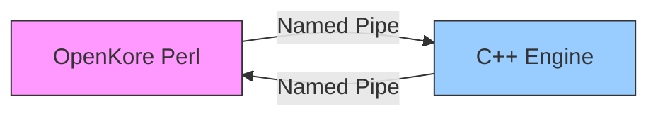
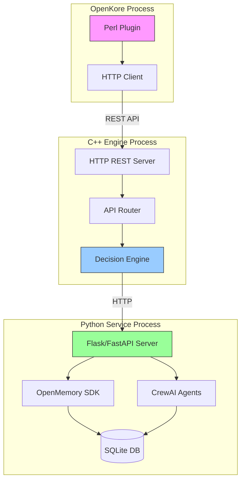
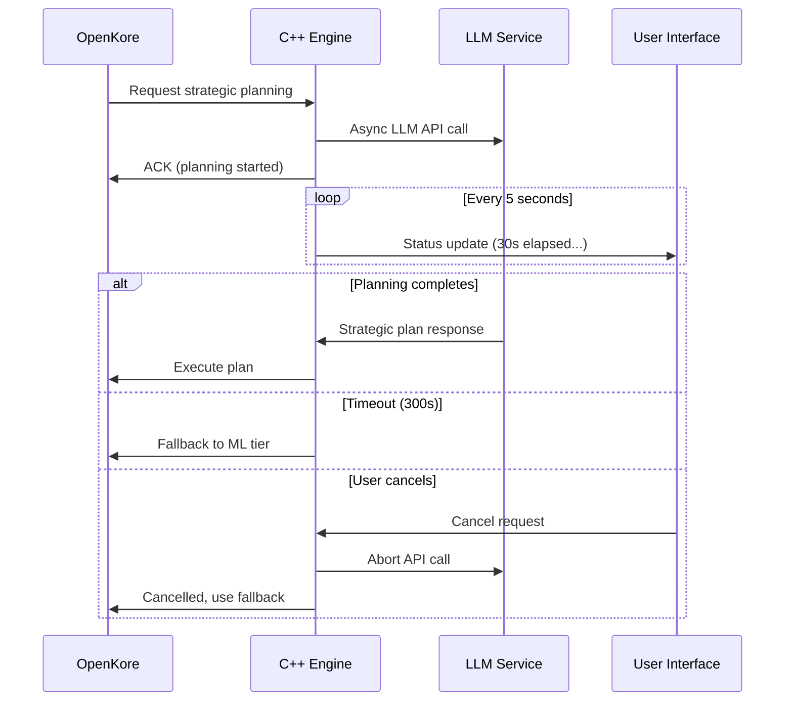
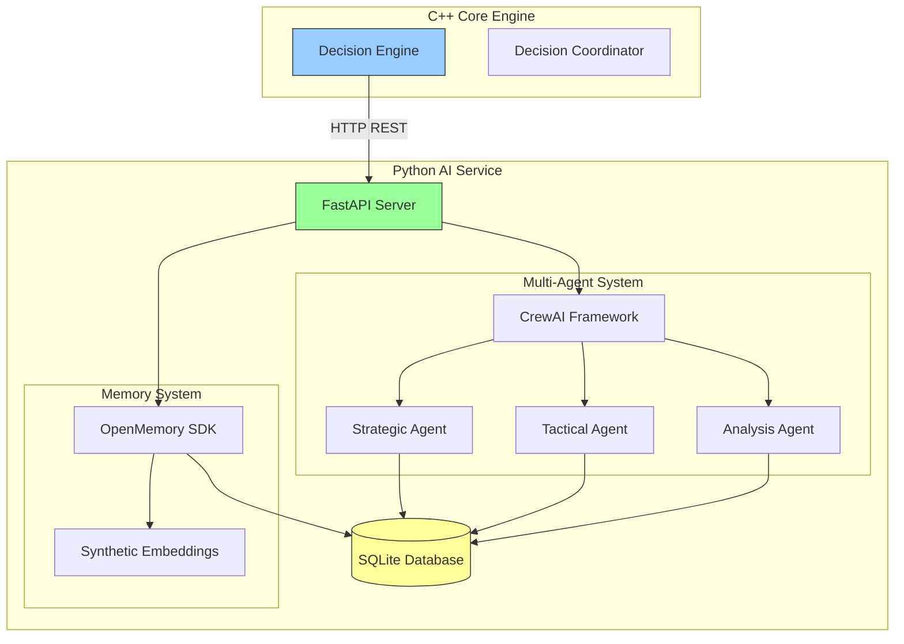
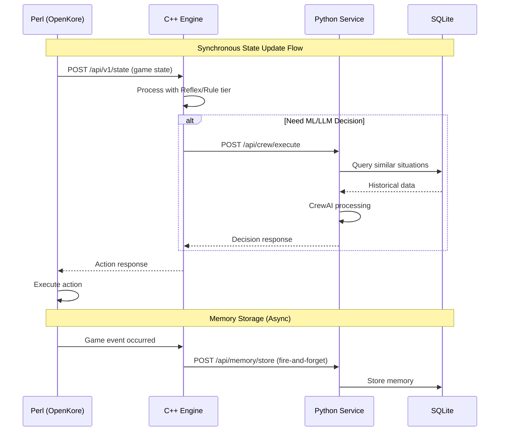
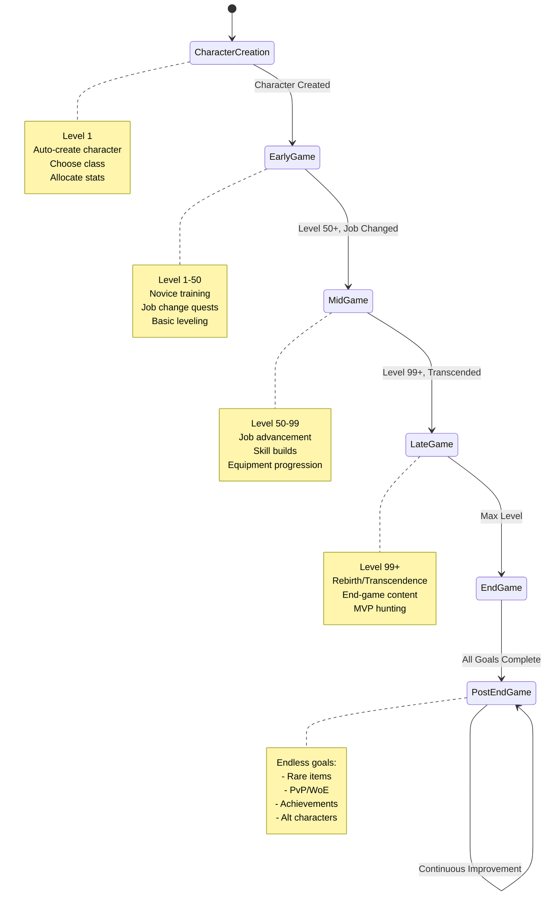
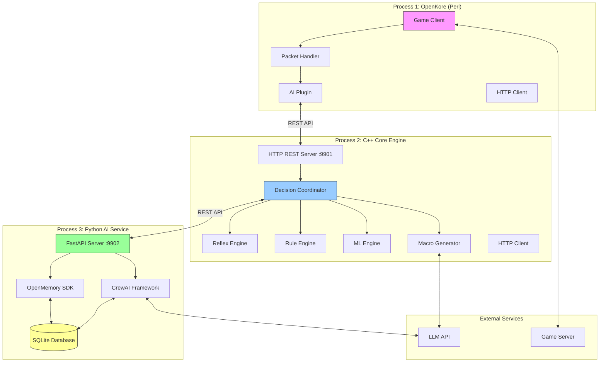
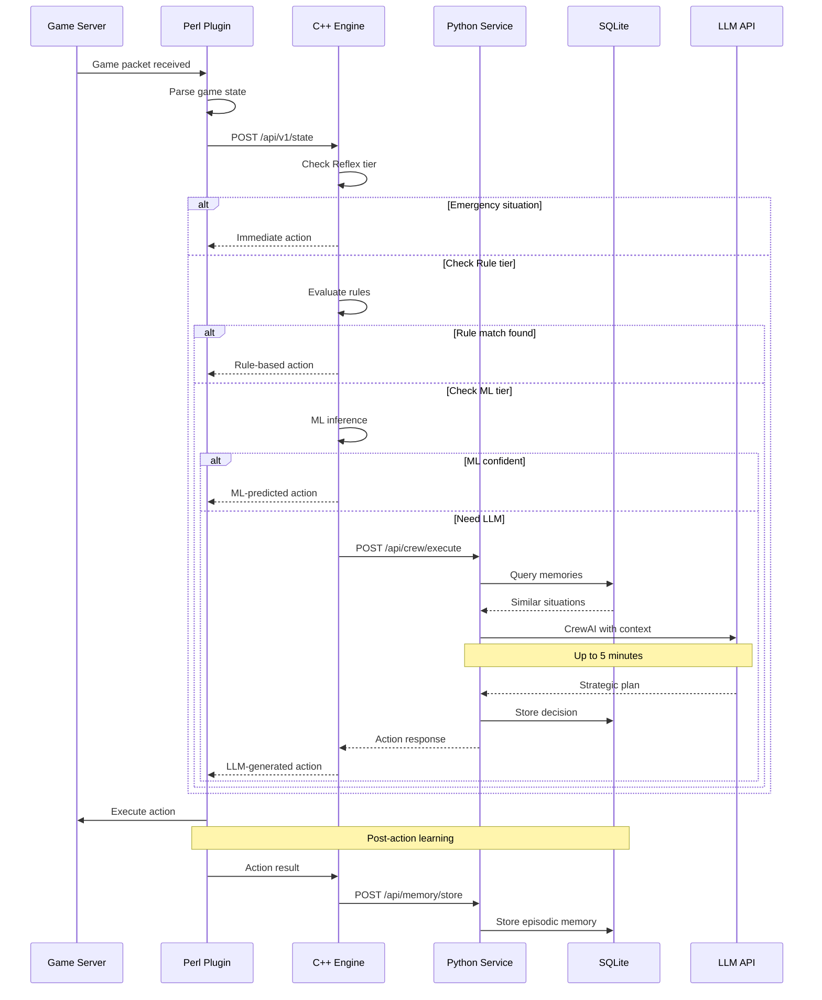

# OpenKore Advanced AI - Architecture Update Plan

**Version:** 2.0  
**Date:** 2026-02-05  
**Status:** Pending Approval  
**Change Type:** Major Architecture Overhaul

---

## Executive Summary

This document outlines critical architectural changes based on stakeholder feedback. These changes represent a significant evolution of the system architecture while maintaining backward compatibility and core design principles.

### Critical Changes Required

1. **IPC Protocol Migration**: Named Pipes → HTTP REST API
2. **LLM Latency Tolerance**: <5 seconds → <5 minutes acceptable
3. **Python Service Integration**: SQLite + OpenMemory SDK + CrewAI
4. **Complete Game Autonomy**: Character creation → Endgame lifecycle

### Impact Assessment

| Area | Current | New | Impact Level |
|------|---------|-----|--------------|
| **IPC Protocol** | Named Pipes/Sockets | HTTP REST API | ⚠️ HIGH |
| **LLM Timeout** | 5 seconds | 5 minutes | 🟡 MEDIUM |
| **Tech Stack** | C++ + Perl | C++ + Perl + Python | ⚠️ HIGH |
| **Autonomy Scope** | Manual character | Full lifecycle | ⚠️ HIGH |
| **Storage Layer** | In-memory + JSON | SQLite + Files | 🟡 MEDIUM |

---

## 1. IPC Communication Protocol Change

### 1.1 Current Architecture (Named Pipes)



**Current Implementation:**
- Windows: Named Pipes `\\.\pipe\openkore_ai`
- Linux: Unix Domain Sockets `/tmp/openkore_ai.sock`
- Binary message protocol with JSON payloads
- Latency: <5ms

**Problems:**
- Windows Named Pipes have reliability issues
- Difficult to debug and monitor
- Limited tooling support
- Complex error handling

### 1.2 New Architecture (HTTP REST API)



**New Design:**

**C++ Engine HTTP Server:**
- Embedded HTTP server (using cpp-httplib or Crow)
- REST endpoints for all IPC operations
- JSON request/response format
- Port: `localhost:9901`
- WebSocket support for real-time state streaming (optional)

**Key REST Endpoints:**

| Method | Endpoint | Purpose | Example |
|--------|----------|---------|---------|
| POST | `/api/v1/state` | Update game state | State snapshot |
| GET | `/api/v1/action` | Get next action | Decision response |
| POST | `/api/v1/macro/execute` | Execute macro | Macro command |
| GET | `/api/v1/metrics` | Get performance metrics | Statistics |
| POST | `/api/v1/config/reload` | Hot-reload config | Config update |
| GET | `/api/v1/health` | Health check | Status |
| WS | `/ws/state-stream` | Real-time state stream | WebSocket |

**Request/Response Format:**

```json
// POST /api/v1/state
{
  "timestamp": 1738744800000,
  "session_id": "abc123",
  "player": {
    "hp": 5000,
    "hp_max": 8000,
    "sp": 300,
    "sp_max": 500,
    "position": {"x": 100, "y": 150, "map": "prontera"}
  },
  "monsters": [...],
  "items": [...]
}

// Response 200 OK
{
  "action_type": "attack",
  "target_id": 12345,
  "priority": "high",
  "decision_tier": "ml",
  "confidence": 0.92
}
```

**Benefits:**
- ✅ Cross-platform standard protocol
- ✅ Easy debugging with curl/Postman
- ✅ Language-agnostic (Python can also consume)
- ✅ Built-in HTTP monitoring tools
- ✅ WebSocket for real-time streaming
- ✅ RESTful design scales better

**Migration Strategy:**
1. Implement HTTP server in C++ engine
2. Create REST API adapter layer
3. Add HTTP client to Perl plugin
4. Maintain Named Pipes as fallback (deprecated)
5. Phase out Named Pipes in v2.1

---

## 2. LLM Latency Tolerance Update

### 2.1 Current Design

```
LLM Planning Timeout: 5 seconds
UI Feedback: None (blocking wait)
Cancellation: Not supported
```

**Problems:**
- Complex reasoning tasks need more time
- 5-second timeout too aggressive for strategic planning
- No user feedback during long operations
- No way to cancel expensive LLM calls

### 2.2 New Design

```
LLM Planning Timeout: 5 minutes (300 seconds)
Progress Indicators: Real-time status updates
Cancellation: User-initiated abort
Async Processing: Non-blocking LLM calls
```

**Architecture Changes:**



**Configuration Updates:**

```json
{
  "llm": {
    "timeout_seconds": 300,
    "progress_update_interval_seconds": 5,
    "allow_cancellation": true,
    "fallback_on_timeout": "ml_tier",
    "performance_targets": {
      "simple_decisions": 5,
      "tactical_planning": 30,
      "strategic_planning": 120,
      "complex_reasoning": 300
    }
  }
}
```

**PDCA Cycle Updates:**
- Planning phase can take up to 5 minutes
- Do/Check/Act phases remain fast (<1s)
- PDCA cycle frequency adjusts based on LLM latency
- Cache strategic plans to avoid repeated expensive calls

**UI/UX Improvements:**
- Progress bar for LLM operations
- Elapsed time display
- Cancel button for long operations
- Status messages: "LLM planning... 45s elapsed"

---

## 3. Python Component Integration

### 3.1 Architecture Overview



### 3.2 Python Service Components

#### 3.2.1 SQLite Database Schema

**Purpose:** Persistent storage for game state, memory, and metrics

```sql
-- Player progression tracking
CREATE TABLE player_sessions (
    session_id TEXT PRIMARY KEY,
    character_name TEXT NOT NULL,
    start_time INTEGER NOT NULL,
    end_time INTEGER,
    total_exp_gained INTEGER DEFAULT 0,
    total_zeny_earned INTEGER DEFAULT 0
);

-- Memory storage (OpenMemory SDK)
CREATE TABLE memories (
    memory_id TEXT PRIMARY KEY,
    session_id TEXT NOT NULL,
    timestamp INTEGER NOT NULL,
    memory_type TEXT NOT NULL, -- 'episodic', 'semantic', 'procedural'
    content TEXT NOT NULL,      -- JSON content
    embedding BLOB,              -- Synthetic embedding vector
    importance REAL DEFAULT 0.5,
    access_count INTEGER DEFAULT 0,
    last_accessed INTEGER,
    FOREIGN KEY (session_id) REFERENCES player_sessions(session_id)
);

-- Decision history
CREATE TABLE decision_log (
    decision_id INTEGER PRIMARY KEY AUTOINCREMENT,
    session_id TEXT NOT NULL,
    timestamp INTEGER NOT NULL,
    game_state TEXT NOT NULL,   -- JSON snapshot
    decision_tier TEXT NOT NULL, -- 'reflex', 'rule', 'ml', 'llm'
    action_taken TEXT NOT NULL,  -- JSON action
    outcome TEXT,                -- JSON result
    reward REAL,                 -- Reinforcement learning reward
    FOREIGN KEY (session_id) REFERENCES player_sessions(session_id)
);

-- Performance metrics
CREATE TABLE metrics (
    metric_id INTEGER PRIMARY KEY AUTOINCREMENT,
    session_id TEXT NOT NULL,
    timestamp INTEGER NOT NULL,
    metric_name TEXT NOT NULL,
    metric_value REAL NOT NULL,
    metric_metadata TEXT,        -- JSON extra data
    FOREIGN KEY (session_id) REFERENCES player_sessions(session_id)
);

-- Game lifecycle state
CREATE TABLE lifecycle_state (
    character_name TEXT PRIMARY KEY,
    current_level INTEGER DEFAULT 1,
    current_job TEXT DEFAULT 'Novice',
    job_level INTEGER DEFAULT 1,
    current_goal TEXT,           -- JSON goal object
    goal_history TEXT,           -- JSON array of completed goals
    last_updated INTEGER NOT NULL
);

CREATE INDEX idx_memories_session ON memories(session_id);
CREATE INDEX idx_memories_type ON memories(memory_type);
CREATE INDEX idx_decisions_session ON decision_log(session_id);
CREATE INDEX idx_metrics_session ON metrics(session_id);
```

#### 3.2.2 OpenMemory SDK Integration

**Purpose:** Memory management with synthetic embeddings (no external API dependencies)

```python
# openkore-ai/python-service/memory_manager.py

from openmemory import OpenMemory, MemoryConfig
import numpy as np

class GameMemoryManager:
    """Manages game memories using OpenMemory SDK with synthetic embeddings"""
    
    def __init__(self, db_path: str):
        self.config = MemoryConfig(
            embedding_model="synthetic",  # No OpenAI/external API
            embedding_dim=384,            # Smaller dimension for performance
            similarity_threshold=0.75,
            max_memories=10000
        )
        self.memory = OpenMemory(config=self.config, db_path=db_path)
    
    def store_episodic_memory(self, event: dict) -> str:
        """Store a game event as episodic memory"""
        content = {
            "type": "episodic",
            "event": event["type"],
            "location": event["location"],
            "actors": event["actors"],
            "outcome": event["outcome"],
            "timestamp": event["timestamp"]
        }
        
        # OpenMemory SDK generates synthetic embedding automatically
        memory_id = self.memory.store(
            content=content,
            memory_type="episodic",
            importance=self._calculate_importance(event)
        )
        return memory_id
    
    def retrieve_similar_situations(self, current_state: dict, k: int = 5):
        """Retrieve similar past situations using semantic search"""
        query = self._state_to_query(current_state)
        
        # OpenMemory SDK uses synthetic embeddings for similarity search
        similar_memories = self.memory.search(
            query=query,
            top_k=k,
            memory_types=["episodic"]
        )
        
        return similar_memories
    
    def _calculate_importance(self, event: dict) -> float:
        """Calculate memory importance based on event characteristics"""
        importance = 0.5  # Base importance
        
        # High importance events
        if event["type"] in ["death", "level_up", "job_change", "mvp_kill"]:
            importance += 0.3
        
        # Reward-based importance
        if "reward" in event and event["reward"] > 0:
            importance += min(0.2, event["reward"] / 1000)
        
        return min(1.0, importance)
    
    def _state_to_query(self, state: dict) -> str:
        """Convert game state to semantic query"""
        return f"Player at {state['map']} level {state['level']} {state['job']} facing {state['situation']}"
```

**Synthetic Embedding Strategy:**
- Use TF-IDF or simple word vectors (no external API)
- Pre-computed embeddings for common game scenarios
- Lightweight embedding model (<50MB)
- Fast inference (<10ms per query)

#### 3.2.3 CrewAI Multi-Agent Framework

**Purpose:** Complex scenario handling with specialized agents

```python
# openkore-ai/python-service/crew_manager.py

from crewai import Agent, Task, Crew, Process
from langchain_openai import ChatOpenAI

class OpenKoreAgentCrew:
    """CrewAI-based multi-agent system for complex decisions"""
    
    def __init__(self, llm_config: dict):
        self.llm = ChatOpenAI(**llm_config)
        self._initialize_agents()
    
    def _initialize_agents(self):
        """Create specialized agents for different aspects of gameplay"""
        
        # Strategic Planning Agent
        self.strategic_agent = Agent(
            role="Strategic Planner",
            goal="Develop long-term character progression strategies",
            backstory="Expert at Ragnarok Online meta-game and optimization",
            llm=self.llm,
            verbose=True
        )
        
        # Tactical Combat Agent
        self.combat_agent = Agent(
            role="Combat Tactician",
            goal="Optimize combat strategies and skill rotations",
            backstory="Specialist in combat mechanics and enemy AI patterns",
            llm=self.llm,
            verbose=True
        )
        
        # Resource Manager Agent
        self.resource_agent = Agent(
            role="Resource Manager",
            goal="Manage inventory, zeny, and consumables efficiently",
            backstory="Expert at economic optimization and resource allocation",
            llm=self.llm,
            verbose=True
        )
        
        # Analysis Agent
        self.analysis_agent = Agent(
            role="Performance Analyst",
            goal="Analyze performance metrics and identify improvements",
            backstory="Data analyst specializing in game performance optimization",
            llm=self.llm,
            verbose=True
        )
    
    def execute_strategic_planning(self, context: dict) -> dict:
        """Execute strategic planning using agent crew"""
        
        # Define tasks for each agent
        strategic_task = Task(
            description=f"Analyze current character state and create next 10-level progression plan: {context}",
            agent=self.strategic_agent,
            expected_output="Detailed progression plan with milestones"
        )
        
        combat_task = Task(
            description=f"Design optimal combat strategy for current level and equipment: {context}",
            agent=self.combat_agent,
            expected_output="Combat strategy with skill priorities"
        )
        
        resource_task = Task(
            description=f"Create resource management plan for upcoming activities: {context}",
            agent=self.resource_agent,
            expected_output="Resource allocation strategy"
        )
        
        # Create crew and execute
        crew = Crew(
            agents=[self.strategic_agent, self.combat_agent, self.resource_agent],
            tasks=[strategic_task, combat_task, resource_task],
            process=Process.sequential,  # Execute in order
            verbose=True
        )
        
        result = crew.kickoff()
        return self._parse_crew_result(result)
    
    def analyze_performance(self, metrics: dict) -> dict:
        """Analyze performance using analysis agent"""
        
        analysis_task = Task(
            description=f"Analyze performance metrics and identify bottlenecks: {metrics}",
            agent=self.analysis_agent,
            expected_output="Performance analysis with recommendations"
        )
        
        crew = Crew(
            agents=[self.analysis_agent],
            tasks=[analysis_task],
            process=Process.sequential
        )
        
        result = crew.kickoff()
        return self._parse_analysis_result(result)
```

**When to Use CrewAI vs Single LLM:**

| Scenario | Approach | Reason |
|----------|----------|--------|
| Simple decisions (attack/heal) | Single LLM | Fast, low cost |
| Tactical combat | Single LLM | Quick response needed |
| Strategic planning (>10min horizon) | CrewAI | Multi-perspective analysis |
| Character build planning | CrewAI | Requires specialized knowledge |
| Performance optimization | CrewAI | Complex analysis needed |
| Emergency situations | No LLM | Use reflex/rule tier |

#### 3.2.4 Python Service API

```python
# openkore-ai/python-service/main.py

from fastapi import FastAPI, HTTPException
from pydantic import BaseModel
import uvicorn

app = FastAPI(title="OpenKore AI Python Service", version="2.0")

class GameState(BaseModel):
    session_id: str
    timestamp: int
    player: dict
    monsters: list
    items: list

class MemoryQuery(BaseModel):
    state: dict
    top_k: int = 5

class CrewTaskRequest(BaseModel):
    task_type: str  # 'strategic', 'combat', 'resource', 'analysis'
    context: dict
    timeout_seconds: int = 300

@app.post("/api/memory/store")
async def store_memory(event: dict):
    """Store episodic memory"""
    memory_id = memory_manager.store_episodic_memory(event)
    return {"memory_id": memory_id, "status": "stored"}

@app.post("/api/memory/retrieve")
async def retrieve_memories(query: MemoryQuery):
    """Retrieve similar past situations"""
    memories = memory_manager.retrieve_similar_situations(
        query.state, 
        k=query.top_k
    )
    return {"memories": memories}

@app.post("/api/crew/execute")
async def execute_crew_task(request: CrewTaskRequest):
    """Execute CrewAI multi-agent task"""
    if request.task_type == "strategic":
        result = crew_manager.execute_strategic_planning(request.context)
    elif request.task_type == "analysis":
        result = crew_manager.analyze_performance(request.context)
    else:
        raise HTTPException(400, f"Unknown task type: {request.task_type}")
    
    return {"result": result, "status": "completed"}

@app.get("/api/health")
async def health_check():
    """Health check endpoint"""
    return {
        "status": "healthy",
        "services": {
            "memory": memory_manager.is_healthy(),
            "crew": crew_manager.is_healthy(),
            "database": check_db_health()
        }
    }

if __name__ == "__main__":
    uvicorn.run(app, host="127.0.0.1", port=9902)
```

### 3.3 Synchronous Integration Strategy

**Critical Requirement:** All components (C++, Perl, Python) must work synchronously and harmoniously.



**Synchronization Mechanisms:**

1. **HTTP Request Timeouts:** Ensure requests don't hang indefinitely
2. **Health Checks:** Periodic health checks detect service failures
3. **Fallback Chains:** C++ → Python → C++ with fallbacks at each step
4. **Shared State:** SQLite provides single source of truth
5. **Transaction Boundaries:** Clear boundaries between sync/async operations

---

## 4. Complete Game Autonomy

### 4.1 Game Lifecycle Stages



### 4.2 Autonomous Goal Generation System

**Architecture:**

```python
class AutonomousGoalGenerator:
    """LLM-powered goal generation system"""
    
    def generate_next_goals(self, character_state: dict) -> list:
        """Generate next objectives based on current state"""
        
        # Analyze current character state
        analysis = self._analyze_character_state(character_state)
        
        # Query LLM for strategic goals
        prompt = self._build_goal_generation_prompt(analysis)
        llm_response = self.llm.generate(prompt, max_tokens=2000)
        
        # Parse and validate goals
        goals = self._parse_goals(llm_response)
        validated_goals = self._validate_goals(goals, character_state)
        
        # Prioritize goals
        prioritized_goals = self._prioritize_goals(validated_goals)
        
        return prioritized_goals
    
    def _build_goal_generation_prompt(self, analysis: dict) -> str:
        return f"""
You are an expert Ragnarok Online strategist managing a character.

Current Character State:
- Level: {analysis['level']} (Job: {analysis['job']})
- Stats: STR {analysis['str']}, AGI {analysis['agi']}, VIT {analysis['vit']}, etc.
- Zeny: {analysis['zeny']:,}
- Equipment: {analysis['equipment']}
- Completed Goals: {analysis['completed_goals']}

Generate the next 5 strategic goals for this character. Goals should be:
1. Specific and measurable
2. Achievable with current capabilities
3. Progressive (build toward long-term advancement)
4. Balanced (mix of leveling, equipment, quests, economy)

Format each goal as:
- Goal: [specific objective]
- Priority: [high/medium/low]
- Estimated Time: [hours]
- Prerequisites: [what's needed]
- Success Criteria: [how to measure completion]
"""
```

### 4.3 Character Creation Automation

```python
class CharacterCreationAgent:
    """Automates character creation process"""
    
    def create_character(self, preferences: dict) -> dict:
        """Fully automated character creation"""
        
        # Step 1: Choose class based on preferences
        chosen_class = self._choose_class(preferences)
        
        # Step 2: Allocate initial stats optimally
        initial_stats = self._allocate_initial_stats(chosen_class)
        
        # Step 3: Generate character name
        name = self._generate_character_name(chosen_class)
        
        # Step 4: Select appearance
        appearance = self._select_appearance()
        
        # Step 5: Execute creation
        self._execute_creation(name, chosen_class, initial_stats, appearance)
        
        # Step 6: Store character profile
        self._store_character_profile({
            "name": name,
            "class": chosen_class,
            "stats": initial_stats,
            "created_at": time.time(),
            "strategy": self._generate_initial_strategy(chosen_class)
        })
        
        return {"name": name, "class": chosen_class}
    
    def _choose_class(self, preferences: dict) -> str:
        """LLM-based class selection"""
        prompt = f"""
Choose the optimal starting class for Ragnarok Online based on:
- Playstyle preference: {preferences.get('playstyle', 'balanced')}
- Solo vs Party: {preferences.get('party_mode', 'solo')}
- PvE vs PvP focus: {preferences.get('content_focus', 'pve')}

Classes: Swordsman, Mage, Archer, Thief, Acolyte, Merchant

Respond with just the class name and a brief 1-sentence reason.
"""
        response = self.llm.generate(prompt)
        return self._parse_class_choice(response)
```

### 4.4 Endless Improvement Strategies

**Post-Endgame Activity Loop:**

```python
class EndlessImprovementEngine:
    """Generates endless goals after reaching endgame"""
    
    ENDGAME_ACTIVITIES = [
        "mvp_hunting",
        "rare_equipment_farming",
        "pvp_ranking",
        "woe_participation",
        "achievement_completion",
        "card_collection",
        "zeny_accumulation",
        "alt_character_leveling",
        "skill_mastery",
        "social_network_building"
    ]
    
    def generate_endless_goals(self, character_state: dict) -> list:
        """Generate new goals even after reaching max level"""
        
        # Analyze what hasn't been achieved yet
        unachieved = self._find_unachieved_activities(character_state)
        
        # Prioritize based on efficiency and interest
        prioritized = self._prioritize_activities(unachieved, character_state)
        
        # Generate specific goals for top priorities
        goals = []
        for activity in prioritized[:3]:
            goal = self._generate_activity_goal(activity, character_state)
            goals.append(goal)
        
        return goals
    
    def _generate_activity_goal(self, activity: str, state: dict) -> dict:
        """Generate specific goal for an activity type"""
        
        if activity == "mvp_hunting":
            return {
                "type": "mvp_hunting",
                "target": self._select_next_mvp(state),
                "objective": "Kill MVP and obtain card/rare drop",
                "estimated_attempts": 50,
                "success_criteria": "MVP card obtained or 100 kills"
            }
        
        elif activity == "rare_equipment_farming":
            return {
                "type": "equipment_upgrade",
                "target": self._identify_weakest_equipment(state),
                "objective": "Upgrade to BiS (Best-in-Slot) item",
                "estimated_zeny": self._calculate_upgrade_cost(state),
                "success_criteria": "Item upgraded to +10 with optimal cards"
            }
        
        # ... other activities
```

---

## 5. Updated Technology Stack

### 5.1 Complete Technology Stack

| Layer | Technology | Version | Purpose |
|-------|-----------|---------|---------|
| **Core Engine** | C++20 | GCC 11+ / MSVC 2022 | High-performance decision engine |
| **HTTP Server** | cpp-httplib / Crow | Latest | REST API server in C++ |
| **Game Interface** | Perl | 5.32+ | OpenKore plugin bridge |
| **AI Service** | Python | 3.10+ | Advanced AI components |
| **Web Framework** | FastAPI | 0.100+ | Python REST API |
| **Database** | SQLite | 3.40+ | Persistent storage |
| **Memory SDK** | OpenMemory | Latest | Memory management (synthetic embeddings) |
| **Multi-Agent** | CrewAI | 0.30+ | Multi-agent framework |
| **LLM Client** | OpenAI/Anthropic SDK | Latest | LLM API integration |
| **ML Framework** | ONNX Runtime | 1.15+ | ML inference |
| **Build System** | CMake | 3.20+ | C++ build system |
| **Package Manager** | pip / poetry | Latest | Python dependencies |

### 5.2 Dependency Management

**C++ Dependencies (CMake):**
```cmake
# External libraries
find_package(httplib REQUIRED)  # HTTP server
find_package(nlohmann_json REQUIRED)  # JSON parsing
find_package(SQLite3 REQUIRED)  # Database (optional in C++)
find_package(ONNXRuntime REQUIRED)  # ML inference
```

**Python Dependencies (requirements.txt):**
```
fastapi>=0.100.0
uvicorn[standard]>=0.23.0
openmemory-sdk>=1.0.0
crewai>=0.30.0
langchain>=0.1.0
langchain-openai>=0.0.5
sqlite3  # Built-in
numpy>=1.24.0
pandas>=2.0.0
pydantic>=2.0.0
httpx>=0.24.0  # HTTP client
```

---

## 6. Updated System Architecture

### 6.1 Three-Process Architecture



### 6.2 Data Flow



---

## 7. Migration Checklist

### 7.1 Phase 1: HTTP REST API (Week 1-2)

- [ ] Implement C++ HTTP server (cpp-httplib)
- [ ] Define REST API endpoints and schemas
- [ ] Create Perl HTTP client adapter
- [ ] Implement error handling and timeouts
- [ ] Add WebSocket support (optional)
- [ ] Test IPC performance (target: <10ms)
- [ ] Update documentation

### 7.2 Phase 2: Python Service Setup (Week 2-3)

- [ ] Create FastAPI application structure
- [ ] Design SQLite database schema
- [ ] Implement database migrations
- [ ] Create OpenMemory SDK integration
- [ ] Test synthetic embeddings performance
- [ ] Create CrewAI agent configurations
- [ ] Implement health check endpoints

### 7.3 Phase 3: LLM Latency Updates (Week 3-4)

- [ ] Update timeout configurations (5s → 300s)
- [ ] Implement async LLM calls
- [ ] Add progress indicators
- [ ] Implement cancellation mechanism
- [ ] Update PDCA cycle timing
- [ ] Test long-running LLM operations
- [ ] Update UI feedback

### 7.4 Phase 4: Game Lifecycle Autonomy (Week 4-8)

- [ ] Implement character creation automation
- [ ] Create early-game strategy (Lv 1-50)
- [ ] Create mid-game strategy (Lv 50-99)
- [ ] Create late-game strategy (Lv 99+)
- [ ] Implement autonomous goal generator
- [ ] Create quest automation framework
- [ ] Implement endless improvement engine
- [ ] Test full lifecycle (character creation → endgame)

### 7.5 Phase 5: Integration & Testing (Week 8-10)

- [ ] Integration testing (all components)
- [ ] Performance testing (latency, throughput)
- [ ] Load testing (24h+ continuous operation)
- [ ] Memory leak testing
- [ ] Failure recovery testing
- [ ] Documentation updates
- [ ] Deployment preparation

---

## 8. Risk Assessment

| Risk | Probability | Impact | Mitigation |
|------|-------------|--------|------------|
| HTTP REST slower than Named Pipes | Medium | Medium | Optimize serialization, use HTTP/2 |
| Python service crashes | Medium | High | Implement auto-restart, health checks |
| SQLite performance bottleneck | Low | Medium | Use WAL mode, optimize indexes |
| LLM timeout too long (5min) | Medium | Medium | Implement progressive timeouts |
| CrewAI license restrictions | Low | High | Verify license, have fallback |
| OpenMemory SDK integration issues | Medium | Medium | Test thoroughly, consider alternatives |
| Game lifecycle too complex | High | High | Incremental implementation, human oversight |

---

## 9. Performance Targets

| Component | Current | Target | Acceptable |
|-----------|---------|--------|------------|
| HTTP REST latency | N/A | <10ms | <20ms |
| Python service response | N/A | <50ms | <100ms |
| SQLite query | N/A | <5ms | <10ms |
| OpenMemory retrieval | N/A | <20ms | <50ms |
| CrewAI execution | N/A | <60s | <300s |
| LLM simple call | <5s | <5s | <30s |
| LLM strategic plan | 5s (timeout) | <120s | <300s |

---

## 10. Next Steps

### 10.1 Immediate Actions

1. **Review and Approve** this architecture update plan
2. **Clarify any ambiguities** or ask questions
3. **Prioritize changes** if phased approach needed
4. **Allocate resources** for implementation

### 10.2 Implementation Approach

**Option A: Full Rewrite (Recommended)**
- Implement all changes together
- Ensures consistency
- Duration: 8-10 weeks
- Risk: Higher initial risk

**Option B: Phased Migration**
- Phase 1: HTTP REST only
- Phase 2: Python service
- Phase 3: Game autonomy
- Duration: 10-12 weeks
- Risk: Lower risk, longer timeline

### 10.3 Questions for Stakeholder

1. **Timeline preference?** Full rewrite vs phased approach?
2. **Python service hosting?** Same machine or separate?
3. **LLM provider?** OpenAI, Anthropic, or local models?
4. **Game autonomy scope?** Start with which class/playstyle?
5. **Testing requirements?** How much human oversight during development?

---

## 11. Summary

This architecture update transforms the OpenKore Advanced AI system into a modern, three-process architecture with:

✅ **HTTP REST API** replacing problematic Named Pipes
✅ **Python AI service** with SQLite, OpenMemory SDK, and CrewAI
✅ **Extended LLM latency** (5 minutes) for complex reasoning
✅ **Complete game autonomy** from character creation to endless endgame
✅ **Improved reliability** through better error handling and fallbacks
✅ **Better debuggability** with standard HTTP protocols and tooling

**Impact:** Major architectural improvement with manageable migration path.

**Recommendation:** Proceed with implementation after stakeholder approval.

---

**Document Status:** ✅ Complete - Ready for Review  
**Next Step:** Stakeholder approval and implementation kick-off
