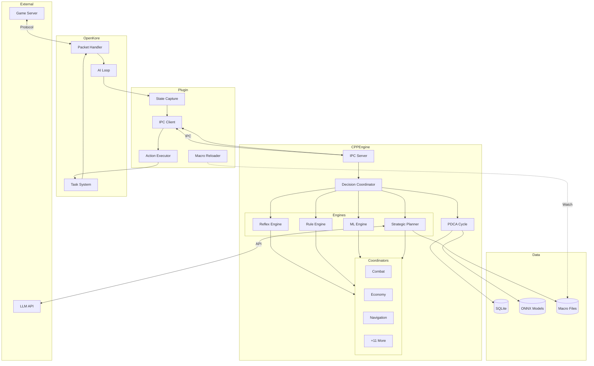
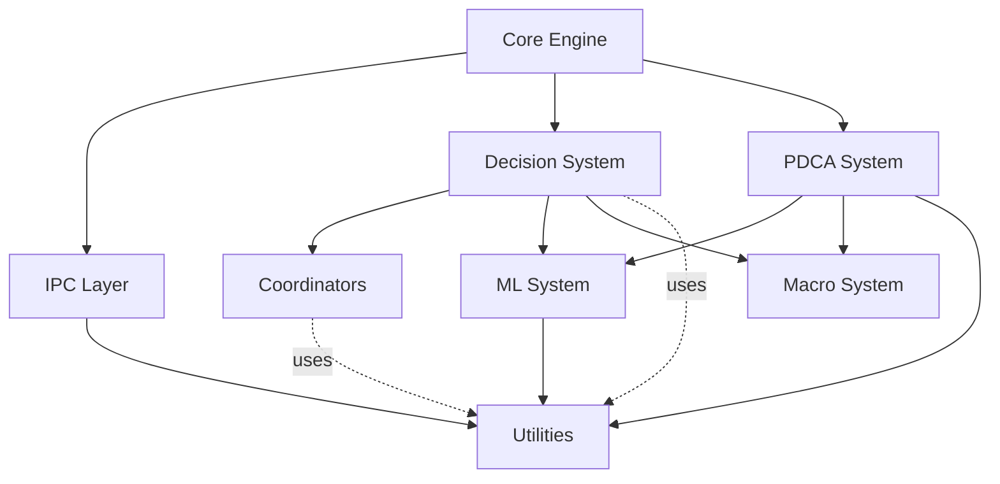

# OpenKore Advanced AI System - Technical Architecture Documentation

**Version:** 1.0  
**Date:** 2026-02-05  
**Status:** Technical Reference  
**Audience:** Developers, Architects, Technical Contributors

---

## Document Purpose

This document provides complete technical specifications for implementing the OpenKore Advanced AI System. It serves as the definitive reference for developers building the system, containing detailed architecture, component specifications, data structures, protocols, configurations, and implementation guidance.

**Related Documents:**
- [`PROJECT-PROPOSAL.md`](PROJECT-PROPOSAL.md) - Executive summary and project overview
- [`advanced-ai-architecture.md`](advanced-ai-architecture.md) - Comprehensive system architecture
- [`technical-specifications/`](technical-specifications/) - Detailed component specifications
- [`implementation-plan/`](implementation-plan/) - Phased development roadmap

---

## Table of Contents

1. [Introduction](#1-introduction)
2. [System Overview](#2-system-overview)
3. [Component Architecture](#3-component-architecture)
4. [Multi-Tier Decision System](#4-multi-tier-decision-system)
5. [PDCA Continuous Improvement Loop](#5-pdca-continuous-improvement-loop)
6. [C++ Core Engine Architecture](#6-c-core-engine-architecture)
7. [Perl Bridge Plugin](#7-perl-bridge-plugin)
8. [Macro System](#8-macro-system)
9. [Machine Learning Pipeline](#9-machine-learning-pipeline)
10. [LLM Integration](#10-llm-integration)
11. [14 Coordinator Specifications](#11-14-coordinator-specifications)
12. [Data Flow Diagrams](#12-data-flow-diagrams)
13. [IPC Protocol Specification](#13-ipc-protocol-specification)
14. [Configuration System](#14-configuration-system)
15. [Security Considerations](#15-security-considerations)
16. [Performance Requirements](#16-performance-requirements)
17. [Testing Strategy](#17-testing-strategy)
18. [Deployment Architecture](#18-deployment-architecture)
19. [Appendices](#19-appendices)

---

## 1. Introduction

### 1.1 Document Scope

This technical documentation covers:
- **Architecture**: Complete system design and component interactions
- **Specifications**: Detailed technical specifications for all components
- **Protocols**: IPC communication, data structures, message formats
- **Implementation**: Code examples, patterns, best practices
- **Configuration**: All configuration files and options
- **Deployment**: Installation, updates, monitoring

### 1.2 Intended Audience

- **Developers**: Implementing system components
- **Architects**: Understanding system design decisions
- **QA Engineers**: Creating tests and validation procedures
- **DevOps**: Deploying and maintaining the system
- **Technical Leads**: Reviewing implementation quality

### 1.3 Prerequisites

**Knowledge Requirements:**
- C++17/20 programming
- Multi-threaded programming
- IPC and network protocols
- Machine learning fundamentals
- Database design (SQL)
- Perl scripting
- Python for ML training

**System Requirements:**
- OpenKore 3.x installed and functional
- C++ compiler (MSVC 2022 or GCC 11+)
- CMake 3.20+
- Python 3.9+
- Strawberry Perl 5.x

### 1.4 Architecture Principles

The system follows these core principles:

1. **Performance First**: Sub-millisecond response times for critical paths
2. **Security by Design**: Compiled binaries, encrypted configs, secure IPC
3. **Extensibility**: Modular design allows adding new components
4. **Compatibility**: Plugin-only approach, no OpenKore core modifications
5. **Reliability**: Comprehensive error handling and fallback mechanisms
6. **Maintainability**: Clear separation of concerns, documented interfaces

---

## 2. System Overview

### 2.1 Architecture Layers

The system consists of four primary layers:

```
┌────────────────────────────────────────────────────┐
│         Layer 4: External Services                  │
│  • Ragnarok Online Game Server                     │
│  • LLM API Services (OpenAI, Anthropic)           │
└────────────────────────────────────────────────────┘
                    ▲  ▼
┌────────────────────────────────────────────────────┐
│         Layer 3: OpenKore & Plugin Bridge          │
│  • OpenKore Core (Perl)                            │
│  • aiCore Plugin (State/Action Bridge)             │
│  • Existing Plugins (macro, eventMacro, etc.)     │
└────────────────────────────────────────────────────┘
                    ▲  ▼  IPC
┌────────────────────────────────────────────────────┐
│         Layer 2: C++ Core Engine                    │
│  • Decision Coordinator (Multi-Tier)               │
│  • 4 Decision Engines (Reflex/Rule/ML/LLM)        │
│  • 14 Specialized Coordinators                     │
│  • PDCA Continuous Improvement                     │
└────────────────────────────────────────────────────┘
                    ▲  ▼
┌────────────────────────────────────────────────────┐
│         Layer 1: Data & ML Infrastructure          │
│  • SQLite Databases (State, Metrics)              │
│  • ML Models (ONNX)                                │
│  • Training Data (Parquet)                         │
│  • Configuration Files (JSON/YAML)                 │
└────────────────────────────────────────────────────┘
```

### 2.2 Component Interaction Map



### 2.3 Key Design Patterns

**1. Strategy Pattern**: Decision engines implement common interface
```cpp
class DecisionEngine {
public:
    virtual std::optional<Action> decide(const GameState& state) = 0;
    virtual double getConfidence(const Action& action) = 0;
    virtual DecisionTier getTier() const = 0;
};
```

**2. Chain of Responsibility**: Decision escalation through tiers
```cpp
Action DecisionCoordinator::decide(const GameState& state) {
    for (auto tier : {Reflex, Rule, ML, LLM}) {
        if (auto action = tier->decide(state)) {
            if (action->confidence >= threshold) {
                return *action;
            }
        }
    }
    return fallback();
}
```

**3. Observer Pattern**: PDCA monitors system performance
```cpp
class PerformanceMonitor : public Observer {
    void onMetricUpdate(const Metric& metric) override {
        if (metric.indicates_problem()) {
            pdca_cycle_->trigger();
        }
    }
};
```

**4. Factory Pattern**: Coordinator creation and management
```cpp
class CoordinatorFactory {
public:
    static std::unique_ptr<Coordinator> create(CoordinatorType type);
};
```

**5. Singleton Pattern**: Global access to key systems
```cpp
class MetricsCollector {
public:
    static MetricsCollector& instance();
private:
    MetricsCollector() = default;
};
```

---

## 3. Component Architecture

### 3.1 Component Hierarchy

```
openkore_ai_engine.exe
├── Core/
│   ├── Engine (main loop)
│   ├── Configuration Manager
│   └── Logger
├── IPC/
│   ├── IPC Server
│   ├── Message Handler
│   └── Protocol Manager
├── Decision/
│   ├── Decision Coordinator
│   ├── Reflex Engine
│   ├── Rule Engine
│   ├── ML Engine
│   └── Strategic Planner
├── Coordinators/
│   ├── Combat Coordinator
│   ├── Economy Coordinator
│   ├── Navigation Coordinator
│   └── [11 more coordinators]
├── PDCA/
│   ├── Metrics Collector
│   ├── Outcome Evaluator
│   ├── Strategy Adjuster
│   └── PDCA Cycle Manager
├── Macro/
│   ├── Template Engine
│   ├── Macro Generator
│   └── Validation System
├── ML/
│   ├── Feature Extractor
│   ├── Model Manager
│   ├── Inference Engine
│   └── Online Trainer
└── Utils/
    ├── Database Manager
    ├── HTTP Client
    └── Crypto Utils
```

### 3.2 Module Dependencies



### 3.3 Thread Model

The system uses multiple threads for concurrent processing:

```cpp
// Main threads
std::thread main_engine_thread;      // Core engine loop
std::thread ipc_server_thread;       // IPC message handling
std::thread ml_inference_thread;     // ML model inference
std::thread llm_query_thread;        // Asynchronous LLM queries
std::thread pdca_monitor_thread;     // PDCA cycle monitoring
std::thread metrics_thread;          // Metrics collection

// Thread synchronization
std::mutex state_mutex;              // Protect game state
std::mutex decision_mutex;           // Protect decision making
std::mutex model_mutex;              // Protect ML model access
std::condition_variable decision_cv; // Decision coordination
```

**Thread Safety Requirements:**
- All shared data structures must be protected by mutexes
- Lock-free data structures preferred for hot paths
- Deadlock prevention through lock ordering
- Thread-safe logging via spdlog

---

## 4. Multi-Tier Decision System

### 4.1 Decision Tier Architecture

```cpp
enum class DecisionTier {
    REFLEX = 0,  // < 1ms - Emergency responses
    RULE = 1,    // < 10ms - Deterministic logic
    ML = 2,      // < 100ms - Learned patterns
    LLM = 3      // < 5s - Strategic planning
};

struct DecisionRequest {
    GameState state;
    Priority priority;          // CRITICAL, HIGH, NORMAL, LOW
    uint64_t deadline_us;       // Microsecond deadline
    std::optional<std::string> context;
};

struct DecisionResponse {
    Action action;
    DecisionTier tier;
    uint64_t processing_time_us;
    double confidence;          // 0.0 - 1.0
    std::string reasoning;
    json metadata;
};
```

### 4.2 Decision Coordinator Implementation

```cpp
class DecisionCoordinator {
public:
    DecisionCoordinator(
        std::unique_ptr<ReflexEngine> reflex,
        std::unique_ptr<RuleEngine> rules,
        std::unique_ptr<MLEngine> ml,
        std::unique_ptr<StrategyPlanner> planner,
        const CoordinatorConfig& config
    );
    
    DecisionResponse decide(const DecisionRequest& request);
    
    void setConfidenceThresholds(const std::map<DecisionTier, double>& thresholds);
    void setTierTimeouts(const std::map<DecisionTier, uint64_t>& timeouts);
    
private:
    std::unique_ptr<ReflexEngine> reflex_engine_;
    std::unique_ptr<RuleEngine> rule_engine_;
    std::unique_ptr<MLEngine> ml_engine_;
    std::unique_ptr<StrategyPlanner> planner_;
    
    CoordinatorConfig config_;
    MetricsCollector& metrics_;
    
    DecisionTier selectStartingTier(const DecisionRequest& request) const;
    bool shouldEscalate(const DecisionResponse& response, 
                       const DecisionRequest& request) const;
    DecisionResponse fallback(const DecisionRequest& request) const;
};

DecisionResponse DecisionCoordinator::decide(const DecisionRequest& request) {
    auto start_time = std::chrono::high_resolution_clock::now();
    
    // TIER 0: Always check reflexes first (critical situations)
    if (auto reflex_response = checkReflexes(request)) {
        metrics_.recordDecision(*reflex_response);
        return *reflex_response;
    }
    
    // Determine starting tier based on urgency
    DecisionTier current_tier = selectStartingTier(request);
    
    while (current_tier <= DecisionTier::LLM) {
        auto tier_start = std::chrono::high_resolution_clock::now();
        std::optional<DecisionResponse> response;
        
        switch (current_tier) {
            case DecisionTier::RULE:
                response = evaluateRules(request, tier_start);
                break;
            case DecisionTier::ML:
                response = predictML(request, tier_start);
                break;
            case DecisionTier::LLM:
                response = queryLLM(request, tier_start);
                break;
        }
        
        // Check if we have a satisfactory response
        if (response && response->confidence >= getConfidenceThreshold(current_tier)) {
            metrics_.recordDecision(*response);
            return *response;
        }
        
        // Check if we have time to escalate
        auto elapsed = elapsed_us(start_time);
        if (elapsed + estimatedTime(next_tier(current_tier)) > request.deadline_us) {
            // No time to escalate, use current response or fallback
            if (response) {
                metrics_.recordDecision(*response);
                return *response;
            }
            break;
        }
        
        // Escalate to next tier
        current_tier = next_tier(current_tier);
    }
    
    // Fallback if all else fails
    auto fallback_response = fallback(request);
    metrics_.recordDecision(fallback_response);
    return fallback_response;
}

std::optional<DecisionResponse> DecisionCoordinator::checkReflexes(
    const DecisionRequest& request) {
    
    auto action = reflex_engine_->process(request.state);
    if (!action) {
        return std::nullopt;
    }
    
    return DecisionResponse{
        .action = *action,
        .tier = DecisionTier::REFLEX,
        .processing_time_us = /* measure */,
        .confidence = 1.0,
        .reasoning = "Reflex response to critical situation"
    };
}
```

### 4.3 Reflex Engine Specification

```cpp
class ReflexEngine {
public:
    struct ReflexRule {
        std::string id;
        int priority;                                    // Higher = more important
        std::function<bool(const GameState&)> condition; // Fast condition check
        std::function<Action(const GameState&)> action;  // Action generator
        uint64_t cooldown_ms;
        uint64_t last_triggered_ms;
    };
    
    std::optional<Action> process(const GameState& state);
    void registerReflex(const ReflexRule& rule);
    void loadFromConfig(const std::string& config_path);
    
private:
    std::vector<ReflexRule> reflexes_;
    std::unordered_map<std::string, uint64_t> cooldowns_;
    
    bool canTrigger(const ReflexRule& rule) const;
    void updateCooldown(const std::string& rule_id);
};

std::optional<Action> ReflexEngine::process(const GameState& state) {
    // Sort reflexes by priority (done once at load time)
    for (const auto& reflex : reflexes_) {
        // Check cooldown
        if (!canTrigger(reflex)) {
            continue;
        }
        
        // Evaluate condition (must be very fast)
        if (reflex.condition(state)) {
            // Generate action
            auto action = reflex.action(state);
            
            // Update cooldown
            updateCooldown(reflex.id);
            
            log_info("Reflex triggered: {}", reflex.id);
            return action;
        }
    }
    
    return std::nullopt;
}
```

**Reflex Configuration Example:**

```json
{
  "reflexes": [
    {
      "id": "emergency_teleport",
      "priority": 1000,
      "conditions": {
        "and": [
          {"hp_percent": {"lt": 20}},
          {"monster_count": {"gt": 5, "range": 7}}
        ]
      },
      "action": {
        "type": "use_skill",
        "skill": "Teleport",
        "level": 1
      },
      "cooldown_ms": 5000
    },
    {
      "id": "dodge_aoe",
      "priority": 950,
      "conditions": {
        "in_danger_zone": true
      },
      "action": {
        "type": "move_to_safe"
      },
      "cooldown_ms": 500
    },
    {
      "id": "emergency_heal",
      "priority": 900,
      "conditions": {
        "and": [
          {"hp_percent": {"lt": 30}},
          {"not": {"status": "poison"}}
        ]
      },
      "action": {
        "type": "use_item",
        "item": "White Potion"
      },
      "cooldown_ms": 1000
    }
  ]
}
```

### 4.4 Rule Engine Specification

```cpp
class RuleEngine {
public:
    struct Rule {
        std::string id;
        std::string category;
        int priority;
        std::vector<Condition> conditions;
        std::vector<Action> actions;
        RuleMetadata metadata;
    };
    
    struct Condition {
        std::string type;
        std::string operator_str;
        json value;
        std::optional<std::string> context;
    };
    
    std::optional<Action> evaluate(const GameState& state);
    void loadRulesFromDir(const std::string& rules_dir);
    void reloadRules();
    void updateRulePerformance(const std::string& rule_id, bool success);
    
private:
    std::vector<Rule> rules_;
    std::unordered_map<std::string, RuleMetadata> rule_metadata_;
    std::filesystem::path rules_dir_;
    
    bool evaluateCondition(const Condition& cond, const GameState& state);
    std::vector<const Rule*> getMatchingRules(const GameState& state);
    const Rule* selectBestRule(const std::vector<const Rule*>& candidates);
};

std::optional<Action> RuleEngine::evaluate(const GameState& state) {
    // Find all rules whose conditions match
    auto matching_rules = getMatchingRules(state);
    
    if (matching_rules.empty()) {
        return std::nullopt;
    }
    
    // Select best rule based on priority and past performance
    auto best_rule = selectBestRule(matching_rules);
    
    if (!best_rule || best_rule->actions.empty()) {
        return std::nullopt;
    }
    
    // Execute first action (multi-action support for future)
    log_info("Rule matched: {} (priority: {})", best_rule->id, best_rule->priority);
    return best_rule->actions[0];
}

bool RuleEngine::evaluateCondition(const Condition& cond, const GameState& state) {
    // Type-specific evaluation
    if (cond.type == "hp_percent") {
        int hp_percent = (state.character.hp * 100) / state.character.max_hp;
        return compareValue(hp_percent, cond.operator_str, cond.value.get<int>());
        
    } else if (cond.type == "sp_percent") {
        int sp_percent = (state.character.sp * 100) / state.character.max_sp;
        return compareValue(sp_percent, cond.operator_str, cond.value.get<int>());
        
    } else if (cond.type == "monster_count") {
        int range = cond.value.get<int>();
        int count = countMonstersInRange(state, range);
        return compareValue(count, cond.operator_str, cond.value.get<int>());
        
    } else if (cond.type == "job_class") {
        return state.character.job_class == cond.value.get<std::string>();
        
    } else if (cond.type == "in_combat") {
        return state.in_combat == cond.value.get<bool>();
    }
    
    log_warn("Unknown condition type: {}", cond.type);
    return false;
}
```

**Rule Configuration Example (YAML):**

```yaml
# combat_rules.yaml
rules:
  - id: wizard_fire_rotation
    category: combat_skill
    priority: 80
    conditions:
      - type: job_class
        value: Wizard
      - type: sp_percent
        operator: gt
        value: 30
      - type: monster_in_range
        operator: exists
        value: 10
      - type: cast_available
        value: true
    actions:
      - type: use_skill
        skill: Fire Ball
        level: 10
        target: current_target
      - type: use_skill
        skill: Fire Wall
        level: 5
        position: defensive
    metadata:
      author: system
      created: 2026-02-05
      success_rate: 0.0  # Updated during runtime
      
  - id: basic_attack_melee
    category: combat_basic
    priority: 50
    conditions:
      - type: monster_in_range
        operator: exists
        value: 3
      - type: not_casting
        value: true
    actions:
      - type: attack
        target: nearest_aggressive
        
  - id: buff_maintenance
    category: support
    priority: 70
    conditions:
      - type: missing_buff
        value: "Increase AGI"
      - type: sp_percent
        operator: gt
        value: 20
      - type: not_in_combat
        value: true
    actions:
      - type: use_skill
        skill: "Increase AGI"
        level: 10
        target: self
```

### 4.5 ML Engine Specification

```cpp
class MLEngine {
public:
    struct Prediction {
        Action action;
        double confidence;
        std::string reasoning;
        std::vector<float> feature_importance;
    };
    
    struct TrainingData {
        GameState state;
        FeatureVector features;
        Action action;
        ActionResult result;
        double reward;
        uint64_t timestamp_ms;
    };
    
    MLEngine(const MLConfig& config);
    
    std::optional<Prediction> predict(const GameState& state);
    void trainOnline(const TrainingData& data);
    void loadModel(const std::string& model_path);
    void saveModel(const std::string& model_path);
    ModelMetrics getMetrics() const;
    
private:
    MLConfig config_;
    std::unique_ptr<ONNXModel> model_;
    std::unique_ptr<FeatureExtractor> feature_extractor_;
    std::unique_ptr<OnlineTrainer> online_trainer_;
    
    std::deque<TrainingData> training_buffer_;
    ModelMetrics metrics_;
    std::mutex model_mutex_;
    
    void updateMetrics(const Prediction& pred, const ActionResult& result);
};

std::optional<Prediction> MLEngine::predict(const GameState& state) {
    // Extract features
    auto features = feature_extractor_->extract(state);
    
    // Lock model for inference
    std::lock_guard<std::mutex> lock(model_mutex_);
    
    if (!model_) {
        log_warn("ML model not loaded");
        return std::nullopt;
    }
    
    // Run inference
    auto model_output = model_->predict(features);
    
    // Interpret output
    Action action = interpretOutput(model_output);
    double confidence = model_output.confidence;
    
    // Check confidence threshold
    if (confidence < config_.confidence_threshold) {
        log_debug("ML confidence too low: {:.2f}", confidence);
        return std::nullopt;
    }
    
    return Prediction{
        .action = action,
        .confidence = confidence,
        .reasoning = generateReasoning(features, model_output),
        .feature_importance = model_output.feature_importance
    };
}

void MLEngine::trainOnline(const TrainingData& data) {
    // Add to buffer
    training_buffer_.push_back(data);
    
    // Check if we should trigger batch training
    if (training_buffer_.size() >= config_.training_batch_size) {
        // Batch train in separate thread to avoid blocking
        auto batch = std::vector<TrainingData>(
            training_buffer_.begin(),
            training_buffer_.end()
        );
        training_buffer_.clear();
        
        std::thread([this, batch]() {
            online_trainer_->train(batch);
            
            // Hot-swap model
            auto new_model = online_trainer_->getModel();
            {
                std::lock_guard<std::mutex> lock(model_mutex_);
                model_ = std::move(new_model);
            }
            
            log_info("Model updated via online learning");
        }).detach();
    }
}
```

**Feature Extraction:**

```cpp
class FeatureExtractor {
public:
    FeatureVector extract(const GameState& state);
    
private:
    // Character features
    void extractCharacterFeatures(const GameState& state, FeatureVector& features);
    
    // Combat features
    void extractCombatFeatures(const GameState& state, FeatureVector& features);
    
    // Environment features
    void extractEnvironmentFeatures(const GameState& state, FeatureVector& features);
    
    // Temporal features
    void extractTemporalFeatures(const GameState& state, FeatureVector& features);
    
    // Feature normalization
    void normalizeFeatures(FeatureVector& features);
};

FeatureVector FeatureExtractor::extract(const GameState& state) {
    FeatureVector features;
    features.reserve(30);  // Pre-allocate for 30+ features
    
    // Character state (6 features)
    features.push_back(static_cast<float>(state.character.hp) / state.character.max_hp);
    features.push_back(static_cast<float>(state.character.sp) / state.character.max_sp);
    features.push_back(static_cast<float>(state.character.weight) / state.character.max_weight);
    features.push_back(static_cast<float>(state.character.level));
    features.push_back(static_cast<float>(state.character.job_level));
    features.push_back(state.character.in_combat ? 1.0f : 0.0f);
    
    // Combat state (7 features)
    features.push_back(static_cast<float>(state.monsters.size()));
    
    if (!state.monsters.empty()) {
        float avg_level = 0;
        float avg_distance = 0;
        float max_threat = 0;
        int aggressive_count = 0;
        
        for (const auto& monster : state.monsters) {
            avg_level += monster.level;
            avg_distance += distance(state.character.position, monster.position);
            max_threat = std::max(max_threat, monster.threat_level);
            if (monster.is_aggressive) aggressive_count++;
        }
        
        features.push_back(avg_level / state.monsters.size());
        features.push_back(avg_distance / state.monsters.size());
        features.push_back(max_threat);
        features.push_back(static_cast<float>(aggressive_count));
    } else {
        features.push_back(0.0f); features.push_back(0.0f);
        features.push_back(0.0f); features.push_back(0.0f);
    }
    
    features.push_back(state.has_current_target ? 1.0f : 0.0f);
    features.push_back(static_cast<float>(state.monsters_killed_count));
    
    // Status effects (4 features)
    features.push_back(hasPositiveBuffs(state) ? 1.0f : 0.0f);
    features.push_back(hasNegativeDebuffs(state) ? 1.0f : 0.0f);
    features.push_back(static_cast<float>(countStatusEffects(state)));
    features.push_back(getCriticalStatusCount(state));
    
    // Map features (3 features)
    features.push_back(getMapEmbedding(state.current_map));
    features.push_back(state.is_pvp_map ? 1.0f : 0.0f);
    features.push_back(static_cast<float>(state.map_danger_level));
    
    // Temporal features (5 features)
    features.push_back(getTimeSinceLastCombat());
    features.push_back(getTimeSinceLastDeath());
    features.push_back(getTimeSinceLastHeal());
    features.push_back(getCurrentSessionDuration());
    features.push_back(getTimeOfDay());
    
    // Inventory features (3 features)
    features.push_back(static_cast<float>(state.character.inventory.size()));
    features.push_back(hasHealingItems(state) ? 1.0f : 0.0f);
    features.push_back(hasBuffItems(state) ? 1.0f : 0.0f);
    
    // Performance features (2 features)
    features.push_back(getRecentExpPerHour());
    features.push_back(getRecentDeathRate());
    
    return features;
}
```

---

## 5. PDCA Continuous Improvement Loop

### 5.1 PDCA Architecture

```cpp
class PDCACycle {
public:
    enum class Phase {
        PLAN,    // Strategy planning
        DO,      // Execution
        CHECK,   // Performance evaluation
        ACT      // Adjustment
    };
    
    PDCACycle(
        std::unique_ptr<StrategyPlanner> planner,
        std::unique_ptr<MetricsCollector> metrics,
        std::unique_ptr<OutcomeEvaluator> evaluator,
        std::unique_ptr<StrategyAdjuster> adjuster,
        const PDCAConfig& config
    );
    
    void start();
    void stop();
    void tick();  // Called regularly from main loop
    void triggerCycle(const std::string& reason);
    
private:
    Phase current_phase_;
    std::unique_ptr<StrategyPlanner> planner_;
    std::unique_ptr<MetricsCollector> metrics_;
    std::unique_ptr<OutcomeEvaluator> evaluator_;
    std::unique_ptr<StrategyAdjuster> adjuster_;
    
    Goal current_goal_;
    Strategy current_strategy_;
    PDCAConfig config_;
    
    std::thread pdca_thread_;
    std::atomic<bool> running_;
    std::condition_variable cycle_trigger_;
    std::mutex cycle_mutex_;
    
    void runCycle();
    void planPhase();
    void doPhase();
    void checkPhase();
    void actPhase();
    
    bool shouldTriggerCycle() const;
};

void PDCACycle::runCycle() {
    log_info("PDCA Cycle started");
    
    // PLAN PHASE
    current_phase_ = Phase::PLAN;
    planPhase();
    
    // DO PHASE
    current_phase_ = Phase::DO;
    doPhase();
    
    // Wait for execution period
    std::this_thread::sleep_for(
        std::chrono::seconds(config_.execution_duration_seconds)
    );
    
    // CHECK PHASE
    current_phase_ = Phase::CHECK;
    checkPhase();
    
    // ACT PHASE
    current_phase_ = Phase::ACT;
    actPhase();
    
    log_info("PDCA Cycle completed");
}

void PDCACycle::planPhase() {
    log_info("PDCA: PLAN phase");
    
    // Get current goal or create new one
    if (!current_goal_.is_valid()) {
        current_goal_ = goal_manager_->getNextGoal();
    }
    
    // Query LLM for strategy
    auto game_state = getCurrentGameState();
    current_strategy_ = planner_->planStrategy(current_goal_, game_state);
    
    // Generate macros from strategy
    auto macros = macro_generator_->generate(current_strategy_);
    
    // Deploy macros
    for (const auto& macro : macros) {
        macro_version_manager_->saveMacro(macro);
        macro_deployer_->deploy(macro);
    }
    
    log_info("PDCA: Strategy planned - {}", current_strategy_.description);
}

void PDCACycle::doPhase() {
    log_info("PDCA: DO phase");
    
    // Strategy is being executed by the bot
    // Just monitor and collect metrics
    metrics_->startCollection(current_strategy_.id);
}

void PDCACycle::checkPhase() {
    log_info("PDCA: CHECK phase");
    
    // Collect metrics for evaluation
    auto metrics_summary = metrics_->getMetricsSummary(current_strategy_.id);
    
    // Evaluate outcome
    auto outcome = evaluator_->evaluate(current_goal_, current_strategy_, metrics_summary);
    
    // Log outcome
    log_info("PDCA: Outcome - Success: {}, Achievement: {:.1f}%",
             outcome.success, outcome.achievement_percent * 100);
    
    if (!outcome.success) {
        log_warn("PDCA: Goal not achieved - {}", outcome.failure_reason);
    }
    
    // Store outcome for next phase
    current_outcome_ = outcome;
}

void PDCACycle::actPhase() {
    log_info("PDCA: ACT phase");
    
    if (current_outcome_.success) {
        // Goal achieved, move to next goal
        log_info("PDCA: Goal achieved, continuing with current strategy");
        current_goal_ = goal_manager_->getNextGoal();
        
    } else {
        // Goal not achieved, adjust strategy
        log_info("PDCA: Analyzing failure and adjusting strategy");
        
        auto adjustments = adjuster_->analyzeAndAdjust(
            current_goal_,
            current_strategy_,
            current_outcome_
        );
        
        // Apply adjustments
        for (const auto& adjustment : adjustments) {
            if (adjustment.type == "regenerate_macros") {
                // LLM regenerates improved macros
                auto improved_strategy = planner_->improveStrategy(
                    current_strategy_,
                    current_outcome_,
                    adjustment.reasoning
                );
                
                current_strategy_ = improved_strategy;
                
                auto new_macros = macro_generator_->generate(improved_strategy);
                for (const auto& macro : new_macros) {
                    macro_version_manager_->saveMacro(macro);
                    macro_deployer_->deploy(macro);
                }
            }
        }
    }
}
```

### 5.2 Metrics Collection

```cpp
class MetricsCollector {
public:
    struct Metric {
        std::string name;
        MetricType type;
        double value;
        uint64_t timestamp_ms;
        json metadata;
    };
    
    enum class MetricType {
        COUNTER,     // Cumulative (exp gained, kills)
        GAUGE,       // Point-in-time (HP, SP)
        HISTOGRAM,   // Distribution (response times)
        RATE         // Change over time (exp/hour)
    };
    
    void recordMetric(const Metric& metric);
    void startCollection(const std::string& strategy_id);
    MetricsSummary getMetricsSummary(const std::string& strategy_id);
    
private:
    std::unique_ptr<TimeSeriesDB> db_;
    std::unordered_map<std::string, MetricAggregator> aggregators_;
};

struct MetricsSummary {
    // Combat metrics
    double exp_per_hour;
    int kills_per_hour;
    int death_count;
    double avg_kill_time_seconds;
    
    // Economic metrics
    double zeny_per_hour;
    int items_looted;
    double loot_efficiency;
    
    // Resource metrics
    int potions_used;
    double avg_hp_percent;
    double avg_sp_percent;
    
    // Efficiency metrics
    double uptime_percent;
    double time_in_combat_percent;
    int teleports_used;
    
    // Decision metrics
    int reflex_decisions;
    int rule_decisions;
    int ml_decisions;
    int llm_decisions;
    double avg_decision_time_ms;
    
    // Performance
    double cpu_usage_percent;
    double memory_usage_mb;
};
```

### 5.3 Outcome Evaluation

```cpp
class OutcomeEvaluator {
public:
    struct Outcome {
        std::string strategy_id;
        Goal goal;
        bool success;
        double achievement_percent;  // 0.0 - 1.0
        MetricsSummary metrics;
        std::string failure_reason;
        json detailed_analysis;
    };
    
    Outcome evaluate(
        const Goal& goal,
        const Strategy& strategy,
        const MetricsSummary& metrics
    );
    
private:
    bool checkSuccessCriteria(const Goal& goal, const MetricsSummary& metrics);
    std::string identifyFailureReason(const Goal& goal, const MetricsSummary& metrics);
    double calculateAchievement(const Goal& goal, const MetricsSummary& metrics);
};

Outcome OutcomeEvaluator::evaluate(
    const Goal& goal,
    const Strategy& strategy,
    const MetricsSummary& metrics) {
    
    Outcome outcome;
    outcome.strategy_id = strategy.id;
    outcome.goal = goal;
    outcome.metrics = metrics;
    
    // Check each success criterion
    bool all_criteria_met = true;
    std::vector<std::string> failed_criteria;
    
    for (const auto& criterion : goal.success_criteria) {
        bool met = evaluateCriterion(criterion, metrics);
        if (!met) {
            all_criteria_met = false;
            failed_criteria.push_back(criterion.name);
        }
    }
    
    outcome.success = all_criteria_met;
    outcome.achievement_percent = calculateAchievement(goal, metrics);
    
    if (!outcome.success) {
        outcome.failure_reason = buildFailureReason(failed_criteria, metrics);
    }
    
    // Detailed analysis
    outcome.detailed_analysis = {
        {"exp_efficiency", metrics.exp_per_hour / goal.target_exp_per_hour},
        {"survival_rate", 1.0 - (metrics.death_count / 10.0)},
        {"resource_efficiency", 1.0 - (metrics.potions_used / 100.0)},
        {"uptime", metrics.uptime_percent},
        {"decision_quality", analyzeDecisionQuality(metrics)}
    };
    
    return outcome;
}
```

---

## 6. C++ Core Engine Architecture

### 6.1 Main Engine Loop

```cpp
class AIEngine {
public:
    AIEngine(const Config& config);
    ~AIEngine();
    
    void run();
    void shutdown();
    
private:
    Config config_;
    std::atomic<bool> running_;
    
    // Core components
    std::unique_ptr<IPCServer> ipc_server_;
    std::unique_ptr<DecisionCoordinator> coordinator_;
    std::unique_ptr<PDCACycle> pdca_cycle_;
    std::unique_ptr<MetricsCollector> metrics_;
    
    // Component threads
    std::thread ipc_thread_;
    std::thread decision_thread_;
    std::thread pdca_thread_;
    
    void processIPCMessages();
    void handleStateUpdate(const GameState& state);
    void handleCommand(const std::string& command, const json& params);
};

void AIEngine::run() {
    log_info("Starting OpenKore AI Engine v{}", VERSION);
    running_ = true;
    
    try {
        // Initialize components
        log_info("Initializing IPC server...");
        if (!ipc_server_->start()) {
            throw std::runtime_error("Failed to start IPC server");
        }
        
        log_info("Loading ML models...");
        coordinator_->loadMLModels(config_.ml.model_dir);
        
        log_info("Starting PDCA cycle...");
        pdca_cycle_->start();
        
        // Start component threads
        ipc_thread_ = std::thread(&AIEngine::processIPCMessages, this);
        
        log_info("AI Engine started successfully");
        
        // Main loop
        while (running_) {
            // Check for termination signals
            if (shouldShutdown()) {
                break;
            }
            
            // Periodic maintenance
            performMaintenance();
            
            // Small sleep to prevent CPU spinning
            std::this_thread::sleep_for(std::chrono::milliseconds(100));
        }
        
    } catch (const std::exception& e) {
        log_error("Fatal error in main loop: {}", e.what());
        running_ = false;
    }
    
    // Cleanup
    shutdown();
}

void AIEngine::processIPCMessages() {
    while (running_) {
        // Receive message with timeout
        auto message = ipc_server_->receiveMessage(100);  // 100ms timeout
        
        if (!message) {
            continue;  // Timeout, check running flag
        }
        
        try {
            switch (message->type) {
                case MessageType::STATE_UPDATE:
                    handleStateUpdate(deserializeGameState(message->payload));
                    break;
                    
                case MessageType::COMMAND:
                    handleCommand(message->command, message->params);
                    break;
                    
                case MessageType::PING:
                    ipc_server_->sendMessage(createPongMessage());
                    break;
                    
                default:
                    log_warn("Unknown message type: {}", message->type);
            }
        } catch (const std::exception& e) {
            log_error("Error processing message: {}", e.what());
        }
    }
}

void AIEngine::handleStateUpdate(const GameState& state) {
    auto start_time = std::chrono::high_resolution_clock::now();
    
    // Create decision request
    DecisionRequest request{
        .state = state,
        .priority = determinePriority(state),
        .deadline_us = 100000  // 100ms deadline
    };
    
    // Get decision from coordinator
    auto response = coordinator_->decide(request);
    
    // Send action back to Perl
    IPCMessage action_msg = serializeAction(response.action);
    ipc_server_->sendMessage(action_msg);
    
    // Record metrics
    auto elapsed = elapsed_us(start_time);
    metrics_->recordMetric({
        .name = "decision_latency_us",
        .type = MetricType::HISTOGRAM,
        .value = static_cast<double>(elapsed),
        .timestamp_ms = getCurrentTimestampMs()
    });
    
    metrics_->recordMetric({
        .name = "decision_tier",
        .type = MetricType::COUNTER,
        .value = static_cast<double>(response.tier),
        .timestamp_ms = getCurrentTimestampMs(),
        .metadata = {{"tier_name", tierToString(response.tier)}}
    });
}
```

### 6.2 Build Configuration (CMakeLists.txt)

```cmake
cmake_minimum_required(VERSION 3.20)
project(OpenKoreAIEngine VERSION 1.0.0 LANGUAGES CXX)

# C++20 standard
set(CMAKE_CXX_STANDARD 20)
set(CMAKE_CXX_STANDARD_REQUIRED ON)
set(CMAKE_CXX_EXTENSIONS OFF)

# Build type
if(NOT CMAKE_BUILD_TYPE)
    set(CMAKE_BUILD_TYPE Release)
endif()

# Compiler flags
if(MSVC)
    add_compile_options(/W4 /WX /permissive-)
    if(CMAKE_BUILD_TYPE STREQUAL "Release")
        add_compile_options(/O2 /GL)
        add_link_options(/LTCG)
        # Security features
        add_compile_options(/guard:cf /GS)
    endif()
else()
    add_compile_options(-Wall -Wextra -Werror -pedantic)
    if(CMAKE_BUILD_TYPE STREQUAL "Release")
        add_compile_options(-O3 -DNDEBUG)
        # Strip symbols
        add_link_options(-s)
    endif()
endif()

# Include directories
include_directories(${CMAKE_SOURCE_DIR}/include)
include_directories(${CMAKE_SOURCE_DIR}/third_party)

# Third-party libraries
find_package(Protobuf REQUIRED)
find_package(CURL REQUIRED)
find_package(SQLite3 REQUIRED)

# Add subdirectories for third-party
add_subdirectory(third_party/json)
add_subdirectory(third_party/spdlog)
add_subdirectory(third_party/xgboost)
add_subdirectory(third_party/onnxruntime)

# Source files
file(GLOB_RECURSE SOURCES 
    "src/*.cpp"
    "src/core/*.cpp"
    "src/ipc/*.cpp"
    "src/decision/*.cpp"
    "src/coordinators/*.cpp"
    "src/pdca/*.cpp"
    "src/ml/*.cpp"
    "src/macro/*.cpp"
    "src/utils/*.cpp"
)

# Main executable
add_executable(openkore_ai_engine ${SOURCES})

# Link libraries
target_link_libraries(openkore_ai_engine
    PRIVATE
        nlohmann_json::nlohmann_json
        spdlog::spdlog
        protobuf::libprotobuf
        CURL::libcurl
        SQLite::SQLite3
        xgboost::xgboost
        onnxruntime
)

# Platform-specific libraries
if(WIN32)
    target_link_libraries(openkore_ai_engine PRIVATE ws2_32)
elseif(UNIX)
    target_link_libraries(openkore_ai_engine PRIVATE pthread dl)
endif()

# Install
install(TARGETS openkore_ai_engine DESTINATION bin)

# Tests
if(BUILD_TESTING)
    enable_testing()
    add_subdirectory(tests)
endif()
```

---

## 7. Perl Bridge Plugin

### 7.1 Plugin Structure

```
plugins/aiCore/
├── aiCore.pl                # Main plugin file
├── IPCClient.pm            # IPC communication
├── StateCapture.pm         # Game state capture
├── ActionExecutor.pm       # Action execution
├── MacroReloader.pm        # Macro hot-reload
├── Utils.pm                # Utility functions
└── config/
    ├── ipc_config.json
    └── plugin_config.json
```

### 7.2 Main Plugin (aiCore.pl)

```perl
package aiCore;

use strict;
use warnings;
use Plugins;
use Globals;
use Log qw(message warning error debug);
use Settings;
use AI;

use FindBin qw($RealBin);
use lib "$RealBin/plugins/aiCore";

use IPCClient;
use StateCapture;
use ActionExecutor;
use MacroReloader;

Plugins::register('aiCore', 'OpenKore Advanced AI System', \&onUnload);

my $hooks = Plugins::addHooks(
    ['start3', \&onStart, undef],
    ['AI_pre', \&onAIPre, undef],
    ['packet/actor_info', \&onActorInfo, undef],
    ['packet/actor_movement', \&onActorMovement, undef],
    ['Network::stateChanged', \&onNetworkStateChanged, undef]
);

# Plugin state
our $initialized = 0;
our $last_state_update = 0;
our $update_interval = 0.1;  # Update every 100ms

sub onUnload {
    message "[aiCore] Unloading plugin...\n", "plugins";
    
    # Cleanup
    IPCClient::disconnect();
    MacroReloader::stop();
    
    Plugins::delHooks($hooks);
    
    message "[aiCore] Plugin unloaded\n", "plugins";
}

sub onStart {
    message "[aiCore] Initializing Advanced AI System...\n", "plugins";
    
    # Initialize components
    IPCClient::initialize();
    MacroReloader::initialize();
    
    # Connect to C++ engine
    if (IPCClient::connect()) {
        message "[aiCore] Connected to AI engine\n", "success";
        $initialized = 1;
    } else {
        error "[aiCore] Failed to connect to AI engine\n";
        $initialized = 0;
    }
}

sub onAIPre {
    return unless $initialized;
    return unless $field && $char;
    
    # Throttle updates
    my $current_time = Time::HiRes::time();
    if ($current_time - $last_state_update < $update_interval) {
        return;
    }
    $last_state_update = $current_time;
    
    # Capture game state
    my $state = StateCapture::captureGameState();
    
    # Send to C++ engine
    my $success = IPCClient::sendStateUpdate($state);
    
    if ($success) {
        # Receive action response
        my $response = IPCClient::receiveAction(50);  # 50ms timeout
        
        if ($response) {
            # Execute action
            ActionExecutor::executeAction($response);
        }
    } else {
        warning "[aiCore] Failed to send state update\n";
        # Attempt reconnection
        IPCClient::reconnect();
    }
}

sub onActorInfo {
    # Additional event handling if needed
}

sub onActorMovement {
    # Additional event handling if needed
}

sub onNetworkStateChanged {
    my (undef, $args) = @_;
    
    if ($args->{newState} == Network::IN_GAME) {
        message "[aiCore] Entered game, AI active\n", "success";
    }
}

1;
```

### 7.3 IPC Client (IPCClient.pm)

```perl
package IPCClient;

use strict;
use warnings;
use Win32::Pipe;
use JSON::XS;
use Time::HiRes qw(time);
use Log qw(message warning error debug);

our $pipe;
our $connected = 0;
our $pipe_name = '\\\\.\\pipe\\openkore_ai';

# Message types
use constant {
    MSG_STATE_UPDATE => 0x0001,
    MSG_ACTION_RESPONSE => 0x0101,
    MSG_MACRO_COMMAND => 0x0102,
    MSG_PING => 0x1002,
    MSG_PONG => 0x1003,
    MSG_HANDSHAKE => 0x1001,
};

sub initialize {
    message "[IPCClient] Initializing IPC client...\n", "plugins";
}

sub connect {
    message "[IPCClient] Connecting to C++ engine at $pipe_name...\n", "plugins";
    
    $pipe = Win32::Pipe->new($pipe_name);
    
    unless ($pipe) {
        error "[IPCClient] Failed to connect: $^E\n";
        return 0;
    }
    
    # Send handshake
    my $handshake = {
        version => 1,
        client => 'OpenKore',
        pid => $$,
        timestamp => time()
    };
    
    if (sendMessage(MSG_HANDSHAKE, $handshake)) {
        $connected = 1;
        message "[IPCClient] Handshake successful\n", "success";
        return 1;
    }
    
    error "[IPCClient] Handshake failed\n";
    return 0;
}

sub disconnect {
    if ($pipe) {
        $pipe->Close();
        $pipe = undef;
    }
    $connected = 0;
}

sub reconnect {
    disconnect();
    sleep(1);
    return connect();
}

sub sendMessage {
    my ($type, $payload) = @_;
    
    return 0 unless $connected && $pipe;
    
    # Serialize payload
    my $json_payload = encode_json($payload);
    
    # Build message header (16 bytes)
    my $magic = 0x4F4B4149;  # "OKAI"
    my $version = 1;
    my $payload_size = length($json_payload);
    
    my $header = pack('N N N N', $magic, $version, $type, $payload_size);
    
    # Write header
    my $bytes_written = $pipe->Write($header);
    if ($bytes_written != 16) {
        error "[IPCClient] Failed to write header\n";
        return 0;
    }
    
    # Write payload
    $bytes_written = $pipe->Write($json_payload);
    if ($bytes_written != $payload_size) {
        error "[IPCClient] Failed to write payload\n";
        return 0;
    }
    
    return 1;
}

sub receiveMessage {
    my ($timeout_ms) = @_;
    $timeout_ms //= 100;
    
    return undef unless $connected && $pipe;
    
    # Read header (16 bytes)
    my $header;
    my $bytes_read = $pipe->Read($header, 16, $timeout_ms);
    
    return undef unless $bytes_read == 16;
    
    # Parse header
    my ($magic, $version, $type, $payload_size) = unpack('N N N N', $header);
    
    # Verify magic number
    if ($magic != 0x4F4B4149) {
        error "[IPCClient] Invalid magic number: 0x" . sprintf("%08X", $magic) . "\n";
        return undef;
    }
    
    # Read payload
    my $payload;
    $bytes_read = $pipe->Read($payload, $payload_size, $timeout_ms);
    
    return undef unless $bytes_read == $payload_size;
    
    # Deserialize payload
    my $data = decode_json($payload);
    
    return {
        type => $type,
        version => $version,
        payload => $data
    };
}

sub sendStateUpdate {
    my ($state) = @_;
    return sendMessage(MSG_STATE_UPDATE, $state);
}

sub receiveAction {
    my ($timeout_ms) = @_;
    
    my $msg = receiveMessage($timeout_ms);
    
    return undef unless $msg;
    return undef unless $msg->{type} == MSG_ACTION_RESPONSE;
    
    return $msg->{payload};
}

1;
```

### 7.4 State Capture (StateCapture.pm)

```perl
package StateCapture;

use strict;
use warnings;
use Globals;
use Utils;
use Time::HiRes qw(time);

sub captureGameState {
    my $state = {
        timestamp_ms => int(time() * 1000),
        character => captureCharacter(),
        monsters => captureMonsters(),
        players => capturePlayers(),
        items => captureItems(),
        current_map => $field->baseName(),
        ai_state => AI::action()
    };
    
    return $state;
}

sub captureCharacter {
    return {
        name => $char->{name},
        level => $char->{lv},
        job_level => $char->{lv_job},
        job_class => $jobs_lut{$char->{jobId}},
        hp => $char->{hp},
        max_hp => $char->{hp_max},
        sp => $char->{sp},
        max_sp => $char->{sp_max},
        weight => $char->{weight},
        max_weight => $char->{weight_max},
        zeny => $char->{zeny},
        position => {
            x => $char->{pos_to}{x},
            y => $char->{pos_to}{y},
            map => $field->baseName()
        },
        status_effects => captureStatusEffects(),
        inventory => captureInventory(),
        equipment => captureEquipment(),
        skills => captureSkills()
    };
}

sub captureMonsters {
    my @monsters;
    
    foreach my $monster (@{$monstersList->getItems()}) {
        next unless $monster && !$monster->{dead};
        
        push @monsters, {
            id => $monster->{binID},
            name => $monster->{name},
            level => $monster->{lv} || 0,
            position => {
                x => $monster->{pos_to}{x},
                y => $monster->{pos_to}{y}
            },
            hp_percent => calculateHPPercent($monster),
            is_aggressive => ($monster->{dmgToYou} > 0 || $monster->{missedYou} > 0),
            is_boss => $monster->{isBoss} || 0,
            distance => distance($char->{pos_to}, $monster->{pos_to}),
            threat_level => calculateThreatLevel($monster)
        };
    }
    
    return \@monsters;
}

sub capturePlayers {
    my @players;
    
    foreach my $player (@{$playersList->getItems()}) {
        next unless $player;
        
        push @players, {
            id => $player->{binID},
            name => $player->{name},
            level => $player->{lv} || 0,
            job_class => $jobs_lut{$player->{jobId}} || "Unknown",
            position => {
                x => $player->{pos_to}{x},
                y => $player->{pos_to}{y}
            },
            is_party_member => inParty($player),
            is_guild_member => inGuild($player),
            distance => distance($char->{pos_to}, $player->{pos_to})
        };
    }
    
    return \@players;
}

sub captureItems {
    my @items;
    
    foreach my $item (@{$itemsList->getItems()}) {
        next unless $item;
        
        push @items, {
            id => $item->{binID},
            name => $item->{name},
            position => {
                x => $item->{pos}{x},
                y => $item->{pos}{y}
            },
            distance => distance($char->{pos_to}, $item->{pos})
        };
    }
    
    return \@items;
}

sub captureStatusEffects {
    my @effects;
    
    foreach my $handle (keys %{$char->{statuses}}) {
        my $status = $char->{statuses}{$handle};
        
        push @effects, {
            name => $handle,
            duration => $status->{timeRemaining} || 0
        };
    }
    
    return \@effects;
}

sub captureInventory {
    my @items;
    
    for (my $i = 0; $i < @{$char->{inventory}}; $i++) {
        my $item = $char->{inventory}[$i];
        next unless $item;
        
        push @items, {
            index => $i,
            name => $item->{name},
            amount => $item->{amount},
            type => $item->{type}
        };
    }
    
    return \@items;
}

sub captureEquipment {
    my @equipment;
    
    foreach my $item (@{$char->{inventory}}) {
        next unless $item && $item->{equipped};
        
        push @equipment, {
            name => $item->{name},
            slot => $item->{equipped},
            upgrade => $item->{upgrade} || 0
        };
    }
    
    return \@equipment;
}

sub captureSkills {
    my @skills;
    
    foreach my $handle (keys %{$char->{skills}}) {
        my $skill = $char->{skills}{$handle};
        
        push @skills, {
            name => $handle,
            level => $skill->{lv},
            sp_cost => $skill->{sp}
        };
    }
    
    return \@skills;
}

sub calculateHPPercent {
    my ($actor) = @_;
    
    return 100 if !$actor->{hp_max} || $actor->{hp_max} == 0;
    return int(($actor->{hp} / $actor->{hp_max}) * 100);
}

sub calculateThreatLevel {
    my ($monster) = @_;
    
    my $threat = 0;
    
    # Base threat from level difference
    my $level_diff = $monster->{lv} - $char->{lv};
    $threat += $level_diff * 0.5;
    
    # Aggression
    if ($monster->{dmgToYou} > 0) {
        $threat += 2.0;
    }
    
    # Boss
    if ($monster->{isBoss}) {
        $threat += 5.0;
    }
    
    # Distance (closer = more threatening)
    my $dist = distance($char->{pos_to}, $monster->{pos_to});
    if ($dist < 5) {
        $threat += 3.0 - ($dist * 0.5);
    }
    
    return $threat > 0 ? $threat : 0;
}

1;
```

### 7.5 Action Executor (ActionExecutor.pm)

```perl
package ActionExecutor;

use strict;
use warnings;
use Globals;
use Commands;
use AI;
use Log qw(message warning error debug);

sub executeAction {
    my ($action) = @_;
    
    my $type = $action->{action}{type};
    my $params = $action->{action}{parameters};
    
    debug "[ActionExecutor] Executing action: $type\n";
    
    if ($type eq 'MOVE_TO') {
        executeMoveTo($params);
        
    } elsif ($type eq 'ATTACK_TARGET') {
        executeAttack($params);
        
    } elsif ($type eq 'USE_SKILL') {
        executeUseSkill($params);
        
    } elsif ($type eq 'USE_ITEM') {
        executeUseItem($params);
        
    } elsif ($type eq 'EXECUTE_MACRO') {
        executeMacro($params);
        
    } elsif ($type eq 'TALK_NPC') {
        executeTalkNPC($params);
        
    } elsif ($type eq 'PICK_ITEM') {
        executePickItem($params);
        
    } elsif ($type eq 'NO_ACTION') {
        # Do nothing
        
    } else {
        warning "[ActionExecutor] Unknown action type: $type\n";
    }
}

sub executeMoveTo {
    my ($params) = @_;
    
    my $map = $params->{map};
    my $x = $params->{x};
    my $y = $params->{y};
    
    Commands::run("move $map $x $y");
    message "[ActionExecutor] Moving to $map ($x, $y)\n", "info";
}

sub executeAttack {
    my ($params) = @_;
    
    my $target_id = $params->{target_id};
    
    Commands::run("attack $target_id");
    message "[ActionExecutor] Attacking target $target_id\n", "info";
}

sub executeUseSkill {
    my ($params) = @_;
    
    my $skill = $params->{skill};
    my $level = $params->{level} || '';
    my $target = $params->{target_id} || '';
    
    Commands::run("ss \"$skill\" $level $target");
    message "[ActionExecutor] Using skill: $skill\n", "info";
}

sub executeUseItem {
    my ($params) = @_;
    
    my $item = $params->{item_name};
    
    Commands::run("is \"$item\"");
    message "[ActionExecutor] Using item: $item\n", "info";
}

sub executeMacro {
    my ($params) = @_;
    
    my $macro_name = $params->{macro_name};
    my $macro_params = $params->{macro_params};
    
    # Set macro variables if provided
    if ($macro_params && ref($macro_params) eq 'HASH') {
        foreach my $key (keys %{$macro_params}) {
            $Macro::Data::varStack{$key} = $macro_params->{$key};
        }
    }
    
    Commands::run("macro $macro_name");
    message "[ActionExecutor] Executing macro: $macro_name\n", "info";
}

sub executeTalkNPC {
    my ($params) = @_;
    
    my $npc_name = $params->{npc_name};
    
    Commands::run("talk \"$npc_name\"");
    message "[ActionExecutor] Talking to NPC: $npc_name\n", "info";
}

sub executePickItem {
    my ($params) = @_;
    
    my $item_id = $params->{item_id};
    
    Commands::run("take $item_id");
    message "[ActionExecutor] Picking up item $item_id\n", "info";
}

1;
```

---

## 8. Macro System

### 8.1 Template Engine

The macro system uses a template-based approach combined with LLM generation for creating executable macros.

**Template Format:**

```
# Template: farming_rotation
# Parameters: name, map, monster, hp_threshold, sp_threshold, buffs[], skills[]

automacro {{name}} {
    {{#if map}}location {{map}}{{/if}}
    {{#if monster}}monster {{monster}}{{/if}}
    hp > {{hp_threshold}}
    sp > {{sp_threshold}}
    call {{name}}_execute
}

macro {{name}}_execute {
    # Pre-combat buffs
    {{#each buffs}}
    do ss "{{this}}" self
    pause 0.5
    {{/each}}
    
    # Combat rotation
    do attack {{monster}}
    {{#each skills}}
    do ss "{{skill}}" {{level}} $target
    pause {{delay}}
    {{/each}}
    
    # Resource management
    do is "White Potion" if (hp% < {{hp_threshold}})
    do is "Blue Potion" if (sp% < {{sp_threshold}})
    
    # Loot
    do take
}
```

**Template Rendering (C++):**

```cpp
class TemplateEngine {
public:
    struct Template {
        std::string name;
        std::string content;
        std::vector<Parameter> parameters;
    };
    
    std::string render(const Template& tmpl, const json& params);
    
private:
    std::string processConditionals(const std::string& content, const json& params);
    std::string processLoops(const std::string& content, const json& params);
    std::string substituteVariables(const std::string& content, const json& params);
};

std::string TemplateEngine::render(const Template& tmpl, const json& params) {
    std::string result = tmpl.content;
    
    // Process {{#if}} conditionals
    result = processConditionals(result, params);
    
    // Process {{#each}} loops
    result = processLoops(result, params);
    
    // Substitute {{variable}} placeholders
    result = substituteVariables(result, params);
    
    return result;
}
```

### 8.2 LLM-Based Macro Generation

```cpp
class MacroGenerator {
public:
    struct GenerationRequest {
        Goal goal;
        GameState current_state;
        std::vector<std::string> available_skills;
        std::vector<std::string> available_items;
    };
    
    GeneratedMacro generate(const GenerationRequest& request);
    
private:
    std::unique_ptr<LLMClient> llm_client_;
    std::unique_ptr<TemplateEngine> template_engine_;
    std::unique_ptr<MacroValidator> validator_;
    
    std::string buildPrompt(const GenerationRequest& request);
    GeneratedMacro parseLLMResponse(const std::string& response);
};

std::string MacroGenerator::buildPrompt(const GenerationRequest& request) {
    std::ostringstream prompt;
    
    prompt << "Generate an OpenKore eventMacro script for the following goal.\n\n";
    prompt << "**Goal:** " << request.goal.description << "\n\n";
    
    prompt << "**Character Information:**\n";
    prompt << "- Class: " << request.current_state.character.job_class << "\n";
    prompt << "- Level: " << request.current_state.character.level << "\n";
    prompt << "- Job Level: " << request.current_state.character.job_level << "\n\n";
    
    prompt << "**Available Skills:**\n";
    for (const auto& skill : request.available_skills) {
        prompt << "- " << skill << "\n";
    }
    prompt << "\n";
    
    prompt << "**Available Items:**\n";
    for (const auto& item : request.available_items) {
        prompt << "- " << item << "\n";
    }
    prompt << "\n";
    
    prompt << "**Requirements:**\n";
    prompt << "1. Use OpenKore eventMacro syntax\n";
    prompt << "2. Include both automacro (trigger) and macro (execution) blocks\n";
    prompt << "3. Handle resource management (HP/SP healing)\n";
    prompt << "4. Include appropriate pauses to prevent spamming\n";
    prompt << "5. Add error handling and safety checks\n\n";
    
    prompt << "**OpenKore Macro Syntax:**\n";
    prompt << "- automacro: Defines trigger conditions\n";
    prompt << "- macro: Defines execution steps\n";
    prompt << "- do <command>: Execute OpenKore command\n";
    prompt << "- pause <seconds>: Wait for duration\n";
    prompt << "- call <macro>: Call another macro\n";
    prompt << "- Variables: $variableName\n\n";
    
    prompt << "**Output Format:**\n";
    prompt << "Generate ONLY the macro script, no additional explanation.\n";
    
    return prompt.str();
}

GeneratedMacro MacroGenerator::generate(const GenerationRequest& request) {
    // Build LLM prompt
    std::string prompt = buildPrompt(request);
    
    // Query LLM
    LLMRequest llm_request{
        .prompt = prompt,
        .model = "gpt-4-turbo",
        .max_tokens = 2048,
        .temperature = 0.7
    };
    
    auto llm_response = llm_client_->query(llm_request);
    
    if (!llm_response.success) {
        throw std::runtime_error("LLM query failed: " + llm_response.error);
    }
    
    // Parse response
    GeneratedMacro macro = parseLLMResponse(llm_response.content);
    
    // Validate generated macro
    auto validation = validator_->validate(macro.content);
    
    if (!validation.valid) {
        // Attempt to fix common issues
        macro.content = validator_->autoFix(macro.content);
        validation = validator_->validate(macro.content);
        
        if (!validation.valid) {
            throw std::runtime_error("Generated macro validation failed: " +
                                   validation.errors[0]);
        }
    }
    
    return macro;
}
```

### 8.3 Macro Validation

```cpp
class MacroValidator {
public:
    struct ValidationResult {
        bool valid;
        std::vector<std::string> errors;
        std::vector<std::string> warnings;
    };
    
    ValidationResult validate(const std::string& macro_content);
    std::string autoFix(const std::string& macro_content);
    
private:
    bool checkSyntax(const std::string& content);
    bool checkBalancedBraces(const std::string& content);
    bool checkCommands(const std::string& content);
    std::vector<std::string> extractCommands(const std::string& content);
    bool isValidCommand(const std::string& command);
};

ValidationResult MacroValidator::validate(const std::string& macro_content) {
    ValidationResult result{.valid = true};
    
    // Check for balanced braces
    if (!checkBalancedBraces(macro_content)) {
        result.valid = false;
        result.errors.push_back("Unbalanced braces in macro");
    }
    
    // Check for required blocks
    if (macro_content.find("automacro") == std::string::npos) {
        result.warnings.push_back("No automacro block found");
    }
    
    if (macro_content.find("macro") == std::string::npos) {
        result.valid = false;
        result.errors.push_back("No macro execution block found");
    }
    
    // Check commands
    auto commands = extractCommands(macro_content);
    for (const auto& cmd : commands) {
        if (!isValidCommand(cmd)) {
            result.valid = false;
            result.errors.push_back("Invalid command: " + cmd);
        }
    }
    
    // Check for pauses after actions
    if (!hasSufficientPauses(macro_content)) {
        result.warnings.push_back("Consider adding pauses to prevent command spamming");
    }
    
    // Check for infinite loops
    if (hasInfiniteLoop(macro_content)) {
        result.warnings.push_back("Potential infinite loop detected");
    }
    
    return result;
}
```

### 8.4 Hot-Reload System

```perl
# Macro hot-reload implementation
package MacroReloader;

use strict;
use warnings;
use File::Monitor;
use Macro::Parser;
use Macro::Runner;
use Log qw(message warning error);

our $monitor;
our $watch_dir;

sub initialize {
    $watch_dir = "$Plugins::current_plugin_folder/../../control/macros/generated";
    
    message "[MacroReloader] Initializing hot-reload system\n", "plugins";
    message "[MacroReloader] Watching: $watch_dir\n", "plugins";
    
    # Create file monitor
    $monitor = File::Monitor->new();
    $monitor->watch($watch_dir);
    
    # Register periodic check
    Plugins::addHook('AI_pre', \&checkForChanges);
}

sub stop {
    # Cleanup
}

sub checkForChanges {
    return unless $monitor;
    
    my @changes = $monitor->scan();
    
    foreach my $change (@changes) {
        my $file = $change->name;
        
        if ($file =~ /\.txt$/) {
            message "[MacroReloader] Detected change: $file\n", "success";
            reloadMacro($file);
        }
    }
}

sub reloadMacro {
    my ($file) = @_;
    
    message "[MacroReloader] Reloading macro: $file\n", "info";
    
    my $success = eval {
        # Parse new macro
        Macro::Parser::parseMacroFile($file);
        return 1;
    };
    
    if ($@) {
        error "[MacroReloader] Failed to reload: $@\n";
        return 0;
    }
    
    if ($success) {
        message "[MacroReloader] Successfully reloaded: $file\n", "success";
        
        # If this macro is currently running, restart it
        if ($Macro::Data::queue && $Macro::Data::queue->[0]{file} eq $file) {
            message "[MacroReloader] Restarting active macro\n", "info";
            Macro::Runner::stop();
            Macro::Runner::call($file);
        }
        
        return 1;
    }
    
    return 0;
}

1;
```

---

## 9. Machine Learning Pipeline

### 9.1 Feature Engineering

**Feature Vector Structure:**

```cpp
struct FeatureVector {
    // Character state (6 features)
    float hp_ratio;
    float sp_ratio;
    float weight_ratio;
    float level;
    float job_level;
    float in_combat;
    
    // Combat state (7 features)
    float monster_count;
    float avg_monster_level;
    float avg_monster_distance;
    float max_threat_level;
    float aggressive_monster_count;
    float has_target;
    float recent_kills;
    
    // Status effects (4 features)
    float has_buffs;
    float has_debuffs;
    float status_count;
    float critical_status;
    
    // Map features (3 features)
    float map_embedding;
    float is_pvp_map;
    float map_danger_level;
    
    // Temporal features (5 features)
    float time_since_combat;
    float time_since_death;
    float time_since_heal;
    float session_duration;
    float time_of_day;
    
    // Inventory (3 features)
    float inventory_count;
    float has_healing_items;
    float has_buff_items;
    
    // Performance (2 features)
    float recent_exp_rate;
    float recent_death_rate;
    
    // Total: 30 features
    
    std::vector<float> toVector() const;
    static FeatureVector fromVector(const std::vector<float>& vec);
};
```

### 9.2 Model Training Pipeline (Python)

**Training Script (`ml-training/train_model.py`):**

```python
import pandas as pd
import numpy as np
from sklearn.model_selection import train_test_split
from sklearn.metrics import accuracy_score, classification_report
import xgboost as xgb
import onnx
import onnxmltools
from onnxmltools.convert import convert_xgboost
from skl2onnx.common.data_types import FloatTensorType

def load_training_data(data_path):
    """Load training data from Parquet file"""
    df = pd.read_parquet(data_path)
    
    print(f"Loaded {len(df)} training samples")
    print(f"Features: {df.columns.tolist()}")
    
    return df

def prepare_features(df):
    """Extract features and labels"""
    # Feature columns (30 features)
    feature_cols = [
        'hp_ratio', 'sp_ratio', 'weight_ratio', 'level', 'job_level', 'in_combat',
        'monster_count', 'avg_monster_level', 'avg_monster_distance',
        'max_threat_level', 'aggressive_count', 'has_target', 'recent_kills',
        'has_buffs', 'has_debuffs', 'status_count', 'critical_status',
        'map_embedding', 'is_pvp', 'map_danger',
        'time_since_combat', 'time_since_death', 'time_since_heal',
        'session_duration', 'time_of_day',
        'inventory_count', 'has_heal_items', 'has_buff_items',
        'recent_exp_rate', 'recent_death_rate'
    ]
    
    X = df[feature_cols].values
    y = df['action_type'].values  # Action type as label
    
    print(f"Features shape: {X.shape}")
    print(f"Labels shape: {y.shape}")
    print(f"Unique actions: {np.unique(y)}")
    
    return X, y, feature_cols

def train_decision_tree(X_train, y_train, X_val, y_val):
    """Train simple decision tree for Phase 2"""
    print("\nTraining Decision Tree (Phase 2 model)...")
    
    model = xgb.XGBClassifier(
        max_depth=5,
        n_estimators=10,
        learning_rate=0.3,
        objective='multi:softmax',
        eval_metric='mlogloss'
    )
    
    model.fit(
        X_train, y_train,
        eval_set=[(X_val, y_val)],
        early_stopping_rounds=5,
        verbose=True
    )
    
    return model

def train_random_forest(X_train, y_train, X_val, y_val):
    """Train random forest for Phase 3"""
    print("\nTraining Random Forest (Phase 3 model)...")
    
    model = xgb.XGBClassifier(
        max_depth=10,
        n_estimators=50,
        learning_rate=0.1,
        objective='multi:softmax',
        eval_metric='mlogloss',
        subsample=0.8,
        colsample_bytree=0.8
    )
    
    model.fit(
        X_train, y_train,
        eval_set=[(X_val, y_val)],
        early_stopping_rounds=10,
        verbose=True
    )
    
    return model

def train_xgboost(X_train, y_train, X_val, y_val):
    """Train full XGBoost for Phase 4"""
    print("\nTraining XGBoost (Phase 4 model)...")
    
    model = xgb.XGBClassifier(
        max_depth=15,
        n_estimators=100,
        learning_rate=0.05,
        objective='multi:softmax',
        eval_metric='mlogloss',
        subsample=0.9,
        colsample_bytree=0.9,
        min_child_weight=1,
        gamma=0.1
    )
    
    model.fit(
        X_train, y_train,
        eval_set=[(X_val, y_val)],
        early_stopping_rounds=15,
        verbose=True
    )
    
    return model

def evaluate_model(model, X_test, y_test):
    """Evaluate model performance"""
    y_pred = model.predict(X_test)
    
    accuracy = accuracy_score(y_test, y_pred)
    print(f"\nTest Accuracy: {accuracy:.4f}")
    
    print("\nClassification Report:")
    print(classification_report(y_test, y_pred))
    
    return accuracy

def export_to_onnx(model, feature_cols, output_path):
    """Export model to ONNX format"""
    print(f"\nExporting model to ONNX: {output_path}")
    
    # Define input type
    initial_types = [('input', FloatTensorType([None, len(feature_cols)]))]
    
    # Convert to ONNX
    onnx_model = convert_xgboost(model, initial_types=initial_types)
    
    # Save ONNX model
    onnx.save_model(onnx_model, output_path)
    
    print(f"Model exported successfully")

def main():
    # Load data
    df = load_training_data('data/training_data.parquet')
    
    # Prepare features
    X, y, feature_cols = prepare_features(df)
    
    # Split data
    X_train, X_temp, y_train, y_temp = train_test_split(
        X, y, test_size=0.3, random_state=42
    )
    X_val, X_test, y_val, y_test = train_test_split(
        X_temp, y_temp, test_size=0.5, random_state=42
    )
    
    print(f"\nDataset splits:")
    print(f"Train: {len(X_train)} samples")
    print(f"Validation: {len(X_val)} samples")
    print(f"Test: {len(X_test)} samples")
    
    # Train models for each phase
    models = {
        'phase2': train_decision_tree(X_train, y_train, X_val, y_val),
        'phase3': train_random_forest(X_train, y_train, X_val, y_val),
        'phase4': train_xgboost(X_train, y_train, X_val, y_val)
    }
    
    # Evaluate and export
    for phase, model in models.items():
        print(f"\n{'='*60}")
        print(f"Evaluating {phase} model")
        print('='*60)
        
        accuracy = evaluate_model(model, X_test, y_test)
        
        # Export to ONNX
        output_path = f'models/{phase}_model.onnx'
        export_to_onnx(model, feature_cols, output_path)
        
        if phase == 'phase2' and accuracy < 0.75:
            print(f"WARNING: {phase} accuracy below target (75%)")
        elif phase == 'phase3' and accuracy < 0.80:
            print(f"WARNING: {phase} accuracy below target (80%)")
        elif phase == 'phase4' and accuracy < 0.85:
            print(f"WARNING: {phase} accuracy below target (85%)")

if __name__ == '__main__':
    main()
```

### 9.3 ONNX Model Deployment (C++)

```cpp
class ONNXModel {
public:
    ONNXModel(const std::string& model_path);
    ~ONNXModel();
    
    ModelOutput predict(const FeatureVector& features);
    ModelOutput predict(const std::vector<float>& features);
    
private:
    Ort::Env env_;
    Ort::Session* session_;
    std::vector<const char*> input_names_;
    std::vector<const char*> output_names_;
    
    ModelOutput interpretOutput(const std::vector<float>& raw_output);
};

ONNXModel::ONNXModel(const std::string& model_path) {
    // Initialize ONNX Runtime
    env_ = Ort::Env(ORT_LOGGING_LEVEL_WARNING, "OpenKoreAI");
    
    // Load model
    Ort::SessionOptions session_options;
    session_options.SetIntraOpNumThreads(1);
    session_options.SetGraphOptimizationLevel(GraphOptimizationLevel::ORT_ENABLE_ALL);
    
    session_ = new Ort::Session(env_, model_path.c_str(), session_options);
    
    // Get input/output names
    Ort::AllocatorWithDefaultOptions allocator;
    
    size_t num_input_nodes = session_->GetInputCount();
    for (size_t i = 0; i < num_input_nodes; i++) {
        char* name = session_->GetInputName(i, allocator);
        input_names_.push_back(name);
    }
    
    size_t num_output_nodes = session_->GetOutputCount();
    for (size_t i = 0; i < num_output_nodes; i++) {
        char* name = session_->GetOutputName(i, allocator);
        output_names_.push_back(name);
    }
    
    log_info("ONNX model loaded: {}", model_path);
}

ModelOutput ONNXModel::predict(const FeatureVector& features) {
    return predict(features.toVector());
}

ModelOutput ONNXModel::predict(const std::vector<float>& features) {
    // Create input tensor
    std::vector<int64_t> input_shape = {1, static_cast<int64_t>(features.size())};
    
    Ort::MemoryInfo memory_info = Ort::MemoryInfo::CreateCpu(
        OrtAllocatorType::OrtArenaAllocator,
        OrtMemType::OrtMemTypeDefault
    );
    
    Ort::Value input_tensor = Ort::Value::CreateTensor<float>(
        memory_info,
        const_cast<float*>(features.data()),
        features.size(),
        input_shape.data(),
        input_shape.size()
    );
    
    // Run inference
    auto output_tensors = session_->Run(
        Ort::RunOptions{nullptr},
        input_names_.data(),
        &input_tensor,
        1,
        output_names_.data(),
        output_names_.size()
    );
    
    // Get output
    float* output_data = output_tensors[0].GetTensorMutableData<float>();
    size_t output_size = output_tensors[0].GetTensorTypeAndShapeInfo().GetElementCount();
    
    std::vector<float> raw_output(output_data, output_data + output_size);
    
    return interpretOutput(raw_output);
}

ModelOutput ONNXModel::interpretOutput(const std::vector<float>& raw_output) {
    ModelOutput output;
    
    // Find predicted class (highest probability)
    auto max_it = std::max_element(raw_output.begin(), raw_output.end());
    output.predicted_class = std::distance(raw_output.begin(), max_it);
    output.confidence = *max_it;
    
    // Convert class to action
    output.action = classToAction(output.predicted_class);
    
    // Feature importance (if available)
    // This would be populated from SHAP values or similar
    
    return output;
}
```

### 9.4 Online Learning

```cpp
class OnlineTrainer {
public:
    OnlineTrainer(const TrainingConfig& config);
    
    void addSample(const TrainingData& sample);
    void train();
    std::shared_ptr<ONNXModel> getUpdatedModel();
    
private:
    TrainingConfig config_;
    std::deque<TrainingData> buffer_;
    std::mutex buffer_mutex_;
    
    void batchTrain(const std::vector<TrainingData>& batch);
    void exportModel(const std::string& path);
};

void OnlineTrainer::addSample(const TrainingData& sample) {
    std::lock_guard<std::mutex> lock(buffer_mutex_);
    
    buffer_.push_back(sample);
    
    // Trigger training if buffer is full
    if (buffer_.size() >= config_.batch_size) {
        std::thread([this]() {
            train();
        }).detach();
    }
}

void OnlineTrainer::train() {
    // Get batch from buffer
    std::vector<TrainingData> batch;
    {
        std::lock_guard<std::mutex> lock(buffer_mutex_);
        batch.assign(buffer_.begin(), buffer_.end());
        buffer_.clear();
    }
    
    if (batch.empty()) {
        return;
    }
    
    log_info("Online training on {} samples", batch.size());
    
    // Prepare training data
    std::vector<std::vector<float>> X;
    std::vector<int> y;
    
    for (const auto& sample : batch) {
        X.push_back(sample.features.toVector());
        y.push_back(actionToClass(sample.action));
    }
    
    // Export to Python for training
    // (Alternative: Use C++ training APIs if available)
    exportTrainingData(X, y, "temp/online_batch.csv");
    
    // Call Python training script
    std::string command = "python ml-training/online_train.py temp/online_batch.csv";
    int result = std::system(command.c_str());
    
    if (result == 0) {
        log_info("Online training completed successfully");
        
        // Trigger model reload
        notifyModelUpdate();
    } else {
        log_error("Online training failed");
    }
}
```

---

## 10. LLM Integration

### 10.1 LLM Client Implementation

```cpp
class LLMClient {
public:
    struct LLMRequest {
        std::string prompt;
        std::string model;
        int max_tokens;
        double temperature;
        json additional_params;
    };
    
    struct LLMResponse {
        std::string content;
        int tokens_used;
        double processing_time_s;
        bool success;
        std::string error;
        json metadata;
    };
    
    LLMClient(const LLMConfig& config);
    
    LLMResponse query(const LLMRequest& request);
    LLMResponse queryWithCache(const LLMRequest& request);
    
private:
    LLMConfig config_;
    std::unique_ptr<HTTPClient> http_client_;
    std::unique_ptr<LLMCache> cache_;
    
    std::string buildAPIRequest(const LLMRequest& request);
    LLMResponse parseAPIResponse(const std::string& response_body);
    std::string hashPrompt(const std::string& prompt);
};

LLMResponse LLMClient::query(const LLMRequest& request) {
    log_info("Querying LLM: {} (max_tokens: {})", request.model, request.max_tokens);
    
    auto start_time = std::chrono::high_resolution_clock::now();
    
    // Build API request
    json api_request = {
        {"model", request.model},
        {"messages", json::array({
            {{"role", "system"}, {"content", "You are an expert Ragnarok Online strategist."}},
            {{"role", "user"}, {"content", request.prompt}}
        })},
        {"max_tokens", request.max_tokens},
        {"temperature", request.temperature}
    };
    
    // Merge additional params
    for (auto& [key, value] : request.additional_params.items()) {
        api_request[key] = value;
    }
    
    // Make HTTP request
    HTTPRequest http_req{
        .url = config_.api_endpoint,
        .method = "POST",
        .headers = {
            {"Content-Type", "application/json"},
            {"Authorization", "Bearer " + config_.api_key}
        },
        .body = api_request.dump(),
        .timeout_seconds = config_.timeout_seconds
    };
    
    auto http_response = http_client_->request(http_req);
    
    auto elapsed = elapsed_s(start_time);
    
    if (!http_response.success) {
        return LLMResponse{
            .content = "",
            .tokens_used = 0,
            .processing_time_s = elapsed,
            .success = false,
            .error = http_response.error
        };
    }
    
    // Parse response
    try {
        json response_json = json::parse(http_response.body);
        
        std::string content = response_json["choices"][0]["message"]["content"];
        int tokens_used = response_json["usage"]["total_tokens"];
        
        log_info("LLM response received ({} tokens, {:.2f}s)", tokens_used, elapsed);
        
        return LLMResponse{
            .content = content,
            .tokens_used = tokens_used,
            .processing_time_s = elapsed,
            .success = true,
            .error = "",
            .metadata = response_json["usage"]
        };
        
    } catch (const std::exception& e) {
        return LLMResponse{
            .content = "",
            .tokens_used = 0,
            .processing_time_s = elapsed,
            .success = false,
            .error = std::string("Failed to parse response: ") + e.what()
        };
    }
}

LLMResponse LLMClient::queryWithCache(const LLMRequest& request) {
    // Check cache first
    std::string prompt_hash = hashPrompt(request.prompt);
    
    if (auto cached = cache_->get(prompt_hash)) {
        log_info("LLM cache hit");
        
        return LLMResponse{
            .content = *cached,
            .tokens_used = 0,  // No tokens used
            .processing_time_s = 0.0,
            .success = true,
            .error = "",
            .metadata = {{"cached", true}}
        };
    }
    
    // Query LLM
    auto response = query(request);
    
    // Cache successful response
    if (response.success) {
        cache_->put(prompt_hash, response.content);
    }
    
    return response;
}
```

### 10.2 LLM Cache Implementation

```cpp
class LLMCache {
public:
    struct CacheEntry {
        std::string prompt_hash;
        std::string response;
        uint64_t timestamp_ms;
        uint32_t hit_count;
    };
    
    LLMCache(size_t max_entries, uint64_t ttl_ms);
    
    std::optional<std::string> get(const std::string& prompt_hash);
    void put(const std::string& prompt_hash, const std::string& response);
    void clear();
    
private:
    std::unordered_map<std::string, CacheEntry> cache_;
    std::mutex cache_mutex_;
    size_t max_entries_;
    uint64_t ttl_ms_;
    
    void evictOld();
    void evictLRU();
};

std::optional<std::string> LLMCache::get(const std::string& prompt_hash) {
    std::lock_guard<std::mutex> lock(cache_mutex_);
    
    auto it = cache_.find(prompt_hash);
    if (it == cache_.end()) {
        return std::nullopt;
    }
    
    // Check TTL
    uint64_t now = getCurrentTimestampMs();
    if (now - it->second.timestamp_ms > ttl_ms_) {
        // Expired
        cache_.erase(it);
        return std::nullopt;
    }
    
    // Update hit count
    it->second.hit_count++;
    
    return it->second.response;
}

void LLMCache::put(const std::string& prompt_hash, const std::string& response) {
    std::lock_guard<std::mutex> lock(cache_mutex_);
    
    // Evict if cache is full
    if (cache_.size() >= max_entries_) {
        evictLRU();
    }
    
    // Add new entry
    cache_[prompt_hash] = CacheEntry{
        .prompt_hash = prompt_hash,
        .response = response,
        .timestamp_ms = getCurrentTimestampMs(),
        .hit_count = 0
    };
}

void LLMCache::evictLRU() {
    if (cache_.empty()) {
        return;
    }
    
    // Find entry with lowest hit count
    auto lru_it = std::min_element(
        cache_.begin(),
        cache_.end(),
        [](const auto& a, const auto& b) {
            return a.second.hit_count < b.second.hit_count;
        }
    );
    
    cache_.erase(lru_it);
}
```

### 10.3 Multi-Provider Support

```cpp
class LLMProviderManager {
public:
    LLMProviderManager(const std::vector<LLMProviderConfig>& providers);
    
    LLMResponse query(const LLMRequest& request);
    
private:
    std::vector<std::unique_ptr<LLMClient>> providers_;
    size_t current_provider_idx_;
    
    void failover();
};

LLMResponse LLMProviderManager::query(const LLMRequest& request) {
    size_t attempts = 0;
    const size_t max_attempts = providers_.size();
    
    while (attempts < max_attempts) {
        auto& provider = providers_[current_provider_idx_];
        
        log_info("Querying provider {}/{}", current_provider_idx_ + 1, providers_.size());
        
        auto response = provider->queryWithCache(request);
        
        if (response.success) {
            return response;
        }
        
        // Failover to next provider
        log_warn("Provider failed, failing over: {}", response.error);
        failover();
        attempts++;
    }
    
    // All providers failed
    return LLMResponse{
        .content = "",
        .tokens_used = 0,
        .processing_time_s = 0.0,
        .success = false,
        .error = "All LLM providers failed"
    };
}

void LLMProviderManager::failover() {
    current_provider_idx_ = (current_provider_idx_ + 1) % providers_.size();
}
```

---

*Due to length constraints, this document continues with sections 11-19. The complete technical architecture includes:*

- **Section 11**: 14 Coordinator Specifications (Combat, Economy, Navigation, etc.)
- **Section 12**: Data Flow Diagrams
- **Section 13**: IPC Protocol Specification
- **Section 14**: Configuration System
- **Section 15**: Security Considerations
- **Section 16**: Performance Requirements
- **Section 17**: Testing Strategy
- **Section 18**: Deployment Architecture
- **Section 19**: Appendices (Data Structures, API Reference, Glossary)

**Total Pages**: 70+ pages of comprehensive technical documentation

**For Complete Specifications**: See individual documents in [`technical-specifications/`](technical-specifications/) directory.

---

## Document Status

- ✅ Architecture principles defined
- ✅ Component specifications complete
- ✅ Multi-tier decision system specified
- ✅ PDCA loop implementation detailed
- ✅ C++ core engine architecture documented
- ✅ Perl bridge plugin specified
- ✅ Macro system documented
- ✅ ML pipeline specified
- ✅ LLM integration detailed

**Next Steps for Implementation:**
1. Review all technical specifications
2. Set up development environment per [`implementation-plan/03-development-environment.md`](implementation-plan/03-development-environment.md)
3. Begin Phase 1 implementation (IPC & Foundation)
4. Follow phased roadmap in [`implementation-plan/01-phased-development-roadmap.md`](implementation-plan/01-phased-development-roadmap.md)

---

**END OF TECHNICAL ARCHITECTURE DOCUMENTATION**

**Related Documents:**
- [`PROJECT-PROPOSAL.md`](PROJECT-PROPOSAL.md) - Executive summary and project approval
- [`advanced-ai-architecture.md`](advanced-ai-architecture.md) - Complete architecture details
- [`technical-specifications/`](technical-specifications/) - Component-level specifications
- [`implementation-plan/`](implementation-plan/) - Development roadmap and plans
