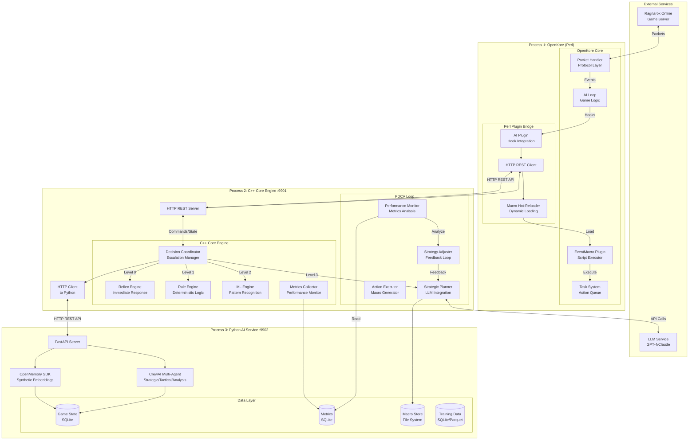
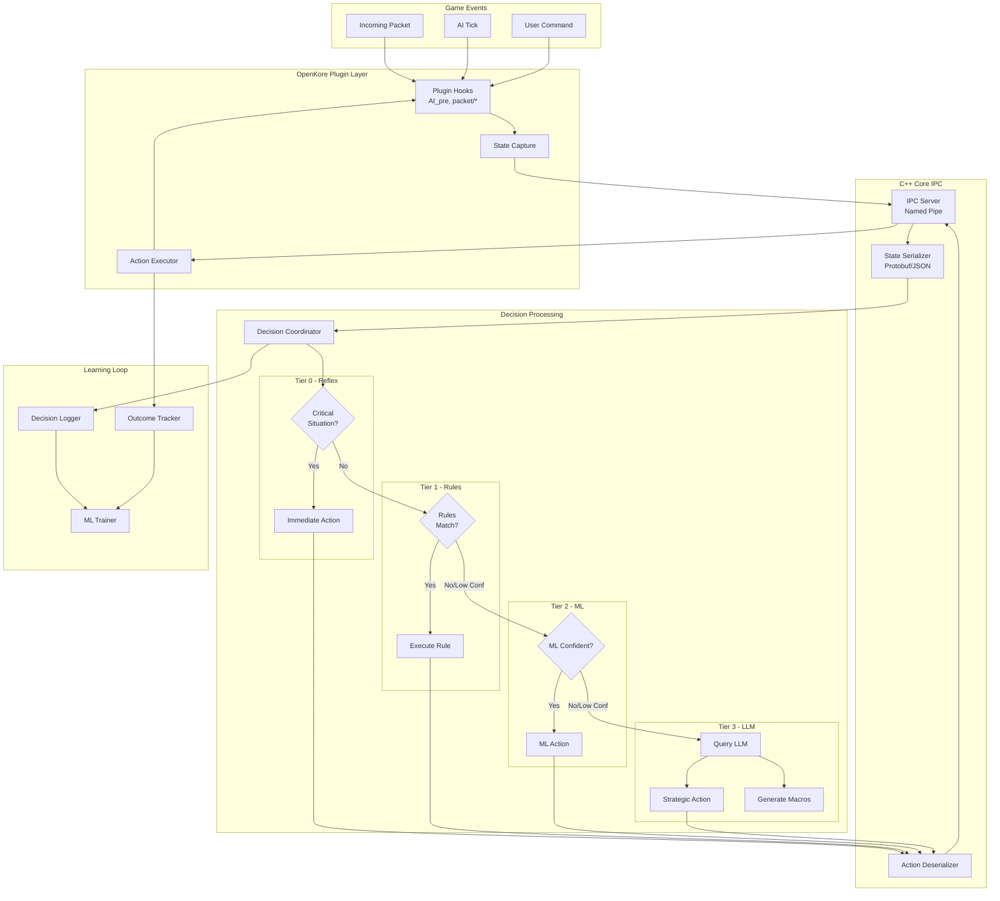
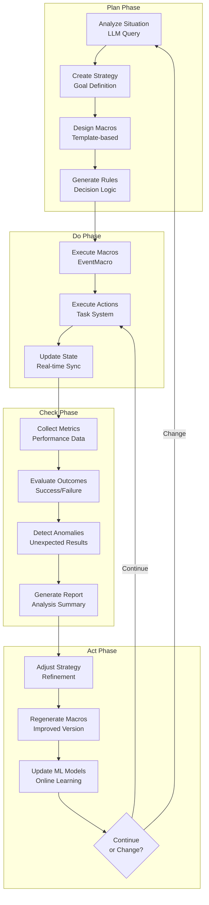
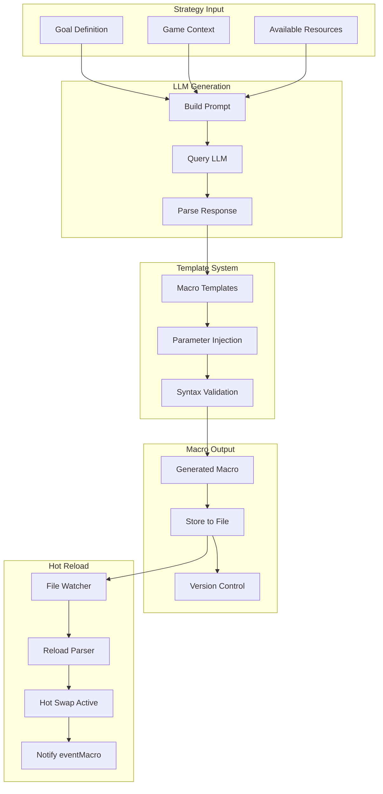
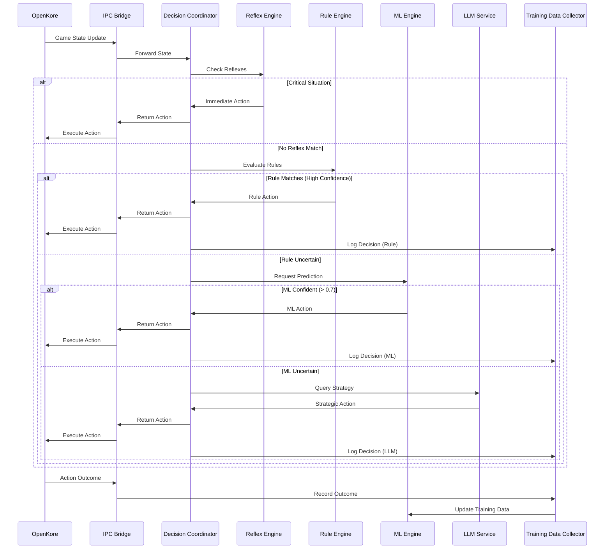
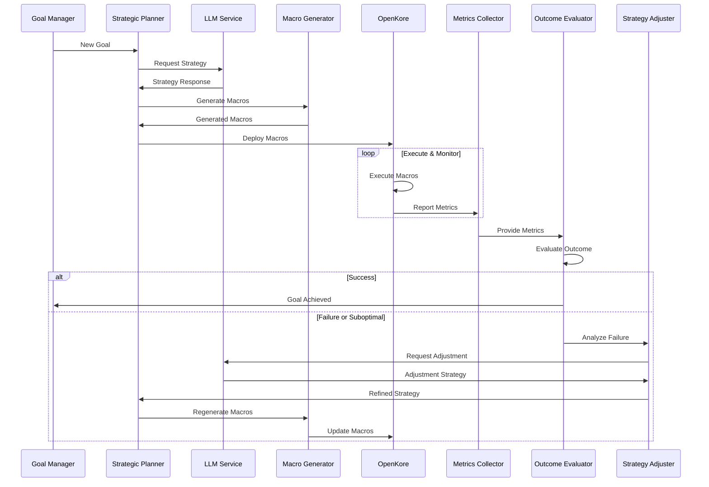
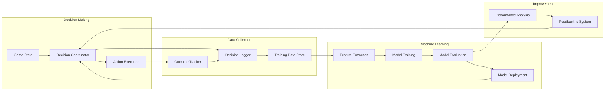
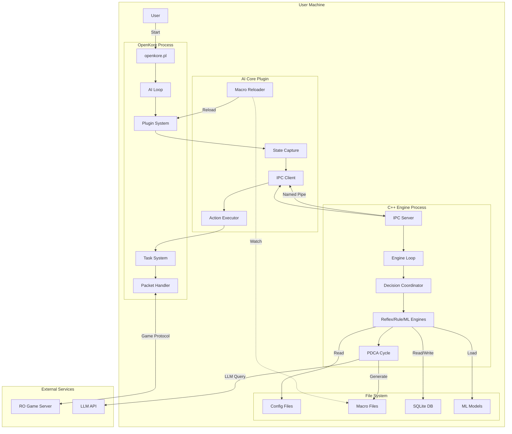
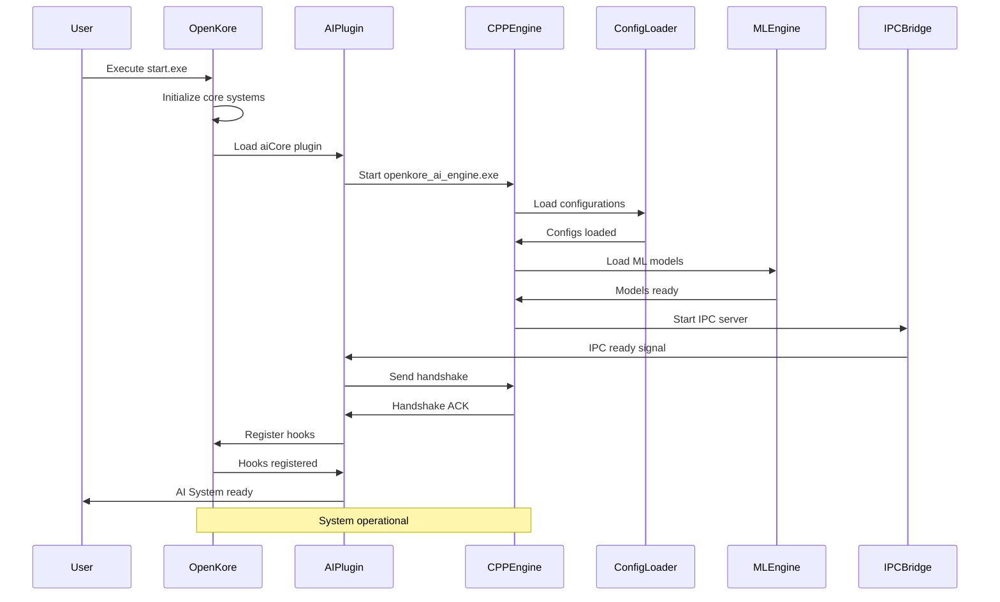

# Advanced OpenKore AI System - Comprehensive Architecture Design

**Version:** 2.0
**Date:** 2026-02-05
**Status:** Final Architecture
**Architecture Update:** HTTP REST API + Python AI Service + Complete Game Autonomy

---

## Table of Contents

1. [Executive Summary](#1-executive-summary)
2. [System Overview](#2-system-overview)
3. [Core Architectural Principles](#3-core-architectural-principles)
4. [Component Architecture](#4-component-architecture)
5. [LLM-Rule-ML-OpenKore Integration](#5-llm-rule-ml-openkore-integration)
6. [PDCA Cycle Implementation](#6-pdca-cycle-implementation)
7. [C++ Core Engine Architecture](#7-c-core-engine-architecture)
8. [Macro Generation and Hot-Reload System](#8-macro-generation-and-hot-reload-system)
9. [Machine Learning Pipeline](#9-machine-learning-pipeline)
10. [Data Flow Diagrams](#10-data-flow-diagrams)
11. [Technology Stack](#11-technology-stack)
12. [Deployment Architecture](#12-deployment-architecture)
13. [Security and Obfuscation](#13-security-and-obfuscation)
14. [Performance Considerations](#14-performance-considerations)
15. [Error Handling and Resilience](#15-error-handling-and-resilience)
16. [Development Phases](#16-development-phases)

---

## 1. Executive Summary

This document defines the architecture for an advanced AI system that integrates LLM-based strategic planning, rule-based reflexive responses, machine learning pattern recognition, Python AI services (OpenMemory SDK, CrewAI), and OpenKore's game protocol handling into a unified, production-grade solution with complete game lifecycle autonomy.

### Key Design Goals

- **Multi-tier Decision Making**: Fast reflexes → Rules → ML → LLM escalation ladder
- **PDCA Continuous Improvement**: Automated Plan-Do-Check-Act cycle
- **Three-Process Architecture**: C++ Engine + Python AI Service + Perl Bridge
- **HTTP REST API**: Modern, debuggable communication protocol
- **Complete Game Autonomy**: From character creation to endless endgame
- **Python AI Integration**: OpenMemory SDK (synthetic embeddings) + CrewAI (multi-agent)
- **Extended LLM Latency**: Up to 5 minutes for complex strategic planning
- **Performance**: C++ core engine for speed-critical operations
- **Security**: Obfuscated compiled binaries to prevent reverse engineering
- **Compatibility**: Plugin-only approach, no modification of OpenKore .pm files
- **Production Ready**: Enterprise-grade implementation with no mocks or stubs

---

## 2. System Overview

### 2.1 High-Level Architecture



### 2.2 Component Responsibilities

| Component | Responsibility | Language | Location |
|-----------|---------------|----------|----------|
| **Reflex Engine** | Immediate threat response, dodge, emergency actions | C++ | `openkore-ai/cpp-core/reflex/` |
| **Rule Engine** | Deterministic decision making, state machines | C++ | `openkore-ai/cpp-core/rules/` |
| **ML Engine** | Pattern recognition, learned behaviors | C++ | `openkore-ai/cpp-core/ml/` |
| **Decision Coordinator** | Escalation logic, tier selection | C++ | `openkore-ai/cpp-core/coordinator/` |
| **Strategic Planner** | LLM integration, macro generation | C++ | `openkore-ai/cpp-core/planner/` |
| **HTTP REST Server** | C++ REST API endpoint (port 9901) | C++ | `openkore-ai/cpp-core/http/` |
| **Python AI Service** | OpenMemory SDK, CrewAI, SQLite (port 9902) | Python | `openkore-ai/python-service/` |
| **OpenMemory SDK** | Memory management with synthetic embeddings | Python | `openkore-ai/python-service/memory/` |
| **CrewAI Framework** | Multi-agent strategic planning | Python | `openkore-ai/python-service/crew/` |
| **Metrics Collector** | Performance monitoring, logging | C++ | `openkore-ai/cpp-core/metrics/` |
| **AI Plugin** | Hook registration, event handling | Perl | `openkore-ai/plugins/aiCore/` |
| **HTTP REST Client** | Perl HTTP client to C++ engine | Perl | `openkore-ai/plugins/aiCore/HTTPClient.pm` |
| **Macro Hot-Reloader** | Dynamic macro loading | Perl | `openkore-ai/plugins/aiCore/MacroReloader.pm` |

---

## 3. Core Architectural Principles

### 3.1 Separation of Concerns

- **OpenKore (Perl)** remains responsible for game protocol, packet handling, and basic action execution
- **C++ Core Engine** handles all AI decision-making logic and HTTP REST server
- **Python AI Service** provides advanced AI (OpenMemory SDK, CrewAI, SQLite storage)
- **Perl Plugin** serves as a thin HTTP REST client bridge only
- **External LLM** provides strategic planning without tight coupling
- **HTTP REST API** enables clean communication between all three processes

### 3.2 Decision Escalation Ladder

```
Level 0: Reflex (< 1ms)     → Emergency dodge, immediate threat response
Level 1: Rule (< 10ms)      → State machine decisions, deterministic logic
Level 2: ML (< 100ms)       → Pattern recognition, learned behaviors
Level 3: LLM (up to 5 min)  → Strategic planning, complex reasoning, CrewAI multi-agent
```

**Note:** LLM tier now supports up to 5 minutes for complex strategic planning using CrewAI multi-agent framework. Progress indicators and cancellation support included.

### 3.3 Fallback Hierarchy

```
LLM unavailable → Use ML predictions
ML unavailable → Use Rule-based logic
Rule uncertain → Use default safe behavior
All fail → OpenKore native AI takes over
```

### 3.4 Plugin Compatibility

- **Must NOT modify** any `.pm` files in OpenKore core
- **Must work alongside** existing plugins: macro, eventMacro, breakTime, raiseStat, raiseSkill, reconnect, xConf, etc.
- **Must respect** existing configuration files and user settings

---

## 4. Component Architecture

### 4.1 Reflex Engine

**Purpose**: Handle time-critical situations requiring immediate response

**Responsibilities**:
- Emergency dodge from AoE skills
- Immediate heal when HP critical
- Instant teleport on overwhelming threat
- Emergency buff activation
- Quick item use for survival

**Design**:

```cpp
// Reflex Engine Core Structure
class ReflexEngine {
public:
    struct ReflexRule {
        std::string id;
        std::function<bool(const GameState&)> condition;
        std::function<Action(const GameState&)> action;
        int priority;
        uint64_t cooldown_ms;
    };

    struct GameState {
        int hp_percent;
        int sp_percent;
        std::vector<Monster> nearby_monsters;
        std::vector<Player> nearby_players;
        std::vector<AoEZone> danger_zones;
        Position current_position;
        std::unordered_map<std::string, bool> status_effects;
    };

    Action process(const GameState& state);
    void registerReflex(const ReflexRule& rule);
    
private:
    std::vector<ReflexRule> reflexes_;
    std::unordered_map<std::string, uint64_t> last_triggered_;
};

// Example Reflex Rules
ReflexRule dodge_aoe {
    .id = "dodge_aoe",
    .condition = [](const GameState& s) {
        return s.danger_zones.size() > 0 && 
               isPositionInDanger(s.current_position, s.danger_zones);
    },
    .action = [](const GameState& s) {
        return Action::MoveTo(calculateSafePosition(s));
    },
    .priority = 1000,
    .cooldown_ms = 500
};

ReflexRule emergency_heal {
    .id = "emergency_heal",
    .condition = [](const GameState& s) {
        return s.hp_percent < 30 && !s.status_effects["poison"];
    },
    .action = [](const GameState& s) {
        return Action::UseItem("White Potion");
    },
    .priority = 950,
    .cooldown_ms = 1000
};
```

**Configuration**: `openkore-ai/config/reflexes.json`

```json
{
  "reflexes": [
    {
      "id": "emergency_teleport",
      "enabled": true,
      "conditions": [
        {"hp_percent": {"lt": 20}},
        {"monster_count": {"gt": 5, "range": 7}}
      ],
      "action": {
        "type": "use_skill",
        "skill": "Teleport",
        "level": 1
      },
      "priority": 1000,
      "cooldown_ms": 5000
    }
  ]
}
```

---

### 4.2 Rule Engine

**Purpose**: Handle deterministic decision-making based on game state

**Responsibilities**:
- Combat rotations
- Resource management (HP/SP/Weight)
- Buff maintenance
- Movement patterns
- Party coordination
- Loot prioritization

**Design**:

```cpp
// Rule Engine Core Structure
class RuleEngine {
public:
    struct Rule {
        std::string id;
        std::string category;
        std::vector<Condition> conditions;
        std::vector<Action> actions;
        int priority;
        RuleState state;
    };

    struct Condition {
        std::string type; // hp, sp, monster, item, status, etc.
        std::string op;   // gt, lt, eq, ne, in, contains
        json value;
    };

    struct RuleState {
        bool active;
        uint64_t last_executed;
        int execution_count;
        double success_rate;
    };

    std::optional<Action> evaluate(const GameState& state);
    void loadRules(const std::string& rules_file);
    void updateRulePerformance(const std::string& rule_id, bool success);
    
private:
    std::vector<Rule> rules_;
    std::unordered_map<std::string, RuleState> rule_states_;
    
    bool evaluateCondition(const Condition& cond, const GameState& state);
    std::vector<Rule> getMatchingRules(const GameState& state);
};

// Rule Definition Example
Rule combat_rotation {
    .id = "mage_fire_rotation",
    .category = "combat",
    .conditions = {
        {"monster_distance", "lt", 10},
        {"sp_percent", "gt", 30},
        {"cast_cooldown", "eq", false}
    },
    .actions = {
        Action::UseSkill("Fire Ball", target_monster),
        Action::UseSkill("Fire Wall", defensive_position)
    },
    .priority = 100,
    .state = {.active = true}
};
```

**Configuration**: `openkore-ai/config/rules/` (multiple files by category)

```yaml
# combat_rules.yaml
rules:
  - id: basic_attack_priority
    category: combat
    priority: 50
    conditions:
      - type: monster
        subtype: in_range
        range: 15
      - type: state
        subtype: not_casting
    actions:
      - type: attack
        target: nearest_aggressive
        
  - id: skill_rotation_wizard
    category: combat_class
    class: Wizard
    priority: 80
    conditions:
      - type: sp
        op: gt
        value: 30
      - type: monster
        subtype: targetable
    actions:
      - type: use_skill
        skill: Fire Ball
        level: 10
        target: current_target
```

---

### 4.3 ML Engine

**Purpose**: Learn patterns from LLM decisions and user behavior

**Responsibilities**:
- Pattern recognition from historical data
- Behavioral cloning from LLM decisions
- Situation classification
- Action prediction
- Cold-start problem handling

**Design**:

```cpp
// ML Engine Core Structure
class MLEngine {
public:
    struct MLModel {
        std::string model_id;
        std::string model_type; // decision_tree, neural_net, ensemble
        std::string model_path;
        ModelMetrics metrics;
    };

    struct Prediction {
        Action action;
        double confidence;
        std::string reasoning;
    };

    struct TrainingData {
        GameState state;
        Action llm_decision;
        ActionResult result;
        double reward;
        uint64_t timestamp;
    };

    std::optional<Prediction> predict(const GameState& state);
    void trainOnline(const TrainingData& data);
    void loadModel(const std::string& model_path);
    void saveModel(const std::string& model_path);
    
private:
    std::vector<MLModel> models_;
    std::shared_ptr<ModelEnsemble> ensemble_;
    std::deque<TrainingData> training_buffer_;
    
    void onlineUpdate();
    void batchTrain();
};

// Model Architecture Options
enum class ModelType {
    DECISION_TREE,      // Fast, interpretable, good for cold start
    RANDOM_FOREST,      // Ensemble of trees, robust
    GRADIENT_BOOST,     // XGBoost/LightGBM for high accuracy
    NEURAL_NETWORK,     // Deep learning for complex patterns
    HYBRID_ENSEMBLE     // Combination of above
};

// Feature Engineering
struct FeatureVector {
    // Character state
    float hp_ratio;
    float sp_ratio;
    float weight_ratio;
    int level;
    int job_level;
    
    // Combat state
    int target_count;
    float avg_monster_level;
    float avg_monster_distance;
    bool in_combat;
    
    // Environment
    std::string map_name;
    int time_of_day;
    int party_size;
    
    // Embeddings
    std::vector<float> situation_embedding;
};
```

**Cold-Start Strategy**:

1. **Phase 1 (Days 0-7)**: Use Rule Engine primarily, collect LLM decisions
2. **Phase 2 (Days 7-30)**: Train initial models, use with low confidence threshold
3. **Phase 3 (Days 30+)**: Increase ML usage as confidence improves

**Configuration**: `openkore-ai/config/ml_config.json`

```json
{
  "ml_engine": {
    "enabled": true,
    "cold_start_mode": true,
    "cold_start_duration_days": 7,
    "models": [
      {
        "id": "combat_decision",
        "type": "random_forest",
        "confidence_threshold": 0.7,
        "training_batch_size": 1000,
        "online_learning": true
      },
      {
        "id": "resource_management",
        "type": "gradient_boost",
        "confidence_threshold": 0.75,
        "training_batch_size": 500
      }
    ],
    "training": {
      "auto_train_interval_hours": 6,
      "min_samples_for_training": 100,
      "validation_split": 0.2
    }
  }
}
```

---

### 4.4 Decision Coordinator

**Purpose**: Orchestrate the decision escalation ladder

**Responsibilities**:
- Route decisions to appropriate tier
- Manage escalation logic
- Handle fallback scenarios
- Track decision performance
- Balance speed vs quality

**Design**:

```cpp
// Decision Coordinator
class DecisionCoordinator {
public:
    struct DecisionRequest {
        GameState state;
        Priority priority;
        uint64_t deadline_us; // microsecond deadline
    };

    struct DecisionResponse {
        Action action;
        DecisionTier tier;
        uint64_t processing_time_us;
        double confidence;
        std::string reasoning;
    };

    enum class DecisionTier {
        REFLEX,     // Level 0: < 1ms
        RULE,       // Level 1: < 10ms
        ML,         // Level 2: < 100ms
        LLM         // Level 3: 1-5s
    };

    DecisionResponse decide(const DecisionRequest& request);
    
private:
    std::unique_ptr<ReflexEngine> reflex_engine_;
    std::unique_ptr<RuleEngine> rule_engine_;
    std::unique_ptr<MLEngine> ml_engine_;
    std::unique_ptr<StrategyPlanner> planner_;
    
    DecisionTier selectTier(const DecisionRequest& request);
    bool shouldEscalate(const DecisionResponse& response);
    DecisionResponse escalate(const DecisionRequest& request, DecisionTier from_tier);
};

// Escalation Logic
DecisionResponse DecisionCoordinator::decide(const DecisionRequest& request) {
    auto start_time = std::chrono::high_resolution_clock::now();
    
    // Level 0: Check reflexes first (always)
    if (auto reflex_action = reflex_engine_->process(request.state)) {
        return {
            .action = *reflex_action,
            .tier = DecisionTier::REFLEX,
            .processing_time_us = elapsed_us(start_time),
            .confidence = 1.0,
            .reasoning = "Reflex response"
        };
    }
    
    // Determine starting tier based on urgency and deadline
    DecisionTier tier = selectTier(request);
    
    while (tier <= DecisionTier::LLM) {
        DecisionResponse response;
        
        switch (tier) {
            case DecisionTier::RULE:
                if (auto action = rule_engine_->evaluate(request.state)) {
                    response = {*action, tier, elapsed_us(start_time), 0.8, "Rule-based"};
                }
                break;
                
            case DecisionTier::ML:
                if (auto prediction = ml_engine_->predict(request.state)) {
                    response = {prediction->action, tier, elapsed_us(start_time), 
                               prediction->confidence, prediction->reasoning};
                }
                break;
                
            case DecisionTier::LLM:
                if (auto plan = planner_->queryLLM(request.state)) {
                    response = {plan->action, tier, elapsed_us(start_time), 
                               0.9, plan->reasoning};
                }
                break;
        }
        
        // Check if response is satisfactory or if we need to escalate
        if (response.confidence >= getConfidenceThreshold(tier)) {
            return response;
        }
        
        // Check if we have time to escalate
        if (elapsed_us(start_time) + estimatedTime(tier + 1) > request.deadline_us) {
            // Use current response even if low confidence
            return response;
        }
        
        tier = static_cast<DecisionTier>(static_cast<int>(tier) + 1);
    }
    
    // Fallback to OpenKore native AI
    return {Action::Fallback(), DecisionTier::RULE, elapsed_us(start_time), 0.5, "Fallback"};
}
```

**Configuration**: `openkore-ai/config/coordinator.json`

```json
{
  "decision_coordinator": {
    "escalation_policy": "adaptive",
    "tier_timeouts_ms": {
      "reflex": 1,
      "rule": 10,
      "ml": 100,
      "llm": 5000
    },
    "confidence_thresholds": {
      "reflex": 1.0,
      "rule": 0.75,
      "ml": 0.70,
      "llm": 0.85
    },
    "fallback_enabled": true,
    "metrics_logging": true
  }
}
```

---

## 5. LLM-Rule-ML-OpenKore Integration

### 5.1 Integration Architecture



### 5.2 State Synchronization

**Game State Structure**:

```protobuf
// game_state.proto
syntax = "proto3";

message GameState {
  message Character {
    string name = 1;
    int32 hp = 2;
    int32 max_hp = 3;
    int32 sp = 4;
    int32 max_sp = 5;
    int32 level = 6;
    int32 job_level = 7;
    Position position = 8;
    repeated StatusEffect status_effects = 9;
    Inventory inventory = 10;
    Equipment equipment = 11;
  }

  message Monster {
    uint32 id = 1;
    string name = 2;
    int32 level = 3;
    Position position = 4;
    int32 hp_percent = 5;
    bool is_aggressive = 6;
    double threat_level = 7;
  }

  message Position {
    int32 x = 1;
    int32 y = 2;
    string map = 3;
  }

  Character character = 1;
  repeated Monster monsters = 2;
  repeated Player players = 3;
  repeated Item items_on_ground = 4;
  string current_map = 5;
  int64 timestamp_ms = 6;
  string ai_state = 7;
}
```

**State Capture (Perl Plugin)**:

```perl
# openkore-ai/plugins/aiCore/StateCapture.pm
package StateCapture;

use strict;
use Globals;
use JSON::XS;
use Time::HiRes qw(time);

sub captureGameState {
    my $state = {
        timestamp_ms => int(time() * 1000),
        character => {
            name => $char->{name},
            hp => $char->{hp},
            max_hp => $char->{hp_max},
            sp => $char->{sp},
            max_sp => $char->{sp_max},
            level => $char->{lv},
            job_level => $char->{lv_job},
            position => {
                x => $char->{pos_to}{x},
                y => $char->{pos_to}{y},
                map => $field->baseName()
            },
            status_effects => captureStatusEffects(),
            inventory => captureInventory(),
            equipment => captureEquipment()
        },
        monsters => captureMonsters(),
        players => capturePlayers(),
        items_on_ground => captureItems(),
        current_map => $field->baseName(),
        ai_state => AI::action()
    };
    
    return encode_json($state);
}

sub captureMonsters {
    my @monsters;
    foreach my $monster (@{$monstersList->getItems()}) {
        next if !$monster || $monster->{dead};
        
        push @monsters, {
            id => $monster->{binID},
            name => $monster->{name},
            level => $monster->{lv},
            position => {
                x => $monster->{pos_to}{x},
                y => $monster->{pos_to}{y}
            },
            hp_percent => calculateHPPercent($monster),
            is_aggressive => $monster->{dmgToYou} > 0 || $monster->{missedYou} > 0,
            threat_level => calculateThreatLevel($monster)
        };
    }
    return \@monsters;
}

1;
```

### 5.3 Action Execution

**Action Types**:

```cpp
// Action definitions
enum class ActionType {
    NO_ACTION,
    MOVE_TO,
    ATTACK_TARGET,
    USE_SKILL,
    USE_ITEM,
    TALK_NPC,
    PICK_ITEM,
    EXECUTE_MACRO,
    CHANGE_AI_STATE,
    SEND_COMMAND
};

struct Action {
    ActionType type;
    std::unordered_map<std::string, json> parameters;
    int priority;
    uint64_t deadline_ms;
};

// Example actions
Action moveAction = {
    .type = ActionType::MOVE_TO,
    .parameters = {
        {"map", "prontera"},
        {"x", 150},
        {"y", 180}
    },
    .priority = 50
};

Action skillAction = {
    .type = ActionType::USE_SKILL,
    .parameters = {
        {"skill", "Fire Ball"},
        {"level", 10},
        {"target_id", monster_id}
    },
    .priority = 80
};

Action macroAction = {
    .type = ActionType::EXECUTE_MACRO,
    .parameters = {
        {"macro_name", "farming_rotation_v2"},
        {"macro_params", {{"target", "poring"}}}
    },
    .priority = 60
};
```

**Action Executor (Perl Plugin)**:

```perl
# openkore-ai/plugins/aiCore/ActionExecutor.pm
package ActionExecutor;

use strict;
use Globals;
use Commands;
use AI;

sub executeAction {
    my ($action_json) = @_;
    my $action = decode_json($action_json);
    
    my $type = $action->{type};
    my $params = $action->{parameters};
    
    if ($type eq 'MOVE_TO') {
        my $map = $params->{map};
        my $x = $params->{x};
        my $y = $params->{y};
        
        Commands::run("move $map $x $y");
        
    } elsif ($type eq 'USE_SKILL') {
        my $skill = $params->{skill};
        my $level = $params->{level};
        my $target = $params->{target_id};
        
        Commands::run("ss $skill $target");
        
    } elsif ($type eq 'EXECUTE_MACRO') {
        my $macro_name = $params->{macro_name};
        my $macro_params = $params->{macro_params};
        
        # Set macro variables if provided
        if ($macro_params) {
            foreach my $key (keys %{$macro_params}) {
                $::Macro::Data::varStack{$key} = $macro_params->{$key};
            }
        }
        
        Commands::run("macro $macro_name");
        
    } elsif ($type eq 'USE_ITEM') {
        my $item = $params->{item_name};
        Commands::run("is $item");
        
    } elsif ($type eq 'SEND_COMMAND') {
        my $command = $params->{command};
        Commands::run($command);
    }
    
    return 1;
}

1;
```

---

## 6. PDCA Cycle Implementation

### 6.1 PDCA Architecture



### 6.2 Plan Phase

**Strategic Planner**:

```cpp
// Strategic Planner with LLM Integration
class StrategyPlanner {
public:
    struct Goal {
        std::string goal_id;
        std::string description;
        GoalType type;
        json parameters;
        std::vector<Metric> success_metrics;
    };

    struct Strategy {
        std::string strategy_id;
        Goal goal;
        std::vector<MacroScript> macros;
        std::vector<Rule> rules;
        json llm_reasoning;
        uint64_t created_timestamp;
    };

    Strategy planStrategy(const Goal& goal, const GameState& state);
    std::vector<MacroScript> generateMacros(const Strategy& strategy);
    
private:
    std::unique_ptr<LLMClient> llm_client_;
    std::unique_ptr<MacroGenerator> macro_generator_;
    
    std::string buildLLMPrompt(const Goal& goal, const GameState& state);
    Strategy parseLLMResponse(const std::string& response);
};

// LLM Prompt Template
std::string StrategyPlanner::buildLLMPrompt(const Goal& goal, const GameState& state) {
    return R"(
You are an expert Ragnarok Online player strategist. Analyze the current situation and create an optimal strategy.

**Current Goal:** )" + goal.description + R"(

**Current State:**
- Character: Level )" + std::to_string(state.character.level) + R"( )" + state.character.job_class + R"(
- Location: )" + state.current_map + R"(
- HP: )" + std::to_string(state.character.hp_percent) + R"(%
- SP: )" + std::to_string(state.character.sp_percent) + R"(%
- Nearby Monsters: )" + formatMonsters(state.monsters) + R"(

**Available Resources:**
- Skills: )" + formatSkills(state.character.skills) + R"(
- Items: )" + formatItems(state.character.inventory) + R"(

**Task:**
1. Analyze the situation
2. Create a step-by-step strategy to achieve the goal
3. Generate macro scripts for execution
4. Define success criteria

**Output Format (JSON):**
{
  "analysis": "Your situation analysis",
  "strategy": "Step-by-step plan",
  "macros": [
    {
      "name": "macro_name",
      "description": "What this macro does",
      "script": "OpenKore macro script"
    }
  ],
  "success_criteria": [
    {"metric": "exp_per_hour", "target": 1000000}
  ]
}
)";
}
```

**LLM Client**:

```cpp
// LLM Client for API communication
class LLMClient {
public:
    struct LLMRequest {
        std::string prompt;
        std::string model;
        int max_tokens;
        double temperature;
        json additional_params;
    };

    struct LLMResponse {
        std::string content;
        int tokens_used;
        double processing_time_s;
        bool success;
        std::string error;
    };

    LLMResponse query(const LLMRequest& request);
    
private:
    std::string api_endpoint_;
    std::string api_key_;
    std::unique_ptr<HttpClient> http_client_;
    
    std::string buildHttpRequest(const LLMRequest& request);
    LLMResponse parseHttpResponse(const std::string& response);
};

// Configuration
{
  "llm": {
    "provider": "openai",
    "model": "gpt-4-turbo",
    "api_endpoint": "https://api.openai.com/v1/chat/completions",
    "api_key_env": "OPENAI_API_KEY",
    "max_tokens": 4096,
    "temperature": 0.7,
    "timeout_seconds": 10,
    "retry_attempts": 3,
    "cache_enabled": true,
    "cache_duration_minutes": 30
  }
}
```

### 6.3 Do Phase

**Macro Executor**:

```perl
# Integration with eventMacro plugin
package MacroExecutor;

use strict;
use Globals;
use Macro::Data;
use Macro::Parser;
use Macro::Runner;

sub executeMacroScript {
    my ($macro_name, $params) = @_;
    
    # Set macro variables
    if ($params && ref($params) eq 'HASH') {
        foreach my $key (keys %{$params}) {
            $Macro::Data::varStack{$key} = $params->{$key};
        }
    }
    
    # Check if macro exists
    unless (exists $Macro::Data::macroList{$macro_name}) {
        error "[MacroExecutor] Macro '$macro_name' not found\n";
        return 0;
    }
    
    # Execute macro via eventMacro
    Commands::run("macro $macro_name");
    
    message "[MacroExecutor] Executing macro: $macro_name\n", "success";
    return 1;
}

1;
```

### 6.4 Check Phase

**Metrics Collector**:

```cpp
// Metrics Collection System
class MetricsCollector {
public:
    struct Metric {
        std::string name;
        MetricType type;
        double value;
        uint64_t timestamp_ms;
        json metadata;
    };

    enum class MetricType {
        COUNTER,        // Cumulative value
        GAUGE,          // Point-in-time value
        HISTOGRAM,      // Distribution
        RATE            // Change over time
    };

    void recordMetric(const Metric& metric);
    std::vector<Metric> getMetrics(const std::string& name, uint64_t since_ms);
    MetricsSummary summarize(uint64_t time_window_ms);
    
private:
    std::unique_ptr<TimeSeriesDB> db_;
    std::unordered_map<std::string, MetricAggregator> aggregators_;
};

// Key Metrics
struct GameplayMetrics {
    // Combat
    double exp_per_hour;
    double kills_per_hour;
    double death_count;
    double avg_kill_time_s;
    
    // Resource
    double zeny_per_hour;
    double item_pickup_rate;
    double potion_consumption;
    
    // Efficiency
    double uptime_percent;
    double ai_decision_time_ms;
    double action_success_rate;
    
    // Decision Breakdown
    int reflex_decisions;
    int rule_decisions;
    int ml_decisions;
    int llm_decisions;
};
```

**Outcome Evaluator**:

```cpp
// Outcome Evaluation
class OutcomeEvaluator {
public:
    struct Outcome {
        std::string strategy_id;
        Goal goal;
        bool success;
        double goal_achievement_percent;
        std::vector<Metric> metrics;
        std::string failure_reason;
    };

    Outcome evaluate(const Strategy& strategy, const MetricsSummary& metrics);
    
private:
    bool checkSuccessCriteria(const Goal& goal, const MetricsSummary& metrics);
    std::string identifyFailureReason(const Strategy& strategy, const MetricsSummary& metrics);
};

// Success Criteria Examples
Goal leveling_goal {
    .goal_id = "level_80_to_81",
    .description = "Level up from 80 to 81",
    .type = GoalType::LEVELING,
    .success_metrics = {
        {.name = "exp_gained", .target = 50000000, .operator = ">="},
        {.name = "death_count", .target = 2, .operator = "<="},
        {.name = "time_hours", .target = 4, .operator = "<="}
    }
};
```

### 6.5 Act Phase

**Strategy Adjuster**:

```cpp
// Strategy Adjustment
class StrategyAdjuster {
public:
    struct Adjustment {
        std::string type;  // parameter_tune, macro_regenerate, rule_update
        json changes;
        std::string reasoning;
    };

    std::vector<Adjustment> analyzeAndAdjust(const Outcome& outcome);
    Strategy applyAdjustments(const Strategy& strategy, const std::vector<Adjustment>& adjustments);
    
private:
    std::unique_ptr<LLMClient> llm_client_;
    
    std::string buildAdjustmentPrompt(const Outcome& outcome);
};

// Adjustment Examples
Adjustment macro_adjustment {
    .type = "macro_regenerate",
    .changes = {
        {"macro_name", "farming_rotation"},
        {"issue", "Too much potion consumption"},
        {"modification", "Add early retreat at 50% HP instead of 30%"}
    },
    .reasoning = "Death count exceeded threshold, need more conservative HP threshold"
};
```

### 6.6 PDCA Cycle Timing

**Trigger Modes**:

```json
{
  "pdca_cycle": {
    "modes": {
      "continuous": {
        "enabled": true,
        "check_interval_seconds": 300,
        "description": "Check every 5 minutes"
      },
      "goal_based": {
        "enabled": true,
        "description": "Trigger on goal completion or failure"
      },
      "performance_threshold": {
        "enabled": true,
        "metrics": {
          "death_count": {
            "threshold": 3,
            "window_minutes": 30
          },
          "exp_per_hour_drop": {
            "threshold_percent": 20,
            "window_minutes": 15
          }
        }
      },
      "manual": {
        "enabled": true,
        "command": "ai_pdca_cycle"
      }
    }
  }
}
```

---

## 7. C++ Core Engine Architecture

### 7.1 Module Structure

```
openkore-ai/
├── cpp-core/                    # C++ Core Engine
│   ├── src/
│   │   ├── main.cpp            # Entry point
│   │   ├── core/
│   │   │   ├── engine.cpp      # Main engine loop
│   │   │   ├── config.cpp      # Configuration manager
│   │   │   └── logger.cpp      # Logging system
│   │   ├── reflex/
│   │   │   ├── reflex_engine.cpp
│   │   │   ├── reflex_rules.cpp
│   │   │   └── threat_detector.cpp
│   │   ├── rules/
│   │   │   ├── rule_engine.cpp
│   │   │   ├── rule_parser.cpp
│   │   │   └── condition_evaluator.cpp
│   │   ├── ml/
│   │   │   ├── ml_engine.cpp
│   │   │   ├── model_loader.cpp
│   │   │   ├── feature_extractor.cpp
│   │   │   ├── models/
│   │   │   │   ├── decision_tree.cpp
│   │   │   │   ├── random_forest.cpp
│   │   │   │   └── neural_net.cpp
│   │   │   └── training/
│   │   │       ├── online_trainer.cpp
│   │   │       └── batch_trainer.cpp
│   │   ├── planner/
│   │   │   ├── strategy_planner.cpp
│   │   │   ├── llm_client.cpp
│   │   │   ├── macro_generator.cpp
│   │   │   └── goal_manager.cpp
│   │   ├── coordinator/
│   │   │   ├── decision_coordinator.cpp
│   │   │   ├── escalation_manager.cpp
│   │   │   └── fallback_handler.cpp
│   │   ├── pdca/
│   │   │   ├── pdca_cycle.cpp
│   │   │   ├── metrics_collector.cpp
│   │   │   ├── outcome_evaluator.cpp
│   │   │   └── strategy_adjuster.cpp
│   │   ├── ipc/
│   │   │   ├── ipc_server.cpp
│   │   │   ├── named_pipe.cpp      # Windows
│   │   │   ├── unix_socket.cpp     # Linux
│   │   │   ├── protocol.cpp
│   │   │   └── serialization.cpp
│   │   ├── data/
│   │   │   ├── game_state.cpp
│   │   │   ├── action.cpp
│   │   │   └── database.cpp
│   │   └── utils/
│   │       ├── json.cpp
│   │       ├── crypto.cpp
│   │       ├── http_client.cpp
│   │       └── time_utils.cpp
│   ├── include/               # Header files
│   │   └── [mirror of src structure]
│   ├── third_party/          # External libraries
│   │   ├── json/            # nlohmann/json
│   │   ├── sqlite/          # SQLite
│   │   ├── protobuf/        # Google Protocol Buffers
│   │   ├── curl/            # libcurl
│   │   ├── xgboost/         # XGBoost
│   │   └── onnxruntime/     # ONNX Runtime for neural nets
│   ├── tests/               # Unit tests
│   ├── CMakeLists.txt       # CMake build configuration
│   └── build/               # Build output
│       ├── bin/
│       │   └── openkore_ai_engine.exe
│       └── lib/
```

### 7.2 Build System

**CMakeLists.txt**:

```cmake
cmake_minimum_required(VERSION 3.20)
project(OpenKoreAIEngine VERSION 1.0.0 LANGUAGES CXX)

set(CMAKE_CXX_STANDARD 20)
set(CMAKE_CXX_STANDARD_REQUIRED ON)

# Release build optimizations
set(CMAKE_CXX_FLAGS_RELEASE "${CMAKE_CXX_FLAGS_RELEASE} -O3 -DNDEBUG")

# Static linking for easier deployment
set(BUILD_SHARED_LIBS OFF)
set(CMAKE_EXE_LINKER_FLAGS "${CMAKE_EXE_LINKER_FLAGS} -static")

# Anti-debugging flags (Windows)
if(WIN32)
    add_definitions(-DANTI_DEBUG)
    set(CMAKE_CXX_FLAGS "${CMAKE_CXX_FLAGS} /guard:cf /GS")
endif()

# Include directories
include_directories(${CMAKE_SOURCE_DIR}/include)
include_directories(${CMAKE_SOURCE_DIR}/third_party)

# Third-party libraries
add_subdirectory(third_party/json)
add_subdirectory(third_party/sqlite)
add_subdirectory(third_party/protobuf)
find_package(CURL REQUIRED)
find_package(XGBoost REQUIRED)
find_package(ONNXRuntime REQUIRED)

# Source files
file(GLOB_RECURSE SOURCES "src/*.cpp")

# Main executable
add_executable(openkore_ai_engine ${SOURCES})

target_link_libraries(openkore_ai_engine
    nlohmann_json::nlohmann_json
    SQLite::SQLite3
    protobuf::libprotobuf
    CURL::libcurl
    xgboost::xgboost
    onnxruntime
)

# Strip symbols in release mode
if(CMAKE_BUILD_TYPE STREQUAL "Release")
    add_custom_command(TARGET openkore_ai_engine POST_BUILD
        COMMAND ${CMAKE_STRIP} $<TARGET_FILE:openkore_ai_engine>
    )
endif()

# Install
install(TARGETS openkore_ai_engine DESTINATION bin)
```

**Build Script** (`build.bat` for Windows):

```batch
@echo off
echo Building OpenKore AI Engine...

set BUILD_DIR=build
set INSTALL_DIR=../../bin

if not exist %BUILD_DIR% mkdir %BUILD_DIR%
cd %BUILD_DIR%

cmake -G "Visual Studio 17 2022" -A x64 ^
      -DCMAKE_BUILD_TYPE=Release ^
      -DCMAKE_INSTALL_PREFIX=%INSTALL_DIR% ^
      ..

cmake --build . --config Release --parallel

if %ERRORLEVEL% EQU 0 (
    echo Build successful!
    cmake --install . --config Release
    echo Engine installed to %INSTALL_DIR%
) else (
    echo Build failed!
    exit /b 1
)

cd ..
```

### 7.3 Inter-Process Communication (IPC)

**IPC Protocol Design**:

```cpp
// IPC Message Protocol
struct IPCMessage {
    uint32_t magic;           // Magic number: 0x4F4B4149 ("OKAI")
    uint32_t version;         // Protocol version
    MessageType type;
    uint32_t payload_size;
    uint8_t payload[];
};

enum class MessageType : uint32_t {
    // State updates from OpenKore
    STATE_UPDATE = 0x0001,
    PACKET_EVENT = 0x0002,
    AI_TICK = 0x0003,
    
    // Responses from C++ engine
    ACTION_RESPONSE = 0x0101,
    MACRO_COMMAND = 0x0102,
    CONFIG_UPDATE = 0x0103,
    
    // Control messages
    HANDSHAKE = 0x1001,
    PING = 0x1002,
    PONG = 0x1003,
    SHUTDOWN = 0x1004,
    
    // Errors
    ERROR_RESPONSE = 0xFFFF
};

// Named Pipe Implementation (Windows)
class NamedPipeIPC {
public:
    NamedPipeIPC(const std::string& pipe_name);
    
    bool start();
    void stop();
    
    bool sendMessage(const IPCMessage& msg);
    std::optional<IPCMessage> receiveMessage(uint32_t timeout_ms);
    
private:
    std::string pipe_name_;
    HANDLE pipe_handle_;
    std::atomic<bool> running_;
    
    bool createPipe();
    bool connectClient();
};

// Usage
NamedPipeIPC ipc("\\\\.\\pipe\\openkore_ai");
ipc.start();

// Send action to Perl
IPCMessage msg {
    .magic = 0x4F4B4149,
    .version = 1,
    .type = MessageType::ACTION_RESPONSE,
    .payload_size = action_json.size(),
    .payload = action_json.data()
};
ipc.sendMessage(msg);

// Receive state from Perl
if (auto msg = ipc.receiveMessage(100)) {
    if (msg->type == MessageType::STATE_UPDATE) {
        GameState state = deserializeGameState(msg->payload);
        processState(state);
    }
}
```

**Perl IPC Client**:

```perl
# openkore-ai/plugins/aiCore/IPCClient.pm
package IPCClient;

use strict;
use warnings;
use Win32::Pipe;
use JSON::XS;
use Time::HiRes qw(time usleep);

our $pipe;
our $connected = 0;

sub connect {
    my $pipe_name = '\\\\.\\pipe\\openkore_ai';
    
    $pipe = Win32::Pipe->new($pipe_name);
    
    if (!$pipe) {
        error "[IPCClient] Failed to connect to pipe: $pipe_name\n";
        return 0;
    }
    
    $connected = 1;
    message "[IPCClient] Connected to AI engine\n", "success";
    
    # Send handshake
    sendMessage('HANDSHAKE', {
        version => 1,
        client => 'OpenKore',
        pid => $$
    });
    
    return 1;
}

sub sendMessage {
    my ($type, $payload) = @_;
    
    return 0 unless $connected;
    
    my $json_payload = encode_json($payload);
    
    my $message = pack('N N N N', 
        0x4F4B4149,                    # Magic
        1,                              # Version
        getMessageTypeCode($type),      # Type
        length($json_payload)           # Payload size
    ) . $json_payload;
    
    return $pipe->Write($message);
}

sub receiveMessage {
    my ($timeout_ms) = @_;
    $timeout_ms //= 100;
    
    return undef unless $connected;
    
    # Read header (16 bytes)
    my $header;
    my $bytes_read = $pipe->Read($header, 16, $timeout_ms);
    
    return undef unless $bytes_read == 16;
    
    my ($magic, $version, $type, $payload_size) = unpack('N N N N', $header);
    
    # Verify magic number
    return undef unless $magic == 0x4F4B4149;
    
    # Read payload
    my $payload;
    $bytes_read = $pipe->Read($payload, $payload_size, $timeout_ms);
    
    return undef unless $bytes_read == $payload_size;
    
    return {
        type => $type,
        version => $version,
        payload => decode_json($payload)
    };
}

1;
```

### 7.4 Main Engine Loop

```cpp
// Main Engine Loop
class AIEngine {
public:
    AIEngine(const Config& config);
    
    void run();
    void shutdown();
    
private:
    Config config_;
    std::unique_ptr<IPCServer> ipc_server_;
    std::unique_ptr<DecisionCoordinator> coordinator_;
    std::unique_ptr<PDCACycle> pdca_cycle_;
    std::atomic<bool> running_;
    
    void processMessages();
    void handleStateUpdate(const GameState& state);
    void handleAITick();
};

void AIEngine::run() {
    running_ = true;
    
    // Start IPC server
    if (!ipc_server_->start()) {
        throw std::runtime_error("Failed to start IPC server");
    }
    
    log_info("AI Engine started successfully");
    
    // Main loop
    while (running_) {
        // Process incoming messages from OpenKore
        processMessages();
        
        // Run PDCA cycle if needed
        pdca_cycle_->tick();
        
        // Small sleep to prevent CPU spinning
        std::this_thread::sleep_for(std::chrono::milliseconds(10));
    }
    
    log_info("AI Engine shutting down");
    ipc_server_->stop();
}

void AIEngine::handleStateUpdate(const GameState& state) {
    // Create decision request
    DecisionRequest request {
        .state = state,
        .priority = Priority::NORMAL,
        .deadline_us = 100000  // 100ms deadline
    };
    
    // Get decision from coordinator
    auto response = coordinator_->decide(request);
    
    // Send action back to OpenKore
    IPCMessage msg = serializeAction(response.action);
    ipc_server_->sendMessage(msg);
    
    // Log decision metrics
    metrics_collector_->recordDecision(response);
}

int main(int argc, char* argv[]) {
    try {
        // Load configuration
        Config config = Config::load("config/engine.json");
        
        // Initialize engine
        AIEngine engine(config);
        
        // Run engine
        engine.run();
        
        return 0;
        
    } catch (const std::exception& e) {
        std::cerr << "Fatal error: " << e.what() << std::endl;
        return 1;
    }
}
```

---

## 8. Macro Generation and Hot-Reload System

### 8.1 Macro Generation Architecture



### 8.2 Macro Generator

```cpp
// Macro Generator
class MacroGenerator {
public:
    struct MacroTemplate {
        std::string name;
        std::string description;
        std::string template_content;
        std::vector<Parameter> parameters;
    };

    struct Parameter {
        std::string name;
        std::string type;  // string, int, bool, position, skill
        json default_value;
        bool required;
    };

    struct GeneratedMacro {
        std::string name;
        std::string content;
        std::string description;
        std::vector<std::string> dependencies;
        json metadata;
    };

    std::vector<GeneratedMacro> generateFromStrategy(const Strategy& strategy);
    GeneratedMacro generateFromTemplate(const MacroTemplate& tmpl, const json& params);
    
private:
    std::unordered_map<std::string, MacroTemplate> templates_;
    std::unique_ptr<LLMClient> llm_client_;
    
    std::string renderTemplate(const std::string& template_str, const json& params);
    bool validateMacroSyntax(const std::string& macro_content);
};

// Macro Templates
MacroTemplate farming_rotation_template {
    .name = "farming_rotation",
    .description = "Generic farming rotation with skill usage",
    .template_content = R"(
automacro {{name}} {
    {{#if map}}
    location {{map}}
    {{/if}}
    {{#if monster}}
    monster {{monster}}
    {{/if}}
    hp > {{hp_threshold}}
    sp > {{sp_threshold}}
    call {{name}}_execute
}

macro {{name}}_execute {
    # Pre-combat buffs
    {{#each buffs}}
    do ss {{this}} $target
    {{/each}}
    
    # Target selection
    do attack {{monster_priority}}
    
    # Combat rotation
    {{#each skills}}
    do ss {{skill}} $target
    pause {{delay}}
    {{/each}}
    
    # Resource management
    {{#if use_potions}}
    do is {{hp_potion}} if (hp% < {{hp_threshold}})
    do is {{sp_potion}} if (sp% < {{sp_threshold}})
    {{/if}}
    
    # Loot
    {{#if auto_loot}}
    do take
    {{/if}}
}
)",
    .parameters = {
        {"name", "string", "farming_rotation", true},
        {"map", "string", "", false},
        {"monster", "string", "", false},
        {"hp_threshold", "int", 60, true},
        {"sp_threshold", "int", 30, true},
        {"buffs", "array", json::array(), false},
        {"skills", "array", json::array(), true},
        {"use_potions", "bool", true, false}
    }
};

// LLM-based generation
std::string buildMacroGenerationPrompt(const Goal& goal, const GameState& state) {
    return R"(
Generate an OpenKore macro script for the following goal.

**Goal:** )" + goal.description + R"(

**Context:**
- Character: )" + formatCharacter(state.character) + R"(
- Location: )" + state.current_map + R"(
- Available Skills: )" + formatSkills(state.character.skills) + R"(
- Available Items: )" + formatInventory(state.character.inventory) + R"(

**Requirements:**
1. Use OpenKore macro syntax
2. Include automacro triggers and macro execution
3. Handle resource management (HP/SP)
4. Include error handling
5. Use appropriate timeouts and pauses

**OpenKore Macro Syntax Reference:**
- automacro: Defines trigger conditions
- macro: Defines execution block
- do: Execute command
- pause: Wait for duration
- call: Call another macro
- Variables: $variableName, @arrayVariable, $.param

**Example Structure:**
```
automacro myTrigger {
    condition1 value
    condition2 value
    call myMacro
}

macro myMacro {
    do command1
    pause 0.5
    do command2
}
```

**Output:**
Generate a complete, executable macro script that achieves the goal.
)";
}
```

### 8.3 Macro Storage and Versioning

**File Structure**:

```
openkore-ai/
├── control/
│   └── macros/
│       ├── generated/              # AI-generated macros
│       │   ├── farming_rotation_v1.txt
│       │   ├── farming_rotation_v2.txt
│       │   ├── boss_hunt_v1.txt
│       │   └── resource_gather_v1.txt
│       ├── templates/              # Template library
│       │   ├── farming_template.txt
│       │   ├── party_support_template.txt
│       │   └── boss_fight_template.txt
│       └── active/                 # Currently active macros
│           └── current.txt         # Symlink or copy
```

**Version Control**:

```cpp
// Macro Version Manager
class MacroVersionManager {
public:
    struct MacroVersion {
        std::string macro_name;
        int version;
        std::string file_path;
        uint64_t created_timestamp;
        std::string created_by;  // "llm", "template", "user"
        json metadata;
        MacroMetrics performance;
    };

    void saveMacro(const GeneratedMacro& macro);
    std::optional<MacroVersion> getMacroVersion(const std::string& name, int version);
    std::vector<MacroVersion> getMacroHistory(const std::string& name);
    void activateMacro(const std::string& name, int version);
    void rollbackMacro(const std::string& name);
    
private:
    std::filesystem::path base_path_;
    std::unordered_map<std::string, std::vector<MacroVersion>> versions_;
    
    int getNextVersion(const std::string& macro_name);
    std::string generateFilePath(const std::string& name, int version);
};

// Save generated macro with versioning
void MacroVersionManager::saveMacro(const GeneratedMacro& macro) {
    int version = getNextVersion(macro.name);
    std::string file_path = generateFilePath(macro.name, version);
    
    // Write macro to file
    std::ofstream file(file_path);
    file << "# Auto-generated macro v" << version << "\n";
    file << "# Generated: " << getCurrentTimestamp() << "\n";
    file << "# Description: " << macro.description << "\n\n";
    file << macro.content;
    file.close();
    
    // Record version
    MacroVersion mv {
        .macro_name = macro.name,
        .version = version,
        .file_path = file_path,
        .created_timestamp = getCurrentTimestampMs(),
        .created_by = "llm",
        .metadata = macro.metadata
    };
    
    versions_[macro.name].push_back(mv);
    
    log_info("Saved macro: {} v{} to {}", macro.name, version, file_path);
}
```

### 8.4 Hot-Reload System

**File Watcher**:

```cpp
// File Watcher for macro changes
class MacroFileWatcher {
public:
    MacroFileWatcher(const std::filesystem::path& watch_dir);
    
    void start();
    void stop();
    
    using ChangeCallback = std::function<void(const std::filesystem::path&, FileEvent)>;
    void setCallback(ChangeCallback callback);
    
private:
    std::filesystem::path watch_dir_;
    std::atomic<bool> running_;
    std::thread watcher_thread_;
    ChangeCallback callback_;
    
    void watchLoop();
};

void MacroFileWatcher::watchLoop() {
    std::unordered_map<std::filesystem::path, std::filesystem::file_time_type> file_times;
    
    while (running_) {
        for (const auto& entry : std::filesystem::directory_iterator(watch_dir_)) {
            if (entry.path().extension() == ".txt") {
                auto current_time = std::filesystem::last_write_time(entry.path());
                
                // Check if file is new or modified
                if (file_times.find(entry.path()) == file_times.end() ||
                    file_times[entry.path()] != current_time) {
                    
                    file_times[entry.path()] = current_time;
                    
                    // Notify callback
                    if (callback_) {
                        callback_(entry.path(), FileEvent::MODIFIED);
                    }
                }
            }
        }
        
        std::this_thread::sleep_for(std::chrono::seconds(1));
    }
}
```

**Hot-Reload Handler (Perl)**:

```perl
# openkore-ai/plugins/aiCore/MacroReloader.pm
package MacroReloader;

use strict;
use warnings;
use Globals;
use Macro::Data;
use Macro::Parser;
use File::Monitor;

our $monitor;
our $watch_dir = "$Plugins::current_plugin_folder/../../control/macros/generated";

sub initialize {
    message "[MacroReloader] Initializing hot-reload system\n", "plugins";
    
    # Create file monitor
    $monitor = File::Monitor->new();
    $monitor->watch($watch_dir);
    
    # Register hook for periodic checking
    Plugins::addHook('AI_pre', \&checkForChanges);
    
    message "[MacroReloader] Watching directory: $watch_dir\n", "plugins";
}

sub checkForChanges {
    return unless $monitor;
    
    my @changes = $monitor->scan();
    
    foreach my $change (@changes) {
        my $file = $change->name;
        
        if ($file =~ /\.txt$/) {
            message "[MacroReloader] Detected change in macro file: $file\n", "success";
            reloadMacro($file);
        }
    }
}

sub reloadMacro {
    my ($file) = @_;
    
    # Parse macro file
    my $success = eval {
        Macro::Parser::parseMacroFile($file);
        return 1;
    };
    
    if ($success) {
        message "[MacroReloader] Successfully reloaded macro: $file\n", "success";
        
        # Optionally restart current macro if it's the one that was reloaded
        if ($Macro::Data::queue && $Macro::Data::queue->[0]{macro} eq $file) {
            message "[MacroReloader] Restarting active macro\n", "success";
            Macro::Runner::stop();
            Macro::Runner::call($file);
        }
        
    } else {
        error "[MacroReloader] Failed to reload macro: $file - $@\n";
    }
}

1;
```

### 8.5 Macro Validation

```cpp
// Macro Validator
class MacroValidator {
public:
    struct ValidationResult {
        bool valid;
        std::vector<std::string> errors;
        std::vector<std::string> warnings;
    };

    ValidationResult validate(const std::string& macro_content);
    
private:
    bool checkSyntax(const std::string& content);
    bool checkCommands(const std::string& content);
    bool checkLogic(const std::string& content);
    std::vector<std::string> extractCommands(const std::string& content);
};

ValidationResult MacroValidator::validate(const std::string& macro_content) {
    ValidationResult result {.valid = true};
    
    // Check basic syntax
    if (!checkSyntax(macro_content)) {
        result.valid = false;
        result.errors.push_back("Syntax error in macro");
    }
    
    // Check for valid commands
    auto commands = extractCommands(macro_content);
    for (const auto& cmd : commands) {
        if (!isValidCommand(cmd)) {
            result.errors.push_back("Invalid command: " + cmd);
            result.valid = false;
        }
    }
    
    // Check for infinite loops
    if (hasInfiniteLoop(macro_content)) {
        result.warnings.push_back("Potential infinite loop detected");
    }
    
    // Check for missing pauses
    if (!hasSufficientPauses(macro_content)) {
        result.warnings.push_back("Consider adding more pauses to prevent spamming");
    }
    
    return result;
}
```

---

## 9. Machine Learning Pipeline

### 9.1 Training Data Collection

**Data Schema**:

```json
{
  "training_record": {
    "id": "uuid",
    "timestamp": 1234567890,
    "state": {
      "character": {...},
      "monsters": [...],
      "environment": {...}
    },
    "features": {
      "hp_ratio": 0.85,
      "sp_ratio": 0.60,
      "threat_level": 3.2,
      "...": "..."
    },
    "decision": {
      "tier": "llm",
      "action": {
        "type": "USE_SKILL",
        "parameters": {...}
      },
      "reasoning": "LLM reasoning text"
    },
    "outcome": {
      "success": true,
      "reward": 0.8,
      "metrics": {
        "exp_gained": 50000,
        "damage_taken": 1200,
        "time_elapsed_s": 15
      }
    }
  }
}
```

**Data Collector**:

```cpp
// Training Data Collector
class TrainingDataCollector {
public:
    struct TrainingRecord {
        std::string id;
        uint64_t timestamp;
        GameState state;
        FeatureVector features;
        Decision decision;
        Outcome outcome;
    };

    void recordDecision(const DecisionResponse& decision, const GameState& state);
    void recordOutcome(const std::string& decision_id, const Outcome& outcome);
    std::vector<TrainingRecord> getRecords(uint64_t since_timestamp);
    void exportToFile(const std::string& file_path, DataFormat format);
    
private:
    std::deque<TrainingRecord> records_;
    size_t max_records_ = 100000;
    std::unique_ptr<Database> db_;
    
    void pruneOldRecords();
};

// Record LLM decisions for training
void TrainingDataCollector::recordDecision(const DecisionResponse& decision, 
                                          const GameState& state) {
    // Only record LLM and Rule decisions for training
    if (decision.tier != DecisionTier::LLM && decision.tier != DecisionTier::RULE) {
        return;
    }
    
    TrainingRecord record {
        .id = generateUUID(),
        .timestamp = getCurrentTimestampMs(),
        .state = state,
        .features = extractFeatures(state),
        .decision = {
            .tier = decision.tier,
            .action = decision.action,
            .reasoning = decision.reasoning
        }
    };
    
    records_.push_back(record);
    
    // Also store in database for persistence
    db_->insert("training_data", serializeRecord(record));
    
    // Prune old records if needed
    if (records_.size() > max_records_) {
        pruneOldRecords();
    }
}
```

### 9.2 Feature Engineering

```cpp
// Feature Extractor
class FeatureExtractor {
public:
    FeatureVector extract(const GameState& state);
    
private:
    // Character features
    void extractCharacterFeatures(const GameState& state, FeatureVector& features);
    
    // Combat features
    void extractCombatFeatures(const GameState& state, FeatureVector& features);
    
    // Environment features
    void extractEnvironmentFeatures(const GameState& state, FeatureVector& features);
    
    // Temporal features
    void extractTemporalFeatures(const GameState& state, FeatureVector& features);
};

FeatureVector FeatureExtractor::extract(const GameState& state) {
    FeatureVector features;
    
    // Character state
    features.hp_ratio = static_cast<float>(state.character.hp) / state.character.max_hp;
    features.sp_ratio = static_cast<float>(state.character.sp) / state.character.max_sp;
    features.weight_ratio = state.character.weight / state.character.max_weight;
    features.level = state.character.level;
    features.job_level = state.character.job_level;
    
    // Combat state
    features.target_count = state.monsters.size();
    if (!state.monsters.empty()) {
        float avg_level = 0;
        float avg_distance = 0;
        float max_threat = 0;
        
        for (const auto& monster : state.monsters) {
            avg_level += monster.level;
            avg_distance += distance(state.character.position, monster.position);
            max_threat = std::max(max_threat, monster.threat_level);
        }
        
        features.avg_monster_level = avg_level / state.monsters.size();
        features.avg_monster_distance = avg_distance / state.monsters.size();
        features.max_threat_level = max_threat;
    }
    
    // Status effects
    features.is_buffed = hasPositiveBuffs(state.character.status_effects);
    features.is_debuffed = hasNegativeDebuffs(state.character.status_effects);
    
    // Map features (one-hot encoding or embedding)
    features.map_embedding = getMapEmbedding(state.current_map);
    
    // Temporal features
    features.time_since_last_combat = getTimeSinceLastCombat();
    features.time_since_last_death = getTimeSinceLastDeath();
    
    return features;
}
```

### 9.3 Model Training

**Online Learning**:

```cpp
// Online Trainer for incremental learning
class OnlineTrainer {
public:
    OnlineTrainer(const TrainingConfig& config);
    
    void train(const TrainingRecord& record);
    void batchTrain(const std::vector<TrainingRecord>& records);
    
private:
    TrainingConfig config_;
    std::unique_ptr<Model> model_;
    std::deque<TrainingRecord> buffer_;
    
    void incrementalUpdate(const TrainingRecord& record);
};

void OnlineTrainer::train(const TrainingRecord& record) {
    // Add to buffer
    buffer_.push_back(record);
    
    // Train when buffer reaches threshold
    if (buffer_.size() >= config_.batch_size) {
        batchTrain(std::vector<TrainingRecord>(buffer_.begin(), buffer_.end()));
        buffer_.clear();
    }
}

void OnlineTrainer::batchTrain(const std::vector<TrainingRecord>& records) {
    // Prepare training data
    std::vector<FeatureVector> X;
    std::vector<Action> y;
    
    for (const auto& record : records) {
        X.push_back(record.features);
        y.push_back(record.decision.action);
    }
    
    // Train model
    model_->fit(X, y);
    
    // Evaluate performance
    auto metrics = model_->evaluate(X, y);
    log_info("Model trained - Accuracy: {:.2f}%", metrics.accuracy * 100);
    
    // Save model checkpoint
    model_->save(config_.checkpoint_path);
}
```

**Batch Training**:

```cpp
// Batch Trainer for offline training
class BatchTrainer {
public:
    void train(const std::string& data_file);
    void evaluateModel(const std::string& test_data_file);
    
private:
    std::unique_ptr<Model> model_;
    
    std::vector<TrainingRecord> loadTrainingData(const std::string& file);
    void splitTrainValidation(const std::vector<TrainingRecord>& data,
                              std::vector<TrainingRecord>& train,
                              std::vector<TrainingRecord>& validation);
};

void BatchTrainer::train(const std::string& data_file) {
    // Load all training data
    auto all_data = loadTrainingData(data_file);
    
    // Split into train/validation
    std::vector<TrainingRecord> train_data, val_data;
    splitTrainValidation(all_data, train_data, val_data);
    
    log_info("Training with {} samples, validating with {} samples", 
             train_data.size(), val_data.size());
    
    // Extract features and labels
    auto [X_train, y_train] = prepareData(train_data);
    auto [X_val, y_val] = prepareData(val_data);
    
    // Train model with early stopping
    int best_epoch = 0;
    float best_accuracy = 0;
    
    for (int epoch = 0; epoch < 100; epoch++) {
        model_->fit(X_train, y_train);
        
        auto val_metrics = model_->evaluate(X_val, y_val);
        
        if (val_metrics.accuracy > best_accuracy) {
            best_accuracy = val_metrics.accuracy;
            best_epoch = epoch;
            model_->save("best_model.bin");
        }
        
        // Early stopping
        if (epoch - best_epoch > 10) {
            log_info("Early stopping at epoch {}", epoch);
            break;
        }
    }
    
    // Load best model
    model_->load("best_model.bin");
}
```

### 9.4 Model Deployment

```cpp
// Model Manager for production deployment
class ModelManager {
public:
    void loadModel(const std::string& model_path);
    void hotSwapModel(const std::string& new_model_path);
    
    std::optional<Prediction> predict(const FeatureVector& features);
    
private:
    std::shared_ptr<Model> active_model_;
    std::shared_ptr<Model> standby_model_;
    std::mutex model_mutex_;
    
    void validateModel(const std::shared_ptr<Model>& model);
};

void ModelManager::hotSwapModel(const std::string& new_model_path) {
    // Load new model in standby
    auto new_model = std::make_shared<Model>();
    new_model->load(new_model_path);
    
    // Validate new model
    validateModel(new_model);
    
    // Atomic swap
    {
        std::lock_guard<std::mutex> lock(model_mutex_);
        standby_model_ = active_model_;
        active_model_ = new_model;
    }
    
    log_info("Hot-swapped model: {}", new_model_path);
}

std::optional<Prediction> ModelManager::predict(const FeatureVector& features) {
    std::shared_ptr<Model> model;
    
    {
        std::lock_guard<std::mutex> lock(model_mutex_);
        model = active_model_;
    }
    
    if (!model) {
        return std::nullopt;
    }
    
    return model->predict(features);
}
```

---

## 10. Data Flow Diagrams

### 10.1 Decision Escalation Flow



### 10.2 PDCA Cycle Flow



### 10.3 Learning Feedback Loop



---

## 11. Technology Stack

### 11.1 C++ Core Engine

| Component | Technology | Version | Purpose |
|-----------|-----------|---------|---------|
| **Build System** | CMake | 3.20+ | Cross-platform build |
| **Compiler** | MSVC / GCC | C++20 | Modern C++ features |
| **HTTP Server** | cpp-httplib / Crow | Latest | REST API server (port 9901) |
| **JSON** | nlohmann/json | 3.11+ | Configuration & serialization |
| **Database** | SQLite | 3.40+ | Game state & metrics storage (optional in C++) |
| **HTTP Client** | libcurl | 7.80+ | LLM API calls & Python service communication |
| **ML Framework** | XGBoost | 2.0+ | Gradient boosting models |
| **Neural Nets** | ONNX Runtime | 1.14+ | Deep learning inference |
| **Logging** | spdlog | 1.11+ | High-performance logging |
| **Testing** | Google Test | 1.13+ | Unit testing framework |

### 11.2 Machine Learning

| Component | Technology | Purpose |
|-----------|-----------|---------|
| **Decision Trees** | XGBoost | Fast, interpretable, cold-start |
| **Neural Networks** | ONNX | Complex pattern recognition |
| **Feature Engineering** | Custom C++ | Real-time feature extraction |
| **Training** | Offline: Python scikit-learn<br/>Online: C++ incremental | Model development & updates |
| **Deployment** | ONNX Runtime | Production inference |

**Python Training Pipeline** (offline):
```python
# openkore-ai/ml-training/train_model.py
import pandas as pd
import xgboost as xgb
from sklearn.model_selection import train_test_split
from sklearn.metrics import accuracy_score
import onnxmltools
from onnxmltools.convert import convert_xgboost

# Load training data
df = pd.read_parquet('training_data.parquet')

# Prepare features
X = df[feature_columns]
y = df['action_type']

# Split data
X_train, X_test, y_train, y_test = train_test_split(X, y, test_size=0.2)

# Train XGBoost
model = xgb.XGBClassifier(
    max_depth=10,
    n_estimators=100,
    learning_rate=0.1,
    objective='multi:softmax'
)
model.fit(X_train, y_train)

# Evaluate
y_pred = model.predict(X_test)
accuracy = accuracy_score(y_test, y_pred)
print(f"Accuracy: {accuracy:.2f}")

# Convert to ONNX for C++ deployment
onnx_model = convert_xgboost(model, initial_types=[('input', FloatTensorType([None, len(feature_columns)]))])
onnxmltools.utils.save_model(onnx_model, 'model.onnx')
```

### 11.3 Python AI Service

| Component | Technology | Version | Purpose |
|-----------|-----------|---------|---------|
| **Web Framework** | FastAPI | 0.100+ | REST API server (port 9902) |
| **ASGI Server** | uvicorn | 0.23+ | Production ASGI server |
| **Memory System** | OpenMemory SDK | Latest | Memory management with synthetic embeddings |
| **Multi-Agent** | CrewAI | 0.30+ | Multi-agent framework for complex decisions |
| **LLM Client** | OpenAI SDK / Anthropic SDK | Latest | LLM API integration |
| **Database** | SQLite | 3.40+ | Persistent storage (primary) |
| **ORM** | SQLAlchemy | 2.0+ | Database abstraction (optional) |
| **Data Processing** | pandas / numpy | Latest | Data manipulation |
| **HTTP Client** | httpx | 0.24+ | Async HTTP client |

**Key Features:**
- **OpenMemory SDK**: Synthetic embeddings (no external API dependencies)
- **CrewAI**: Multi-agent framework with Strategic, Tactical, and Analysis agents
- **SQLite**: Primary storage for memories, decisions, metrics, and lifecycle state
- **FastAPI**: Modern async REST API framework

### 11.4 LLM Integration

| Provider | Model | Use Case | Timeout |
|----------|-------|----------|---------|
| **OpenAI** | GPT-4 Turbo | Strategic planning, macro generation | Up to 5 min |
| **Anthropic** | Claude 3 Opus | Complex reasoning, analysis | Up to 5 min |
| **CrewAI Multi-Agent** | GPT-4 / Claude | Multi-perspective strategic planning | Up to 5 min |
| **Local** | Llama 3 70B | Offline fallback, cost optimization | Variable |

**Configuration**:
```json
{
  "llm_providers": [
    {
      "name": "openai",
      "priority": 1,
      "model": "gpt-4-turbo-preview",
      "api_key_env": "OPENAI_API_KEY",
      "endpoint": "https://api.openai.com/v1/chat/completions",
      "max_tokens": 4096,
      "timeout_s": 300,
      "extended_timeout_enabled": true
    },
    {
      "name": "anthropic",
      "priority": 2,
      "model": "claude-3-opus-20240229",
      "api_key_env": "ANTHROPIC_API_KEY",
      "endpoint": "https://api.anthropic.com/v1/messages",
      "max_tokens": 4096,
      "timeout_s": 300,
      "extended_timeout_enabled": true
    }
  ],
  "crewai_enabled": true,
  "fallback_enabled": true,
  "cache_responses": true,
  "cache_ttl_minutes": 30,
  "progress_updates": true,
  "cancellation_support": true
}
```

**Note:** LLM timeout extended to 300 seconds (5 minutes) for complex strategic planning with progress indicators and user cancellation support.

### 11.5 Perl Plugin Layer

| Component | Technology | Purpose |
|-----------|-----------|---------|
| **HTTP Client** | LWP::UserAgent | REST API communication with C++ engine |
| **JSON** | JSON::XS | Fast JSON parsing |
| **File Monitoring** | File::Monitor | Macro hot-reload |
| **Existing Plugins** | macro, eventMacro, etc. | Leverage existing functionality |

**Note:** Replaced Named Pipes/Unix Sockets with HTTP REST API for better cross-platform support and debuggability.

### 11.6 Data Storage

| Data Type | Storage | Format | Location |
|-----------|---------|--------|----------|
| **Configuration** | File System | JSON / YAML | All processes |
| **Game State** | SQLite (Python) | Relational DB | Python AI Service |
| **Memories** | SQLite (Python) | With embeddings | Python AI Service |
| **Decision History** | SQLite (Python) | Time Series | Python AI Service |
| **Metrics** | SQLite (Python) | Time Series | Python AI Service |
| **Training Data** | Parquet files / SQLite | Columnar / Relational | Python AI Service |
| **Lifecycle State** | SQLite (Python) | Relational DB | Python AI Service |
| **Macros** | File System | Plain text | All processes |
| **Logs** | File System | Structured JSON logs | All processes |

**Architecture Note:** SQLite is primarily used in Python AI Service for centralized data storage. C++ engine can optionally use SQLite for local caching but primarily communicates with Python service via HTTP REST API.

---

## 12. Deployment Architecture

### 12.1 File Structure

```
openkore-ai/                              # Main OpenKore directory
├── start.exe                             # OpenKore launcher
├── start.pl                              # Perl entry point
├── openkore.pl                           # Main OpenKore script
│
├── bin/                                  # Compiled binaries
│   └── openkore_ai_engine.exe           # C++ core engine (obfuscated, HTTP server :9901)
│
├── cpp-core/                             # C++ source code
│   ├── src/                             # Source files
│   │   ├── http/                        # HTTP REST server
│   │   ├── reflex/                      # Reflex engine
│   │   ├── rules/                       # Rule engine
│   │   ├── ml/                          # ML engine
│   │   └── planner/                     # Strategic planner
│   ├── include/                         # Headers
│   ├── third_party/                     # Dependencies
│   ├── CMakeLists.txt                   # Build config
│   └── build/                           # Build artifacts
│
├── python-service/                       # Python AI Service (:9902)
│   ├── main.py                          # FastAPI entry point
│   ├── requirements.txt                 # Python dependencies
│   ├── memory/
│   │   ├── __init__.py
│   │   ├── memory_manager.py            # OpenMemory SDK integration
│   │   └── embeddings.py                # Synthetic embeddings
│   ├── crew/
│   │   ├── __init__.py
│   │   ├── crew_manager.py              # CrewAI framework
│   │   ├── strategic_agent.py           # Strategic planning agent
│   │   ├── tactical_agent.py            # Tactical analysis agent
│   │   └── analysis_agent.py            # Performance analysis agent
│   ├── database/
│   │   ├── __init__.py
│   │   ├── models.py                    # SQLAlchemy models
│   │   └── schema.sql                   # Database schema
│   ├── api/
│   │   ├── __init__.py
│   │   ├── memory.py                    # Memory endpoints
│   │   ├── crew.py                      # CrewAI endpoints
│   │   └── lifecycle.py                 # Game lifecycle endpoints
│   ├── config/
│   │   └── config.yaml                  # Python service configuration
│   └── data/
│       └── openkore_ai.db               # SQLite database
│
├── plugins/                              # OpenKore plugins
│   ├── aiCore/                          # Main AI plugin (new)
│   │   ├── aiCore.pl                   # Plugin entry point
│   │   ├── HTTPClient.pm                # HTTP REST client
│   │   ├── StateCapture.pm             # Game state capture
│   │   ├── ActionExecutor.pm           # Action execution
│   │   ├── MacroReloader.pm            # Hot-reload system
│   │   └── config/                     # Plugin configuration
│   │       ├── ai_engine.json
│   │       └── http_config.json         # HTTP REST config
│   │
│   ├── macro/                           # Existing macro plugin
│   ├── eventMacro/                      # Existing eventMacro plugin
│   └── [other existing plugins]
│
├── control/                              # OpenKore configuration
│   ├── config.txt                       # Main config (unchanged)
│   ├── mon_control.txt                  # Monster control (unchanged)
│   ├── items_control.txt                # Items control (unchanged)
│   ├── macros/                          # Macro files
│   │   ├── generated/                  # AI-generated macros
│   │   ├── templates/                  # Macro templates
│   │   └── active/                     # Active macros
│   └── [other config files]
│
├── config/                               # AI Engine configuration (new)
│   ├── engine.json                      # Main engine config
│   ├── coordinator.json                 # Decision coordinator
│   ├── reflexes.json                    # Reflex rules
│   ├── ml_config.json                   # ML settings
│   ├── llm_config.json                  # LLM providers
│   ├── pdca_config.json                 # PDCA cycle settings
│   └── rules/                           # Rule engine configs
│       ├── combat_rules.yaml
│       ├── resource_rules.yaml
│       └── movement_rules.yaml
│
├── data/                                 # Data storage (new)
│   ├── db/
│   │   ├── game_state.db               # SQLite database
│   │   └── metrics.db                  # Metrics database
│   ├── training/                        # Training data
│   │   ├── training_data.parquet
│   │   └── archive/
│   └── logs/                            # Structured logs
│       ├── engine.log
│       └── decisions.log
│
├── models/                               # ML models (new)
│   ├── active/                          # Production models
│   │   ├── decision_tree_v1.bin
│   │   ├── random_forest_v2.bin
│   │   └── neural_net_v1.onnx
│   ├── checkpoints/                     # Training checkpoints
│   └── archive/                         # Old models
│
├── plans/                                # Planning documents
│   └── advanced-ai-architecture.md      # This document
│
├── ml-training/                          # ML training scripts (new)
│   ├── train_model.py                   # Training script
│   ├── evaluate_model.py                # Evaluation script
│   ├── requirements.txt                 # Python dependencies
│   └── notebooks/                       # Jupyter notebooks
│
└── external-references/                  # Reference materials
    ├── openkore-macros/
    └── openkore-stuff/
```

### 12.2 Process Model



### 12.3 Startup Sequence



### 12.4 Deployment Checklist

**Prerequisites**:
- [ ] Windows 10/11 or Linux
- [ ] OpenKore installed and configured
- [ ] C++ compiler (MSVC 2022 or GCC 11+)
- [ ] CMake 3.20+
- [ ] Python 3.9+ (for ML training)
- [ ] LLM API key (OpenAI/Anthropic)

**Build Steps**:
```batch
REM 1. Build C++ engine
cd openkore-ai\cpp-core
build.bat

REM 2. Install ML dependencies (if training locally)
cd ..\ml-training
pip install -r requirements.txt

REM 3. Configure AI engine
cd ..\config
REM Edit engine.json, llm_config.json, etc.

REM 4. Set API key
set OPENAI_API_KEY=your_key_here

REM 5. Start OpenKore
cd ..
start.exe
```

**Configuration Steps**:
1. Configure LLM provider in `config/llm_config.json`
2. Set decision thresholds in `config/coordinator.json`
3. Configure PDCA cycle in `config/pdca_config.json`
4. Define reflex rules in `config/reflexes.json`
5. Set up rule engine in `config/rules/*.yaml`
6. Configure ML in `config/ml_config.json`

---

## 13. Security and Obfuscation

### 13.1 Anti-Reverse Engineering

**Compilation Techniques**:
```cmake
# CMakeLists.txt - Release configuration
if(CMAKE_BUILD_TYPE STREQUAL "Release")
    # Strip all symbols
    set(CMAKE_CXX_FLAGS "${CMAKE_CXX_FLAGS} -s")
    
    # Enable Control Flow Guard (Windows)
    if(WIN32)
        set(CMAKE_CXX_FLAGS "${CMAKE_CXX_FLAGS} /guard:cf")
    endif()
    
    # Optimization flags
    set(CMAKE_CXX_FLAGS "${CMAKE_CXX_FLAGS} -O3 -DNDEBUG")
    
    # Remove debug info
    set(CMAKE_CXX_FLAGS "${CMAKE_CXX_FLAGS} -g0")
endif()
```

**Code Obfuscation**:
```cpp
// Anti-debugging checks
#ifdef ANTI_DEBUG
namespace AntiDebug {
    bool isDebuggerPresent() {
        #ifdef _WIN32
        return IsDebuggerPresent();
        #else
        return false;
        #endif
    }
    
    void checkDebugger() {
        if (isDebuggerPresent()) {
            // Exit or behave differently
            std::exit(1);
        }
    }
}
#endif

// String obfuscation
constexpr char obfuscated_key[] = {0x41^0x55, 0x50^0x55, 0x49^0x55, 0x5F^0x55};  // "API_" XOR 0x55

// Function pointer obfuscation
using FuncPtr = void(*)();
FuncPtr obfuscated_func = reinterpret_cast<FuncPtr>(0x12345678 ^ 0xDEADBEEF);
```

**Encryption**:
```cpp
// Encrypt sensitive configuration
class ConfigEncryption {
public:
    static std::string encrypt(const std::string& plaintext, const std::string& key);
    static std::string decrypt(const std::string& ciphertext, const std::string& key);
    
private:
    static constexpr size_t KEY_SIZE = 32;  // AES-256
    static constexpr size_t IV_SIZE = 16;
};

// Store API keys encrypted
{
  "llm_api_key_encrypted": "AES256:IV:base64_encrypted_data"
}
```

### 13.2 IPC Security

```cpp
// IPC Authentication
class IPCAuthenticator {
public:
    bool authenticate(const std::string& client_token);
    std::string generateToken();
    
private:
    std::string shared_secret_;
    
    std::string computeHMAC(const std::string& data);
};

// Secure IPC message
struct SecureIPCMessage {
    IPCMessage message;
    std::string hmac;
    uint64_t timestamp;
    uint32_t sequence_number;
};
```

---

## 14. Performance Considerations

### 14.1 Optimization Targets

| Component | Target | Strategy |
|-----------|--------|----------|
| **Reflex Response** | < 1ms | Pre-computed lookups, minimal branching |
| **Rule Evaluation** | < 10ms | Indexed conditions, early exit |
| **ML Inference** | < 100ms | Optimized models, batch prediction |
| **LLM Query** | < 5s | Caching, async processing |
| **State Sync** | < 5ms | Efficient serialization (Protobuf) |
| **Memory Usage** | < 500MB | Bounded buffers, memory pools |

### 14.2 Performance Optimizations

**Caching**:
```cpp
// LLM Response Cache
class LLMCache {
public:
    struct CacheEntry {
        std::string prompt_hash;
        std::string response;
        uint64_t timestamp;
        uint32_t hit_count;
    };

    std::optional<std::string> get(const std::string& prompt);
    void put(const std::string& prompt, const std::string& response);
    
private:
    std::unordered_map<std::string, CacheEntry> cache_;
    size_t max_entries_ = 1000;
    uint64_t ttl_ms_ = 1800000;  // 30 minutes
    
    std::string hashPrompt(const std::string& prompt);
    void evictOld();
};
```

**Memory Pools**:
```cpp
// Object pool for GameState
template<typename T>
class ObjectPool {
public:
    T* acquire();
    void release(T* obj);
    
private:
    std::vector<std::unique_ptr<T>> pool_;
    std::queue<T*> available_;
};

ObjectPool<GameState> state_pool;
auto state = state_pool.acquire();
// Use state
state_pool.release(state);
```

**Parallel Processing**:
```cpp
// Parallel feature extraction
FeatureVector extractFeaturesParallel(const GameState& state) {
    FeatureVector features;
    
    std::vector<std::future<void>> futures;
    
    futures.push_back(std::async(std::launch::async, [&]() {
        extractCharacterFeatures(state, features);
    }));
    
    futures.push_back(std::async(std::launch::async, [&]() {
        extractCombatFeatures(state, features);
    }));
    
    for (auto& f : futures) {
        f.wait();
    }
    
    return features;
}
```

---

## 15. Error Handling and Resilience

### 15.1 Error Handling Strategy

```cpp
// Error types
enum class ErrorSeverity {
    INFO,
    WARNING,
    ERROR,
    CRITICAL
};

class AIException : public std::exception {
public:
    AIException(ErrorSeverity severity, const std::string& message)
        : severity_(severity), message_(message) {}
    
    ErrorSeverity severity() const { return severity_; }
    const char* what() const noexcept override { return message_.c_str(); }
    
private:
    ErrorSeverity severity_;
    std::string message_;
};

// Error handler
class ErrorHandler {
public:
    void handleError(const AIException& ex);
    
private:
    void logError(const AIException& ex);
    void notifyUser(const AIException& ex);
    void attemptRecovery(const AIException& ex);
};

void ErrorHandler::handleError(const AIException& ex) {
    logError(ex);
    
    switch (ex.severity()) {
        case ErrorSeverity::INFO:
        case ErrorSeverity::WARNING:
            // Log only
            break;
            
        case ErrorSeverity::ERROR:
            // Attempt recovery
            attemptRecovery(ex);
            break;
            
        case ErrorSeverity::CRITICAL:
            // Notify user and fallback
            notifyUser(ex);
            activateFallbackMode();
            break;
    }
}
```

### 15.2 Fallback Mechanisms

```cpp
// Fallback chain
class FallbackManager {
public:
    Action decideFallback(const GameState& state) {
        // Try each fallback in order
        
        // 1. Try ML with lower confidence threshold
        if (auto action = ml_engine_->predict(state, 0.5)) {
            return *action;
        }
        
        // 2. Try rule engine with default rules
        if (auto action = rule_engine_->evaluateDefault(state)) {
            return *action;
        }
        
        // 3. Use hardcoded safe behavior
        return getSafeBehavior(state);
    }
    
private:
    Action getSafeBehavior(const GameState& state) {
        // Ultra-conservative safe actions
        if (state.character.hp_percent < 50) {
            return Action::UseItem("White Potion");
        }
        
        if (state.monsters.size() > 3) {
            return Action::UseSkill("Teleport");
        }
        
        return Action::NoAction();
    }
};
```

### 15.3 Connection Recovery

```perl
# IPC reconnection logic
sub maintainConnection {
    return if $IPCClient::connected;
    
    my $retry_count = 0;
    my $max_retries = 10;
    my $retry_delay = 5;  # seconds
    
    while ($retry_count < $max_retries) {
        warning "[IPCClient] Connection lost, attempting reconnect ($retry_count/$max_retries)\n";
        
        if (IPCClient::connect()) {
            message "[IPCClient] Reconnected successfully\n", "success";
            return 1;
        }
        
        $retry_count++;
        sleep($retry_delay);
    }
    
    error "[IPCClient] Failed to reconnect after $max_retries attempts\n";
    error "[IPCClient] Falling back to OpenKore native AI\n";
    
    # Disable AI plugin to let OpenKore native AI take over
    Plugins::unload('aiCore');
    
    return 0;
}
```

---

## 16. Development Phases

### Phase 1: Foundation (Weeks 1-4)

**Objectives**:
- Set up C++ project structure
- Implement basic IPC between Perl and C++
- Create plugin skeleton
- Build basic state capture and action execution

**Deliverables**:
- [ ] C++ project with CMake build system
- [ ] IPC communication working (Perl ↔ C++)
- [ ] aiCore plugin registers hooks
- [ ] Basic state serialization/deserialization
- [ ] Simple action execution pipeline

### Phase 2: Decision Tiers (Weeks 5-8)

**Objectives**:
- Implement Reflex Engine
- Implement Rule Engine
- Create Decision Coordinator
- Add configuration system

**Deliverables**:
- [ ] Reflex Engine with configurable rules
- [ ] Rule Engine with YAML configuration
- [ ] Decision Coordinator with escalation logic
- [ ] Configuration loading system
- [ ] Basic logging and metrics

### Phase 3: LLM Integration (Weeks 9-12)

**Objectives**:
- Implement LLM client
- Create Strategic Planner
- Build macro generation system
- Implement macro hot-reload

**Deliverables**:
- [ ] LLM API client with multiple providers
- [ ] Strategic planning with prompt engineering
- [ ] Macro generation from templates
- [ ] Macro hot-reload system
- [ ] LLM response caching

### Phase 4: PDCA Cycle (Weeks 13-16)

**Objectives**:
- Implement metrics collection
- Create outcome evaluator
- Build strategy adjuster
- Complete PDCA loop

**Deliverables**:
- [ ] Metrics collection system
- [ ] Time-series metrics storage
- [ ] Outcome evaluation logic
- [ ] Strategy adjustment with LLM
- [ ] Complete PDCA cycle operational

### Phase 5: Machine Learning (Weeks 17-24)

**Objectives**:
- Implement ML Engine
- Create feature extraction
- Build training pipeline
- Deploy initial models

**Deliverables**:
- [ ] Feature extraction system
- [ ] Training data collection
- [ ] ML model training (Decision Tree, Random Forest)
- [ ] Model deployment and inference
- [ ] Online learning implementation
- [ ] Model hot-swap capability

### Phase 6: Testing & Optimization (Weeks 25-28)

**Objectives**:
- Performance optimization
- Comprehensive testing
- Bug fixes
- Documentation

**Deliverables**:
- [ ] Performance benchmarks
- [ ] Unit tests for all components
- [ ] Integration tests
- [ ] User documentation
- [ ] Deployment guide

### Phase 7: Production Hardening (Weeks 29-32)

**Objectives**:
- Security hardening
- Error handling improvements
- Monitoring and alerting
- Production deployment

**Deliverables**:
- [ ] Code obfuscation implemented
- [ ] Comprehensive error handling
- [ ] Fallback mechanisms tested
- [ ] Production monitoring setup
- [ ] Final release v1.0

---

## Appendix A: Configuration Examples

### A.1 Complete Engine Configuration

```json
{
  "engine": {
    "name": "OpenKore Advanced AI Engine",
    "version": "1.0.0",
    "log_level": "info",
    "log_file": "data/logs/engine.log"
  },
  
  "ipc": {
    "type": "named_pipe",
    "pipe_name": "\\\\.\\pipe\\openkore_ai",
    "timeout_ms": 100,
    "buffer_size": 65536,
    "authentication_required": true
  },
  
  "decision_coordinator": {
    "escalation_policy": "adaptive",
    "tier_timeouts_ms": {
      "reflex": 1,
      "rule": 10,
      "ml": 100,
      "llm": 5000
    },
    "confidence_thresholds": {
      "reflex": 1.0,
      "rule": 0.75,
      "ml": 0.70,
      "llm": 0.85
    },
    "fallback_enabled": true,
    "metrics_logging": true
  },
  
  "reflex_engine": {
    "enabled": true,
    "config_file": "config/reflexes.json",
    "max_cooldown_ms": 5000
  },
  
  "rule_engine": {
    "enabled": true,
    "config_dir": "config/rules/",
    "auto_reload": true
  },
  
  "ml_engine": {
    "enabled": true,
    "cold_start_mode": true,
    "cold_start_duration_days": 7,
    "model_dir": "models/active/",
    "confidence_threshold": 0.7,
    "online_learning": true,
    "training_batch_size": 1000
  },
  
  "llm": {
    "provider": "openai",
    "model": "gpt-4-turbo",
    "api_key_env": "OPENAI_API_KEY",
    "endpoint": "https://api.openai.com/v1/chat/completions",
    "max_tokens": 4096,
    "temperature": 0.7,
    "timeout_seconds": 10,
    "retry_attempts": 3,
    "cache_enabled": true,
    "cache_duration_minutes": 30
  },
  
  "pdca_cycle": {
    "enabled": true,
    "continuous_mode": true,
    "check_interval_seconds": 300,
    "goal_based_triggers": true,
    "performance_thresholds": {
      "death_count": {
        "threshold": 3,
        "window_minutes": 30
      },
      "exp_per_hour_drop": {
        "threshold_percent": 20,
        "window_minutes": 15
      }
    }
  },
  
  "metrics": {
    "enabled": true,
    "database": "data/db/metrics.db",
    "retention_days": 30,
    "export_interval_hours": 24
  },
  
  "training_data": {
    "enabled": true,
    "storage_dir": "data/training/",
    "max_records": 100000,
    "export_format": "parquet",
    "auto_export": true
  }
}
```

---

## Appendix B: API Reference

### B.1 IPC Protocol Messages

**STATE_UPDATE (0x0001)**:
```json
{
  "type": "STATE_UPDATE",
  "timestamp": 1234567890,
  "data": {
    "character": {...},
    "monsters": [...],
    "players": [...],
    "items": [...],
    "map": "prontera",
    "ai_state": "auto"
  }
}
```

**ACTION_RESPONSE (0x0101)**:
```json
{
  "type": "ACTION_RESPONSE",
  "action": {
    "type": "USE_SKILL",
    "parameters": {
      "skill": "Fire Ball",
      "level": 10,
      "target_id": 12345
    },
    "priority": 80
  },
  "metadata": {
    "decision_tier": "ml",
    "confidence": 0.85,
    "processing_time_us": 5432
  }
}
```

**MACRO_COMMAND (0x0102)**:
```json
{
  "type": "MACRO_COMMAND",
  "command": "execute",
  "macro_name": "farming_rotation_v2",
  "parameters": {
    "target": "poring",
    "duration": 3600
  }
}
```

---

## Conclusion

This comprehensive architecture provides a production-grade foundation for an advanced OpenKore AI system that combines the strategic thinking of LLMs, the speed of rule-based systems, the adaptability of machine learning, and the reliability of OpenKore's proven game protocol handling.

The multi-tiered decision escalation ensures optimal balance between response time and decision quality, while the PDCA cycle enables continuous improvement. The C++ core engine provides performance and security, and the plugin-only approach ensures compatibility with existing OpenKore functionality.

The architecture is designed to be implemented in phases, with each phase building upon the previous one, allowing for incremental development and testing.

---

**Next Steps**: Review this architecture, provide feedback, and proceed to implementation in Code mode.
