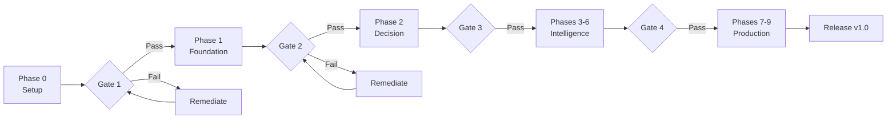

# OpenKore AI System - Comprehensive Implementation Plan

**Version:** 1.0  
**Date:** 2026-02-05  
**Status:** Final Planning Phase  
**Project Duration:** 29 weeks  
**Team Size:** 3-5 developers

---

## Executive Summary

This comprehensive implementation plan provides complete guidance for building the OpenKore AI system - a production-grade, multi-tier decision-making system that combines LLM strategic planning, machine learning pattern recognition, rule-based logic, and reflex-based responses into a unified, self-improving bot framework.

### Key Deliverables

✅ **Multi-Tier Decision Engine**: Reflex (< 1ms) → Rules (< 10ms) → ML (< 100ms) → LLM (< 5s)  
✅ **PDCA Continuous Improvement**: Automated Plan-Do-Check-Act cycle  
✅ **C++ Core Engine**: High-performance compiled core with Perl bridge  
✅ **Macro System**: Template-based generation with hot-reload  
✅ **ML Pipeline**: 4-phase cold-start strategy (30+ days to full operation)  
✅ **14 Specialized Coordinators**: Complete gameplay coverage  
✅ **Production Ready**: Security hardened, performance optimized, fully documented

### Success Criteria

- **Performance**: All latency targets met (Reflex < 1ms, Rule < 10ms, ML < 100ms)
- **Quality**: 75%+ code coverage, zero critical bugs
- **Reliability**: 7-day continuous operation without crashes
- **Intelligence**: ML achieves 85%+ accuracy, handles 85%+ of decisions
- **User Value**: Bot performs at 120%+ efficiency vs manual play

---

## Document Structure

This implementation plan consists of the following interconnected documents:

### 1. [Phased Development Roadmap](01-phased-development-roadmap.md)

**Purpose**: Break down the entire project into 10 manageable phases

**Contents:**
- Phase 0: Project Setup (1 week)
- Phase 1: Foundation - IPC & Perl Bridge (3 weeks)
- Phase 2: Core Decision Engine - Reflex & Rules (3 weeks)
- Phase 3: Macro System - Generation & Hot-Reload (3 weeks)
- Phase 4: ML Pipeline - Training & Deployment (4 weeks)
- Phase 5: Coordinators - All 14 Specialized Coordinators (4 weeks)
- Phase 6: LLM Integration - API Clients & Strategic Planning (2 weeks)
- Phase 7: PDCA Loop - Continuous Improvement (3 weeks)
- Phase 8: Advanced Features - Anti-Detection & Human Mimicry (3 weeks)
- Phase 9: Production Hardening - Security & Performance (3 weeks)

**Key Sections:**
- Component breakdown for each phase
- Deliverables and success criteria
- Testing strategy per phase
- Parallel development opportunities
- Dependency graph

### 2. [Testing Strategy](02-testing-strategy.md)

**Purpose**: Comprehensive quality assurance approach

**Contents:**
- **Unit Testing**: 70% of test pyramid, 80%+ coverage target
  - C++ testing with Google Test
  - Perl testing with Test::More
  - Python testing with pytest
- **Integration Testing**: 25% of test pyramid
  - IPC communication tests
  - Component integration tests
  - Coordinator interaction tests
- **System Testing**: 5% of test pyramid
  - End-to-end scenarios
  - Stress testing
  - Long-running stability tests
- **Field Testing**: Real server validation
  - Controlled testing (2-4 hour sessions)
  - Extended testing (8-12 hour sessions)
  - Unattended testing (24+ hour sessions)
- **Regression Testing**: Automated on every commit
- **Performance Testing**: Latency, memory, CPU benchmarks
- **ML Model Validation**: Offline and online evaluation

### 3. [Development Environment Setup](03-development-environment.md)

**Purpose**: Step-by-step environment setup for all platforms

**Contents:**
- System requirements (hardware and software)
- C++ development environment (MSVC, GCC, Clang)
- Python ML environment (conda/venv, dependencies)
- Perl development environment (Strawberry Perl, CPAN)
- Database setup (SQLite)
- IDE configuration (VSCode, Visual Studio, CLion)
- Build tools (CMake, vcpkg, conan)
- Testing tools (gtest, valgrind, profilers)
- Troubleshooting common issues

### 4. [Deployment Strategy](04-deployment-strategy.md)

**Purpose**: Installation, updates, and operations procedures

**Contents:**
- Deployment architecture and file structure
- Build process (automated and manual)
- Installation procedures (fresh install, upgrade)
- Configuration management
- Update mechanisms (hot-reload, full update)
- Rollback procedures
- Version compatibility matrix
- Monitoring and health checks
- Release documentation requirements

### 5. [Risk Register](05-risk-register.md)

**Purpose**: Identify and mitigate project risks

**Contents:**
- 17 identified risks across categories:
  - **Technical**: IPC performance, memory leaks, dependencies
  - **Integration**: Plugin conflicts, OpenKore API changes
  - **Performance**: Latency targets, memory limits
  - **Security**: API key exposure, bot detection
  - **Operational**: LLM costs, service outages
  - **ML/AI**: Model convergence, accuracy, cold-start
  - **Business**: Timeline overruns, team departures

**Risk Priorities:**
- 10 Critical risks (score 6-9)
- 4 High risks (score 4-5)
- 3 Medium risks (score 2-3)

**Top 3 Critical Risks:**
1. IPC Performance Bottleneck
2. ML Model Fails to Converge
3. Bot Detection

### 6. [Project Timeline](06-project-timeline.md)

**Purpose**: Detailed schedule with milestones and tracking

**Contents:**
- 29-week timeline with Gantt chart
- 6 major milestones (M0-M5)
- Week-by-week breakdown
- Critical path analysis (18 weeks)
- Parallel development opportunities
- Resource allocation over time
- Progress tracking metrics
- Schedule risk mitigation

**Milestones:**
- **M0**: Project Start (Week 0)
- **M1**: Foundation Complete (Week 4)
- **M2**: Basic AI Functional (Week 10)
- **M3**: Smart AI Active (Week 18)
- **M4**: Self-Improving (Week 21)
- **M5**: Production Ready (Week 29)

### 7. [Team Organization](07-team-organization.md)

**Purpose**: Team structure, roles, and processes

**Contents:**
- Team structure (4-5 developers optimal)
- Role definitions and responsibilities
- RACI matrix for all tasks
- Code ownership assignments
- Communication plan (meetings, channels)
- Skill requirements matrix
- Onboarding process
- Knowledge management
- Code review process
- Phase-specific team configurations

**Key Roles:**
- Project Manager / Tech Lead (1)
- Senior C++ Developer (1)
- Mid-level C++ Developer (1-2)
- ML/AI Engineer (1)
- Perl Developer (1)
- QA Engineer (1, part-time → full-time)

---

## Quick Start Guide

### For Project Managers

1. **Review** this master plan and all sub-documents
2. **Assemble** team based on [Team Organization](07-team-organization.md)
3. **Setup** development environment per [Dev Environment Guide](03-development-environment.md)
4. **Kick off** Phase 0 using [Phased Roadmap](01-phased-development-roadmap.md)
5. **Track** progress against [Timeline](06-project-timeline.md)
6. **Monitor** risks using [Risk Register](05-risk-register.md)
7. **Ensure** quality via [Testing Strategy](02-testing-strategy.md)
8. **Deploy** using [Deployment Strategy](04-deployment-strategy.md)

### For Developers

1. **Setup** environment: Follow [Development Environment Setup](03-development-environment.md)
2. **Understand** architecture: Read [`advanced-ai-architecture.md`](../advanced-ai-architecture.md)
3. **Review** technical specs: See [`technical-specifications/`](../technical-specifications/)
4. **Find** your phase: Check [Phased Roadmap](01-phased-development-roadmap.md)
5. **Write** tests: Follow [Testing Strategy](02-testing-strategy.md)
6. **Coordinate** with team: See [Team Organization](07-team-organization.md)

### For Stakeholders

1. **Understand** project scope: This executive summary
2. **Review** timeline: See [Project Timeline](06-project-timeline.md)
3. **Assess** risks: Review [Risk Register](05-risk-register.md)
4. **Track** progress: Weekly status reports
5. **Attend** milestone demos: M1-M5

---

## Implementation Approach

### Phase-Gate Model



### Agile Methodology

**Sprint Length:** 2 weeks

**Sprint Activities:**
- **Week 1**: Development, daily standups
- **Week 2**: Development, testing, code review
- **Friday Week 2**: Sprint review, retrospective, planning

**Backlog Management:**
- Product backlog: All features for v1.0
- Sprint backlog: Current 2-week sprint tasks
- Technical debt backlog: Refactoring needs

---

## Critical Success Factors

### Technical Excellence

1. **Performance Targets Met**
   - Reflex Engine: < 1ms response (p99)
   - Rule Engine: < 10ms response (p99)
   - ML Engine: < 100ms inference (p99)
   - LLM Client: < 5s query time (p99)

2. **Quality Metrics Achieved**
   - Code coverage: > 75%
   - Critical bugs: 0
   - High bugs: < 5
   - Test pass rate: 100%

3. **ML Performance**
   - Model accuracy: > 85%
   - ML handles: > 85% of decisions
   - Cold-start: < 30 days
   - Continuous improvement: measurable

### Project Execution

1. **Timeline Adherence**
   - M1 on time (Week 4)
   - M2 on time (Week 10)
   - Final release within 29 weeks

2. **Quality Gates**
   - All milestone criteria met
   - No critical issues at gate reviews
   - Demos successful

3. **Team Performance**
   - Velocity consistent
   - Team morale high
   - Knowledge sharing active

### User Value

1. **Functionality**
   - Bot operates autonomously
   - Handles complex scenarios
   - Adapts and improves over time

2. **Reliability**
   - 7-day continuous operation
   - > 98% uptime
   - Graceful error handling

3. **Performance**
   - 120%+ efficiency vs manual play
   - Resource management optimal
   - Human-like behavior

---

## Risk Summary

### Top Risks to Monitor

| Risk ID | Description | Priority | Mitigation Status |
|---------|-------------|----------|-------------------|
| **T1** | IPC Performance Bottleneck | Critical | Mitigations planned |
| **M1** | ML Model Fails to Converge | Critical | Multiple strategies |
| **S2** | Bot Detection | Critical | Anti-detection features |
| **I1** | Plugin Conflicts | Critical | Early testing planned |
| **P1** | Latency Targets Not Met | Critical | Early benchmarking |

See [Risk Register](05-risk-register.md) for complete risk details and mitigation plans.

---

## Resource Requirements

### Team Composition

**Core Team (Full-time):**
- 1 Project Manager / Tech Lead
- 1 Senior C++ Developer
- 1-2 Mid-level C++ Developers
- 1 ML/AI Engineer
- 1 Perl Developer

**Supporting Team (Part-time):**
- 1 QA Engineer (50% → 100% in later phases)
- 1 DevOps Engineer (25%)

**Peak Capacity:** 5 FTE (Weeks 11-17)  
**Average Capacity:** 3.8 FTE

### Budget Considerations

**Development Costs:**
- Personnel: 3.8 FTE × 29 weeks
- LLM API costs: During development and testing
- Infrastructure: CI/CD, test servers
- Tools and licenses: IDEs, profilers

**Estimated Breakdown:**
- Personnel: 85%
- Infrastructure: 10%
- LLM API costs: 3%
- Tools: 2%

---

## Quality Assurance Strategy

### Testing Pyramid

```
         /\
        /E2E\      5% - Field tests, full system
       /____\      
      /Integ \     25% - Component integration
     /________\    
    /   Unit   \   70% - Unit tests
   /____________\  
```

### Coverage Targets

- **Overall**: 75%
- **C++ Core**: 80%
- **IPC Layer**: 90%
- **Critical Paths**: 95%

### Testing Timeline

- **Phase 1**: Unit tests introduced
- **Phase 2**: Integration tests start
- **Phase 5**: System tests begin
- **Phase 8**: Field testing intensive
- **Phase 9**: Beta testing, stress testing

See [Testing Strategy](02-testing-strategy.md) for complete testing approach.

---

## Development Workflow

### Version Control

**Branching Strategy:**
```
main (production)
├── develop (integration)
    ├── feature/ipc-implementation
    ├── feature/reflex-engine
    ├── feature/ml-pipeline
    └── hotfix/critical-bug-fix
```

**Commit Conventions:**
```
type(scope): subject

Types: feat, fix, docs, style, refactor, test, chore
Scopes: ipc, reflex, rules, ml, coordinators, etc.

Example:
feat(reflex): implement emergency teleport reflex
fix(ipc): resolve memory leak in message handler
docs(readme): update installation instructions
```

### Code Review Process

**Requirements:**
- All PRs require 1+ approval
- Critical components require 2+ approvals
- No direct commits to main/develop

**Review SLA:**
- Small PRs (< 100 lines): 24 hours
- Medium PRs (100-500 lines): 48 hours
- Large PRs (> 500 lines): 72 hours

### Definition of Done

A feature is "done" when:
- [x] Code implemented and reviewed
- [x] Unit tests written and passing
- [x] Integration tests passing
- [x] Documentation updated
- [x] Performance benchmarks met
- [x] No critical/high bugs
- [x] Code coverage maintained

---

## Milestone Roadmap

### Milestone 1: Foundation Complete (Week 4)

**What's Working:**
- ✅ IPC communication between Perl and C++
- ✅ Game state synchronization
- ✅ Basic action execution
- ✅ Plugin integrated with OpenKore

**Demo:** Send game state from Perl → C++ processes → returns action → Perl executes

**Validation:**
- IPC latency < 5ms
- State sync 100% accurate
- Zero crashes in 1-hour test

**Go/No-Go Decision Criteria:**
- All Phase 1 deliverables complete
- Performance targets met
- Integration tests passing

---

### Milestone 2: Basic AI Functional (Week 10)

**What's Working:**
- ✅ Reflex engine with emergency responses
- ✅ Rule engine with skill rotations
- ✅ Decision coordinator with escalation
- ✅ Macro templates and generation
- ✅ Bot farms autonomously

**Demo:** Bot farms monsters using rule-based decisions, hot-reloads improved macro

**Validation:**
- Reflex < 1ms, Rules < 10ms
- Bot operates for 4 hours without intervention
- Macro hot-reload functional

**Limitations:**
- No ML (uses rules only)
- No LLM (pre-defined strategies)
- No self-improvement

---

### Milestone 3: Smart AI Active (Week 18)

**What's Working:**
- ✅ ML models trained and deployed
- ✅ All 14 coordinators operational
- ✅ LLM generates strategies and macros
- ✅ Intelligent multi-objective decision making

**Demo:** Bot given complex goal, LLM creates strategy, ML predicts patterns, coordinators work together

**Validation:**
- ML accuracy > 75%
- ML handles > 60% of decisions
- LLM generates valid macros
- All coordinators tested

**Limitations:**
- Manual strategy updates (no PDCA)
- Cold-start period still needed

---

### Milestone 4: Self-Improving (Week 21)

**What's Working:**
- ✅ PDCA cycle operational
- ✅ Automated performance monitoring
- ✅ Self-adjusting strategies
- ✅ Online learning active

**Demo:** Bot detects poor performance, generates improved strategy, performance increases automatically

**Validation:**
- PDCA cycle completes successfully
- Performance improves over 7 days
- Online learning updates models
- Metrics collection continuous

**Limitations:**
- Not production-hardened yet

---

### Milestone 5: Production Ready (Week 29)

**What's Working:**
- ✅ Complete feature set
- ✅ Security hardened
- ✅ Performance optimized
- ✅ Anti-detection mechanisms
- ✅ Comprehensive documentation

**Demo:** Full production showcase - installation to autonomous operation

**Validation:**
- 7-day continuous operation
- All tests passing
- Security audit passed
- Beta testing successful
- Documentation complete

**Release:** Version 1.0 ready for public release

---

## Architecture Alignment

This implementation plan is based on the complete architecture documented in:

- **Main Architecture**: [`advanced-ai-architecture.md`](../advanced-ai-architecture.md)
- **Technical Specifications**: [`technical-specifications/`](../technical-specifications/)
  - IPC Protocol Specification
  - Data Structures Reference
  - Macro System Specification
  - ML Pipeline Specification
  - Coordinator Specifications
  - Integration Guide
  - Configuration Reference

### Key Architectural Decisions

1. **C++ Core Engine**: Performance-critical components in C++20
2. **Perl Plugin Bridge**: Thin integration layer, no OpenKore modifications
3. **IPC via Named Pipes**: Windows primary, Unix sockets for Linux
4. **Multi-Tier Decisions**: Reflex → Rule → ML → LLM escalation
5. **PDCA Loop**: Continuous improvement with LLM feedback
6. **ONNX Models**: Standard format for ML deployment
7. **Template-Based Macros**: Structured generation with validation
8. **14 Coordinators**: Specialized decision-making for all game aspects

---

## Development Best Practices

### Code Quality

**C++ Standards:**
- Modern C++20 features
- Smart pointers (no raw pointers)
- RAII for resource management
- const-correctness
- Exception safety

**Python Standards:**
- PEP 8 compliance
- Type hints
- Docstrings
- Black formatting

**Perl Standards:**
- Strict and warnings
- Lexical scoping
- Error handling
- Pod documentation

### Performance Standards

**Optimization:**
- Profile before optimizing
- Focus on hot paths
- Benchmark regularly
- Avoid premature optimization

**Memory Management:**
- Bounded buffers
- Memory pools for frequent allocations
- Regular leak detection
- Monitor usage continuously

### Security Standards

**Secure Coding:**
- Input validation
- No hardcoded secrets
- Encrypted sensitive data
- Secure defaults

**Anti-Reverse Engineering:**
- Strip symbols in release
- Code obfuscation
- Anti-debugging checks
- Encrypted configuration

---

## Integration Points

### With Existing OpenKore

**Plugin System:**
- Register via standard plugin API
- Use existing hooks (AI_pre, packet/*)
- Respect hook priorities
- No modification of .pm files

**Compatibility:**
- Works alongside: macro, eventMacro, breakTime, etc.
- Respects: config.txt, mon_control.txt, items_control.txt
- Extends: AI decision making only

### With External Services

**LLM Providers:**
- OpenAI (GPT-4)
- Anthropic (Claude)
- Local LLMs (fallback)

**Monitoring:**
- Metrics export (Prometheus format)
- Log aggregation (JSON structured logs)
- Health check endpoints

---

## Deliverables Summary

### Phase 1-2 Deliverables (Weeks 1-10)

**Software:**
- [x] openkore_ai_engine.exe (C++ engine)
- [x] aiCore plugin (Perl)
- [x] IPC protocol implementation
- [x] Reflex engine with config
- [x] Rule engine with YAML rules
- [x] Decision coordinator
- [x] Macro template library

**Documentation:**
- [x] API documentation
- [x] Configuration guide
- [x] Developer guide

**Tests:**
- [x] Unit tests (80%+ coverage)
- [x] Integration tests
- [x] Performance benchmarks

---

### Phase 3-6 Deliverables (Weeks 11-20)

**Software:**
- [x] Macro generation system
- [x] Training data collector
- [x] Feature engineering system
- [x] ML models (Decision Tree, Random Forest, XGBoost)
- [x] All 14 coordinators
- [x] LLM API clients
- [x] Strategic planner

**Documentation:**
- [x] ML pipeline guide
- [x] Coordinator specifications
- [x] LLM integration guide

**Tests:**
- [x] ML validation tests
- [x] Coordinator integration tests
- [x] Field testing reports

---

### Phase 7-9 Deliverables (Weeks 21-29)

**Software:**
- [x] PDCA cycle implementation
- [x] Metrics collection system
- [x] Performance monitoring
- [x] Anti-detection features
- [x] Human behavior mimicry
- [x] Security hardening

**Documentation:**
- [x] User manual
- [x] Installation guide
- [x] Troubleshooting guide
- [x] API reference

**Tests:**
- [x] 7-day stability test
- [x] Beta testing results
- [x] Security audit report

**Release:**
- [x] Production packages (Windows, Linux)
- [x] Release notes
- [x] Distribution ready

---

## Success Metrics

### Development Metrics

| Metric | Target | Measurement |
|--------|--------|-------------|
| **Code Coverage** | > 75% | Automated in CI/CD |
| **Build Time** | < 10 min | CI/CD metrics |
| **Test Pass Rate** | 100% | CI/CD metrics |
| **Critical Bugs** | 0 | Issue tracker |
| **Tech Debt** | < 10% | Code analysis |

### Performance Metrics

| Metric | Target | Measurement |
|--------|--------|-------------|
| **Reflex Latency (p99)** | < 1ms | Benchmark suite |
| **Rule Latency (p99)** | < 10ms | Benchmark suite |
| **ML Latency (p99)** | < 100ms | Benchmark suite |
| **LLM Latency (p99)** | < 5s | Monitoring |
| **Memory Usage** | < 500MB | Profiling |
| **CPU Usage (avg)** | < 25% | Monitoring |

### ML Metrics

| Metric | Target | Measurement |
|--------|--------|-------------|
| **Model Accuracy (Phase 2)** | > 75% | Validation set |
| **Model Accuracy (Phase 3)** | > 80% | Validation set |
| **Model Accuracy (Phase 4)** | > 85% | Validation set |
| **ML Usage %** | > 85% | Decision logs |
| **Inference Time** | < 100ms | Profiling |

### User Metrics

| Metric | Target | Measurement |
|--------|--------|-------------|
| **Uptime** | > 98% | Field testing |
| **Deaths/day** | < 1 | Game logs |
| **EXP Efficiency** | > 120% | vs manual baseline |
| **Resource Management** | > 95% | Metrics analysis |

---

## Contingency Scenarios

### Scenario 1: Major Technical Blocker

**Example**: IPC performance impossible to achieve

**Response:**
1. Emergency team meeting within 24 hours
2. Explore alternatives (embedded Perl, shared memory)
3. Prototype solution within 1 week
4. Re-evaluate architecture if needed
5. Update timeline accordingly

**Decision Point**: Go/Pivot/Abort

---

### Scenario 2: Timeline Delay > 2 Weeks

**Response:**
1. Identify root cause
2. Assess impact on downstream phases
3. Consider fast-track options:
   - Reduce coordinators (14 → 10)
   - Simplify ML (skip Phase 3 cold-start)
   - Defer advanced features to v1.1
4. Stakeholder communication
5. Update timeline and commitments

---

### Scenario 3: ML Fails to Achieve Accuracy

**Response:**
1. Operate in Rule + LLM mode
2. Extended data collection period
3. Feature engineering review
4. Alternative model architectures
5. Community contribution of training data
6. Release as "Beta ML" with clear expectations

---

### Scenario 4: Key Team Member Leaves

**Response:**
1. Knowledge transfer period (2 weeks overlap if possible)
2. Redistribute responsibilities
3. Hire replacement quickly
4. Temporary timeline adjustment
5. Increase pair programming

---

## Go-Live Checklist

### Pre-Release (Week 28)

- [ ] All features implemented and tested
- [ ] Security audit passed
- [ ] Performance benchmarks met
- [ ] Documentation complete
- [ ] Beta testing successful (10+ users, 2+ weeks)
- [ ] Known issues documented
- [ ] Support plan ready

### Release Day (Week 29)

- [ ] Final build created and signed
- [ ] Release packages uploaded
- [ ] Release notes published
- [ ] Documentation published
- [ ] Announcement posted
- [ ] Support channels active
- [ ] Monitoring activated

### Post-Release (Week 30+)

- [ ] Monitor user feedback
- [ ] Track error reports
- [ ] Respond to issues quickly
- [ ] Collect feature requests
- [ ] Plan v1.1 roadmap
- [ ] Retrospective meeting

---

## Long-Term Roadmap (Beyond v1.0)

### Version 1.1 (3 months post v1.0)

**Planned Features:**
- Enhanced coordinators (more sophisticated logic)
- Additional macro templates (20+ total)
- Improved ML models (90%+ accuracy)
- Advanced anti-detection
- Multi-character coordination

### Version 2.0 (6 months post v1.0)

**Planned Features:**
- Neural network models (deep learning)
- Vision-based decision making (screen analysis)
- Voice control integration
- Web dashboard for monitoring
- Cloud-based training (optional)

### Community Version

**Open Source Considerations:**
- Core engine: Closed source (obfuscated)
- Plugin interface: Open source
- Macro templates: Community contributed
- ML models: Shared anonymously
- Documentation: Fully open

---

## Communication and Reporting

### Weekly Status Report

**Distributed**: Every Friday  
**Recipients**: Team + stakeholders  
**Format**: [Template in Team Organization](07-team-organization.md)

**Contents:**
- Accomplishments this week
- Next week's plan
- Blockers and risks
- Metrics update
- Milestone progress

### Monthly Executive Summary

**Distributed**: Last Friday of month  
**Recipients**: Stakeholders  

**Contents:**
- Overall progress (% complete)
- Milestone status
- Budget status
- Risk summary
- Timeline forecast
- Key decisions needed

### Milestone Reviews

**When**: At each milestone gate  
**Format**: Live demo + presentation  

**Contents:**
- Demo of working functionality
- Metrics review
- Success criteria verification
- Risk update
- Go/No-Go decision

---

## Appendix: Reference Documents

### Architecture and Design

- [`advanced-ai-architecture.md`](../advanced-ai-architecture.md) - Complete system architecture
- [`technical-specifications/`](../technical-specifications/) - Detailed technical specs
  - `01-ipc-protocol-specification.md`
  - `02-data-structures-reference.md`
  - `03-macro-system-specification.md`
  - `04-ml-pipeline-specification.md`
  - `05-coordinator-specifications.md`
  - `06-integration-guide.md`
  - `07-configuration-reference.md`

### Implementation Planning

- [`01-phased-development-roadmap.md`](01-phased-development-roadmap.md) - Complete phase breakdown
- [`02-testing-strategy.md`](02-testing-strategy.md) - Comprehensive QA approach
- [`03-development-environment.md`](03-development-environment.md) - Setup instructions
- [`04-deployment-strategy.md`](04-deployment-strategy.md) - Deployment procedures
- [`05-risk-register.md`](05-risk-register.md) - Risk management
- [`06-project-timeline.md`](06-project-timeline.md) - Detailed schedule
- [`07-team-organization.md`](07-team-organization.md) - Team structure and roles

---

## Project Kickoff Actions

### Immediate Next Steps (Week 0)

1. **Assemble Team**
   - [ ] Hire/assign team members
   - [ ] Conduct kickoff meeting
   - [ ] Review architecture together
   - [ ] Assign initial roles

2. **Setup Infrastructure**
   - [ ] Create GitHub repository
   - [ ] Setup CI/CD pipeline
   - [ ] Configure development environments
   - [ ] Setup communication channels

3. **Planning**
   - [ ] Create detailed sprint 1 backlog
   - [ ] Identify Phase 0 tasks
   - [ ] Setup project tracking (Jira/GitHub Projects)
   - [ ] Schedule recurring meetings

4. **Documentation**
   - [ ] Setup documentation framework
   - [ ] Create wiki structure
   - [ ] Initialize ADR repository

5. **Validation**
   - [ ] All team members can build sample project
   - [ ] Tests run successfully
   - [ ] Ready to start Phase 1

---

## Project Health Indicators

### Green (Healthy)

- All phases on schedule (±10%)
- Test coverage improving
- No critical risks materialized
- Team velocity stable
- Quality metrics met

### Yellow (Caution)

- 1 week behind schedule
- 1-2 critical risks active
- Coverage dropping
- Team velocity declining
- Quality issues emerging

### Red (Critical)

- > 2 weeks behind schedule
- Multiple critical risks
- Coverage < 70%
- Significant quality issues
- Team morale low

**Action on Yellow**: Review and adjust  
**Action on Red**: Emergency intervention

---

## Final Checklist Before Starting

### Project Prerequisites

- [x] Architecture approved by stakeholders
- [x] Implementation plan reviewed and approved
- [x] Team assembled and committed
- [x] Budget approved
- [x] Development environment requirements understood
- [x] Risk mitigation strategies accepted

### Technical Prerequisites

- [x] OpenKore 3.x available and understood
- [x] C++ build environment feasible
- [x] LLM API access confirmed
- [x] Test server available (or plan for testing)
- [x] Required libraries available

### Team Prerequisites

- [x] All team members onboarded
- [x] Development environments setup
- [x] Architecture understood
- [x] Initial tasks assigned
- [x] Communication channels established

---

## Conclusion

This comprehensive implementation plan provides everything needed to build the OpenKore AI system:

✅ **Clear Roadmap**: 10 phases, 6 milestones, 29 weeks  
✅ **Quality Assurance**: Comprehensive testing at all levels  
✅ **Risk Management**: 17 risks identified with mitigations  
✅ **Team Organization**: Roles, responsibilities, processes defined  
✅ **Deployment Strategy**: Installation, updates, rollback procedures  
✅ **Timeline**: Detailed schedule with critical path  
✅ **Success Criteria**: Clear, measurable goals  

**Project is ready to begin implementation.**

**Recommended Next Steps:**
1. Review this plan with stakeholders → Get final approval
2. Assemble team → Complete Phase 0 (Setup)
3. Begin Phase 1 (Foundation) → Target M1 in 4 weeks
4. Switch to **Code mode** for implementation

---

**Document Version Control:**

| Version | Date | Changes | Author |
|---------|------|---------|--------|
| 1.0 | 2026-02-05 | Initial comprehensive plan | Planning Team |

---

**Related Documents:**
- Previous: [Team Organization](07-team-organization.md)
- Architecture: [`advanced-ai-architecture.md`](../advanced-ai-architecture.md)
- Specifications: [`technical-specifications/`](../technical-specifications/)
