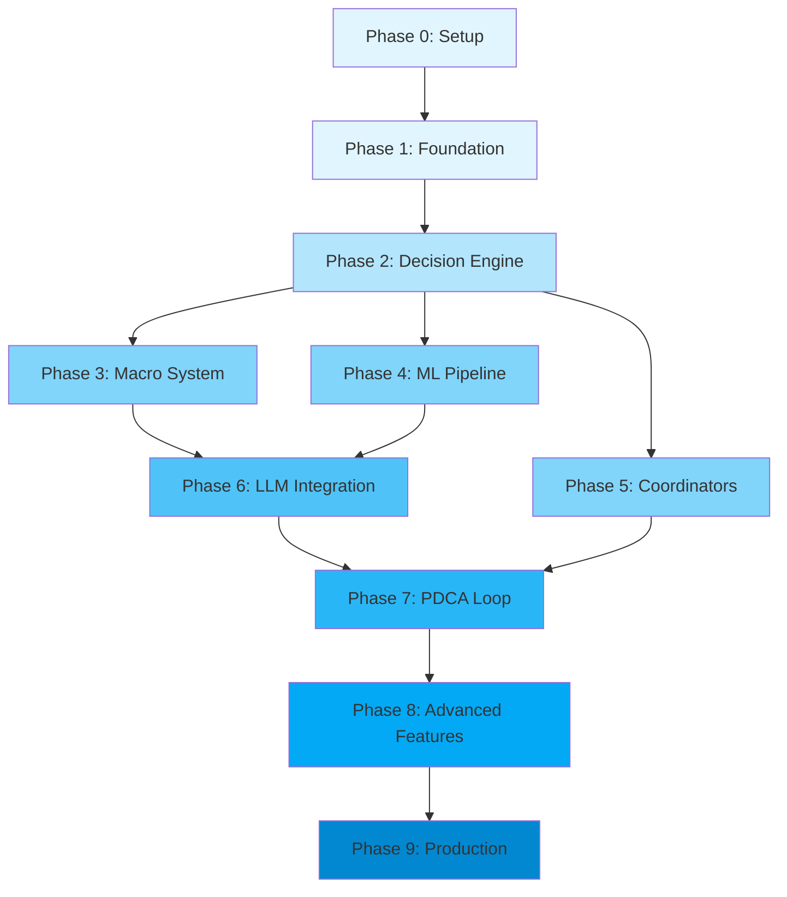

# Phased Development Roadmap

**Version:** 1.0  
**Date:** 2026-02-05  
**Status:** Planning Phase

---

## Table of Contents

1. [Overview](#1-overview)
2. [Phase 0: Project Setup](#2-phase-0-project-setup)
3. [Phase 1: Foundation](#3-phase-1-foundation)
4. [Phase 2: Core Decision Engine](#4-phase-2-core-decision-engine)
5. [Phase 3: Macro System](#5-phase-3-macro-system)
6. [Phase 4: ML Pipeline](#6-phase-4-ml-pipeline)
7. [Phase 5: Coordinators](#7-phase-5-coordinators)
8. [Phase 6: LLM Integration](#8-phase-6-llm-integration)
9. [Phase 7: PDCA Loop](#9-phase-7-pdca-loop)
10. [Phase 8: Advanced Features](#10-phase-8-advanced-features)
11. [Phase 9: Production Hardening](#11-phase-9-production-hardening)
12. [Dependency Graph](#12-dependency-graph)
13. [Parallel Development Opportunities](#13-parallel-development-opportunities)

---

## 1. Overview

### 1.1 Purpose

This roadmap breaks down the entire OpenKore AI system implementation into manageable, sequential phases. Each phase delivers working functionality that can be tested independently while building toward the complete system.

### 1.2 Guiding Principles

- **Incremental Value**: Each phase produces testable, usable output
- **Risk-Driven**: High-risk components addressed early
- **Test-Driven**: Testing integrated from Phase 0
- **Parallel-Friendly**: Phases structured to allow concurrent work
- **Rollback-Ready**: Each phase can be reverted if issues arise

### 1.3 Phase Summary

| Phase | Name | Duration | Key Deliverables | Team Size |
|-------|------|----------|------------------|-----------|
| 0 | Project Setup | 1 week | Dev environment, build system, documentation structure | 2-3 |
| 1 | Foundation | 3 weeks | IPC, Perl bridge, basic state sync | 3-4 |
| 2 | Core Decision Engine | 3 weeks | Reflex + Rule engines, decision coordinator | 3-4 |
| 3 | Macro System | 3 weeks | Templates, generation, hot-reload | 2-3 |
| 4 | ML Pipeline | 4 weeks | Training data, feature engineering, models | 3-4 |
| 5 | Coordinators | 4 weeks | All 14 specialized coordinators | 4-5 |
| 6 | LLM Integration | 2 weeks | API clients, prompt engineering | 2-3 |
| 7 | PDCA Loop | 3 weeks | Metrics, evaluation, adjustment | 3-4 |
| 8 | Advanced Features | 3 weeks | Anti-detection, human mimicry | 2-3 |
| 9 | Production Hardening | 3 weeks | Security, performance, monitoring | 3-4 |
| **Total** | | **29 weeks** | **Full production system** | **3-5 avg** |

---

## 2. Phase 0: Project Setup

**Duration:** 1 week  
**Prerequisites:** None  
**Team:** 2-3 developers

### 2.1 Objectives

- Establish development infrastructure
- Set up build systems
- Configure version control
- Create documentation framework
- Define coding standards

### 2.2 Deliverables

#### Development Environment
- [ ] C++ development environment setup guide
- [ ] Python ML environment setup (conda/virtualenv)
- [ ] Perl development environment
- [ ] IDE configurations (VSCode, Visual Studio)
- [ ] Debugger setup (gdb, MSVC debugger)

#### Build System
- [ ] CMake project structure
- [ ] Build scripts (Windows .bat, Linux .sh)
- [ ] Dependency management (vcpkg/conan)
- [ ] CI/CD pipeline configuration
- [ ] Automated testing framework setup

#### Version Control
- [ ] Git repository structure
- [ ] Branch strategy (main, develop, feature/*)
- [ ] Commit message conventions
- [ ] Code review process
- [ ] .gitignore configuration

#### Documentation
- [ ] Documentation templates
- [ ] API documentation framework (Doxygen)
- [ ] Architecture decision records (ADRs)
- [ ] README files for each component
- [ ] Contribution guidelines

#### Coding Standards
- [ ] C++ coding style guide
- [ ] Python style guide (PEP 8)
- [ ] Perl style guide
- [ ] Code formatting tools (.clang-format)
- [ ] Static analysis tools (clang-tidy, cppcheck)

### 2.3 Success Criteria

- ✅ All team members can build C++ project from source
- ✅ Python environment can train sample ML model
- ✅ Perl can load and execute test plugin
- ✅ Documentation framework generates HTML/PDF output
- ✅ CI/CD runs automated tests on commit

### 2.4 Risks & Mitigations

| Risk | Likelihood | Impact | Mitigation |
|------|------------|--------|------------|
| Dependency conflicts | Medium | Medium | Use containerized builds, document exact versions |
| Platform differences | High | Medium | Test on all target platforms early |
| Tool learning curve | Medium | Low | Provide training sessions, pair programming |

### 2.5 Timeline

```
Week 1
├── Day 1-2: Dev environment setup
├── Day 3-4: Build system and CI/CD
└── Day 5: Documentation and standards
```

---

## 3. Phase 1: Foundation

**Duration:** 3 weeks  
**Prerequisites:** Phase 0 complete  
**Team:** 3-4 developers

### 3.1 Objectives

- Establish C++/Perl IPC communication
- Create plugin skeleton
- Implement basic game state synchronization
- Build action execution pipeline
- Set up logging and diagnostics

### 3.2 Component Breakdown

#### Week 1: IPC Protocol
- [ ] IPC message protocol design (Protobuf/JSON)
- [ ] Named Pipe implementation (Windows)
- [ ] Unix socket implementation (Linux)
- [ ] Message serialization/deserialization
- [ ] Connection management and reconnection logic
- [ ] Protocol authentication
- [ ] Unit tests for IPC layer

#### Week 2: Perl Bridge
- [ ] aiCore plugin skeleton
- [ ] Hook registration (AI_pre, packet/*)
- [ ] State capture module
- [ ] IPC client implementation (Perl)
- [ ] Action executor module
- [ ] Error handling and fallback
- [ ] Integration tests

#### Week 3: C++ Engine Core
- [ ] Main engine loop
- [ ] Configuration loader
- [ ] State manager
- [ ] Basic action handler
- [ ] Logging system integration
- [ ] End-to-end test: Perl → C++ → Perl

### 3.3 Deliverables

#### C++ Components
```cpp
// Core engine
openkore_ai_engine.exe
├── IPC Server (NamedPipeIPC / UnixSocketIPC)
├── State Manager
├── Action Handler
├── Configuration Loader
└── Logger

// Libraries
libipc.a           // IPC communication
libstate.a         // State management
libconfig.a        // Configuration
```

#### Perl Components
```perl
# Plugin structure
plugins/aiCore/
├── aiCore.pl                # Main plugin
├── IPCClient.pm            # IPC communication
├── StateCapture.pm         # Game state capture
├── ActionExecutor.pm       # Action execution
└── config/
    └── ipc_config.json
```

#### Configuration Files
```json
{
  "ipc": {
    "type": "named_pipe",
    "pipe_name": "\\\\.\\pipe\\openkore_ai",
    "timeout_ms": 100,
    "buffer_size": 65536
  },
  "engine": {
    "log_level": "debug",
    "log_file": "data/logs/engine.log"
  }
}
```

### 3.4 Testing Strategy

#### Unit Tests
- IPC message serialization/deserialization
- State capture accuracy
- Action execution correctness
- Configuration loading

#### Integration Tests
- Full IPC round-trip (Perl → C++ → Perl)
- State synchronization accuracy
- Action execution in OpenKore
- Connection recovery

#### Manual Tests
- Start OpenKore with plugin loaded
- Verify IPC connection established
- Send test state, receive test action
- Check logs for errors

### 3.5 Success Criteria

- ✅ IPC communication working bidirectionally
- ✅ Game state captured and sent to C++ engine
- ✅ C++ engine receives state, processes, returns action
- ✅ Perl plugin executes action in OpenKore
- ✅ < 5ms latency for round-trip communication
- ✅ Graceful handling of connection failures
- ✅ All unit tests passing (80%+ coverage)

### 3.6 Risks & Mitigations

| Risk | Likelihood | Impact | Mitigation |
|------|------------|--------|------------|
| IPC performance issues | Medium | High | Benchmark early, use binary serialization |
| Perl/C++ memory issues | Medium | High | Careful memory management, use smart pointers |
| Plugin conflicts | Low | Medium | Test with existing plugins early |
| State sync complexity | High | High | Start with minimal state, expand gradually |

### 3.7 Parallel Work Opportunities

- **Team A**: IPC C++ implementation
- **Team B**: IPC Perl implementation  
- **Team C**: State capture and action execution
- **Team D**: Testing and documentation

---

## 4. Phase 2: Core Decision Engine

**Duration:** 3 weeks  
**Prerequisites:** Phase 1 complete  
**Team:** 3-4 developers

### 4.1 Objectives

- Implement Reflex Engine (< 1ms response)
- Implement Rule Engine (< 10ms response)
- Create Decision Coordinator
- Build escalation logic
- Add configuration system for rules

### 4.2 Component Breakdown

#### Week 1: Reflex Engine
- [ ] Reflex rule data structure
- [ ] Condition evaluator (optimized)
- [ ] Action generator
- [ ] Cooldown manager
- [ ] Reflex configuration loader (JSON)
- [ ] Priority-based execution
- [ ] Performance optimization (< 1ms target)
- [ ] Unit tests

**Reflex Rules Examples:**
```json
{
  "reflexes": [
    {
      "id": "emergency_teleport",
      "priority": 1000,
      "conditions": [
        {"type": "hp_percent", "op": "lt", "value": 20},
        {"type": "monster_count", "op": "gt", "value": 5, "range": 7}
      ],
      "action": {
        "type": "use_skill",
        "skill": "Teleport",
        "level": 1
      },
      "cooldown_ms": 5000
    },
    {
      "id": "dodge_aoe",
      "priority": 950,
      "conditions": [
        {"type": "in_danger_zone", "value": true}
      ],
      "action": {
        "type": "move_to",
        "position": "safe_position"
      },
      "cooldown_ms": 500
    }
  ]
}
```

#### Week 2: Rule Engine
- [ ] Rule definition format (YAML)
- [ ] Rule parser
- [ ] Condition evaluation engine
- [ ] Rule priority system
- [ ] Rule state tracking
- [ ] Rule performance metrics
- [ ] Hot-reload capability
- [ ] Unit tests

**Rule Examples:**
```yaml
# combat_rules.yaml
rules:
  - id: wizard_fire_rotation
    category: combat
    priority: 80
    conditions:
      - type: job_class
        value: Wizard
      - type: sp_percent
        op: gt
        value: 30
      - type: monster
        subtype: in_range
        range: 10
    actions:
      - type: use_skill
        skill: Fire Ball
        level: 10
        target: current_target
      - type: use_skill
        skill: Fire Wall
        level: 5
        position: defensive
    
  - id: basic_healing
    category: survival
    priority: 90
    conditions:
      - type: hp_percent
        op: lt
        value: 60
      - type: not_in_combat
        value: true
    actions:
      - type: use_item
        item: White Potion
```

#### Week 3: Decision Coordinator
- [ ] Coordinator core architecture
- [ ] Tier selection logic
- [ ] Escalation manager
- [ ] Fallback handler
- [ ] Metrics collection integration
- [ ] Configuration system
- [ ] Integration tests

**Decision Flow:**
```cpp
DecisionResponse DecisionCoordinator::decide(const DecisionRequest& request) {
    auto start = now();
    
    // Level 0: Reflexes (always check first)
    if (auto reflex = reflex_engine_->process(request.state)) {
        return {*reflex, DecisionTier::REFLEX, elapsed(start), 1.0};
    }
    
    // Level 1: Rules
    if (auto rule = rule_engine_->evaluate(request.state)) {
        auto confidence = calculateRuleConfidence(rule);
        if (confidence >= config_.confidence_thresholds.rule) {
            return {*rule, DecisionTier::RULE, elapsed(start), confidence};
        }
    }
    
    // Levels 2-3 will be added in later phases
    
    // Fallback
    return {Action::NoAction(), DecisionTier::RULE, elapsed(start), 0.5};
}
```

### 4.3 Deliverables

#### C++ Components
```cpp
openkore_ai_engine.exe (updated)
├── ReflexEngine
│   ├── ReflexRule
│   ├── ConditionEvaluator
│   └── ActionGenerator
├── RuleEngine
│   ├── RuleParser (YAML)
│   ├── RuleEvaluator
│   └── RuleStateManager
└── DecisionCoordinator
    ├── TierSelector
    ├── EscalationManager
    └── FallbackHandler
```

#### Configuration Files
```
config/
├── reflexes.json
├── coordinator.json
└── rules/
    ├── combat_rules.yaml
    ├── survival_rules.yaml
    ├── resource_rules.yaml
    └── movement_rules.yaml
```

### 4.4 Success Criteria

- ✅ Reflex engine responds in < 1ms (99th percentile)
- ✅ Rule engine responds in < 10ms (99th percentile)
- ✅ Decision coordinator correctly escalates
- ✅ Rules can be hot-reloaded without restart
- ✅ Fallback system activates on failures
- ✅ All unit tests passing (80%+ coverage)
- ✅ Bot can farm basic mobs using rules only

### 4.5 Testing Strategy

#### Performance Tests
- Reflex engine latency benchmark
- Rule engine latency benchmark
- Memory usage profiling
- CPU usage monitoring

#### Functional Tests
- Reflex activation under correct conditions
- Rule matching accuracy
- Priority-based execution order
- Escalation logic correctness
- Fallback behavior

#### Integration Tests
- Full decision flow (state → decision → action)
- Hot-reload without downtime
- Concurrent decision requests

---

## 5. Phase 3: Macro System

**Duration:** 3 weeks  
**Prerequisites:** Phase 2 complete  
**Team:** 2-3 developers

### 4.1 Objectives

- Create macro template library
- Build macro generation system
- Implement hot-reload mechanism
- Add macro validation
- Integrate with eventMacro plugin

### 5.2 Component Breakdown

#### Week 1: Template System
- [ ] Template format specification
- [ ] Template parser
- [ ] Parameter injection engine
- [ ] Template validation
- [ ] Template library (10+ base templates)
- [ ] Template versioning
- [ ] Unit tests

**Template Example:**
```handlebars
# Template: farming_rotation
automacro {{name}} {
    {{#if map}}location {{map}}{{/if}}
    {{#if monster}}monster {{monster}}{{/if}}
    hp > {{hp_threshold}}
    sp > {{sp_threshold}}
    call {{name}}_execute
}

macro {{name}}_execute {
    # Buffs
    {{#each buffs}}
    do ss {{this}} self
    pause 0.5
    {{/each}}
    
    # Combat
    do attack {{monster}}
    {{#each skills}}
    do ss {{skill}} $target
    pause {{delay}}
    {{/each}}
    
    # Healing
    do is {{hp_item}} if (hp% < {{hp_threshold}})
}
```

#### Week 2: Generation & Validation
- [ ] Macro generator core
- [ ] Template renderer (Handlebars-style)
- [ ] Parameter validator
- [ ] Syntax validator
- [ ] Semantic validator
- [ ] Version manager
- [ ] Integration tests

#### Week 3: Hot-Reload System
- [ ] File watcher implementation
- [ ] Reload coordinator (Perl)
- [ ] Macro parser integration
- [ ] Active macro swap logic
- [ ] Rollback on errors
- [ ] End-to-end tests

### 5.3 Deliverables

#### C++ Components
```cpp
openkore_ai_engine.exe (updated)
└── MacroGenerator
    ├── TemplateEngine
    ├── ParameterValidator
    ├── SyntaxValidator
    └── VersionManager
```

#### Perl Components
```perl
plugins/aiCore/ (updated)
└── MacroReloader.pm
    ├── FileWatcher
    ├── MacroParser
    └── HotSwapper
```

#### Template Library
```
control/macros/templates/
├── farming_rotation.template
├── party_support.template
├── boss_fight.template
├── resource_gather.template
├── quest_sequence.template
├── buff_maintenance.template
├── emergency_escape.template
├── shop_routine.template
├── instance_run.template
└── pvp_combat.template
```

### 5.4 Success Criteria

- ✅ 10+ base templates available
- ✅ Macro generation from templates in < 100ms
- ✅ Syntax validation catches invalid macros
- ✅ Hot-reload completes in < 2 seconds
- ✅ No disruption to running macros during reload
- ✅ Rollback works on invalid macro
- ✅ All tests passing

### 5.5 Testing Strategy

#### Unit Tests
- Template parsing
- Parameter validation
- Syntax validation
- Version management

#### Integration Tests
- Full generation pipeline
- Hot-reload without errors
- Rollback mechanism
- eventMacro compatibility

#### Field Tests
- Generate farming macro
- Hot-reload during active use
- Verify macro executes correctly
- Test error recovery

---

## 6. Phase 4: ML Pipeline

**Duration:** 4 weeks  
**Prerequisites:** Phase 2 complete  
**Team:** 3-4 developers (including ML engineer)

### 6.1 Objectives

- Implement training data collection
- Build feature engineering system
- Create offline training pipeline (Python)
- Implement online learning (C++)
- Deploy models with ONNX Runtime
- Establish cold-start strategy

### 6.2 Component Breakdown

#### Week 1: Data Collection
- [ ] Training data schema
- [ ] Data collector implementation
- [ ] SQLite database setup
- [ ] Parquet export functionality
- [ ] Data quality validation
- [ ] Buffer management
- [ ] Unit tests

#### Week 2: Feature Engineering
- [ ] Feature extractor implementation
- [ ] 25+ feature definitions
- [ ] Feature normalization
- [ ] Feature statistics tracking
- [ ] Feature validation
- [ ] Unit tests

#### Week 3: Training Pipeline
- [ ] Python training scripts
- [ ] Decision Tree training (Phase 2)
- [ ] Random Forest training (Phase 3)
- [ ] XGBoost training (Phase 3+)
- [ ] ONNX export
- [ ] Model evaluation scripts
- [ ] Hyperparameter tuning

#### Week 4: Deployment & Online Learning
- [ ] ONNX model loader (C++)
- [ ] Inference engine integration
- [ ] Model hot-swap mechanism
- [ ] Online learning implementation
- [ ] Model performance monitoring
- [ ] Integration tests

### 6.3 Cold-Start Strategy Implementation

#### Phase 1 Mode (Days 1-7)
```json
{
  "phase": 1,
  "ml_enabled": false,
  "llm_enabled": true,
  "data_collection_target": 10000,
  "priority_scenarios": ["combat", "resource", "navigation"]
}
```

**Implementation:**
- Collect all LLM decisions
- Store with full context
- No ML predictions yet
- Focus on data diversity

#### Phase 2 Mode (Days 8-14)
```json
{
  "phase": 2,
  "ml_enabled": true,
  "ml_confidence_threshold": 0.85,
  "model_type": "decision_tree",
  "max_depth": 5
}
```

**Implementation:**
- Train simple decision tree
- Use only for high-confidence predictions
- Fallback to LLM for low confidence
- Continue data collection

#### Phase 3 Mode (Days 15-30)
```json
{
  "phase": 3,
  "ml_confidence_threshold": 0.70,
  "ml_usage_target": 0.60,
  "models": ["random_forest", "xgboost"],
  "ensemble": true
}
```

**Implementation:**
- Deploy ensemble models
- Lower confidence threshold
- Use ML for 60%+ decisions
- Online learning active

#### Phase 4 Mode (Days 31+)
```json
{
  "phase": 4,
  "ml_confidence_threshold": 0.65,
  "ml_usage_target": 0.85,
  "llm_triggers": ["novel_situation", "failure", "explicit"]
}
```

**Implementation:**
- ML handles 85%+ decisions
- LLM only for novel situations
- Continuous model updates
- Production mode active

### 6.4 Deliverables

#### C++ Components
```cpp
openkore_ai_engine.exe (updated)
├── TrainingDataCollector
├── FeatureExtractor
├── MLEngine
│   ├── ONNXModelLoader
│   ├── InferenceEngine
│   ├── ModelManager
│   └── OnlineLearner
└── PhaseManager
```

#### Python Training Scripts
```
ml-training/
├── train_model.py
├── evaluate_model.py
├── export_onnx.py
├── feature_analysis.py
├── requirements.txt
└── notebooks/
    ├── data_exploration.ipynb
    └── model_evaluation.ipynb
```

#### Models
```
models/
├── active/
│   ├── decision_tree_phase2.onnx
│   ├── random_forest_phase3.onnx
│   └── xgboost_phase4.onnx
├── checkpoints/
└── archive/
```

### 6.5 Success Criteria

- ✅ Training data collection functional
- ✅ 10,000+ samples collected in Phase 1
- ✅ Feature extraction < 1ms
- ✅ Model training pipeline complete
- ✅ ONNX models load and infer correctly
- ✅ Inference time < 100ms (99th percentile)
- ✅ Phase 2 model accuracy > 75%
- ✅ Phase 3 model accuracy > 80%
- ✅ Phase 4 model accuracy > 85%
- ✅ Online learning updates without downtime

### 6.6 Testing Strategy

#### Unit Tests
- Feature extraction correctness
- Data validation
- Model loading
- Inference correctness

#### Integration Tests
- End-to-end training pipeline
- Model deployment
- Hot-swap functionality
- Online learning updates

#### Performance Tests
- Inference latency benchmarks
- Memory usage profiling
- Training time measurement

#### ML Validation
- Offline accuracy metrics
- Online A/B testing
- Model drift detection
- Confidence calibration

---

## 7. Phase 5: Coordinators

**Duration:** 4 weeks  
**Prerequisites:** Phase 2 complete  
**Team:** 4-5 developers

### 7.1 Objectives

- Implement all 14 specialized coordinators
- Create coordinator router
- Build action aggregation system
- Implement priority and confidence scoring
- Integrate with decision coordinator

### 7.2 Implementation Strategy

Coordinators are developed in priority order based on gameplay importance:

**Priority 1 (Week 1): Core Gameplay**
1. Combat Coordinator
2. Consumables Coordinator
3. Navigation Coordinator

**Priority 2 (Week 2): Economy & Progression**
4. Economy Coordinator
5. Progression Coordinator
6. NPC Interaction Coordinator

**Priority 3 (Week 3): Social & Advanced**
7. Social Coordinator
8. Planning Coordinator
9. Job-Specific Coordinator

**Priority 4 (Week 4): Specialized**
10. Companions Coordinator
11. Instances Coordinator
12. Crafting Coordinator
13. Environment Coordinator
14. PvP/WoE Coordinator

### 7.3 Component Breakdown

#### Week 1: Core Coordinators
**Combat Coordinator**
- [ ] Target selection algorithm
- [ ] Skill rotation logic
- [ ] Positioning system
- [ ] Emergency actions
- [ ] Configuration
- [ ] Unit tests

**Consumables Coordinator**
- [ ] Auto-healing logic
- [ ] Buff item management
- [ ] Resource conservation
- [ ] Emergency usage
- [ ] Configuration
- [ ] Unit tests

**Navigation Coordinator**
- [ ] A* pathfinding
- [ ] Portal navigation
- [ ] Obstacle avoidance
- [ ] Map transitions
- [ ] Configuration
- [ ] Unit tests

#### Week 2: Economy & Progression
**Economy Coordinator**
- [ ] Loot prioritization
- [ ] Weight management
- [ ] Selling strategy
- [ ] Buying logic
- [ ] Configuration
- [ ] Unit tests

**Progression Coordinator**
- [ ] Leveling strategy
- [ ] Stat allocation
- [ ] Skill learning
- [ ] Equipment progression
- [ ] Configuration
- [ ] Unit tests

**NPC Interaction Coordinator**
- [ ] Quest management
- [ ] Shop interactions
- [ ] Service NPCs
- [ ] Dialog handling
- [ ] Configuration
- [ ] Unit tests

#### Week 3: Social & Advanced
**Social Coordinator**
- [ ] Party management
- [ ] Guild activities
- [ ] Chat responses
- [ ] Friend management
- [ ] Configuration
- [ ] Unit tests

**Planning Coordinator**
- [ ] Goal setting
- [ ] Session management
- [ ] Long-term planning
- [ ] Break scheduling
- [ ] Configuration
- [ ] Unit tests

**Job-Specific Coordinator**
- [ ] Class detection
- [ ] Class-specific strategies
- [ ] Skill combinations
- [ ] Role optimization
- [ ] Configuration (per class)
- [ ] Unit tests

#### Week 4: Specialized & Integration
**Remaining Coordinators**
- [ ] Companions Coordinator (Homunculus, Mercenary, Pet)
- [ ] Instances Coordinator (Dungeons, Raids)
- [ ] Crafting Coordinator (Crafting, Refining)
- [ ] Environment Coordinator (Weather, Time)
- [ ] PvP/WoE Coordinator (Player combat)

**Coordinator Router**
- [ ] Router implementation
- [ ] Action aggregation
- [ ] Priority resolution
- [ ] Confidence scoring
- [ ] Integration tests

### 7.4 Deliverables

```cpp
openkore_ai_engine.exe (updated)
└── Coordinators/
    ├── CombatCoordinator
    ├── ConsumablesCoordinator
    ├── NavigationCoordinator
    ├── EconomyCoordinator
    ├── ProgressionCoordinator
    ├── NPCCoordinator
    ├── SocialCoordinator
    ├── PlanningCoordinator
    ├── CompanionsCoordinator
    ├── InstancesCoordinator
    ├── CraftingCoordinator
    ├── EnvironmentCoordinator
    ├── JobSpecificCoordinator
    ├── PvPCoordinator
    └── CoordinatorRouter
```

### 7.5 Success Criteria

- ✅ All 14 coordinators implemented
- ✅ Each coordinator has 80%+ test coverage
- ✅ Coordinator router aggregates correctly
- ✅ Priority system works as designed
- ✅ No conflicts between coordinators
- ✅ Bot can handle complex multi-objective scenarios
- ✅ Performance: All coordinators together < 20ms

---

## 8. Phase 6: LLM Integration

**Duration:** 2 weeks  
**Prerequisites:** Phase 3 complete  
**Team:** 2-3 developers

### 8.1 Objectives

- Implement LLM API clients
- Build prompt engineering system
- Create strategic planner
- Integrate with macro generation
- Add caching and fallback

### 8.2 Component Breakdown

#### Week 1: LLM Client & Prompts
- [ ] HTTP client implementation
- [ ] OpenAI API client
- [ ] Anthropic API client
- [ ] Local LLM client (optional)
- [ ] Prompt template system
- [ ] Response parser
- [ ] Error handling
- [ ] Unit tests

#### Week 2: Strategic Planner & Integration
- [ ] Strategic planner implementation
- [ ] Goal analysis
- [ ] Macro generation integration
- [ ] LLM response caching
- [ ] Fallback provider system
- [ ] Rate limiting
- [ ] Integration tests

### 8.3 Deliverables

```cpp
openkore_ai_engine.exe (updated)
└── LLM/
    ├── LLMClient
    │   ├── OpenAIClient
    │   ├── AnthropicClient
    │   └── LocalLLMClient
    ├── PromptEngine
    │   ├── TemplateRenderer
    │   └── PromptLibrary
    ├── StrategyPlanner
    ├── ResponseParser
    └── LLMCache
```

### 8.4 Success Criteria

- ✅ LLM clients work with multiple providers
- ✅ Prompt templates generate valid prompts
- ✅ Strategic planner produces actionable plans
- ✅ LLM can generate valid macros
- ✅ Response time < 5 seconds (99th percentile)
- ✅ Caching reduces duplicate calls by 60%+
- ✅ Fallback system works on provider failures

---

## 9. Phase 7: PDCA Loop

**Duration:** 3 weeks  
**Prerequisites:** Phase 6 complete  
**Team:** 3-4 developers

### 9.1 Objectives

- Implement metrics collection
- Build outcome evaluation
- Create strategy adjustment
- Complete PDCA cycle
- Add automated improvement

### 9.2 Component Breakdown

#### Week 1: Metrics Collection
- [ ] Metrics collector implementation
- [ ] Time-series database setup
- [ ] Performance metrics
- [ ] Success metrics
- [ ] Resource metrics
- [ ] Database schema
- [ ] Unit tests

#### Week 2: Evaluation & Analysis
- [ ] Outcome evaluator
- [ ] Success criteria checking
- [ ] Failure analysis
- [ ] Performance reporting
- [ ] Anomaly detection
- [ ] Unit tests

#### Week 3: Adjustment & Integration
- [ ] Strategy adjuster
- [ ] LLM-based adjustment
- [ ] Macro regeneration trigger
- [ ] Rule updates
- [ ] PDCA cycle orchestrator
- [ ] Integration tests

### 9.3 Deliverables

```cpp
openkore_ai_engine.exe (updated)
└── PDCA/
    ├── MetricsCollector
    ├── OutcomeEvaluator
    ├── PerformanceAnalyzer
    ├── StrategyAdjuster
    └── PDCACycleManager
```

### 9.4 Success Criteria

- ✅ Metrics collection continuous
- ✅ Outcome evaluation accurate
- ✅ Strategy adjustment working
- ✅ Complete PDCA cycle functional
- ✅ Automated improvements detectable
- ✅ Performance improves over 30 days

---

## 10. Phase 8: Advanced Features

**Duration:** 3 weeks  
**Prerequisites:** Phase 7 complete  
**Team:** 2-3 developers

### 10.1 Objectives

- Implement anti-detection mechanisms
- Add human behavior mimicry
- Create randomization systems
- Build safety features
- Add stealth mode

### 10.2 Deliverables

- [ ] Anti-detection systems
- [ ] Human behavior patterns
- [ ] Randomization engine
- [ ] Safety mechanisms
- [ ] Stealth mode

### 10.3 Success Criteria

- ✅ Bot behavior appears human-like
- ✅ Detection risk minimized
- ✅ Safety features prevent account risk

---

## 11. Phase 9: Production Hardening

**Duration:** 3 weeks  
**Prerequisites:** Phase 8 complete  
**Team:** 3-4 developers

### 11.1 Objectives

- Security hardening
- Performance optimization
- Monitoring and alerting
- Documentation completion
- Production deployment

### 11.2 Deliverables

- [ ] Security audit and fixes
- [ ] Performance optimization
- [ ] Monitoring dashboards
- [ ] Complete documentation
- [ ] Production deployment guide
- [ ] User manual

### 11.3 Success Criteria

- ✅ All security vulnerabilities addressed
- ✅ Performance targets met
- ✅ Monitoring operational
- ✅ Documentation complete
- ✅ Ready for production use

---

## 12. Dependency Graph



---

## 13. Parallel Development Opportunities

### Concurrent Work Streams

**After Phase 1 Complete:**
- Stream A: Phase 2 (Decision Engine)
- Stream B: Begin Phase 3 (Macro System)

**After Phase 2 Complete:**
- Stream A: Phase 4 (ML Pipeline)
- Stream B: Phase 5 (Coordinators)
- Stream C: Continue Phase 3

**After Phases 3-5 Complete:**
- Stream A: Phase 6 (LLM Integration)
- Stream B: Phase 7 (PDCA Loop) - partial work

**Critical Path:**
Phase 0 → Phase 1 → Phase 2 → Phase 6 → Phase 7 → Phase 8 → Phase 9

**Parallel Paths:**
- Phase 3 can start with Phase 2
- Phase 4 and Phase 5 can run parallel after Phase 2

---

**Next Document:** [Testing Strategy](02-testing-strategy.md)
