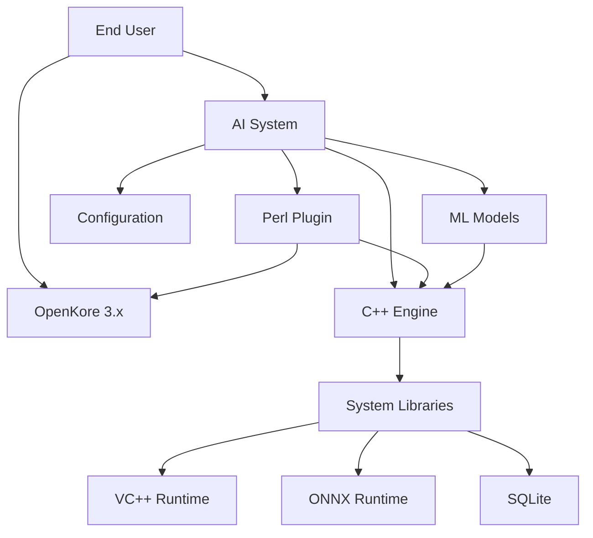

# Deployment Strategy and Procedures

**Version:** 1.0  
**Date:** 2026-02-05  
**Status:** Planning Phase

---

## Table of Contents

1. [Overview](#1-overview)
2. [Deployment Architecture](#2-deployment-architecture)
3. [Build Process](#3-build-process)
4. [Installation Procedures](#4-installation-procedures)
5. [Configuration Management](#5-configuration-management)
6. [Update Mechanisms](#6-update-mechanisms)
7. [Rollback Procedures](#7-rollback-procedures)
8. [Version Compatibility](#8-version-compatibility)
9. [Monitoring and Health Checks](#9-monitoring-and-health-checks)
10. [Documentation](#10-documentation)

---

## 1. Overview

### 1.1 Deployment Goals

- **Zero Downtime**: Updates without stopping OpenKore
- **Atomic Updates**: All-or-nothing deployment
- **Easy Rollback**: Quick recovery from failures
- **Version Control**: Clear versioning and compatibility
- **User-Friendly**: Simple installation for end users

### 1.2 Deployment Models

| Model | Description | Use Case |
|-------|-------------|----------|
| **Fresh Install** | Complete new installation | New users |
| **Upgrade** | Update existing installation | Version updates |
| **Patch** | Small fixes/updates | Bug fixes |
| **Rollback** | Revert to previous version | Failed upgrade |

### 1.3 Release Channels


**Channels:**
- **Development**: Daily builds, untested, for developers only
- **Testing**: Weekly builds, internal testing
- **Beta**: Monthly releases, early adopters
- **Stable**: Quarterly releases, production-ready

---

## 2. Deployment Architecture

### 2.1 File Structure

```
openkore-ai/                         # Root directory
├── bin/                             # Compiled binaries
│   └── openkore_ai_engine.exe       # C++ engine (v1.0.0)
├── plugins/                         # OpenKore plugins
│   └── aiCore/                      # AI Core plugin
│       ├── aiCore.pl                # Plugin entry (v1.0.0)
│       ├── IPCClient.pm
│       ├── StateCapture.pm
│       ├── ActionExecutor.pm
│       ├── MacroReloader.pm
│       └── config/
│           ├── ipc_config.json
│           └── version.json
├── config/                          # Configuration files
│   ├── engine.json
│   ├── coordinator.json
│   ├── reflexes.json
│   ├── ml_config.json
│   ├── llm_config.json
│   ├── pdca_config.json
│   └── rules/
│       ├── combat_rules.yaml
│       ├── survival_rules.yaml
│       └── resource_rules.yaml
├── control/                         # OpenKore control files
│   └── macros/
│       ├── templates/               # Macro templates
│       ├── generated/               # AI-generated macros
│       └── active/                  # Currently active macros
├── data/                            # Data storage
│   ├── db/
│   │   ├── game_state.db
│   │   ├── metrics.db
│   │   └── training_data.db
│   ├── training/
│   │   └── *.parquet
│   └── logs/
│       ├── engine.log
│       └── decisions.log
├── models/                          # ML models
│   ├── active/
│   │   ├── decision_tree_v1.onnx
│   │   ├── random_forest_v2.onnx
│   │   └── xgboost_v3.onnx
│   ├── checkpoints/
│   └── archive/
├── ml-training/                     # ML training scripts (optional)
│   ├── train_model.py
│   ├── requirements.txt
│   └── notebooks/
└── docs/                            # Documentation
    ├── README.md
    ├── CHANGELOG.md
    ├── USER_GUIDE.md
    └── API_REFERENCE.md
```

### 2.2 Component Versions

**Version File** (`plugins/aiCore/config/version.json`):
```json
{
  "version": "1.0.0",
  "build": "20260205.1",
  "components": {
    "cpp_engine": "1.0.0",
    "perl_plugin": "1.0.0",
    "ml_models": "1.0.0",
    "config_schema": "1.0.0"
  },
  "compatibility": {
    "openkore_min": "3.0.0",
    "openkore_max": "4.0.0"
  },
  "release_date": "2026-02-05",
  "release_notes": "Initial release"
}
```

### 2.3 Dependency Tree



---

## 3. Build Process

### 3.1 Automated Build Pipeline

```yaml
# .github/workflows/build-release.yml
name: Build Release

on:
  push:
    tags:
      - 'v*'

jobs:
  build-windows:
    runs-on: windows-latest
    steps:
      - uses: actions/checkout@v2
      
      - name: Setup MSVC
        uses: microsoft/setup-msbuild@v1
      
      - name: Install vcpkg dependencies
        run: |
          vcpkg install nlohmann-json:x64-windows
          vcpkg install sqlite3:x64-windows
          vcpkg install onnxruntime:x64-windows
      
      - name: Build C++ Engine
        run: |
          cd cpp-core
          mkdir build && cd build
          cmake -G "Visual Studio 17 2022" -A x64 \
                -DCMAKE_BUILD_TYPE=Release \
                -DCMAKE_TOOLCHAIN_FILE=C:/vcpkg/scripts/buildsystems/vcpkg.cmake \
                ..
          cmake --build . --config Release
      
      - name: Run Tests
        run: |
          cd cpp-core/build
          ctest -C Release --output-on-failure
      
      - name: Package Release
        run: |
          python scripts/package_release.py --version ${{ github.ref_name }}
      
      - name: Upload Artifacts
        uses: actions/upload-artifact@v2
        with:
          name: openkore-ai-windows-${{ github.ref_name }}
          path: dist/openkore-ai-windows-*.zip
  
  build-linux:
    runs-on: ubuntu-latest
    steps:
      - uses: actions/checkout@v2
      
      - name: Install dependencies
        run: |
          sudo apt update
          sudo apt install -y build-essential cmake libsqlite3-dev
      
      - name: Build C++ Engine
        run: |
          cd cpp-core
          mkdir build && cd build
          cmake -DCMAKE_BUILD_TYPE=Release ..
          make -j$(nproc)
      
      - name: Run Tests
        run: |
          cd cpp-core/build
          ctest --output-on-failure
      
      - name: Package Release
        run: |
          python3 scripts/package_release.py --version ${{ github.ref_name }}
      
      - name: Upload Artifacts
        uses: actions/upload-artifact@v2
        with:
          name: openkore-ai-linux-${{ github.ref_name }}
          path: dist/openkore-ai-linux-*.tar.gz
```

### 3.2 Manual Build

**Windows:**
```batch
@echo off
echo Building OpenKore AI Release...

set VERSION=1.0.0
set BUILD_TYPE=Release

REM Build C++ engine
cd cpp-core
call build.bat

REM Package release
cd ..
python scripts/package_release.py --version %VERSION%

echo Release package created: dist/openkore-ai-windows-%VERSION%.zip
```

**Linux:**
```bash
#!/bin/bash
set -e

VERSION="1.0.0"
BUILD_TYPE="Release"

echo "Building OpenKore AI Release..."

# Build C++ engine
cd cpp-core
./build.sh

# Package release
cd ..
python3 scripts/package_release.py --version $VERSION

echo "Release package created: dist/openkore-ai-linux-$VERSION.tar.gz"
```

### 3.3 Package Script

**scripts/package_release.py:**
```python
#!/usr/bin/env python3
import argparse
import shutil
import os
import zipfile
import tarfile
from pathlib import Path

def package_release(version, platform='windows'):
    """Package release for distribution"""
    
    print(f"Packaging OpenKore AI {version} for {platform}")
    
    # Create temp directory
    temp_dir = Path(f"temp/openkore-ai-{version}")
    temp_dir.mkdir(parents=True, exist_ok=True)
    
    # Copy files
    print("Copying files...")
    
    # Binaries
    if platform == 'windows':
        shutil.copy("cpp-core/build/bin/Release/openkore_ai_engine.exe", 
                   temp_dir / "bin/")
    else:
        shutil.copy("cpp-core/build/bin/openkore_ai_engine", 
                   temp_dir / "bin/")
    
    # Plugins
    shutil.copytree("openkore-ai/plugins/aiCore", 
                   temp_dir / "plugins/aiCore")
    
    # Configuration
    shutil.copytree("openkore-ai/config", temp_dir / "config")
    
    # Macro templates
    shutil.copytree("openkore-ai/control/macros/templates",
                   temp_dir / "control/macros/templates")
    
    # ML models
    shutil.copytree("openkore-ai/models/active", 
                   temp_dir / "models/active")
    
    # Documentation
    shutil.copy("README.md", temp_dir)
    shutil.copy("CHANGELOG.md", temp_dir)
    shutil.copy("docs/USER_GUIDE.md", temp_dir / "docs/")
    shutil.copy("LICENSE", temp_dir)
    
    # Create version file
    create_version_file(temp_dir, version)
    
    # Create archive
    print("Creating archive...")
    dist_dir = Path("dist")
    dist_dir.mkdir(exist_ok=True)
    
    if platform == 'windows':
        archive_name = f"openkore-ai-windows-{version}.zip"
        create_zip(temp_dir.parent, archive_name, dist_dir)
    else:
        archive_name = f"openkore-ai-linux-{version}.tar.gz"
        create_tar(temp_dir.parent, archive_name, dist_dir)
    
    # Cleanup
    shutil.rmtree("temp")
    
    print(f"✅ Package created: {dist_dir / archive_name}")

def create_version_file(base_dir, version):
    """Create version.json file"""
    import json
    from datetime import datetime
    
    version_data = {
        "version": version,
        "build": datetime.now().strftime("%Y%m%d.1"),
        "release_date": datetime.now().isoformat(),
        "components": {
            "cpp_engine": version,
            "perl_plugin": version,
            "ml_models": version,
            "config_schema": version
        }
    }
    
    version_file = base_dir / "plugins/aiCore/config/version.json"
    version_file.parent.mkdir(parents=True, exist_ok=True)
    
    with open(version_file, 'w') as f:
        json.dump(version_data, f, indent=2)

def create_zip(source_dir, archive_name, dest_dir):
    """Create ZIP archive"""
    with zipfile.ZipFile(dest_dir / archive_name, 'w', zipfile.ZIP_DEFLATED) as zf:
        for file in Path(source_dir).rglob('*'):
            if file.is_file():
                arcname = file.relative_to(source_dir)
                zf.write(file, arcname)

def create_tar(source_dir, archive_name, dest_dir):
    """Create TAR.GZ archive"""
    with tarfile.open(dest_dir / archive_name, 'w:gz') as tf:
        tf.add(source_dir, arcname='.')

if __name__ == '__main__':
    parser = argparse.ArgumentParser()
    parser.add_argument('--version', required=True)
    parser.add_argument('--platform', default='windows', choices=['windows', 'linux'])
    
    args = parser.parse_args()
    package_release(args.version, args.platform)
```

---

## 4. Installation Procedures

### 4.1 Fresh Installation

#### 4.1.1 Prerequisites Check

**install_check.bat (Windows):**
```batch
@echo off
echo Checking prerequisites...

REM Check OpenKore
if not exist "openkore.pl" (
    echo ❌ OpenKore not found in current directory
    echo Please run this installer from your OpenKore directory
    exit /b 1
)
echo ✅ OpenKore found

REM Check Perl
perl --version >nul 2>&1
if %ERRORLEVEL% neq 0 (
    echo ❌ Perl not found
    echo Please install Strawberry Perl: https://strawberryperl.com/
    exit /b 1
)
echo ✅ Perl found

REM Check required Perl modules
perl -MJSON::XS -e "print 'ok'" >nul 2>&1
if %ERRORLEVEL% neq 0 (
    echo ❌ JSON::XS module not found
    echo Installing...
    cpanm JSON::XS
)
echo ✅ Perl modules OK

echo.
echo ✅ All prerequisites met!
```

#### 4.1.2 Installation Script

**install.bat (Windows):**
```batch
@echo off
echo ================================================
echo OpenKore AI System - Installation
echo ================================================
echo.

REM Check prerequisites
call install_check.bat
if %ERRORLEVEL% neq 0 exit /b 1

echo.
echo Installing OpenKore AI System...
echo.

REM Extract package (if ZIP)
if exist "openkore-ai-windows-*.zip" (
    echo Extracting package...
    powershell -Command "Expand-Archive -Path openkore-ai-windows-*.zip -DestinationPath ."
)

REM Create directories
if not exist "openkore-ai\data\db" mkdir "openkore-ai\data\db"
if not exist "openkore-ai\data\logs" mkdir "openkore-ai\data\logs"
if not exist "openkore-ai\data\training" mkdir "openkore-ai\data\training"
if not exist "openkore-ai\models\checkpoints" mkdir "openkore-ai\models\checkpoints"
if not exist "openkore-ai\models\archive" mkdir "openkore-ai\models\archive"
if not exist "openkore-ai\control\macros\generated" mkdir "openkore-ai\control\macros\generated"
if not exist "openkore-ai\control\macros\active" mkdir "openkore-ai\control\macros\active"

REM Copy plugin to OpenKore plugins directory
echo Installing plugin...
xcopy /E /Y "openkore-ai\plugins\aiCore" "plugins\aiCore\"

REM Initialize databases
echo Initializing databases...
sqlite3 openkore-ai\data\db\game_state.db < openkore-ai\data\db\schema\game_state.sql
sqlite3 openkore-ai\data\db\metrics.db < openkore-ai\data\db\schema\metrics.sql

REM Configure API keys (interactive)
echo.
echo ================================================
echo Configuration
echo ================================================
echo.
echo Please configure your LLM API key:
set /p API_KEY="OpenAI API Key (or press Enter to skip): "

if not "%API_KEY%"=="" (
    echo Configuring API key...
    python openkore-ai\scripts\configure_api.py --key "%API_KEY%"
)

echo.
echo ================================================
echo Installation Complete!
echo ================================================
echo.
echo To enable the AI system:
echo 1. Edit your OpenKore config.txt
echo 2. Add: loadPlugins aiCore
echo 3. Start OpenKore normally
echo.
echo Documentation: openkore-ai\docs\USER_GUIDE.md
echo.
pause
```

**install.sh (Linux):**
```bash
#!/bin/bash
set -e

echo "================================================"
echo "OpenKore AI System - Installation"
echo "================================================"
echo

# Check prerequisites
echo "Checking prerequisites..."

if [ ! -f "openkore.pl" ]; then
    echo "❌ OpenKore not found in current directory"
    echo "Please run this installer from your OpenKore directory"
    exit 1
fi
echo "✅ OpenKore found"

if ! command -v perl &> /dev/null; then
    echo "❌ Perl not found"
    exit 1
fi
echo "✅ Perl found"

# Extract package
if [ -f openkore-ai-linux-*.tar.gz ]; then
    echo "Extracting package..."
    tar -xzf openkore-ai-linux-*.tar.gz
fi

# Create directories
echo "Creating directories..."
mkdir -p openkore-ai/data/{db,logs,training}
mkdir -p openkore-ai/models/{checkpoints,archive}
mkdir -p openkore-ai/control/macros/{generated,active}

# Copy plugin
echo "Installing plugin..."
cp -r openkore-ai/plugins/aiCore plugins/

# Set permissions
chmod +x openkore-ai/bin/openkore_ai_engine

# Initialize databases
echo "Initializing databases..."
sqlite3 openkore-ai/data/db/game_state.db < openkore-ai/data/db/schema/game_state.sql
sqlite3 openkore-ai/data/db/metrics.db < openkore-ai/data/db/schema/metrics.sql

# Configure API key
echo
echo "================================================"
echo "Configuration"
echo "================================================"
echo
read -p "OpenAI API Key (or press Enter to skip): " API_KEY

if [ ! -z "$API_KEY" ]; then
    echo "Configuring API key..."
    python3 openkore-ai/scripts/configure_api.py --key "$API_KEY"
fi

echo
echo "================================================"
echo "Installation Complete!"
echo "================================================"
echo
echo "To enable the AI system:"
echo "1. Edit your OpenKore config.txt"
echo "2. Add: loadPlugins aiCore"
echo "3. Start OpenKore normally"
echo
echo "Documentation: openkore-ai/docs/USER_GUIDE.md"
echo
```

### 4.2 Upgrade Installation

**upgrade.bat:**
```batch
@echo off
echo ================================================
echo OpenKore AI System - Upgrade
echo ================================================
echo.

REM Check current version
if not exist "openkore-ai\plugins\aiCore\config\version.json" (
    echo ❌ No existing installation found
    echo Please run install.bat for fresh installation
    exit /b 1
)

REM Backup current installation
echo Creating backup...
set BACKUP_DIR=openkore-ai-backup-%date:~-4,4%%date:~-10,2%%date:~-7,2%-%time:~0,2%%time:~3,2%%time:~6,2%
set BACKUP_DIR=%BACKUP_DIR: =0%
mkdir "%BACKUP_DIR%"
xcopy /E /Y openkore-ai "%BACKUP_DIR%\"
echo ✅ Backup created: %BACKUP_DIR%

REM Stop engine if running
echo Stopping AI engine...
taskkill /F /IM openkore_ai_engine.exe 2>nul

REM Extract new version
echo Installing update...
if exist "openkore-ai-windows-*.zip" (
    powershell -Command "Expand-Archive -Force -Path openkore-ai-windows-*.zip -DestinationPath ."
)

REM Preserve user data
echo Preserving user data...
xcopy /E /Y "%BACKUP_DIR%\data" "openkore-ai\data\"
xcopy /E /Y "%BACKUP_DIR%\config" "openkore-ai\config\"
xcopy /E /Y "%BACKUP_DIR%\control\macros\generated" "openkore-ai\control\macros\generated\"

REM Update plugin
xcopy /E /Y "openkore-ai\plugins\aiCore" "plugins\aiCore\"

echo.
echo ================================================
echo Upgrade Complete!
echo ================================================
echo.
echo Backup location: %BACKUP_DIR%
echo If you experience issues, run rollback.bat
echo.
pause
```

---

## 5. Configuration Management

### 5.1 Configuration Files

**Default Configuration Template:**
```json
{
  "engine": {
    "name": "OpenKore Advanced AI",
    "version": "1.0.0",
    "log_level": "info",
    "log_file": "data/logs/engine.log"
  },
  "ipc": {
    "type": "named_pipe",
    "pipe_name": "\\\\.\\pipe\\openkore_ai",
    "timeout_ms": 100
  },
  "decision_coordinator": {
    "escalation_policy": "adaptive",
    "tier_timeouts_ms": {
      "reflex": 1,
      "rule": 10,
      "ml": 100,
      "llm": 5000
    },
    "confidence_thresholds": {
      "reflex": 1.0,
      "rule": 0.75,
      "ml": 0.70,
      "llm": 0.85
    }
  },
  "ml_engine": {
    "enabled": true,
    "cold_start_mode": true,
    "model_dir": "models/active/"
  },
  "llm": {
    "provider": "openai",
    "model": "gpt-4-turbo",
    "api_key_env": "OPENAI_API_KEY"
  }
}
```

### 5.2 Configuration Migration

**migrate_config.py:**
```python
#!/usr/bin/env python3
"""Migrate configuration from old version to new version"""

import json
from pathlib import Path

def migrate_config(old_version, new_version):
    """Migrate configuration between versions"""
    
    config_file = Path("openkore-ai/config/engine.json")
    
    with open(config_file) as f:
        config = json.load(f)
    
    # Version-specific migrations
    if old_version < "0.9.0" and new_version >= "1.0.0":
        # Add new PDCA configuration
        config["pdca_cycle"] = {
            "enabled": True,
            "check_interval_seconds": 300
        }
    
    if old_version < "1.1.0" and new_version >= "1.1.0":
        # Update ML configuration schema
        if "ml_engine" in config:
            config["ml_engine"]["online_learning"] = True
    
    # Write updated configuration
    with open(config_file, 'w') as f:
        json.dump(config, f, indent=2)
    
    print(f"✅ Configuration migrated from {old_version} to {new_version}")

if __name__ == '__main__':
    import sys
    migrate_config(sys.argv[1], sys.argv[2])
```

---

## 6. Update Mechanisms

### 6.1 Hot-Reload Components

**Components that support hot-reload:**
- ✅ Reflex rules (reflexes.json)
- ✅ Rule engine rules (rules/*.yaml)
- ✅ Macro templates
- ✅ ML models (via model hot-swap)
- ❌ C++ engine (requires restart)
- ❌ Perl plugin core (requires restart)

### 6.2 Configuration Updates

**reload_config.pl:**
```perl
# plugins/aiCore/reload_config.pl
sub reloadConfiguration {
    my $config_file = 'openkore-ai/config/engine.json';
    
    # Send reload command to C++ engine via IPC
    my $message = {
        type => 'CONFIG_RELOAD',
        file => $config_file
    };
    
    IPCClient::sendMessage('CONFIG_RELOAD', $message);
    
    message "[aiCore] Configuration reloaded\n", "success";
}
```

### 6.3 Model Updates

**update_model.py:**
```python
#!/usr/bin/env python3
"""Update ML model without downtime"""

import shutil
from pathlib import Path

def update_model(model_name, new_model_path):
    """Hot-swap ML model"""
    
    models_dir = Path("openkore-ai/models")
    
    # Move current model to archive
    current_model = models_dir / "active" / f"{model_name}.onnx"
    if current_model.exists():
        archive_name = f"{model_name}_{timestamp()}.onnx"
        shutil.move(current_model, models_dir / "archive" / archive_name)
    
    # Copy new model to active
    shutil.copy(new_model_path, current_model)
    
    # Trigger reload via IPC
    trigger_model_reload(model_name)
    
    print(f"✅ Model '{model_name}' updated successfully")

def trigger_model_reload(model_name):
    """Send IPC message to reload model"""
    import socket
    import json
    
    message = {
        'type': 'MODEL_RELOAD',
        'model_name': model_name
    }
    
    # Send to C++ engine via IPC
    # Implementation depends on IPC mechanism
    pass
```

---

## 7. Rollback Procedures

### 7.1 Automated Rollback

**rollback.bat:**
```batch
@echo off
echo ================================================
echo OpenKore AI System - Rollback
echo ================================================
echo.

REM Find latest backup
for /f "delims=" %%i in ('dir /b /ad /o-d openkore-ai-backup-*') do (
    set BACKUP_DIR=%%i
    goto :found
)

:found
if not defined BACKUP_DIR (
    echo ❌ No backup found
    exit /b 1
)

echo Found backup: %BACKUP_DIR%
echo.
set /p CONFIRM="Restore from this backup? (Y/N): "

if /i not "%CONFIRM%"=="Y" (
    echo Rollback cancelled
    exit /b 0
)

echo.
echo Rolling back...

REM Stop engine
taskkill /F /IM openkore_ai_engine.exe 2>nul

REM Restore from backup
xcopy /E /Y "%BACKUP_DIR%\*" "openkore-ai\"
xcopy /E /Y "%BACKUP_DIR%\plugins\aiCore" "plugins\aiCore\"

echo.
echo ================================================
echo Rollback Complete!
echo ================================================
echo.
echo Previous version restored from: %BACKUP_DIR%
echo.
pause
```

### 7.2 Manual Rollback

1. Stop OpenKore
2. Stop AI engine: `taskkill /F /IM openkore_ai_engine.exe`
3. Restore from backup:
   ```batch
   xcopy /E /Y openkore-ai-backup-YYYYMMDD\* openkore-ai\
   ```
4. Restart OpenKore

---

## 8. Version Compatibility

### 8.1 Compatibility Matrix

| AI System | OpenKore | Perl | Python | Notes |
|-----------|----------|------|--------|-------|
| **1.0.x** | 3.0.0 - 3.9.x | 5.30+ | 3.9+ | Initial release |
| **1.1.x** | 3.0.0 - 4.0.x | 5.32+ | 3.9+ | Enhanced ML |
| **2.0.x** | 4.0.0+ | 5.34+ | 3.10+ | Major refactor |

### 8.2 Version Check

**check_compatibility.pl:**
```perl
sub checkCompatibility {
    my $ai_version = getAIVersion();
    my $ok_version = $Settings::VERSION;
    
    # Parse versions
    my ($ai_major, $ai_minor) = $ai_version =~ /^(\d+)\.(\d+)/;
    my ($ok_major, $ok_minor) = $ok_version =~ /^(\d+)\.(\d+)/;
    
    # Check compatibility
    if ($ai_major == 1 && $ok_major == 3) {
        return 1;  # Compatible
    } elsif ($ai_major == 1 && $ok_major == 4) {
        if ($ai_minor >= 1) {
            return 1;  # Compatible
        }
    }
    
    warning "[aiCore] Version compatibility issue!\n";
    warning "[aiCore] AI System: $ai_version\n";
    warning "[aiCore] OpenKore: $ok_version\n";
    
    return 0;  # Incompatible
}
```

---

## 9. Monitoring and Health Checks

### 9.1 Health Check Script

**health_check.py:**
```python
#!/usr/bin/env python3
"""System health check"""

import subprocess
import json
from pathlib import Path

def check_health():
    """Run system health checks"""
    
    results = {
        'engine': check_engine(),
        'ipc': check_ipc(),
        'database': check_database(),
        'models': check_models(),
        'config': check_config()
    }
    
    # Print results
    for component, status in results.items():
        icon = "✅" if status['healthy'] else "❌"
        print(f"{icon} {component}: {status['message']}")
    
    # Overall health
    all_healthy = all(r['healthy'] for r in results.values())
    
    if all_healthy:
        print("\n✅ System is healthy")
        return 0
    else:
        print("\n❌ System has issues")
        return 1

def check_engine():
    """Check if C++ engine is running"""
    try:
        # Check if process is running (platform-specific)
        if os.name == 'nt':  # Windows
            result = subprocess.run(['tasklist'], capture_output=True, text=True)
            if 'openkore_ai_engine.exe' in result.stdout:
                return {'healthy': True, 'message': 'Running'}
        else:  # Linux
            result = subprocess.run(['pgrep', 'openkore_ai_engine'], 
                                   capture_output=True)
            if result.returncode == 0:
                return {'healthy': True, 'message': 'Running'}
        
        return {'healthy': False, 'message': 'Not running'}
    except Exception as e:
        return {'healthy': False, 'message': str(e)}

def check_ipc():
    """Check IPC connection"""
    try:
        # Try to connect to IPC
        # Implementation depends on IPC mechanism
        return {'healthy': True, 'message': 'Connected'}
    except:
        return {'healthy': False, 'message': 'Connection failed'}

def check_database():
    """Check database integrity"""
    try:
        import sqlite3
        
        db_path = Path("openkore-ai/data/db/game_state.db")
        if not db_path.exists():
            return {'healthy': False, 'message': 'Database not found'}
        
        conn = sqlite3.connect(db_path)
        conn.execute("PRAGMA integrity_check")
        conn.close()
        
        return {'healthy': True, 'message': 'OK'}
    except Exception as e:
        return {'healthy': False, 'message': str(e)}

def check_models():
    """Check ML models"""
    try:
        models_dir = Path("openkore-ai/models/active")
        models = list(models_dir.glob("*.onnx"))
        
        if not models:
            return {'healthy': False, 'message': 'No models found'}
        
        return {'healthy': True, 'message': f'{len(models)} models loaded'}
    except Exception as e:
        return {'healthy': False, 'message': str(e)}

def check_config():
    """Check configuration validity"""
    try:
        config_file = Path("openkore-ai/config/engine.json")
        with open(config_file) as f:
            config = json.load(f)
        
        # Verify required fields
        required = ['engine', 'ipc', 'decision_coordinator']
        missing = [r for r in required if r not in config]
        
        if missing:
            return {'healthy': False, 
                   'message': f'Missing: {", ".join(missing)}'}
        
        return {'healthy': True, 'message': 'Valid'}
    except Exception as e:
        return {'healthy': False, 'message': str(e)}

if __name__ == '__main__':
    import sys
    sys.exit(check_health())
```

### 9.2 Automated Monitoring

**monitor.bat (runs continuously):**
```batch
@echo off
:loop
python health_check.py
if %ERRORLEVEL% neq 0 (
    echo [%date% %time%] Health check failed >> monitor.log
)
timeout /t 60 /nobreak
goto loop
```

---

## 10. Documentation

### 10.1 Required Documentation

- [ ] **README.md**: Overview and quick start
- [ ] **CHANGELOG.md**: Version history and changes
- [ ] **USER_GUIDE.md**: Complete user manual
- [ ] **API_REFERENCE.md**: Technical API documentation
- [ ] **TROUBLESHOOTING.md**: Common issues and solutions
- [ ] **INSTALLATION.md**: Detailed installation instructions
- [ ] **CONFIGURATION.md**: Configuration reference

### 10.2 Release Notes Template

**CHANGELOG.md:**
```markdown
# Changelog

## [1.0.0] - 2026-02-05

### Added
- Initial release of OpenKore AI System
- Multi-tier decision engine (Reflex/Rules/ML/LLM)
- PDCA continuous improvement loop
- 14 specialized coordinators
- ML pipeline with cold-start strategy
- Macro generation and hot-reload system

### Features
- Performance: < 1ms reflex, < 10ms rules, < 100ms ML
- Compatibility: OpenKore 3.0.0+
- Platform support: Windows, Linux

### Known Issues
- ML cold-start requires 7 days of data collection
- LLM API key required for strategic planning

### Breaking Changes
- None (initial release)

## [Unreleased]

### Planned for 1.1.0
- Enhanced coordinator coordination
- Improved ML model accuracy
- Additional macro templates
- Performance optimizations
```

---

## Deployment Checklist

### Pre-Deployment
- [ ] All tests passing
- [ ] Documentation updated
- [ ] Version numbers updated
- [ ] CHANGELOG updated
- [ ] Build artifacts generated
- [ ] Security audit completed

### Deployment
- [ ] Create release tag
- [ ] Build release packages
- [ ] Upload to distribution server
- [ ] Update download links
- [ ] Announce release

### Post-Deployment
- [ ] Monitor error reports
- [ ] Respond to user feedback
- [ ] Prepare hotfix if needed
- [ ] Plan next release

---

**Next Document:** [Risk Register](05-risk-register.md)
