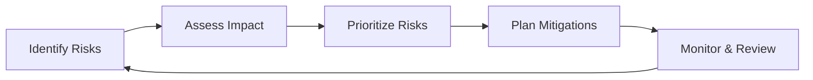
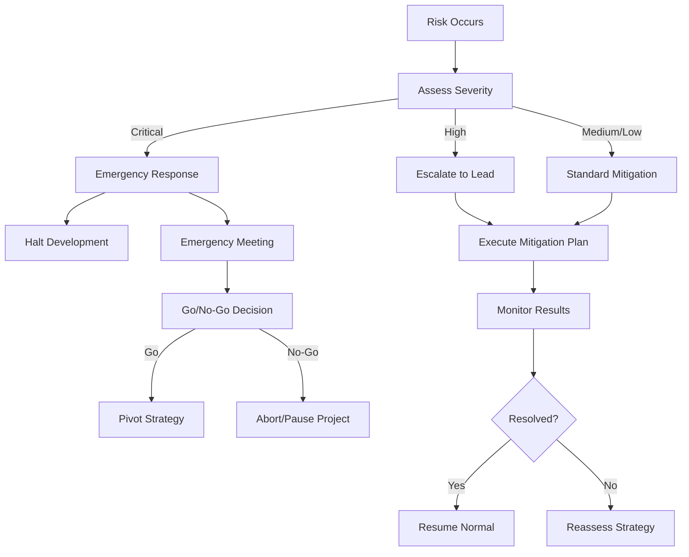

# Risk Register and Mitigation Strategies

**Version:** 1.0  
**Date:** 2026-02-05  
**Status:** Planning Phase

---

## Table of Contents

1. [Overview](#1-overview)
2. [Risk Assessment Matrix](#2-risk-assessment-matrix)
3. [Technical Risks](#3-technical-risks)
4. [Integration Risks](#4-integration-risks)
5. [Performance Risks](#5-performance-risks)
6. [Security Risks](#6-security-risks)
7. [Operational Risks](#7-operational-risks)
8. [ML/AI Risks](#8-mlai-risks)
9. [Business Risks](#9-business-risks)
10. [Contingency Plans](#10-contingency-plans)

---

## 1. Overview

### 1.1 Purpose

This risk register identifies potential risks to the OpenKore AI system project, assesses their likelihood and impact, and defines mitigation and contingency strategies.

### 1.2 Risk Management Process



### 1.3 Risk Scoring

**Likelihood Scale:**
- **Low (1)**: < 10% chance
- **Medium (2)**: 10-50% chance
- **High (3)**: > 50% chance

**Impact Scale:**
- **Low (1)**: Minor delay, easy workaround
- **Medium (2)**: Significant delay, rework required
- **High (3)**: Project failure, complete redesign

**Risk Score** = Likelihood × Impact (1-9)

**Priority:**
- **Critical**: Score 6-9
- **High**: Score 4-5
- **Medium**: Score 2-3
- **Low**: Score 1

---

## 2. Risk Assessment Matrix

| ID | Risk | Likelihood | Impact | Score | Priority |
|----|------|------------|--------|-------|----------|
| **T1** | IPC performance bottleneck | High (3) | High (3) | 9 | Critical |
| **T2** | C++/Perl memory leaks | Medium (2) | High (3) | 6 | Critical |
| **T3** | Dependency conflicts | High (3) | Medium (2) | 6 | Critical |
| **T4** | Cross-platform compatibility | Medium (2) | Medium (2) | 4 | High |
| **I1** | Plugin conflicts with existing plugins | High (3) | Medium (2) | 6 | Critical |
| **I2** | OpenKore API changes | Medium (2) | High (3) | 6 | Critical |
| **P1** | Latency targets not met | Medium (2) | High (3) | 6 | Critical |
| **P2** | Memory usage exceeds limits | Low (1) | High (3) | 3 | Medium |
| **S1** | API key exposure | Low (1) | High (3) | 3 | Medium |
| **S2** | Bot detection | Medium (2) | High (3) | 6 | Critical |
| **O1** | LLM API costs too high | Medium (2) | Medium (2) | 4 | High |
| **O2** | LLM service outages | Medium (2) | Medium (2) | 4 | High |
| **M1** | ML model fails to converge | Medium (2) | High (3) | 6 | Critical |
| **M2** | Cold-start period too long | Low (1) | Medium (2) | 2 | Medium |
| **M3** | Model accuracy insufficient | Medium (2) | High (3) | 6 | Critical |
| **B1** | Development timeline overrun | High (3) | Medium (2) | 6 | Critical |
| **B2** | Key team member departure | Low (1) | High (3) | 3 | Medium |

---

## 3. Technical Risks

### Risk T1: IPC Performance Bottleneck

**Description**: Inter-process communication between Perl and C++ becomes a performance bottleneck, causing latency spikes.

**Likelihood**: High (3)  
**Impact**: High (3)  
**Score**: 9 - **CRITICAL**

**Indicators:**
- IPC round-trip > 5ms
- CPU usage spikes during state sync
- Decision latency increases over time

**Mitigation Strategies:**

1. **Design Phase:**
   - Use binary serialization (Protobuf) instead of JSON
   - Implement message batching
   - Use shared memory for large data transfers
   - Profile IPC early in development

2. **Implementation:**
   ```cpp
   // Use zero-copy serialization where possible
   struct IPCMessage {
       uint32_t magic;
       uint32_t size;
       uint8_t payload[];  // Direct memory layout
   };
   
   // Batch multiple updates
   void batchStateUpdates(const std::vector<GameState>& states) {
       auto batch = serializeBatch(states);
       ipc_->send(batch);
   }
   ```

3. **Testing:**
   - Stress test IPC with 1000+ messages/second
   - Profile with different payload sizes
   - Benchmark against target latency (< 5ms)

**Contingency Plan:**
- If IPC is too slow: Consider embedding Perl interpreter in C++ or vice versa
- Alternative: Use memory-mapped files for state sharing
- Worst case: Reduce update frequency, prioritize critical updates

---

### Risk T2: C++/Perl Memory Leaks

**Description**: Memory leaks in either C++ engine or Perl plugin cause crashes or degraded performance over time.

**Likelihood**: Medium (2)  
**Impact**: High (3)  
**Score**: 6 - **CRITICAL**

**Indicators:**
- Memory usage grows continuously
- Crash after extended runtime
- System becomes unresponsive

**Mitigation Strategies:**

1. **Prevention:**
   - Use smart pointers in C++ (unique_ptr, shared_ptr)
   - Implement RAII principles
   - Careful Perl reference counting
   - Regular code reviews focusing on resource management

2. **Detection:**
   ```cpp
   // Enable sanitizers in debug builds
   cmake -DCMAKE_CXX_FLAGS="-fsanitize=address -fsanitize=leak" ..
   
   // Use Valgrind regularly
   valgrind --leak-check=full ./openkore_ai_engine
   ```

3. **Testing:**
   - 24-hour leak tests
   - Automated memory profiling in CI/CD
   - Monitor memory usage in field tests

**Contingency Plan:**
- Implement periodic restarts if leak detected
- Add memory usage limits and graceful shutdown
- Emergency patch release if critical leak found

---

### Risk T3: Dependency Conflicts

**Description**: Conflicting library versions or missing dependencies prevent building or running the system.

**Likelihood**: High (3)  
**Impact**: Medium (2)  
**Score**: 6 - **CRITICAL**

**Indicators:**
- Build failures on different machines
- Runtime DLL/SO missing errors
- Version compatibility issues

**Mitigation Strategies:**

1. **Dependency Management:**
   - Use vcpkg/conan for C++ dependencies
   - Document exact version requirements
   - Include dependency version check in build
   - Provide pre-built binaries with dependencies

2. **Testing:**
   - Test on clean VMs for each platform
   - Automated dependency verification
   - Test on multiple OS versions

3. **Documentation:**
   ```markdown
   # Required Dependencies
   - nlohmann/json: 3.11.2 (exact)
   - ONNX Runtime: 1.14.x
   - SQLite: 3.40+
   - Protobuf: 3.21.x
   ```

**Contingency Plan:**
- Provide Docker containers with all dependencies
- Static linking for critical components
- Fallback to older dependency versions if needed

---

### Risk T4: Cross-Platform Compatibility

**Description**: Code works on one platform but fails on another (Windows vs Linux).

**Likelihood**: Medium (2)  
**Impact**: Medium (2)  
**Score**: 4 - **HIGH**

**Mitigation Strategies:**

1. **Development:**
   - Use cross-platform libraries (std::filesystem, not Windows-specific)
   - Abstract platform-specific code
   - CI/CD tests on all platforms

2. **Code Standards:**
   ```cpp
   // Platform abstraction
   #ifdef _WIN32
       #include "ipc/named_pipe.h"
       using IPC = NamedPipeIPC;
   #else
       #include "ipc/unix_socket.h"
       using IPC = UnixSocketIPC;
   #endif
   ```

**Contingency Plan:**
- Focus on single platform initially (Windows)
- Add Linux support in Phase 2
- Community contributions for macOS

---

## 4. Integration Risks

### Risk I1: Plugin Conflicts with Existing Plugins

**Description**: aiCore plugin conflicts with existing OpenKore plugins (macro, eventMacro, etc.).

**Likelihood**: High (3)  
**Impact**: Medium (2)  
**Score**: 6 - **CRITICAL**

**Indicators:**
- Hooks firing in wrong order
- State corruption
- Commands not executing
- Crashes when other plugins loaded

**Mitigation Strategies:**

1. **Design:**
   - Use unique hook priorities
   - Don't modify global state
   - Coordinate with eventMacro plugin
   - Provide compatibility mode

2. **Testing:**
   - Test with all common plugins loaded
   - Integration test suite with plugin combinations
   - Beta testing with real user setups

3. **Hook Priority Management:**
   ```perl
   # Register hooks with specific priorities
   Plugins::addHook('AI_pre', \&onAIPre, undef, 10);  # Lower priority
   Plugins::addHook('packet/actor_info', \&onPacket, undef, 5);
   ```

**Contingency Plan:**
- Provide plugin load order instructions
- Implement plugin compatibility checks
- Disable conflicting features automatically
- Create plugin compatibility matrix

---

### Risk I2: OpenKore API Changes

**Description**: OpenKore updates break compatibility with AI system.

**Likelihood**: Medium (2)  
**Impact**: High (3)  
**Score**: 6 - **CRITICAL**

**Mitigation Strategies:**

1. **API Versioning:**
   - Check OpenKore version at startup
   - Maintain compatibility matrix
   - Abstract OpenKore API calls

2. **Version Checking:**
   ```perl
   sub checkOpenKoreCompatibility {
       my $required_min = "3.0.0";
       my $required_max = "4.0.0";
       
       if (compareVersion($Settings::VERSION, $required_min) < 0) {
           error "OpenKore too old. Need $required_min+\n";
           return 0;
       }
       
       return 1;
   }
   ```

3. **Monitoring:**
   - Subscribe to OpenKore development updates
   - Test against OpenKore development branch
   - Participate in OpenKore community

**Contingency Plan:**
- Release compatibility updates quickly
- Maintain separate branches for different OpenKore versions
- Provide legacy support for older versions

---

## 5. Performance Risks

### Risk P1: Latency Targets Not Met

**Description**: System fails to meet latency requirements (< 1ms reflex, < 10ms rules, < 100ms ML).

**Likelihood**: Medium (2)  
**Impact**: High (3)  
**Score**: 6 - **CRITICAL**

**Indicators:**
- Benchmark tests fail
- Response times increase under load
- Users report sluggish bot behavior

**Mitigation Strategies:**

1. **Early Performance Testing:**
   - Benchmark each component in isolation
   - Profile regularly during development
   - Set performance gates in CI/CD

2. **Optimization:**
   ```cpp
   // Hot path optimization
   inline Action ReflexEngine::process(const GameState& state) {
       // Fast path for common cases
       if (state.character.hp_percent < 20) {
           return emergency_teleport_action_;  // Pre-computed
       }
       
       // Full evaluation only if needed
       return evaluateReflexes(state);
   }
   ```

3. **Architecture:**
   - Use lock-free data structures
   - Minimize allocations in hot paths
   - Cache computed results
   - Parallel processing where possible

**Contingency Plan:**
- Relax latency targets if necessary
- Reduce feature scope to meet performance
- Optimize critical paths post-release
- Consider hardware acceleration (GPU)

---

### Risk P2: Memory Usage Exceeds Limits

**Description**: System uses more than 500MB RAM, causing issues on low-end systems.

**Likelihood**: Low (1)  
**Impact**: High (3)  
**Score**: 3 - **MEDIUM**

**Mitigation Strategies:**

1. **Memory Management:**
   - Bounded buffers for training data
   - Model quantization for smaller models
   - Lazy loading of resources
   - Regular memory profiling

2. **Configuration:**
   ```json
   {
     "memory_limits": {
       "training_buffer_mb": 100,
       "model_cache_mb": 200,
       "max_total_mb": 500
     }
   }
   ```

**Contingency Plan:**
- Provide "lite" version with reduced features
- Stream data to disk instead of memory
- Offload ML training to separate process

---

## 6. Security Risks

### Risk S1: API Key Exposure

**Description**: LLM API keys leaked through logs, configuration files, or memory dumps.

**Likelihood**: Low (1)  
**Impact**: High (3)  
**Score**: 3 - **MEDIUM**

**Mitigation Strategies:**

1. **Secure Storage:**
   ```cpp
   // Encrypt API keys in configuration
   class SecureConfig {
       std::string getAPIKey() {
           std::string encrypted = config_["llm"]["api_key_encrypted"];
           return decrypt(encrypted, getMachineKey());
       }
   };
   ```

2. **Best Practices:**
   - Store keys in environment variables
   - Encrypt configuration files
   - Never log API keys
   - Clear keys from memory after use

3. **Code Review:**
   - Security-focused code reviews
   - Automated secrets scanning
   - No hardcoded credentials

**Contingency Plan:**
- API key rotation mechanism
- Rate limiting to prevent abuse
- Immediate revocation if leaked

---

### Risk S2: Bot Detection

**Description**: Game server detects and bans accounts using the AI system.

**Likelihood**: Medium (2)  
**Impact**: High (3)  
**Score**: 6 - **CRITICAL**

**Indicators:**
- User reports of bans
- Unusual pattern detection
- Server-side behavioral analysis

**Mitigation Strategies:**

1. **Human-Like Behavior:**
   - Randomize action timing
   - Add natural delays
   - Vary movement patterns
   - Simulate mistakes

2. **Anti-Detection:**
   ```cpp
   // Add human-like randomization
   void addHumanDelay(Action& action) {
       int base_delay_ms = 500;
       int variation_ms = random(100, 300);
       int micro_delay_ms = random(0, 50);
       
       action.delay_ms = base_delay_ms + variation_ms + micro_delay_ms;
   }
   ```

3. **Testing:**
   - Test on official servers carefully
   - Monitor ban rates
   - Gather user feedback
   - Study detection patterns

**Contingency Plan:**
- Implement stealth mode with ultra-conservative behavior
- Provide detection risk warnings
- Quick updates to evade new detection methods
- Disclaimer: Use at own risk

---

## 7. Operational Risks

### Risk O1: LLM API Costs Too High

**Description**: LLM API usage costs exceed budget, making system too expensive to use.

**Likelihood**: Medium (2)  
**Impact**: Medium (2)  
**Score**: 4 - **HIGH**

**Indicators:**
- High API usage bills
- Frequent LLM calls
- Users complaining about costs

**Mitigation Strategies:**

1. **Cost Control:**
   - Aggressive caching (30+ minute TTL)
   - ML takes over after cold-start
   - Rate limiting LLM calls
   - Cost monitoring dashboard

2. **Optimization:**
   ```cpp
   // Only use LLM for novel situations
   if (ml_engine_->predict(state).confidence < 0.7 && 
       !cache_->hasResponse(state_hash) &&
       llm_call_count_today_ < MAX_LLM_CALLS) {
       // Use LLM
       llm_call_count_today_++;
   }
   ```

3. **Alternatives:**
   - Support local LLMs (Llama, Mistral)
   - Provide API cost estimates
   - User-configurable LLM usage limits

**Contingency Plan:**
- Operate in ML-only mode
- Use cheaper LLM providers
- Implement token budgeting

---

### Risk O2: LLM Service Outages

**Description**: LLM API service is down or rate-limited, preventing strategic planning.

**Likelihood**: Medium (2)  
**Impact**: Medium (2)  
**Score**: 4 - **HIGH**

**Mitigation Strategies:**

1. **Redundancy:**
   - Support multiple LLM providers (OpenAI, Anthropic, local)
   - Automatic failover
   - Cached responses for common scenarios

2. **Graceful Degradation:**
   ```cpp
   DecisionResponse decide(const DecisionRequest& req) {
       // Try LLM
       if (auto llm_response = llm_client_->query(req.state)) {
           return *llm_response;
       }
       
       // Fall back to ML
       if (auto ml_response = ml_engine_->predict(req.state)) {
           return *ml_response;
       }
       
       // Fall back to rules
       return rule_engine_->evaluate(req.state);
   }
   ```

**Contingency Plan:**
- Operate in degraded mode without LLM
- Queue strategic decisions for later
- User notification of degraded service

---

## 8. ML/AI Risks

### Risk M1: ML Model Fails to Converge

**Description**: ML model training fails to achieve acceptable accuracy, rendering ML tier useless.

**Likelihood**: Medium (2)  
**Impact**: High (3)  
**Score**: 6 - **CRITICAL**

**Indicators:**
- Training accuracy < 70%
- Validation loss doesn't decrease
- Model makes poor predictions

**Mitigation Strategies:**

1. **Data Quality:**
   - Ensure sufficient training data (10,000+ samples)
   - Balanced action distribution
   - Feature normalization
   - Data augmentation

2. **Model Selection:**
   - Try multiple model types
   - Hyperparameter tuning
   - Ensemble methods
   - Start with simpler models

3. **Monitoring:**
   ```python
   def train_with_validation(model, X_train, y_train, X_val, y_val):
       best_accuracy = 0
       patience = 10
       no_improvement = 0
       
       for epoch in range(100):
           model.fit(X_train, y_train)
           val_acc = model.score(X_val, y_val)
           
           if val_acc > best_accuracy:
               best_accuracy = val_acc
               model.save('best_model.onnx')
               no_improvement = 0
           else:
               no_improvement += 1
           
           if no_improvement >= patience:
               break  # Early stopping
       
       if best_accuracy < 0.70:
           raise ModelConvergenceError("Model failed to reach 70% accuracy")
   ```

**Contingency Plan:**
- Operate without ML tier (Rules + LLM only)
- Use simpler decision trees
- Collect more diverse training data
- Community-contributed pre-trained models

---

### Risk M2: Cold-Start Period Too Long

**Description**: 30-day cold-start period is too long, users abandon system before ML activates.

**Likelihood**: Low (1)  
**Impact**: Medium (2)  
**Score**: 2 - **MEDIUM**

**Mitigation Strategies:**

1. **Accelerated Cold-Start:**
   - Provide pre-trained models for common scenarios
   - Transfer learning from similar characters
   - Synthetic data generation

2. **User Communication:**
   - Clear expectations about cold-start
   - Progress indicators
   - Early benefits (Rules work immediately)

**Contingency Plan:**
- Reduce cold-start to 7 days with pre-trained models
- Provide "quick start" mode with generic models
- Community model sharing

---

### Risk M3: Model Accuracy Insufficient

**Description**: ML model accuracy is too low (< 80%), leading to poor decisions.

**Likelihood**: Medium (2)  
**Impact**: High (3)  
**Score**: 6 - **CRITICAL**

**Mitigation Strategies:**

1. **Quality Gates:**
   - Minimum accuracy thresholds per phase
   - A/B testing against rule-based decisions
   - User feedback collection

2. **Continuous Improvement:**
   - Online learning from corrections
   - Regular model retraining
   - Feature engineering improvements

**Contingency Plan:**
- Raise confidence thresholds (use ML less)
- Fall back to rule-based decisions
- Request community help with model improvement

---

## 9. Business Risks

### Risk B1: Development Timeline Overrun

**Description**: Project takes significantly longer than planned 29 weeks, delaying release.

**Likelihood**: High (3)  
**Impact**: Medium (2)  
**Score**: 6 - **CRITICAL**

**Indicators:**
- Phases taking 150%+ estimated time
- Accumulating technical debt
- Feature creep
- Blocked dependencies

**Mitigation Strategies:**

1. **Project Management:**
   - Weekly progress reviews
   - Early identification of blockers
   - Scope management (MVP first)
   - Buffer time in estimates

2. **Agile Approach:**
   - Deliver incrementally
   - Focus on core features first
   - Defer nice-to-have features
   - Parallel development where possible

3. **Risk Indicators:**
   - Phase 1 taking > 4 weeks = Major concern
   - Phase 2 taking > 4 weeks = Reassess timeline
   - Any phase > 150% estimate = Red flag

**Contingency Plan:**
- Cut non-essential features
- Reduce coordinator count (14 → 8)
- Simplify ML pipeline
- Release MVP earlier, enhance later

---

### Risk B2: Key Team Member Departure

**Description**: Critical team member leaves mid-project, losing knowledge and slowing development.

**Likelihood**: Low (1)  
**Impact**: High (3)  
**Score**: 3 - **MEDIUM**

**Mitigation Strategies:**

1. **Knowledge Management:**
   - Comprehensive documentation
   - Pair programming
   - Code reviews by multiple people
   - Architecture decision records

2. **Team Structure:**
   - Cross-training on components
   - No single points of failure
   - Overlapping expertise

**Contingency Plan:**
- Quick knowledge transfer period
- Hire replacement with overlap
- Redistribute responsibilities
- Delay timeline if needed

---

## 10. Contingency Plans

### General Response Framework



### Critical Risk Response Team

**Escalation Path:**
1. Developer identifies risk → Team Lead
2. Team Lead assesses → Project Manager (if High/Critical)
3. Project Manager → Stakeholders (if Critical)

**Response Time:**
- Critical: Immediate (< 1 hour)
- High: Same day
- Medium: Within week
- Low: Next sprint

### Project Abort Criteria

**Consider aborting if:**
- Multiple critical risks materialize simultaneously
- Timeline exceeds 200% of estimate
- Key technical feasibility blocked (IPC performance impossible)
- Security vulnerabilities can't be mitigated
- Cost exceeds 300% of budget

**Before Aborting:**
1. Attempt mitigation plans
2. Consult stakeholders
3. Explore pivot options
4. Document lessons learned

---

## Risk Monitoring Dashboard

**Weekly Review Items:**
- [ ] Review all critical risks
- [ ] Check risk indicators
- [ ] Update likelihood/impact
- [ ] Execute mitigation actions
- [ ] Escalate new risks

**Monthly Review:**
- [ ] Comprehensive risk assessment
- [ ] Update risk register
- [ ] Adjust mitigation strategies
- [ ] Report to stakeholders

**Metrics to Track:**
- Open critical risks
- Risks resolved
- New risks identified
- Mitigation success rate
- Project health score

---

## Summary

**Total Risks Identified:** 17  
**Critical Priority:** 10  
**High Priority:** 4  
**Medium Priority:** 3  
**Low Priority:** 0

**Top 3 Risks to Monitor:**
1. **T1**: IPC Performance Bottleneck
2. **M1**: ML Model Fails to Converge
3. **S2**: Bot Detection

**Overall Project Risk:** **MEDIUM-HIGH**
- Mitigations in place for all identified risks
- Contingency plans ready
- Regular monitoring essential
- Early technical validation critical

---

**Next Document:** [Project Timeline and Milestones](06-project-timeline.md)
