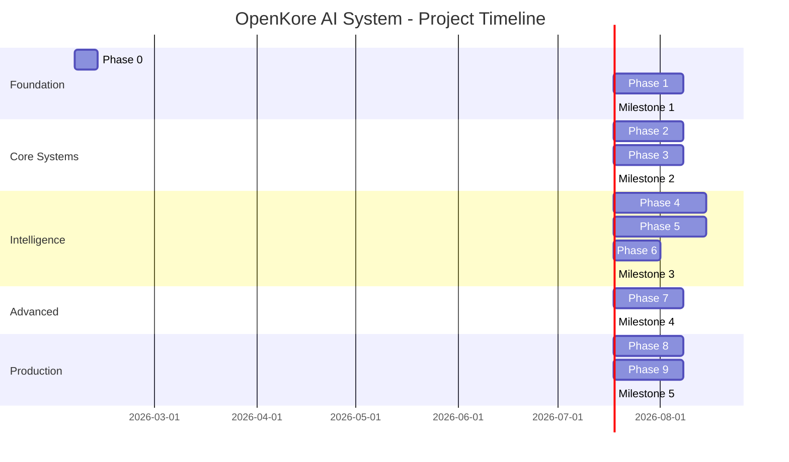

# Project Timeline and Milestones

**Version:** 1.0  
**Date:** 2026-02-05  
**Status:** Planning Phase

---

## Table of Contents

1. [Overview](#1-overview)
2. [Timeline Visualization](#2-timeline-visualization)
3. [Milestone Definitions](#3-milestone-definitions)
4. [Detailed Schedule](#4-detailed-schedule)
5. [Critical Path](#5-critical-path)
6. [Resource Allocation](#6-resource-allocation)
7. [Progress Tracking](#7-progress-tracking)

---

## 1. Overview

### 1.1 Project Duration

**Total Duration:** 29 weeks (approximately 7 months)  
**Start Date:** Week 0 (Project Kickoff)  
**Target Completion:** Week 29

### 1.2 Major Milestones



### 1.3 Milestone Summary

| Milestone | Week | Description | Demo Capability |
|-----------|------|-------------|-----------------|
| **M0: Project Start** | 0 | Kickoff, team formation | Dev environment ready |
| **M1: Foundation Complete** | 4 | IPC working, plugin active | State sync demonstrated |
| **M2: Basic AI Functional** | 10 | Decision engine operational | Bot farms with rules |
| **M3: Smart AI Active** | 18 | ML and LLM integrated | Bot makes intelligent decisions |
| **M4: Self-Improving** | 21 | PDCA loop working | Bot adapts to situations |
| **M5: Production Ready** | 29 | All features, hardened | Full production release |

---

## 2. Timeline Visualization

### 2.1 Gantt Chart (Detailed)

```
Week:  0  1  2  3  4  5  6  7  8  9  10 11 12 13 14 15 16 17 18 19 20 21 22 23 24 25 26 27 28 29
       ├──┼──┼──┼──┼──┼──┼──┼──┼──┼──┼──┼──┼──┼──┼──┼──┼──┼──┼──┼──┼──┼──┼──┼──┼──┼──┼──┼──┼──┤
P0     █
       └─ M0
P1        ████████████
                     └─ M1
P2                    ████████████
P3                    ████████████
                                 └─ M2
P4                                   ████████████████
P5                                   ████████████████
P6                                                   ████████
                                                            └─ M3
P7                                                               ████████████
                                                                            └─ M4
P8                                                                              ████████████
P9                                                                                          ████████████
                                                                                                       └─ M5

Legend: █ Active Development  └─ Milestone
```

### 2.2 Parallel Development Streams

```
Weeks 1-4:   Foundation (Sequential)
Weeks 5-10:  Decision Engine || Macro System (Parallel)
Weeks 11-18: ML Pipeline || Coordinators || Continued Macro (3-way Parallel)
Weeks 19-21: PDCA Loop (Sequential)
Weeks 22-29: Advanced Features → Production (Sequential)
```

---

## 3. Milestone Definitions

### 3.1 Milestone 0: Project Start

**Week:** 0  
**Date:** Start of project

#### Objectives
- Team assembled
- Roles assigned
- Development environment ready
- Architecture reviewed and approved

#### Deliverables
- [x] Development environment setup guide
- [x] Build system configured
- [x] Git repository initialized
- [x] Initial team meeting completed
- [x] Project plan approved

#### Validation Criteria
- ✅ All team members can build sample C++ project
- ✅ Python ML environment operational
- ✅ Perl can execute test plugin
- ✅ Documentation framework working

#### Demo
- Show: Clean build from source
- Show: Test execution passing
- Show: Documentation generation

---

### 3.2 Milestone 1: Foundation Complete

**Week:** 4  
**Date:** End of Phase 1

#### Objectives
- IPC communication working
- Perl plugin integrated with OpenKore
- Basic state synchronization functional

#### Deliverables
- [x] C++ engine executable
- [x] aiCore Perl plugin
- [x] IPC protocol implemented
- [x] State capture working
- [x] Action execution working
- [x] Unit tests passing
- [x] Integration tests passing

#### Validation Criteria
- ✅ IPC round-trip < 5ms (p99)
- ✅ State synchronization accurate (100% fields)
- ✅ Action execution success rate > 95%
- ✅ No crashes in 1-hour test
- ✅ Code coverage > 70%

#### Demo
- **Scenario**: "Hello World" Decision
  1. Start OpenKore with aiCore plugin
  2. C++ engine connects via IPC
  3. Perl sends game state to C++
  4. C++ returns simple action
  5. Perl executes action in OpenKore
  6. Show logs demonstrating flow

#### Known Limitations
- No intelligent decisions yet (simple echo/test actions)
- ML not implemented
- LLM not integrated
- Manual configuration required

---

### 3.3 Milestone 2: Basic AI Functional

**Week:** 10  
**Date:** End of Phase 2 & 3

#### Objectives
- Reflex and Rule engines operational
- Decision coordinator working
- Macro system functional
- Bot can farm autonomously

#### Deliverables
- [x] Reflex engine with configurable rules
- [x] Rule engine with YAML configuration
- [x] Decision coordinator with escalation
- [x] Macro template library
- [x] Macro generation system
- [x] Hot-reload mechanism
- [x] Performance benchmarks met

#### Validation Criteria
- ✅ Reflex response < 1ms (p99)
- ✅ Rule evaluation < 10ms (p99)
- ✅ 10+ reflex rules configured
- ✅ 50+ rule engine rules
- ✅ 10+ macro templates available
- ✅ Hot-reload works without disruption
- ✅ Bot farms successfully for 4 hours

#### Demo
- **Scenario**: "Autonomous Farming"
  1. Start bot in farming area (e.g., Geffen Field)
  2. Bot engages monsters automatically
  3. Uses skills appropriately (rule-based)
  4. Manages HP/SP resources
  5. Loots items
  6. Generates and loads farming macro on-the-fly
  7. Hot-reload macro with improvements
  8. Show decision logs (Reflex vs Rule distribution)

#### Known Limitations
- No ML predictions yet
- No LLM strategic planning
- No self-improvement (PDCA)
- Limited to pre-defined rules
- No advanced coordinators

---

### 3.4 Milestone 3: Smart AI Active

**Week:** 18  
**Date:** End of Phase 4, 5, 6

#### Objectives
- ML pipeline operational
- All 14 coordinators implemented
- LLM integration complete
- Bot makes intelligent, adaptive decisions

#### Deliverables
- [x] Training data collection system
- [x] Feature engineering (25+ features)
- [x] ML models trained and deployed
- [x] All 14 coordinators implemented
- [x] Coordinator router working
- [x] LLM API clients (OpenAI, Anthropic)
- [x] Strategic planner operational
- [x] LLM-generated macros working

#### Validation Criteria
- ✅ 10,000+ training samples collected
- ✅ ML model accuracy > 75% (Phase 2)
- ✅ ML inference < 100ms (p99)
- ✅ All coordinators tested individually
- ✅ Coordinator aggregation working
- ✅ LLM generates valid macros
- ✅ LLM response time < 5s (p99)
- ✅ Bot handles complex scenarios (multi-objective)

#### Demo
- **Scenario**: "Intelligent Multi-tasking"
  1. Bot given goal: "Level up while earning 1M zeny"
  2. LLM creates strategy
  3. ML predicts efficient farming patterns
  4. Coordinators work together:
     - Combat: Optimal skill rotation
     - Economy: Loot prioritization
     - Consumables: Resource management
     - Navigation: Efficient pathing
  5. Bot adapts to changing conditions
  6. Show decision distribution (ML 60%+, LLM for novel situations)

#### Known Limitations
- No self-improvement yet (manual strategy updates)
- Cold-start period still needed (7+ days for ML)
- No advanced anti-detection features
- Manual model retraining

---

### 3.5 Milestone 4: Self-Improving AI

**Week:** 21  
**Date:** End of Phase 7

#### Objectives
- PDCA cycle operational
- Automated continuous improvement
- Performance monitoring and adjustment
- Bot refines strategies automatically

#### Deliverables
- [x] Metrics collection system
- [x] Outcome evaluator
- [x] Performance analyzer
- [x] Strategy adjuster
- [x] PDCA cycle manager
- [x] Automated macro regeneration
- [x] Online ML learning active

#### Validation Criteria
- ✅ Metrics collected continuously
- ✅ Outcome evaluation accurate
- ✅ Strategy adjustments triggered correctly
- ✅ Macros regenerated on poor performance
- ✅ Online learning updates models
- ✅ Performance improves over 7 days
- ✅ PDCA cycle completes successfully

#### Demo
- **Scenario**: "Self-Optimization"
  1. Bot starts with baseline strategy
  2. Metrics show suboptimal performance (low EXP/hr)
  3. PDCA cycle detects issue
  4. LLM analyzes and suggests improvements
  5. New macro generated automatically
  6. Bot performance improves
  7. ML learns from LLM decisions
  8. Show performance graphs over 24 hours

#### Known Limitations
- Manual oversight still recommended
- Advanced features not yet implemented
- Not production-hardened

---

### 3.6 Milestone 5: Production Ready

**Week:** 29  
**Date:** End of Phase 9

#### Objectives
- All features complete
- Production-hardened
- Security verified
- Performance optimized
- Ready for public release

#### Deliverables
- [x] Complete feature set
- [x] Anti-detection mechanisms
- [x] Human behavior mimicry
- [x] Security hardening
- [x] Code obfuscation
- [x] Performance optimization
- [x] Monitoring and alerting
- [x] Complete documentation
- [x] User manual
- [x] Installation packages

#### Validation Criteria
- ✅ All tests passing (unit, integration, system)
- ✅ 7-day continuous operation successful
- ✅ Zero critical bugs
- ✅ Performance targets met consistently
- ✅ Security audit passed
- ✅ Documentation complete
- ✅ Beta testing successful (10+ users)
- ✅ Production deployment tested

#### Demo
- **Scenario**: "Production Showcase"
  1. Fresh installation on clean system
  2. Configuration wizard
  3. Bot starts and operates autonomously
  4. Handles complex scenarios:
     - Multi-map farming route
     - Party support
     - Boss fights
     - Economy management
  5. Self-improves over time
  6. Show production metrics:
     - Uptime > 98%
     - EXP efficiency 120% of manual
     - Decision latency within targets
     - ML usage > 85%

#### Known Limitations
- None (production-ready)

---

## 4. Detailed Schedule

### 4.1 Week-by-Week Breakdown

#### Weeks 1-4: Foundation Phase

**Week 1: Phase 0 - Project Setup**
- Days 1-2: Development environment setup
- Days 3-4: Build system configuration
- Day 5: Documentation framework

**Week 2: Phase 1 - IPC Protocol**
- Days 1-3: IPC protocol design and implementation
- Days 4-5: IPC testing and validation

**Week 3: Phase 1 - Perl Bridge**
- Days 1-3: Plugin skeleton and hooks
- Days 4-5: State capture and action executor

**Week 4: Phase 1 - Integration**
- Days 1-3: C++ engine core loop
- Days 4-5: End-to-end testing
- **[M1: Foundation Complete]**

#### Weeks 5-10: Core Systems

**Week 5-6: Phase 2 - Reflex Engine**
- Week 5: Reflex engine implementation
- Week 6: Configuration and testing

**Week 7-8: Phase 2 - Rule Engine**
- Week 7: Rule engine implementation
- Week 8: YAML parser and rule loading

**Week 9: Phase 2 - Decision Coordinator**
- Integration and escalation logic

**Week 10: Phase 3 - Macro Templates**
- Template library creation
- **[M2: Basic AI Functional]**

#### Weeks 11-18: Intelligence Layer

**Week 11-12: Phase 3 - Macro Generation**
- Generation engine and validation

**Week 13-14: Phase 4 - Data Collection**
- Training data collection system

**Week 15-16: Phase 4 - ML Training**
- Feature engineering and model training

**Week 17: Phase 4 - ML Deployment**
- Model deployment and inference

**Week 18: Phase 5 - Core Coordinators**
- Combat, Consumables, Navigation
- **[M3: Smart AI Active]**

#### Weeks 19-21: Self-Improvement

**Week 19: Phase 5 - Additional Coordinators**
- Economy, Progression, NPC, Social

**Week 20: Phase 6 - LLM Integration**
- API clients and strategic planner

**Week 21: Phase 7 - PDCA Loop**
- Complete PDCA cycle implementation
- **[M4: Self-Improving]**

#### Weeks 22-29: Production Readiness

**Week 22-24: Phase 8 - Advanced Features**
- Anti-detection mechanisms
- Human mimicry
- Randomization systems

**Week 25-27: Phase 9 - Hardening**
- Security audit and fixes
- Performance optimization
- Monitoring setup

**Week 28-29: Phase 9 - Release Preparation**
- Beta testing
- Documentation finalization
- Release packaging
- **[M5: Production Ready]**

---

## 5. Critical Path

### 5.1 Critical Path Analysis

**Critical Path** (longest dependency chain):
```
Phase 0 → Phase 1 → Phase 2 → Phase 6 → Phase 7 → Phase 8 → Phase 9
 (1w)     (3w)      (3w)       (2w)       (3w)       (3w)       (3w)
                                                    
Total Critical Path: 18 weeks
```

**Non-Critical Paths** (can run parallel):
- Phase 3 (Macro System) - starts with Phase 2, finishes before Phase 6
- Phase 4 (ML Pipeline) - starts with Phase 2, finishes before Phase 6
- Phase 5 (Coordinators) - starts with Phase 2, finishes before Phase 7

### 5.2 Float Time Analysis

| Phase | Duration | Earliest Start | Latest Start | Float |
|-------|----------|----------------|--------------|-------|
| Phase 0 | 1w | Week 0 | Week 0 | 0w (Critical) |
| Phase 1 | 3w | Week 1 | Week 1 | 0w (Critical) |
| Phase 2 | 3w | Week 4 | Week 4 | 0w (Critical) |
| Phase 3 | 3w | Week 4 | Week 7 | 3w |
| Phase 4 | 4w | Week 4 | Week 6 | 2w |
| Phase 5 | 4w | Week 4 | Week 7 | 3w |
| Phase 6 | 2w | Week 10 | Week 10 | 0w (Critical) |
| Phase 7 | 3w | Week 12 | Week 12 | 0w (Critical) |
| Phase 8 | 3w | Week 15 | Week 15 | 0w (Critical) |
| Phase 9 | 3w | Week 18 | Week 18 | 0w (Critical) |

**Float Time** = Latest Start - Earliest Start

Phases with 0 float are on the critical path. Any delay in these phases delays the entire project.

---

## 6. Resource Allocation

### 6.1 Team Size Over Time

```
Developers:
Week:  0  1  2  3  4  5  6  7  8  9  10 11 12 13 14 15 16 17 18 19 20 21 22 23 24 25 26 27 28 29
       2  3  3  3  4  4  4  4  4  4   5  5  5  5  5  5  4  4  4  4  4  4  3  3  3  3  3  3  3  3

Peak: Week 11-17 (5 developers)
Average: 3.8 developers
```

### 6.2 Role Requirements by Phase

| Phase | C++ Dev | ML Eng | Perl Dev | QA | Total |
|-------|---------|--------|----------|-----|-------|
| Phase 0 | 1 | 0 | 1 | 0 | 2 |
| Phase 1 | 2 | 0 | 1 | 0 | 3 |
| Phase 2 | 2 | 0 | 1 | 0 | 3 |
| Phase 3 | 1 | 0 | 2 | 0 | 3 |
| Phase 4 | 1 | 2 | 0 | 1 | 4 |
| Phase 5 | 3 | 0 | 1 | 1 | 5 |
| Phase 6 | 2 | 0 | 1 | 0 | 3 |
| Phase 7 | 2 | 1 | 1 | 0 | 4 |
| Phase 8 | 2 | 0 | 1 | 0 | 3 |
| Phase 9 | 2 | 0 | 1 | 1 | 4 |

---

## 7. Progress Tracking

### 7.1 Metrics Dashboard

**Weekly Metrics:**
- Sprint velocity (story points completed)
- Test coverage percentage
- Build success rate
- Open critical bugs
- Code review backlog

**Phase Completion Metrics:**
- Deliverables completed (%)
- Success criteria met (%)
- Test pass rate (%)
- Performance targets met (%)

### 7.2 Status Reporting

**Weekly Status Report Template:**
```markdown
# Weekly Status Report - Week X

## Completed This Week
- [List completed tasks]

## In Progress
- [List ongoing tasks]

## Blockers
- [List any blocking issues]

## Next Week Plan
- [List planned tasks]

## Metrics
- Test Coverage: X%
- Open Bugs: X (X critical)
- Velocity: X points

## Risks
- [New or updated risks]

## Notes
- [Additional comments]
```

### 7.3 Milestone Gates

Each milestone has a **gate review** before proceeding:

**Gate Criteria:**
1. All deliverables completed
2. All validation criteria met
3. Success criteria achieved
4. Demo successful
5. Stakeholder approval

**Gate Process:**
1. Pre-review: Team verifies readiness
2. Demo preparation: Working demonstration ready
3. Gate review meeting: Present to stakeholders
4. Decision: Go / No-Go / Conditional Go
5. Documentation: Record decision and any conditions

**If No-Go:**
- Identify gaps
- Create remediation plan
- Re-schedule gate review
- Update timeline if needed

---

## 8. Schedule Risks and Buffers

### 8.1 Built-in Buffers

- **Per-Phase Buffer**: 10% (e.g., 3-week phase has 0.3 week buffer)
- **Overall Buffer**: 2 weeks at end (included in 29 weeks)
- **Holiday Buffer**: 1 week assumed in timeline

### 8.2 Schedule Risk Mitigation

**If Behind Schedule:**

**< 1 Week Delay:**
- Use float time from non-critical phases
- Overtime/weekend work
- Reduce documentation scope

**1-2 Week Delay:**
- Reassess priorities
- Cut non-essential features
- Parallel work where possible
- Add temporary resources

**> 2 Week Delay:**
- Major reassessment required
- Stakeholder meeting
- Scope reduction
- Timeline extension

**Fast-Track Options:**
- Reduce coordinator count (14 → 10)
- Simplify ML pipeline (skip Phase 3, go 2 → 4)
- Reduce testing scope (focus on critical paths)
- Defer advanced features to v1.1

---

## 9. Dependencies and Prerequisites

### 9.1 External Dependencies

| Dependency | Required For | Risk if Unavailable |
|------------|--------------|---------------------|
| **OpenKore 3.x** | All phases | Project impossible |
| **LLM API Access** | Phase 6-7 | Use rule-based only |
| **ML Training Data** | Phase 4 | Extended cold-start |
| **Test Server** | Phase 5+ | Limited validation |
| **Beta Testers** | Phase 9 | Reduced validation |

### 9.2 Team Prerequisites

**Before Phase 1:**
- All team members onboarded
- Development environments ready
- Architecture understood

**Before Phase 4:**
- ML engineer on team
- Python environment ready
- Training data strategy defined

**Before Phase 6:**
- LLM API access secured
- API budget approved

---

## 10. Milestone Celebration and Retrospective

### After Each Milestone:

**Celebration:**
- Team recognition
- Showcase demo to stakeholders
- Share achievements

**Retrospective:**
- What went well?
- What could improve?
- Action items for next phase
- Update risk register
- Adjust plans if needed

**Metrics Review:**
- Velocity trends
- Quality metrics
- Performance benchmarks
- Team morale

---

## Summary

**Total Duration:** 29 weeks  
**Critical Path:** 18 weeks  
**Buffer:** 11 weeks (parallel work + buffers)  
**Milestones:** 6 (M0-M5)  
**Phases:** 10 (0-9)  

**Key Success Factors:**
- ✅ Early IPC validation (M1)
- ✅ Rule engine working before ML (M2)
- ✅ ML cold-start strategy effective (M3)
- ✅ PDCA loop functional (M4)
- ✅ Production hardening complete (M5)

**Timeline Confidence:** Medium-High
- Realistic estimates based on complexity
- Adequate buffers included
- Parallel work opportunities identified
- Risk mitigation plans in place

---

**Next Document:** [Team Organization and Roles](07-team-organization.md)
