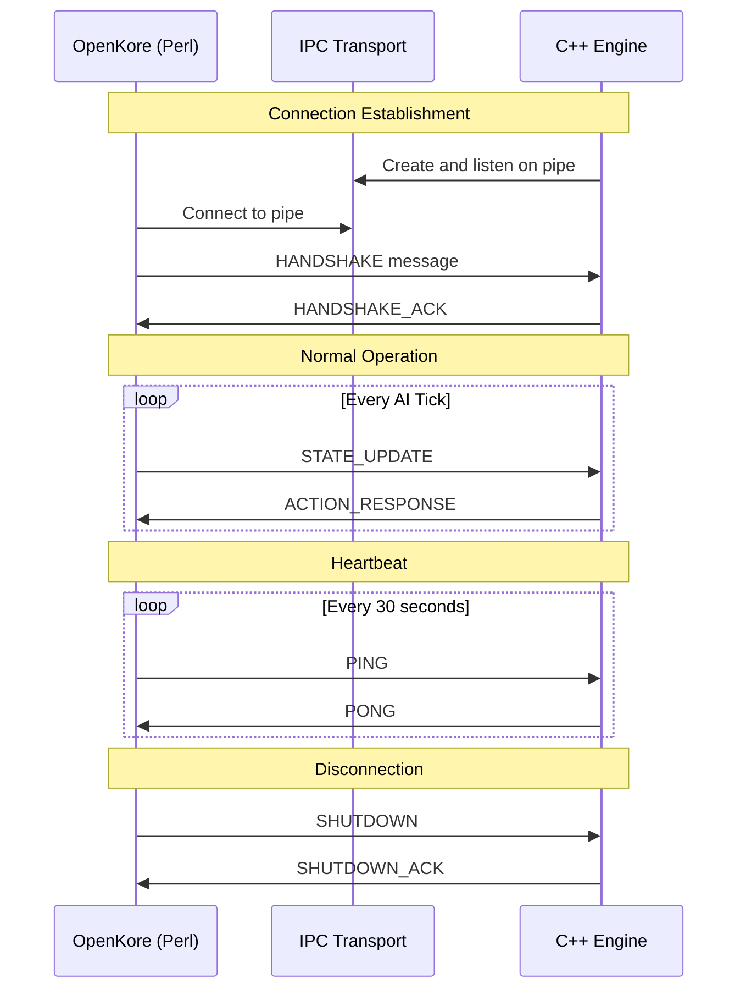

# IPC Protocol Specification

**Version:** 1.0  
**Date:** 2026-02-05  
**Status:** Final Specification

---

## Table of Contents

1. [Overview](#1-overview)
2. [Protocol Architecture](#2-protocol-architecture)
3. [Message Format](#3-message-format)
4. [Message Catalog](#4-message-catalog)
5. [Request/Response Patterns](#5-requestresponse-patterns)
6. [Error Handling](#6-error-handling)
7. [Performance Requirements](#7-performance-requirements)
8. [Implementation Examples](#8-implementation-examples)

---

## 1. Overview

### 1.1 Purpose

The IPC (Inter-Process Communication) protocol enables communication between:
- **OpenKore Perl Process**: Game client interface
- **C++ Core Engine Process**: AI decision-making engine

### 1.2 Design Goals

- **Low Latency**: < 5ms round-trip for state updates
- **Reliable**: Guaranteed message delivery with error recovery
- **Efficient**: Minimal serialization overhead
- **Secure**: Authentication and message integrity
- **Cross-Platform**: Works on Windows and Linux

### 1.3 Transport Layer

| Platform | Primary Transport | Fallback |
|----------|------------------|----------|
| **Windows** | Named Pipes (`\\.\pipe\openkore_ai`) | TCP Socket (localhost:9901) |
| **Linux** | Unix Domain Socket (`/tmp/openkore_ai.sock`) | TCP Socket (localhost:9901) |

---

## 2. Protocol Architecture

### 2.1 Connection Model



### 2.2 Message Flow

**Synchronous Flow** (State Update):
```
Perl → C++: STATE_UPDATE (with game state)
C++ → Perl: ACTION_RESPONSE (within 100ms)
```

**Asynchronous Flow** (Macro Generation):
```
C++ → Perl: MACRO_COMMAND (new macro available)
Perl → C++: MACRO_COMMAND_ACK (loaded successfully)
```

---

## 3. Message Format

### 3.1 Binary Message Structure

All messages use the following binary format:

```cpp
struct IPCMessageHeader {
    uint32_t magic;           // Magic number: 0x4F4B4149 ("OKAI")
    uint32_t version;         // Protocol version (current: 1)
    uint32_t message_type;    // Message type code (see catalog)
    uint32_t payload_size;    // Size of payload in bytes
    uint32_t sequence_number; // Message sequence for ordering
    uint32_t timestamp_ms;    // Timestamp in milliseconds
    uint32_t flags;           // Message flags (see below)
    uint32_t checksum;        // CRC32 checksum of payload
};
// Total header size: 32 bytes
```

**Message Flags**:
```cpp
enum MessageFlags : uint32_t {
    FLAG_NONE           = 0x00000000,
    FLAG_REQUIRES_ACK   = 0x00000001,  // Requires acknowledgment
    FLAG_COMPRESSED     = 0x00000002,  // Payload is compressed
    FLAG_ENCRYPTED      = 0x00000004,  // Payload is encrypted
    FLAG_PRIORITY_HIGH  = 0x00000010,  // High priority message
    FLAG_PRIORITY_LOW   = 0x00000020,  // Low priority message
};
```

### 3.2 Payload Format

Payloads are JSON-encoded strings for flexibility and debuggability:

```
[Header (32 bytes)][JSON Payload (variable)]
```

**Production Note**: For maximum performance, consider using Protocol Buffers or MessagePack in production builds.

### 3.3 Serialization Example

```cpp
// C++ Serialization
std::vector<uint8_t> serializeMessage(MessageType type, const json& payload) {
    std::string payload_str = payload.dump();
    uint32_t payload_size = payload_str.size();
    
    IPCMessageHeader header{
        .magic = 0x4F4B4149,
        .version = 1,
        .message_type = static_cast<uint32_t>(type),
        .payload_size = payload_size,
        .sequence_number = getNextSequence(),
        .timestamp_ms = getCurrentTimestampMs(),
        .flags = FLAG_REQUIRES_ACK,
        .checksum = crc32(payload_str)
    };
    
    std::vector<uint8_t> message;
    message.resize(sizeof(header) + payload_size);
    
    // Copy header
    std::memcpy(message.data(), &header, sizeof(header));
    
    // Copy payload
    std::memcpy(message.data() + sizeof(header), 
                payload_str.data(), payload_size);
    
    return message;
}
```

```perl
# Perl Serialization
sub serialize_message {
    my ($type, $payload) = @_;
    
    my $payload_json = encode_json($payload);
    my $payload_size = length($payload_json);
    
    my $header = pack('N N N N N N N N',
        0x4F4B4149,              # magic
        1,                        # version
        $type,                    # message_type
        $payload_size,            # payload_size
        get_next_sequence(),      # sequence_number
        get_timestamp_ms(),       # timestamp_ms
        FLAG_REQUIRES_ACK,        # flags
        crc32($payload_json)      # checksum
    );
    
    return $header . $payload_json;
}
```

---

## 4. Message Catalog

### 4.1 Message Type Codes

```cpp
enum class MessageType : uint32_t {
    // Connection Management (0x00xx)
    HANDSHAKE           = 0x0001,
    HANDSHAKE_ACK       = 0x0002,
    PING                = 0x0003,
    PONG                = 0x0004,
    SHUTDOWN            = 0x0005,
    SHUTDOWN_ACK        = 0x0006,
    
    // State Updates (0x01xx)
    STATE_UPDATE        = 0x0100,
    STATE_UPDATE_ACK    = 0x0101,
    PACKET_EVENT        = 0x0102,
    AI_TICK             = 0x0103,
    
    // Action Commands (0x02xx)
    ACTION_RESPONSE     = 0x0200,
    ACTION_EXECUTE      = 0x0201,
    ACTION_COMPLETE     = 0x0202,
    ACTION_FAILED       = 0x0203,
    
    // Macro Management (0x03xx)
    MACRO_COMMAND       = 0x0300,
    MACRO_COMMAND_ACK   = 0x0301,
    MACRO_GENERATED     = 0x0302,
    MACRO_RELOAD        = 0x0303,
    
    // Configuration (0x04xx)
    CONFIG_UPDATE       = 0x0400,
    CONFIG_QUERY        = 0x0401,
    CONFIG_RESPONSE     = 0x0402,
    
    // Metrics & Logging (0x05xx)
    METRICS_REPORT      = 0x0500,
    LOG_MESSAGE         = 0x0501,
    DECISION_LOG        = 0x0502,
    
    // Error Messages (0xFFxx)
    ERROR_INVALID_MSG   = 0xFF00,
    ERROR_TIMEOUT       = 0xFF01,
    ERROR_PARSE_FAILED  = 0xFF02,
    ERROR_CHECKSUM      = 0xFF03,
    ERROR_UNKNOWN       = 0xFFFF,
};
```

### 4.2 Message Specifications

#### HANDSHAKE (0x0001)

**Direction**: Perl → C++  
**Purpose**: Establish connection and exchange capabilities  
**Requires ACK**: Yes

**Payload**:
```json
{
  "version": 1,
  "client": "OpenKore",
  "client_version": "3.2.0",
  "pid": 12345,
  "capabilities": [
    "state_updates",
    "macro_execution",
    "hot_reload"
  ],
  "authentication": {
    "token": "sha256_hash_of_shared_secret"
  }
}
```

**Response**: HANDSHAKE_ACK (0x0002)
```json
{
  "version": 1,
  "server": "OpenKore AI Engine",
  "server_version": "1.0.0",
  "capabilities": [
    "reflex_engine",
    "rule_engine",
    "ml_engine",
    "llm_integration"
  ],
  "session_id": "uuid-here",
  "status": "ready"
}
```

---

#### STATE_UPDATE (0x0100)

**Direction**: Perl → C++  
**Purpose**: Send current game state for decision making  
**Requires ACK**: Yes (ACTION_RESPONSE)  
**Frequency**: Every AI tick (~50-100ms)

**Payload**:
```json
{
  "timestamp": 1234567890123,
  "character": {
    "id": 150000,
    "name": "MyCharacter",
    "hp": 8500,
    "max_hp": 10000,
    "sp": 600,
    "max_sp": 800,
    "level": 99,
    "job_level": 70,
    "job_class": "High Wizard",
    "position": {"x": 150, "y": 180, "map": "prontera"},
    "weight": 1500,
    "max_weight": 2000,
    "zeny": 5000000,
    "status_effects": [
      {"id": 12, "name": "Blessing", "remaining_ms": 60000},
      {"id": 13, "name": "Increase AGI", "remaining_ms": 45000}
    ],
    "skills": {
      "Fire Ball": {"level": 10, "sp_cost": 50, "cooldown_ms": 0},
      "Fire Wall": {"level": 10, "sp_cost": 40, "cooldown_ms": 1500}
    }
  },
  "monsters": [
    {
      "id": 200001,
      "name": "Poring",
      "name_id": 1002,
      "level": 1,
      "position": {"x": 145, "y": 175},
      "hp_percent": 100,
      "is_aggressive": false,
      "is_attacking_me": false,
      "distance": 7.2,
      "threat_level": 0.1
    }
  ],
  "players": [
    {
      "id": 150001,
      "name": "OtherPlayer",
      "position": {"x": 155, "y": 185},
      "guild": "SomeGuild",
      "is_party_member": false
    }
  ],
  "items_on_ground": [
    {
      "id": 300001,
      "name": "Jellopy",
      "item_id": 909,
      "position": {"x": 148, "y": 178},
      "amount": 1
    }
  ],
  "party": {
    "members": [
      {
        "id": 150002,
        "name": "PartyMember1",
        "hp_percent": 85,
        "position": {"x": 160, "y": 190}
      }
    ]
  },
  "inventory": {
    "items": [
      {"id": 501, "name": "Red Potion", "amount": 100},
      {"id": 502, "name": "Orange Potion", "amount": 50}
    ],
    "weight_percent": 75
  },
  "ai_state": "auto",
  "current_target": 200001,
  "is_casting": false,
  "is_sitting": false
}
```

**Response**: ACTION_RESPONSE (0x0200)

---

#### ACTION_RESPONSE (0x0200)

**Direction**: C++ → Perl  
**Purpose**: Return decision/action to execute  
**Response To**: STATE_UPDATE  
**Max Latency**: 100ms

**Payload**:
```json
{
  "action": {
    "type": "USE_SKILL",
    "parameters": {
      "skill": "Fire Ball",
      "level": 10,
      "target_id": 200001,
      "target_type": "monster"
    },
    "priority": 80,
    "timeout_ms": 5000
  },
  "metadata": {
    "decision_tier": "ml",
    "confidence": 0.85,
    "reasoning": "High SP, optimal damage target",
    "processing_time_us": 5432,
    "model_version": "decision_tree_v2"
  },
  "fallback_action": {
    "type": "ATTACK",
    "parameters": {
      "target_id": 200001
    }
  }
}
```

**Action Types**:
```cpp
enum class ActionType {
    NO_ACTION,          // Do nothing
    MOVE_TO,           // Move to position
    ATTACK,            // Basic attack
    USE_SKILL,         // Use skill
    USE_ITEM,          // Use item
    PICK_ITEM,         // Pick up item
    TALK_NPC,          // Talk to NPC
    EXECUTE_MACRO,     // Execute macro
    SEND_COMMAND,      // Send console command
    CHANGE_STATE,      // Change AI state
};
```

---

#### MACRO_COMMAND (0x0300)

**Direction**: C++ → Perl  
**Purpose**: Command to execute or reload macro  
**Requires ACK**: Yes

**Payload**:
```json
{
  "command": "execute",
  "macro_name": "farming_rotation_v2",
  "macro_file": "control/macros/generated/farming_rotation_v2.txt",
  "parameters": {
    "target": "poring",
    "duration_seconds": 3600
  },
  "priority": "normal",
  "replace_current": false
}
```

**Commands**:
- `execute`: Execute a macro
- `reload`: Reload macro files
- `stop`: Stop current macro
- `status`: Query macro status

---

#### METRICS_REPORT (0x0500)

**Direction**: Perl → C++  
**Purpose**: Report gameplay metrics  
**Requires ACK**: No  
**Frequency**: Every 60 seconds

**Payload**:
```json
{
  "interval_seconds": 60,
  "metrics": {
    "combat": {
      "kills": 45,
      "deaths": 0,
      "exp_gained": 500000,
      "damage_dealt": 1250000,
      "damage_taken": 25000
    },
    "resources": {
      "zeny_gained": 15000,
      "items_picked": 78,
      "potions_used": 12,
      "weight_avg_percent": 65
    },
    "efficiency": {
      "uptime_percent": 98.5,
      "combat_time_percent": 75,
      "idle_time_percent": 2
    }
  }
}
```

---

#### ERROR Messages (0xFFxx)

**Direction**: Both  
**Purpose**: Report errors  
**Requires ACK**: No

**Payload**:
```json
{
  "error_code": 0xFF02,
  "error_type": "PARSE_FAILED",
  "error_message": "Failed to parse STATE_UPDATE payload",
  "details": {
    "expected": "JSON object",
    "received": "malformed data",
    "position": 156
  },
  "original_message_sequence": 12345,
  "timestamp": 1234567890123
}
```

---

## 5. Request/Response Patterns

### 5.1 Synchronous Request-Response

Used for STATE_UPDATE → ACTION_RESPONSE:

```cpp
// C++ Engine Side
void handleStateUpdate(const IPCMessage& msg) {
    auto state = parseGameState(msg.payload);
    
    // Process decision (must be < 100ms)
    auto action = coordinator_->decide(state);
    
    // Send response
    json response_payload = serializeAction(action);
    sendMessage(MessageType::ACTION_RESPONSE, response_payload);
}
```

```perl
# Perl Side
sub sendStateUpdate {
    my ($state) = @_;
    
    # Send state
    IPCClient::sendMessage('STATE_UPDATE', $state);
    
    # Wait for response (timeout: 150ms)
    my $response = IPCClient::receiveMessage(150);
    
    if ($response && $response->{type} eq 'ACTION_RESPONSE') {
        executeAction($response->{payload});
    } else {
        warning "[AI] No response from engine, using fallback\n";
        useFallbackAI();
    }
}
```

### 5.2 Asynchronous Notifications

Used for MACRO_COMMAND and METRICS:

```cpp
// C++ → Perl (Async)
void notifyMacroGenerated(const GeneratedMacro& macro) {
    json payload = {
        {"command", "execute"},
        {"macro_name", macro.name},
        {"macro_file", macro.file_path}
    };
    
    sendMessage(MessageType::MACRO_COMMAND, payload);
    // Don't wait for response, continue processing
}
```

### 5.3 Heartbeat Pattern

```perl
# Perl Side - Send heartbeat
our $last_heartbeat = 0;
sub maintainConnection {
    my $now = Time::HiRes::time();
    
    if ($now - $last_heartbeat > 30) {
        IPCClient::sendMessage('PING', {});
        my $pong = IPCClient::receiveMessage(5000);
        
        if (!$pong || $pong->{type} ne 'PONG') {
            error "[IPC] Heartbeat failed, reconnecting...\n";
            IPCClient::reconnect();
        }
        
        $last_heartbeat = $now;
    }
}
```

---

## 6. Error Handling

### 6.1 Error Types and Recovery

| Error Code | Error Type | Recovery Strategy |
|------------|-----------|-------------------|
| `0xFF00` | INVALID_MSG | Log and ignore message |
| `0xFF01` | TIMEOUT | Retry with exponential backoff |
| `0xFF02` | PARSE_FAILED | Request resend |
| `0xFF03` | CHECKSUM | Request resend |
| `0xFFFF` | UNKNOWN | Log and fallback to safe mode |

### 6.2 Retry Logic

```cpp
template<typename T>
std::optional<T> sendWithRetry(MessageType type, const json& payload, 
                               int max_retries = 3) {
    for (int attempt = 0; attempt < max_retries; attempt++) {
        try {
            sendMessage(type, payload);
            
            auto response = receiveMessage(timeout_ms);
            if (response) {
                return parseResponse<T>(*response);
            }
            
        } catch (const TimeoutException& e) {
            log_warning("Message timeout, retry {}/{}", attempt + 1, max_retries);
            std::this_thread::sleep_for(
                std::chrono::milliseconds(100 * (1 << attempt)) // Exponential backoff
            );
        }
    }
    
    return std::nullopt;
}
```

### 6.3 Connection Recovery

```perl
sub reconnect {
    my $max_attempts = 10;
    my $attempt = 0;
    
    while ($attempt < $max_attempts) {
        message "[IPC] Reconnection attempt $attempt/$max_attempts\n";
        
        if (IPCClient::connect()) {
            message "[IPC] Reconnected successfully\n", "success";
            return 1;
        }
        
        $attempt++;
        sleep(5);
    }
    
    error "[IPC] Failed to reconnect after $max_attempts attempts\n";
    return 0;
}
```

---

## 7. Performance Requirements

### 7.1 Latency Budgets

| Operation | Target | Maximum |
|-----------|--------|---------|
| **Message Serialization** | < 1ms | 5ms |
| **Message Deserialization** | < 1ms | 5ms |
| **Send/Receive** | < 2ms | 10ms |
| **Round-trip (STATE_UPDATE)** | < 5ms | 50ms |
| **Round-trip (ACTION_RESPONSE)** | < 100ms | 500ms |

### 7.2 Throughput Requirements

- **STATE_UPDATE Rate**: Up to 20 messages/second
- **ACTION_RESPONSE Rate**: Up to 20 messages/second
- **METRICS_REPORT Rate**: 1 message/minute
- **Maximum Message Size**: 1MB (typical: 10-50KB)

### 7.3 Memory Constraints

- **Message Buffer Size**: 64KB per direction
- **Queue Depth**: 100 messages maximum
- **Total IPC Memory**: < 10MB

---

## 8. Implementation Examples

### 8.1 Complete C++ IPC Server

```cpp
// ipc_server.hpp
class IPCServer {
public:
    IPCServer(const std::string& pipe_name);
    ~IPCServer();
    
    bool start();
    void stop();
    
    using MessageHandler = std::function<void(const IPCMessage&)>;
    void registerHandler(MessageType type, MessageHandler handler);
    
    void sendMessage(MessageType type, const json& payload);
    
private:
    std::string pipe_name_;
    std::atomic<bool> running_;
    std::thread receiver_thread_;
    
    std::unordered_map<MessageType, MessageHandler> handlers_;
    
    void receiverLoop();
    void processMessage(const IPCMessage& msg);
};

// ipc_server.cpp
IPCServer::IPCServer(const std::string& pipe_name) 
    : pipe_name_(pipe_name), running_(false) {}

bool IPCServer::start() {
    // Create named pipe (Windows)
    #ifdef _WIN32
    HANDLE pipe = CreateNamedPipeA(
        pipe_name_.c_str(),
        PIPE_ACCESS_DUPLEX,
        PIPE_TYPE_BYTE | PIPE_READMODE_BYTE | PIPE_WAIT,
        1,  // Max instances
        65536,  // Out buffer size
        65536,  // In buffer size
        0,  // Default timeout
        NULL  // Default security
    );
    
    if (pipe == INVALID_HANDLE_VALUE) {
        log_error("Failed to create named pipe: {}", GetLastError());
        return false;
    }
    #endif
    
    running_ = true;
    receiver_thread_ = std::thread(&IPCServer::receiverLoop, this);
    
    log_info("IPC Server started on {}", pipe_name_);
    return true;
}

void IPCServer::receiverLoop() {
    while (running_) {
        // Wait for client connection
        // Read messages
        // Dispatch to handlers
    }
}
```

### 8.2 Complete Perl IPC Client

```perl
# IPCClient.pm
package IPCClient;

use strict;
use warnings;
use Win32::Pipe;
use JSON::XS;

our $pipe;
our $connected = 0;
our $sequence = 0;

sub connect {
    my $pipe_name = '\\\\.\\pipe\\openkore_ai';
    
    $pipe = Win32::Pipe->new($pipe_name);
    
    if (!$pipe) {
        error "[IPC] Failed to connect: $^E\n";
        return 0;
    }
    
    $connected = 1;
    
    # Send handshake
    my $handshake = {
        version => 1,
        client => 'OpenKore',
        client_version => '3.2.0',
        pid => $$,
        capabilities => ['state_updates', 'macro_execution']
    };
    
    sendMessage('HANDSHAKE', $handshake);
    
    # Wait for ACK
    my $ack = receiveMessage(5000);
    if ($ack && $ack->{type} eq 'HANDSHAKE_ACK') {
        message "[IPC] Connected to AI Engine\n", "success";
        return 1;
    }
    
    return 0;
}

sub sendMessage {
    my ($type, $payload) = @_;
    
    return 0 unless $connected;
    
    my $json_payload = encode_json($payload);
    my $payload_size = length($json_payload);
    
    my $type_code = getMessageTypeCode($type);
    
    my $header = pack('N N N N N N N N',
        0x4F4B4149,           # magic
        1,                     # version
        $type_code,            # message_type
        $payload_size,         # payload_size
        $sequence++,           # sequence_number
        getTimestampMs(),      # timestamp_ms
        0x00000001,            # flags (REQUIRES_ACK)
        crc32($json_payload)   # checksum
    );
    
    my $message = $header . $json_payload;
    
    my $written = $pipe->Write($message);
    
    return $written == length($message);
}

sub receiveMessage {
    my ($timeout_ms) = @_;
    $timeout_ms //= 100;
    
    return undef unless $connected;
    
    # Read header (32 bytes)
    my $header;
    my $bytes_read = $pipe->Read($header, 32, $timeout_ms);
    
    return undef unless $bytes_read == 32;
    
    my ($magic, $version, $type, $payload_size, $seq, $timestamp, $flags, $checksum) 
        = unpack('N N N N N N N N', $header);
    
    # Verify magic
    return undef unless $magic == 0x4F4B4149;
    
    # Read payload
    my $payload_data;
    $bytes_read = $pipe->Read($payload_data, $payload_size, $timeout_ms);
    
    return undef unless $bytes_read == $payload_size;
    
    # Verify checksum
    my $computed_checksum = crc32($payload_data);
    if ($computed_checksum != $checksum) {
        error "[IPC] Checksum mismatch\n";
        return undef;
    }
    
    # Decode JSON
    my $payload = decode_json($payload_data);
    
    return {
        type => getMessageTypeName($type),
        sequence => $seq,
        timestamp => $timestamp,
        payload => $payload
    };
}

1;
```

---

## 9. Testing & Validation

### 9.1 Unit Tests

```cpp
TEST(IPCProtocol, MessageSerialization) {
    json payload = {
        {"test", "data"},
        {"number", 123}
    };
    
    auto message = serializeMessage(MessageType::STATE_UPDATE, payload);
    
    // Verify header
    IPCMessageHeader* header = reinterpret_cast<IPCMessageHeader*>(message.data());
    EXPECT_EQ(header->magic, 0x4F4B4149);
    EXPECT_EQ(header->version, 1);
    EXPECT_EQ(header->message_type, static_cast<uint32_t>(MessageType::STATE_UPDATE));
    
    // Verify payload
    auto [parsed_header, parsed_payload] = deserializeMessage(message);
    EXPECT_EQ(parsed_payload, payload);
}

TEST(IPCProtocol, RoundTripLatency) {
    auto start = std::chrono::high_resolution_clock::now();
    
    // Send state update
    sendMessage(MessageType::STATE_UPDATE, test_state);
    
    // Receive action response
    auto response = receiveMessage(100);
    
    auto end = std::chrono::high_resolution_clock::now();
    auto duration = std::chrono::duration_cast<std::chrono::milliseconds>(end - start);
    
    EXPECT_LT(duration.count(), 100);  // Must be < 100ms
}
```

### 9.2 Integration Tests

Test full workflow:
1. Connection establishment
2. State update → Action response
3. Macro generation
4. Error recovery
5. Graceful shutdown

---

## 10. Security Considerations

### 10.1 Authentication

```cpp
bool IPCServer::authenticate(const json& handshake) {
    auto provided_token = handshake["authentication"]["token"].get<std::string>();
    
    // Compute expected token
    std::string expected_token = computeHMAC(shared_secret_, "openkore_ai_session");
    
    return provided_token == expected_token;
}
```

### 10.2 Message Integrity

- All messages include CRC32 checksum
- Optional encryption for sensitive data
- Sequence numbers prevent replay attacks

---

## Appendix A: Message Type Reference

Complete table of all message types with codes, directions, and purposes.

## Appendix B: Error Code Reference

Complete list of error codes with descriptions and recovery procedures.

## Appendix C: Performance Benchmarks

Expected performance metrics for different hardware configurations.

---

**Next Document**: [Data Structures Reference](02-data-structures-reference.md)
