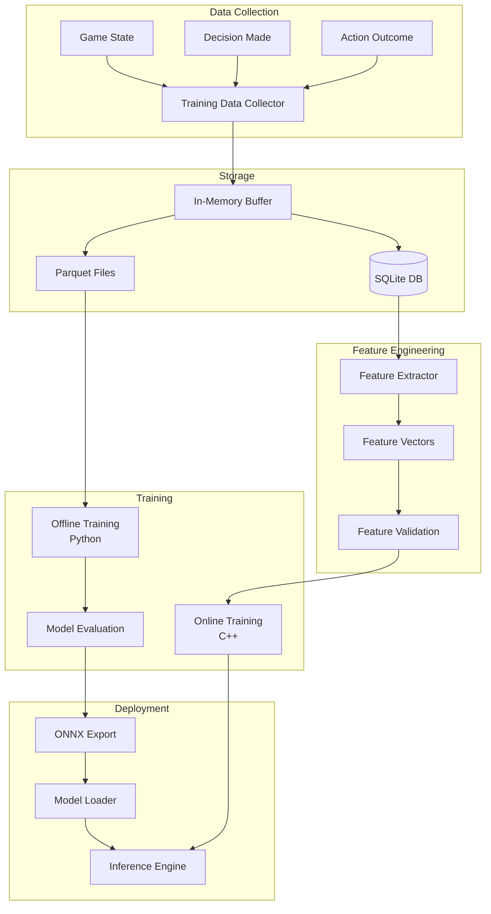

# ML Pipeline Specification

**Version:** 1.0  
**Date:** 2026-02-05  
**Status:** Final Specification

---

## Table of Contents

1. [Overview](#1-overview)
2. [Cold-Start Strategy](#2-cold-start-strategy)
3. [Training Data Collection](#3-training-data-collection)
4. [Feature Engineering](#4-feature-engineering)
5. [Model Training Pipeline](#5-model-training-pipeline)
6. [Model Deployment](#6-model-deployment)
7. [Online Learning](#7-online-learning)
8. [Performance Monitoring](#8-performance-monitoring)

---

## 1. Overview

### 1.1 Purpose

The ML Pipeline enables the system to:
- Learn from LLM and rule-based decisions
- Gradually replace expensive LLM calls with fast ML inference
- Adapt to player's style and game situations
- Improve decision quality over time

### 1.2 Architecture



### 1.3 Design Principles

- **Cold-Start Friendly**: Work with limited initial data
- **Incremental Learning**: Continuously improve without full retraining
- **Production-Ready**: Low latency, high throughput
- **Explainable**: Feature importance and decision reasoning
- **Robust**: Handle data drift and distribution shifts

---

## 2. Cold-Start Strategy

### 2.1 Overview

The cold-start strategy addresses the chicken-and-egg problem: ML needs training data, but we need to make decisions before we have enough data.

### 2.2 Four-Phase Approach

#### Phase 1: Pure LLM Mode (Days 1-7)

**Objective**: Collect initial training data

**Configuration**:
```json
{
  "phase": 1,
  "duration_days": 7,
  "ml_enabled": false,
  "llm_enabled": true,
  "data_collection": {
    "target_samples": 10000,
    "priority_scenarios": [
      "combat",
      "resource_management",
      "navigation"
    ]
  }
}
```

**Behavior**:
- All decisions escalate to LLM
- Every LLM decision is logged
- Focus on diverse scenarios
- No ML predictions yet

**Data Collection Goals**:
- Minimum 10,000 labeled samples
- Coverage of major action types
- Variety of game states

```cpp
void Phase1Collector::processDecision(const DecisionResponse& decision,
                                      const GameState& state) {
    if (decision.tier != DecisionTier::LLM) return;
    
    // Record for training
    TrainingRecord record{
        .id = generateUUID(),
        .timestamp = getCurrentTimestampMs(),
        .state = state,
        .features = feature_extractor_->extract(state),
        .decision = {
            .tier = decision.tier,
            .action = decision.action,
            .reasoning = decision.reasoning,
            .confidence = decision.confidence
        }
    };
    
    training_buffer_.push_back(record);
    
    // Check if ready for Phase 2
    if (training_buffer_.size() >= 10000) {
        log_info("Phase 1 complete: {} samples collected", training_buffer_.size());
        triggerPhase2Transition();
    }
}
```

#### Phase 2: Simple Models (Days 8-14)

**Objective**: Deploy initial ML models with conservative usage

**Configuration**:
```json
{
  "phase": 2,
  "duration_days": 7,
  "ml_enabled": true,
  "ml_confidence_threshold": 0.85,
  "llm_fallback": true,
  "models": [
    {
      "type": "decision_tree",
      "max_depth": 5,
      "min_samples": 1000
    }
  ]
}
```

**Behavior**:
- Train initial decision tree model
- Use ML only for high-confidence predictions (>0.85)
- Fallback to LLM for low confidence
- Continue collecting data

**Model Training**:
```python
# Phase 2 training script
import pandas as pd
from sklearn.tree import DecisionTreeClassifier
from sklearn.model_selection import train_test_split

# Load data
df = pd.read_parquet('training_data_phase1.parquet')

# Prepare features and labels
X = df[feature_columns]
y = df['action_type']

# Split data
X_train, X_test, y_train, y_test = train_test_split(
    X, y, test_size=0.2, random_state=42
)

# Train simple decision tree
model = DecisionTreeClassifier(
    max_depth=5,
    min_samples_split=50,
    min_samples_leaf=20,
    random_state=42
)

model.fit(X_train, y_train)

# Evaluate
accuracy = model.score(X_test, y_test)
print(f"Phase 2 Model Accuracy: {accuracy:.3f}")

# Export to ONNX
from skl2onnx import convert_sklearn
onnx_model = convert_sklearn(
    model, 
    initial_types=[('input', FloatTensorType([None, len(feature_columns)]))]
)
```

**Usage Pattern**:
```cpp
DecisionResponse Phase2Coordinator::decide(const DecisionRequest& request) {
    // Try ML first
    auto ml_prediction = ml_engine_->predict(request.state);
    
    if (ml_prediction && ml_prediction->confidence >= 0.85f) {
        log_debug("Phase 2: Using ML prediction (conf: {:.2f})", 
                  ml_prediction->confidence);
        return toDecisionResponse(*ml_prediction, DecisionTier::ML);
    }
    
    // Fallback to LLM
    log_debug("Phase 2: ML confidence too low, using LLM");
    auto llm_result = llm_client_->query(request.state);
    return toDecisionResponse(llm_result, DecisionTier::LLM);
}
```

#### Phase 3: Hybrid Mode (Days 15-30)

**Objective**: Increase ML usage while maintaining quality

**Configuration**:
```json
{
  "phase": 3,
  "duration_days": 15,
  "ml_confidence_threshold": 0.70,
  "ml_usage_target": 0.60,
  "models": [
    {
      "type": "random_forest",
      "n_estimators": 100,
      "max_depth": 15
    },
    {
      "type": "gradient_boost",
      "n_estimators": 50,
      "learning_rate": 0.1
    }
  ],
  "ensemble": true
}
```

**Behavior**:
- Deploy more sophisticated models (Random Forest, XGBoost)
- Lower confidence threshold to 0.70
- Use ML for 60%+ of decisions
- Continue refining with online learning

**Model Ensemble**:
```cpp
class ModelEnsemble {
public:
    struct EnsemblePrediction {
        Action action;
        float confidence;
        std::unordered_map<std::string, float> model_votes;
    };
    
    EnsemblePrediction predict(const FeatureVector& features) {
        std::vector<Prediction> predictions;
        
        // Get predictions from all models
        for (const auto& model : models_) {
            predictions.push_back(model->predict(features));
        }
        
        // Weighted voting
        std::unordered_map<ActionType, float> votes;
        for (const auto& pred : predictions) {
            votes[pred.action.type] += pred.confidence * model_weights_[pred.model_id];
        }
        
        // Select best action
        auto best = std::max_element(votes.begin(), votes.end(),
            [](const auto& a, const auto& b) { return a.second < b.second; });
        
        float total_weight = std::accumulate(
            model_weights_.begin(), model_weights_.end(), 0.0f,
            [](float sum, const auto& p) { return sum + p.second; });
        
        return EnsemblePrediction{
            .action = Action::fromType(best->first),
            .confidence = best->second / total_weight,
            .model_votes = votes
        };
    }
    
private:
    std::vector<std::unique_ptr<Model>> models_;
    std::unordered_map<std::string, float> model_weights_;
};
```

#### Phase 4: ML-Primary Mode (Days 31+)

**Objective**: ML handles most decisions, LLM for novel situations

**Configuration**:
```json
{
  "phase": 4,
  "ml_confidence_threshold": 0.65,
  "ml_usage_target": 0.85,
  "llm_triggers": [
    "novel_situation",
    "significant_failure",
    "explicit_request"
  ],
  "continuous_learning": true
}
```

**Behavior**:
- ML handles 85%+ of decisions
- LLM only for:
  - Novel situations (low confidence across all models)
  - After repeated failures
  - Complex strategic planning
- Continuous model updates

**Novel Situation Detection**:
```cpp
bool isNovelSituation(const GameState& state, const FeatureVector& features) {
    // Check if feature distribution is outside training distribution
    for (size_t i = 0; i < features.toVector().size(); i++) {
        float value = features.toVector()[i];
        auto stats = feature_statistics_[i];
        
        // Check if value is beyond 3 standard deviations
        if (std::abs(value - stats.mean) > 3 * stats.std_dev) {
            log_warning("Novel situation detected: feature {} = {:.3f} "
                       "(mean: {:.3f}, std: {:.3f})",
                       i, value, stats.mean, stats.std_dev);
            return true;
        }
    }
    
    // Check ensemble disagreement
    auto ensemble_pred = ensemble_->predict(features);
    float disagreement = calculateDisagreement(ensemble_pred.model_votes);
    
    if (disagreement > 0.5f) {
        log_warning("Novel situation: high model disagreement ({:.2f})", 
                   disagreement);
        return true;
    }
    
    return false;
}
```

### 2.3 Phase Transition Criteria

```cpp
struct PhaseTransitionCriteria {
    size_t min_samples;
    float min_accuracy;
    float min_ml_success_rate;
    uint32_t min_runtime_hours;
};

std::unordered_map<int, PhaseTransitionCriteria> phase_criteria = {
    {1, {.min_samples = 10000, .min_runtime_hours = 24}},
    {2, {.min_samples = 25000, .min_accuracy = 0.75, .min_runtime_hours = 48}},
    {3, {.min_samples = 50000, .min_accuracy = 0.80, .min_ml_success_rate = 0.75}},
    {4, {.min_accuracy = 0.85, .min_ml_success_rate = 0.85}}
};

bool canTransitionToNextPhase(int current_phase) {
    auto criteria = phase_criteria[current_phase];
    auto stats = getPhaseStatistics(current_phase);
    
    bool meets_criteria = 
        stats.sample_count >= criteria.min_samples &&
        stats.model_accuracy >= criteria.min_accuracy &&
        stats.ml_success_rate >= criteria.min_ml_success_rate &&
        stats.runtime_hours >= criteria.min_runtime_hours;
    
    if (meets_criteria) {
        log_info("Phase {} transition criteria met", current_phase + 1);
        return true;
    }
    
    return false;
}
```

---

## 3. Training Data Collection

### 3.1 Data Collection Pipeline

```cpp
class TrainingDataCollector {
public:
    struct CollectionConfig {
        size_t buffer_size;
        size_t batch_export_size;
        std::string storage_dir;
        bool auto_export;
        uint32_t export_interval_hours;
    };
    
    void recordDecision(const GameState& state,
                       const DecisionResponse& decision);
    
    void recordOutcome(const std::string& decision_id,
                      const ActionOutcome& outcome);
    
    void exportData(DataFormat format);
    
private:
    CollectionConfig config_;
    std::deque<TrainingRecord> buffer_;
    std::unique_ptr<Database> db_;
    
    std::unordered_map<std::string, TrainingRecord> pending_outcomes_;
};

void TrainingDataCollector::recordDecision(const GameState& state,
                                          const DecisionResponse& decision) {
    TrainingRecord record{
        .id = generateUUID(),
        .timestamp = getCurrentTimestampMs(),
        .state = state,
        .features = feature_extractor_->extract(state),
        .decision = {
            .tier = decision.tier,
            .action = decision.action,
            .reasoning = decision.reasoning,
            .confidence = decision.confidence
        }
    };
    
    // Store in pending map (waiting for outcome)
    pending_outcomes_[record.id] = record;
    
    // Auto-cleanup old pending outcomes (>5 minutes)
    auto now = getCurrentTimestampMs();
    for (auto it = pending_outcomes_.begin(); it != pending_outcomes_.end();) {
        if (now - it->second.timestamp > 300000) {
            it = pending_outcomes_.erase(it);
        } else {
            ++it;
        }
    }
}

void TrainingDataCollector::recordOutcome(const std::string& decision_id,
                                         const ActionOutcome& outcome) {
    auto it = pending_outcomes_.find(decision_id);
    if (it == pending_outcomes_.end()) {
        log_warning("Outcome for unknown decision: {}", decision_id);
        return;
    }
    
    // Complete the training record
    it->second.outcome = outcome;
    
    // Move to buffer
    buffer_.push_back(it->second);
    pending_outcomes_.erase(it);
    
    // Store in database
    db_->insert("training_data", serializeRecord(buffer_.back()));
    
    // Check if we need to export
    if (buffer_.size() >= config_.batch_export_size && config_.auto_export) {
        exportData(DataFormat::PARQUET);
    }
}
```

### 3.2 Data Schema (SQLite)

```sql
CREATE TABLE training_data (
    id TEXT PRIMARY KEY,
    timestamp INTEGER NOT NULL,
    
    -- Game State (JSON)
    state_json TEXT NOT NULL,
    
    -- Features (binary blob for efficiency)
    features BLOB NOT NULL,
    
    -- Decision
    decision_tier TEXT NOT NULL,
    action_type TEXT NOT NULL,
    action_params TEXT,
    reasoning TEXT,
    confidence REAL,
    
    -- Outcome
    success BOOLEAN,
    reward REAL,
    exp_gained INTEGER,
    damage_taken INTEGER,
    damage_dealt INTEGER,
    time_elapsed_s REAL,
    died BOOLEAN,
    
    -- Metadata
    phase INTEGER,
    session_id TEXT,
    
    INDEX idx_timestamp (timestamp),
    INDEX idx_action_type (action_type),
    INDEX idx_phase (phase)
);

-- Feature statistics for normalization
CREATE TABLE feature_stats (
    feature_name TEXT PRIMARY KEY,
    feature_index INTEGER NOT NULL,
    mean REAL NOT NULL,
    std_dev REAL NOT NULL,
    min_value REAL NOT NULL,
    max_value REAL NOT NULL,
    last_updated INTEGER NOT NULL
);
```

### 3.3 Data Export

```cpp
void TrainingDataCollector::exportData(DataFormat format) {
    auto timestamp = getCurrentTimestamp();
    std::string filename = fmt::format("training_data_{}_{}.{}",
        current_phase_, timestamp, formatExtension(format));
    
    std::filesystem::path export_path = 
        std::filesystem::path(config_.storage_dir) / filename;
    
    if (format == DataFormat::PARQUET) {
        exportToParquet(buffer_, export_path);
    } else if (format == DataFormat::CSV) {
        exportToCSV(buffer_, export_path);
    }
    
    log_info("Exported {} records to {}", buffer_.size(), export_path.string());
    
    // Clear buffer after export
    buffer_.clear();
}
```

---

## 4. Feature Engineering

### 4.1 Feature Extraction

```cpp
class FeatureExtractor {
public:
    FeatureVector extract(const GameState& state);
    
    struct FeatureMetadata {
        std::string name;
        std::string description;
        FeatureType type;
        float min_value;
        float max_value;
    };
    
    std::vector<FeatureMetadata> getFeatureMetadata() const;
    
private:
    // Feature extraction methods
    void extractCharacterFeatures(const GameState& state, FeatureVector& fv);
    void extractCombatFeatures(const GameState& state, FeatureVector& fv);
    void extractEnvironmentFeatures(const GameState& state, FeatureVector& fv);
    void extractTemporalFeatures(const GameState& state, FeatureVector& fv);
    
    // Normalization
    float normalize(float value, float min, float max);
    
    // Feature statistics for normalization
    std::unordered_map<std::string, FeatureStatistics> stats_;
};

FeatureVector FeatureExtractor::extract(const GameState& state) {
    FeatureVector fv{};
    
    extractCharacterFeatures(state, fv);
    extractCombatFeatures(state, fv);
    extractEnvironmentFeatures(state, fv);
    extractTemporalFeatures(state, fv);
    
    return fv;
}

void FeatureExtractor::extractCharacterFeatures(
    const GameState& state, FeatureVector& fv) {
    
    // Vital stats (normalized 0-1)
    fv.hp_ratio = state.character.hp_percent / 100.0f;
    fv.sp_ratio = state.character.sp_percent / 100.0f;
    fv.weight_ratio = state.character.weight_percent / 100.0f;
    
    // Level (normalized)
    fv.level_normalized = state.character.level / 175.0f;
    fv.job_level_normalized = state.character.job_level / 70.0f;
    
    // Zeny (log scale)
    fv.zeny_log = std::log10(state.character.zeny + 1.0f);
    
    // Status effects
    fv.status_effect_count = state.character.status_effects.size();
    fv.buff_count = std::count_if(
        state.character.status_effects.begin(),
        state.character.status_effects.end(),
        [](const StatusEffect& s) { return s.is_positive; }
    );
}

void FeatureExtractor::extractCombatFeatures(
    const GameState& state, FeatureVector& fv) {
    
    fv.monster_count = state.monsters.size();
    
    if (!state.monsters.empty()) {
        // Calculate averages
        float total_level = 0, total_distance = 0;
        float max_threat = 0;
        int aggressive_count = 0, attacking_me_count = 0;
        
        for (const auto& monster : state.monsters) {
            total_level += monster.level;
            total_distance += monster.distance_to_player;
            max_threat = std::max(max_threat, monster.threat_level);
            
            if (monster.is_aggressive) aggressive_count++;
            if (monster.is_attacking_me) attacking_me_count++;
        }
        
        fv.avg_monster_level = total_level / state.monsters.size();
        fv.avg_monster_distance = total_distance / state.monsters.size();
        fv.max_threat_level = max_threat;
        fv.aggressive_monster_count = aggressive_count;
        fv.attacking_me_count = attacking_me_count;
        
        // Find closest monster
        auto closest = std::min_element(state.monsters.begin(), state.monsters.end(),
            [](const Monster& a, const Monster& b) {
                return a.distance_to_player < b.distance_to_player;
            });
        fv.min_monster_distance = closest->distance_to_player;
    }
}
```

### 4.2 Feature Normalization

```cpp
class FeatureNormalizer {
public:
    void fit(const std::vector<FeatureVector>& features);
    FeatureVector transform(const FeatureVector& features);
    
    struct Statistics {
        float mean;
        float std_dev;
        float min;
        float max;
    };
    
private:
    std::vector<Statistics> feature_stats_;
};

void FeatureNormalizer::fit(const std::vector<FeatureVector>& features) {
    size_t n_features = FeatureVector::FEATURE_COUNT;
    feature_stats_.resize(n_features);
    
    // Calculate statistics for each feature
    for (size_t i = 0; i < n_features; i++) {
        std::vector<float> values;
        for (const auto& fv : features) {
            values.push_back(fv.toVector()[i]);
        }
        
        // Mean
        float mean = std::accumulate(values.begin(), values.end(), 0.0f) / values.size();
        
        // Standard deviation
        float sq_sum = 0.0f;
        for (float v : values) {
            sq_sum += (v - mean) * (v - mean);
        }
        float std_dev = std::sqrt(sq_sum / values.size());
        
        // Min/Max
        auto [min_it, max_it] = std::minmax_element(values.begin(), values.end());
        
        feature_stats_[i] = Statistics{
            .mean = mean,
            .std_dev = std_dev,
            .min = *min_it,
            .max = *max_it
        };
    }
}

FeatureVector FeatureNormalizer::transform(const FeatureVector& features) {
    FeatureVector normalized = features;
    auto vec = normalized.toVector();
    
    for (size_t i = 0; i < vec.size(); i++) {
        // Z-score normalization
        vec[i] = (vec[i] - feature_stats_[i].mean) / 
                 (feature_stats_[i].std_dev + 1e-8f);
    }
    
    return FeatureVector::fromVector(vec);
}
```

---

## 5. Model Training Pipeline

### 5.1 Offline Training (Python)

```python
# train_model.py
import pandas as pd
import numpy as np
from sklearn.ensemble import RandomForestClassifier, GradientBoostingClassifier
from sklearn.model_selection import train_test_split, cross_val_score
from sklearn.metrics import accuracy_score, classification_report
import xgboost as xgb
import onnxmltools
from onnxmltools.convert import convert_sklearn
from skl2onnx.common.data_types import FloatTensorType

class ModelTrainer:
    def __init__(self, data_path, config):
        self.data_path = data_path
        self.config = config
        
    def load_data(self):
        """Load training data from Parquet files"""
        df = pd.read_parquet(self.data_path)
        
        # Extract features and labels
        feature_cols = [f'feature_{i}' for i in range(28)]
        X = df[feature_cols].values
        y = df['action_type'].values
        
        return X, y
    
    def train_decision_tree(self, X_train, y_train):
        """Train simple decision tree for Phase 2"""
        from sklearn.tree import DecisionTreeClassifier
        
        model = DecisionTreeClassifier(
            max_depth=5,
            min_samples_split=50,
            min_samples_leaf=20,
            random_state=42
        )
        
        model.fit(X_train, y_train)
        return model
    
    def train_random_forest(self, X_train, y_train):
        """Train random forest for Phase 3"""
        model = RandomForestClassifier(
            n_estimators=100,
            max_depth=15,
            min_samples_split=20,
            min_samples_leaf=10,
            n_jobs=-1,
            random_state=42
        )
        
        model.fit(X_train, y_train)
        return model
    
    def train_xgboost(self, X_train, y_train):
        """Train XGBoost for Phase 3/4"""
        # Convert labels to numeric
        from sklearn.preprocessing import LabelEncoder
        le = LabelEncoder()
        y_encoded = le.fit_transform(y_train)
        
        model = xgb.XGBClassifier(
            n_estimators=100,
            max_depth=10,
            learning_rate=0.1,
            subsample=0.8,
            colsample_bytree=0.8,
            n_jobs=-1,
            random_state=42
        )
        
        model.fit(X_train, y_encoded)
        return model, le
    
    def evaluate_model(self, model, X_test, y_test):
        """Evaluate model performance"""
        y_pred = model.predict(X_test)
        
        accuracy = accuracy_score(y_test, y_pred)
        report = classification_report(y_test, y_pred)
        
        print(f"Accuracy: {accuracy:.3f}")
        print("\nClassification Report:")
        print(report)
        
        return accuracy
    
    def export_to_onnx(self, model, output_path, n_features):
        """Export model to ONNX format"""
        initial_type = [('input', FloatTensorType([None, n_features]))]
        
        onnx_model = convert_sklearn(model, initial_types=initial_type)
        
        with open(output_path, 'wb') as f:
            f.write(onnx_model.SerializeToString())
        
        print(f"Model exported to {output_path}")
    
    def run_training_pipeline(self, phase):
        """Run complete training pipeline"""
        print(f"Starting training pipeline for Phase {phase}")
        
        # Load data
        X, y = self.load_data()
        print(f"Loaded {len(X)} samples")
        
        # Split data
        X_train, X_test, y_train, y_test = train_test_split(
            X, y, test_size=0.2, random_state=42
        )
        
        # Train model based on phase
        if phase == 2:
            model = self.train_decision_tree(X_train, y_train)
            model_name = "decision_tree"
        elif phase == 3:
            model = self.train_random_forest(X_train, y_train)
            model_name = "random_forest"
        elif phase == 4:
            model, label_encoder = self.train_xgboost(X_train, y_train)
            model_name = "xgboost"
        
        # Evaluate
        accuracy = self.evaluate_model(model, X_test, y_test)
        
        # Export to ONNX
        output_path = f"models/{model_name}_phase{phase}.onnx"
        self.export_to_onnx(model, output_path, X.shape[1])
        
        return model, accuracy

# Usage
if __name__ == "__main__":
    trainer = ModelTrainer(
        data_path="data/training/training_data_phase2_*.parquet",
        config={}
    )
    
    model, accuracy = trainer.run_training_pipeline(phase=3)
    print(f"Training complete. Accuracy: {accuracy:.3f}")
```

### 5.2 Model Training Configuration

```json
{
  "training": {
    "phase_2": {
      "model_type": "decision_tree",
      "hyperparameters": {
        "max_depth": 5,
        "min_samples_split": 50,
        "min_samples_leaf": 20
      },
      "min_samples": 10000,
      "validation_split": 0.2
    },
    "phase_3": {
      "models": [
        {
          "type": "random_forest",
          "hyperparameters": {
            "n_estimators": 100,
            "max_depth": 15,
            "min_samples_split": 20
          }
        },
        {
          "type": "xgboost",
          "hyperparameters": {
            "n_estimators": 100,
            "max_depth": 10,
            "learning_rate": 0.1
          }
        }
      ],
      "min_samples": 25000,
      "ensemble": true
    },
    "phase_4": {
      "models": [
        {
          "type": "xgboost",
          "hyperparameters": {
            "n_estimators": 200,
            "max_depth": 12,
            "learning_rate": 0.05
          }
        }
      ],
      "min_samples": 50000,
      "online_learning": true
    }
  }
}
```

---

## 6. Model Deployment

### 6.1 ONNX Model Loading

```cpp
class ONNXModelLoader {
public:
    std::unique_ptr<Model> loadModel(const std::filesystem::path& model_path);
    
private:
    Ort::Env env_;
    Ort::SessionOptions session_options_;
};

std::unique_ptr<Model> ONNXModelLoader::loadModel(
    const std::filesystem::path& model_path) {
    
    // Create ONNX Runtime session
    auto session = std::make_unique<Ort::Session>(
        env_, 
        model_path.c_str(), 
        session_options_
    );
    
    // Get input/output names
    Ort::AllocatorWithDefaultOptions allocator;
    size_t num_input_nodes = session->GetInputCount();
    size_t num_output_nodes = session->GetOutputCount();
    
    log_info("Loaded ONNX model: {}", model_path.string());
    log_info("  Inputs: {}, Outputs: {}", num_input_nodes, num_output_nodes);
    
    return std::make_unique<ONNXModel>(std::move(session));
}
```

### 6.2 Model Inference

```cpp
class ONNXModel : public Model {
public:
    ONNXModel(std::unique_ptr<Ort::Session> session);
    
    Prediction predict(const FeatureVector& features) override;
    
private:
    std::unique_ptr<Ort::Session> session_;
    Ort::MemoryInfo memory_info_;
    
    std::vector<const char*> input_names_;
    std::vector<const char*> output_names_;
};

Prediction ONNXModel::predict(const FeatureVector& features) {
    auto start = std::chrono::high_resolution_clock::now();
    
    // Prepare input tensor
    std::vector<float> input_data = features.toVector();
    std::vector<int64_t> input_shape = {1, static_cast<int64_t>(input_data.size())};
    
    auto input_tensor = Ort::Value::CreateTensor<float>(
        memory_info_,
        input_data.data(),
        input_data.size(),
        input_shape.data(),
        input_shape.size()
    );
    
    // Run inference
    auto output_tensors = session_->Run(
        Ort::RunOptions{nullptr},
        input_names_.data(),
        &input_tensor,
        1,
        output_names_.data(),
        output_names_.size()
    );
    
    // Extract results
    float* output_data = output_tensors[0].GetTensorMutableData<float>();
    size_t output_size = output_tensors[0].GetTensorTypeAndShapeInfo().GetElementCount();
    
    // Find best action
    auto max_it = std::max_element(output_data, output_data + output_size);
    size_t best_action_idx = std::distance(output_data, max_it);
    float confidence = *max_it;
    
    auto end = std::chrono::high_resolution_clock::now();
    uint64_t inference_time = std::chrono::duration_cast<std::chrono::microseconds>(
        end - start).count();
    
    return Prediction{
        .action = Action::fromIndex(best_action_idx),
        .confidence = confidence,
        .reasoning = "ML prediction",
        .inference_time_us = inference_time
    };
}
```

### 6.3 Model Hot-Swap

```cpp
class ModelManager {
public:
    void loadModel(const std::string& model_id, 
                   const std::filesystem::path& model_path);
    
    void activateModel(const std::string& model_id);
    
    std::optional<Prediction> predict(const FeatureVector& features);
    
private:
    std::unordered_map<std::string, std::unique_ptr<Model>> models_;
    std::shared_ptr<Model> active_model_;
    std::mutex model_mutex_;
};

void ModelManager::activateModel(const std::string& model_id) {
    auto it = models_.find(model_id);
    if (it == models_.end()) {
        throw std::runtime_error("Model not found: " + model_id);
    }
    
    {
        std::lock_guard<std::mutex> lock(model_mutex_);
        active_model_ = it->second;
    }
    
    log_info("Activated model: {}", model_id);
}

std::optional<Prediction> ModelManager::predict(const FeatureVector& features) {
    std::shared_ptr<Model> model;
    
    {
        std::lock_guard<std::mutex> lock(model_mutex_);
        model = active_model_;
    }
    
    if (!model) {
        return std::nullopt;
    }
    
    return model->predict(features);
}
```

---

## 7. Online Learning

### 7.1 Incremental Updates

```cpp
class OnlineLearner {
public:
    struct UpdateConfig {
        size_t batch_size;
        float learning_rate;
        size_t buffer_size;
    };
    
    void addSample(const TrainingRecord& record);
    void update();
    
private:
    UpdateConfig config_;
    std::deque<TrainingRecord> buffer_;
    std::unique_ptr<Model> model_;
    
    void batchUpdate(const std::vector<TrainingRecord>& batch);
};

void OnlineLearner::addSample(const TrainingRecord& record) {
    buffer_.push_back(record);
    
    // Update when batch is ready
    if (buffer_.size() >= config_.batch_size) {
        update();
    }
    
    // Maintain buffer size
    while (buffer_.size() > config_.buffer_size) {
        buffer_.pop_front();
    }
}

void OnlineLearner::update() {
    if (buffer_.size() < config_.batch_size) {
        return;
    }
    
    // Get recent samples
    std::vector<TrainingRecord> batch(
        buffer_.end() - config_.batch_size,
        buffer_.end()
    );
    
    batchUpdate(batch);
    
    log_info("Online learning update: {} samples", batch.size());
}
```

---

## 8. Performance Monitoring

### 8.1 Model Metrics Tracking

```cpp
struct ModelMetrics {
    // Accuracy metrics
    float accuracy;
    float precision;
    float recall;
    float f1_score;
    
    // Performance metrics
    uint64_t total_predictions;
    uint64_t correct_predictions;
    float avg_confidence;
    float avg_inference_time_us;
    
    // Per-action metrics
    std::unordered_map<ActionType, float> per_action_accuracy;
    
    void update(const Prediction& prediction, bool correct) {
        total_predictions++;
        if (correct) correct_predictions++;
        
        accuracy = static_cast<float>(correct_predictions) / total_predictions;
        avg_confidence = (avg_confidence * (total_predictions - 1) + 
                         prediction.confidence) / total_predictions;
    }
};
```

---

**Next Document**: [Coordinator Specifications](05-coordinator-specifications.md)
