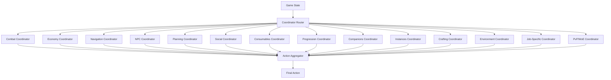

# Coordinator Specifications

**Version:** 1.0  
**Date:** 2026-02-05  
**Status:** Final Specification

---

## Table of Contents

1. [Overview](#1-overview)
2. [Combat Coordinator](#2-combat-coordinator)
3. [Economy Coordinator](#3-economy-coordinator)
4. [Navigation Coordinator](#4-navigation-coordinator)
5. [NPC Interaction Coordinator](#5-npc-interaction-coordinator)
6. [Planning Coordinator](#6-planning-coordinator)
7. [Social Coordinator](#7-social-coordinator)
8. [Consumables Coordinator](#8-consumables-coordinator)
9. [Progression Coordinator](#9-progression-coordinator)
10. [Companions Coordinator](#10-companions-coordinator)
11. [Instances Coordinator](#11-instances-coordinator)
12. [Crafting Coordinator](#12-crafting-coordinator)
13. [Environment Coordinator](#13-environment-coordinator)
14. [Job-Specific Coordinator](#14-job-specific-coordinator)
15. [PvP/WoE Coordinator](#15-pvpwoe-coordinator)

---

## 1. Overview

### 1.1 Coordinator Architecture

Each coordinator is a specialized decision-making component responsible for a specific aspect of gameplay. Coordinators work together to provide comprehensive AI coverage.

```cpp
class Coordinator {
public:
    virtual std::string getName() const = 0;
    virtual std::string getCategory() const = 0;
    
    // Can this coordinator handle this state?
    virtual bool canHandle(const GameState& state) const = 0;
    
    // Generate action recommendations
    virtual std::vector<ActionRecommendation> recommend(
        const GameState& state) const = 0;
    
    // Priority of this coordinator's decisions
    virtual int getPriority() const = 0;
    
    virtual ~Coordinator() = default;
};

struct ActionRecommendation {
    Action action;
    float priority;
    float confidence;
    std::string reasoning;
};
```

### 1.2 Coordinator Interaction



---

## 2. Combat Coordinator

### 2.1 Responsibility

Manages all combat-related decisions including targeting, skill usage, positioning, and threat management.

### 2.2 Input Requirements

```cpp
struct CombatInput {
    // Character state
    CharacterState character;
    
    // Enemies
    std::vector<Monster> monsters;
    bool in_combat;
    std::optional<uint32_t> current_target_id;
    
    // Resources
    std::unordered_map<std::string, SkillInfo> available_skills;
    std::vector<std::string> combat_items;
    
    // Environment
    Position current_position;
    std::vector<Position> danger_zones;  // AoE areas
};
```

### 2.3 Decision Logic

```cpp
class CombatCoordinator : public Coordinator {
public:
    std::vector<ActionRecommendation> recommend(
        const GameState& state) const override;
    
private:
    // Target selection
    std::optional<MonsterId> selectTarget(const GameState& state) const;
    
    // Skill rotation
    std::optional<Action> determineSkillUsage(
        const GameState& state, 
        const Monster& target) const;
    
    // Positioning
    std::optional<Action> determinePo sitioning(
        const GameState& state) const;
    
    // Emergency actions
    std::optional<Action> checkEmergency(const GameState& state) const;
};

std::vector<ActionRecommendation> CombatCoordinator::recommend(
    const GameState& state) const {
    
    std::vector<ActionRecommendation> recommendations;
    
    // 1. Check for emergency situations
    if (auto emergency = checkEmergency(state)) {
        recommendations.push_back({
            .action = *emergency,
            .priority = 100.0f,
            .confidence = 1.0f,
            .reasoning = "Emergency action required"
        });
        return recommendations;
    }
    
    // 2. Check if in combat
    if (!state.isInCombat()) {
        return recommendations;
    }
    
    // 3. Select target
    auto target_id = selectTarget(state);
    if (!target_id) {
        return recommendations;
    }
    
    auto target = state.getMonsterById(*target_id);
    if (!target) {
        return recommendations;
    }
    
    // 4. Determine skill usage
    if (auto skill_action = determineSkillUsage(state, *target)) {
        recommendations.push_back({
            .action = *skill_action,
            .priority = 80.0f,
            .confidence = 0.85f,
            .reasoning = "Optimal skill for current target"
        });
    }
    
    // 5. Check positioning
    if (auto positioning = determinePositioning(state)) {
        recommendations.push_back({
            .action = *positioning,
            .priority = 60.0f,
            .confidence = 0.75f,
            .reasoning = "Maintain optimal combat distance"
        });
    }
    
    // 6. Basic attack as fallback
    recommendations.push_back({
        .action = Action::Attack(*target_id),
        .priority = 50.0f,
        .confidence = 0.9f,
        .reasoning = "Basic attack on target"
    });
    
    return recommendations;
}
```

### 2.4 Target Selection Algorithm

```cpp
std::optional<MonsterId> CombatCoordinator::selectTarget(
    const GameState& state) const {
    
    if (state.monsters.empty()) {
        return std::nullopt;
    }
    
    // Scoring factors
    struct TargetScore {
        MonsterId id;
        float score;
    };
    
    std::vector<TargetScore> scored_targets;
    
    for (const auto& monster : state.monsters) {
        float score = 0.0f;
        
        // Distance (closer is better)
        score += (20.0f - monster.distance_to_player) * 5.0f;
        
        // Threat level (higher threat = higher priority)
        score += monster.threat_level * 10.0f;
        
        // Already attacking me (highest priority)
        if (monster.is_attacking_me) {
            score += 50.0f;
        }
        
        // Current target (maintain focus)
        if (state.current_target_id == monster.id) {
            score += 30.0f;
        }
        
        // Low HP (finish off)
        if (monster.hp_percent < 30.0f) {
            score += 20.0f;
        }
        
        // Boss/MVP (special handling)
        if (monster.is_boss || monster.is_mvp) {
            score += 15.0f;
        }
        
        scored_targets.push_back({monster.id, score});
    }
    
    // Select highest scoring target
    auto best = std::max_element(scored_targets.begin(), scored_targets.end(),
        [](const TargetScore& a, const TargetScore& b) {
            return a.score < b.score;
        });
    
    return best->id;
}
```

### 2.5 Configuration

```json
{
  "combat_coordinator": {
    "targeting": {
      "priority": "threat_based",
      "focus_current_target": true,
      "finish_low_hp": true,
      "max_target_distance": 20
    },
    "skills": {
      "rotation_mode": "adaptive",
      "sp_conservation": 0.3,
      "aoe_threshold": 3
    },
    "positioning": {
      "maintain_distance": true,
      "melee_range": 2.0,
      "ranged_range": 10.0,
      "flee_on_overwhelm": true
    },
    "emergency": {
      "teleport_hp_threshold": 20,
      "teleport_monster_count": 8,
      "emergency_heal_threshold": 30
    }
  }
}
```

---

## 3. Economy Coordinator

### 3.1 Responsibility

Manages economic decisions including looting, selling, buying, storage management, and resource optimization.

### 3.2 Input Requirements

```cpp
struct EconomyInput {
    // Inventory
    std::vector<InventoryItem> inventory;
    Percentage weight_percent;
    uint64_t zeny;
    
    // Items on ground
    std::vector<ItemOnGround> nearby_items;
    
    // Market data (if available)
    std::unordered_map<ItemId, uint32_t> market_prices;
    
    // Storage status
    bool storage_available;
    std::vector<Item> storage_items;
};
```

### 3.3 Decision Logic

```cpp
class EconomyCoordinator : public Coordinator {
public:
    std::vector<ActionRecommendation> recommend(
        const GameState& state) const override;
    
private:
    // Loot decisions
    std::vector<ItemOnGround> prioritizeLoot(
        const std::vector<ItemOnGround>& items) const;
    
    // Inventory management
    std::optional<Action> manageInventory(const GameState& state) const;
    
    // Selling strategy
    std::vector<ItemId> determineItemsToSell(
        const std::vector<InventoryItem>& inventory) const;
    
    // Value calculation
    float calculateItemValue(const Item& item) const;
};

std::vector<ItemOnGround> EconomyCoordinator::prioritizeLoot(
    const std::vector<ItemOnGround>& items) const {
    
    struct ScoredItem {
        ItemOnGround item;
        float score;
    };
    
    std::vector<ScoredItem> scored;
    
    for (const auto& item : items) {
        float score = 0.0f;
        
        // Base value
        float value = calculateItemValue(item);
        score += value * 10.0f;
        
        // Distance (closer is better)
        score += (30.0f - item.distance_to_player) * 2.0f;
        
        // Rarity
        if (item.estimated_value == ItemValue::RARE) {
            score += 50.0f;
        } else if (item.estimated_value == ItemValue::HIGH) {
            score += 30.0f;
        }
        
        // Quest items
        if (isQuestItem(item)) {
            score += 40.0f;
        }
        
        // Expiring soon
        if (item.isExpiring()) {
            score += 20.0f;
        }
        
        scored.push_back({item, score});
    }
    
    // Sort by score
    std::sort(scored.begin(), scored.end(),
        [](const ScoredItem& a, const ScoredItem& b) {
            return a.score > b.score;
        });
    
    // Return prioritized list
    std::vector<ItemOnGround> result;
    for (const auto& s : scored) {
        result.push_back(s.item);
    }
    
    return result;
}
```

### 3.4 Configuration

```json
{
  "economy_coordinator": {
    "loot_priority": [
      "quest_items",
      "rare_items",
      "high_value_items",
      "consumables",
      "crafting_materials"
    ],
    "auto_loot": true,
    "loot_distance_max": 15,
    "weight_management": {
      "storage_threshold": 80,
      "sell_threshold": 85,
      "emergency_threshold": 95
    },
    "selling_strategy": {
      "min_value": 1000,
      "keep_consumables": true,
      "keep_equipment_upgrades": true
    }
  }
}
```

---

## 4. Navigation Coordinator

### 4.1 Responsibility

Handles all movement decisions including pathfinding, map transitions, waypoint navigation, and obstacle avoidance.

### 4.2 Input Requirements

```cpp
struct NavigationInput {
    Position current_position;
    std::optional<Position> destination;
    MapInfo current_map;
    std::vector<Position> obstacles;
    std::vector<Portal> portals;
    bool in_combat;
};
```

### 4.3 Decision Logic

```cpp
class NavigationCoordinator : public Coordinator {
public:
    std::vector<ActionRecommendation> recommend(
        const GameState& state) const override;
    
private:
    // Pathfinding
    std::vector<Position> findPath(
        const Position& start,
        const Position& goal,
        const MapInfo& map) const;
    
    // Portal navigation
    std::optional<Action> navigateToMap(
        const std::string& target_map,
        const GameState& state) const;
    
    // Obstacle avoidance
    Position adjustForObstacles(
        const Position& target,
        const std::vector<Position>& obstacles) const;
};

std::vector<Position> NavigationCoordinator::findPath(
    const Position& start,
    const Position& goal,
    const MapInfo& map) const {
    
    // A* pathfinding algorithm
    struct Node {
        Position pos;
        float g_score;  // Cost from start
        float h_score;  // Heuristic to goal
        float f_score;  // g + h
        std::optional<Position> parent;
    };
    
    auto heuristic = [](const Position& a, const Position& b) {
        return a.distance(b);
    };
    
    std::vector<Node> open_set;
    std::unordered_set<Position> closed_set;
    
    open_set.push_back({
        .pos = start,
        .g_score = 0.0f,
        .h_score = heuristic(start, goal),
        .f_score = heuristic(start, goal),
        .parent = std::nullopt
    });
    
    while (!open_set.empty()) {
        // Get node with lowest f_score
        auto current_it = std::min_element(open_set.begin(), open_set.end(),
            [](const Node& a, const Node& b) { return a.f_score < b.f_score; });
        
        Node current = *current_it;
        open_set.erase(current_it);
        
        // Goal reached
        if (current.pos.distance(goal) < 2.0f) {
            return reconstructPath(current);
        }
        
        closed_set.insert(current.pos);
        
        // Explore neighbors
        for (const auto& neighbor_pos : getNeighbors(current.pos, map)) {
            if (closed_set.count(neighbor_pos)) continue;
            
            float tentative_g = current.g_score + current.pos.distance(neighbor_pos);
            
            // Add to open set
            open_set.push_back({
                .pos = neighbor_pos,
                .g_score = tentative_g,
                .h_score = heuristic(neighbor_pos, goal),
                .f_score = tentative_g + heuristic(neighbor_pos, goal),
                .parent = current.pos
            });
        }
    }
    
    // No path found
    return {};
}
```

### 4.4 Configuration

```json
{
  "navigation_coordinator": {
    "pathfinding": {
      "algorithm": "a_star",
      "max_path_length": 100,
      "obstacle_padding": 2
    },
    "movement": {
      "run_when_possible": true,
      "avoid_players": false,
      "avoid_monsters": true,
      "avoid_pvp_zones": true
    },
    "portals": {
      "auto_use": true,
      "preferred_routes": {}
    }
  }
}
```

---

## 5. NPC Interaction Coordinator

### 5.1 Responsibility

Manages all NPC interactions including conversations, quests, shops, and services.

### 5.2 Input Requirements

```cpp
struct NPCInput {
    std::vector<NPC> nearby_npcs;
    std::vector<Quest> active_quests;
    std::vector<Quest> available_quests;
    Position current_position;
};
```

### 5.3 Decision Logic

```cpp
class NPCCoordinator : public Coordinator {
public:
    std::vector<ActionRecommendation> recommend(
        const GameState& state) const override;
    
private:
    // Quest management
    std::optional<Action> handleQuests(const GameState& state) const;
    
    // Shop interactions
    std::optional<Action> handleShop(const GameState& state) const;
    
    // Service NPCs (storage, kafra, etc.)
    std::optional<Action> handleServices(const GameState& state) const;
};

std::optional<Action> NPCCoordinator::handleQuests(
    const GameState& state) const {
    
    // Priority: Turn in completed quests
    for (const auto& quest : state.active_quests) {
        if (quest.isComplete() && quest.canTurnIn(state.current_position)) {
            return Action::TalkNPC(
                quest.turn_in_npc,
                generateQuestTurnInSequence(quest)
            );
        }
    }
    
    // Accept new quests
    for (const auto& quest : state.available_quests) {
        if (shouldAcceptQuest(quest, state)) {
            return Action::TalkNPC(
                quest.start_npc,
                generateQuestAcceptSequence(quest)
            );
        }
    }
    
    return std::nullopt;
}
```

### 5.4 Configuration

```json
{
  "npc_coordinator": {
    "quests": {
      "auto_accept": true,
      "level_range": 10,
      "priority_types": ["main", "job", "daily"]
    },
    "shops": {
      "auto_sell_junk": true,
      "auto_buy_consumables": true,
      "consumable_stock_min": 50
    },
    "services": {
      "use_storage": true,
      "use_kafra_services": true,
      "prefer_warper": true
    }
  }
}
```

---

## 6. Planning Coordinator

### 6.1 Responsibility

High-level strategic planning including goal setting, session management, and long-term objectives.

### 6.2 Decision Logic

```cpp
class PlanningCoordinator : public Coordinator {
public:
    std::vector<ActionRecommendation> recommend(
        const GameState& state) const override;
    
    // Goal management
    void setGoal(const Goal& goal);
    std::optional<Goal> getCurrentGoal() const;
    
private:
    std::optional<Goal> current_goal_;
    std::unique_ptr<StrategyPlanner> planner_;
    
    // Break down high-level goals into actions
    std::vector<Action> planActions(const Goal& goal, const GameState& state) const;
};
```

### 6.3 Configuration

```json
{
  "planning_coordinator": {
    "goals": {
      "default_goal": "level_up",
      "goal_priority": ["quest", "level_up", "farm", "explore"]
    },
    "session_management": {
      "max_session_hours": 8,
      "break_interval_hours": 2,
      "break_duration_minutes": 10
    }
  }
}
```

---

## 7-14. Additional Coordinators (Summary)

### 7. Social Coordinator
**Responsibility**: Party management, guild activities, friend interactions, chat responses

**Key Features**:
- Party formation and maintenance
- Guild event participation
- Friend list management
- Automated chat responses

---

### 8. Consumables Coordinator
**Responsibility**: Potion usage, buff items, food consumption, resource management

**Key Features**:
- Auto-healing (HP/SP)
- Buff item usage
- Food consumption for bonuses
- Emergency item usage

---

### 9. Progression Coordinator
**Responsibility**: Leveling strategy, stat allocation, skill learning, equipment upgrades

**Key Features**:
- Optimal leveling zones
- Stat distribution
- Skill prioritization
- Equipment progression path

---

### 10. Companions Coordinator
**Responsibility**: Homunculus, Mercenary, Pet management

**Key Features**:
- Companion feeding and care
- Companion skill usage
- Companion positioning
- Evolution decisions

---

### 11. Instances Coordinator
**Responsibility**: Instance dungeons, party instances, raid coordination

**Key Features**:
- Instance entry management
- Boss fight strategies
- Loot distribution
- Instance completion optimization

---

### 12. Crafting Coordinator
**Responsibility**: Item crafting, enchanting, refining, upgrading

**Key Features**:
- Resource gathering for crafts
- Optimal crafting sequences
- Enchantment strategies
- Refining risk management

---

### 13. Environment Coordinator
**Responsibility**: Weather effects, time-of-day bonuses, map hazards

**Key Features**:
- Weather-based decisions
- Time-sensitive activities
- Hazard avoidance
- Environmental buffs

---

### 14. Job-Specific Coordinator
**Responsibility**: Class-specific mechanics and strategies

**Key Features**:
- Wizard: Spell combinations, elemental mastery
- Priest: Healing priority, support optimization
- Knight: Tank positioning, aggro management
- Assassin: Stealth usage, critical optimization

---

### 15. PvP/WoE Coordinator
**Responsibility**: Player vs Player combat, War of Emperium strategies

**Key Features**:
- PvP combat tactics
- WoE positioning
- Guild coordination
- Equipment swapping for PvP

---

## 16. Coordinator Integration

### 16.1 Coordinator Router

```cpp
class CoordinatorRouter {
public:
    void registerCoordinator(std::unique_ptr<Coordinator> coordinator);
    
    std::vector<ActionRecommendation> getAllRecommendations(
        const GameState& state) const;
    
    Action selectBestAction(const GameState& state) const;
    
private:
    std::vector<std::unique_ptr<Coordinator>> coordinators_;
    
    Action aggregateRecommendations(
        const std::vector<ActionRecommendation>& recommendations) const;
};

Action CoordinatorRouter::selectBestAction(const GameState& state) const {
    // Get recommendations from all coordinators
    auto recommendations = getAllRecommendations(state);
    
    if (recommendations.empty()) {
        return Action::NoAction();
    }
    
    // Select based on priority and confidence
    auto best = std::max_element(recommendations.begin(), recommendations.end(),
        [](const ActionRecommendation& a, const ActionRecommendation& b) {
            return (a.priority * a.confidence) < (b.priority * b.confidence);
        });
    
    return best->action;
}
```

---

**Next Document**: [Integration Guide](06-integration-guide.md)
