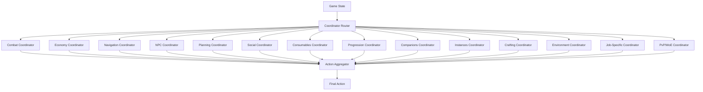

# Coordinator Specifications

**Version:** 1.1
**Date:** 2026-02-05
**Status:** Final Specification
**Update:** Expanded Social Coordinator with human-like chat, reputation system, all interaction types

---

## Table of Contents

1. [Overview](#1-overview)
2. [Combat Coordinator](#2-combat-coordinator)
3. [Economy Coordinator](#3-economy-coordinator)
4. [Navigation Coordinator](#4-navigation-coordinator)
5. [NPC Interaction Coordinator](#5-npc-interaction-coordinator)
6. [Planning Coordinator](#6-planning-coordinator)
7. [Social Coordinator](#7-social-coordinator)
8. [Consumables Coordinator](#8-consumables-coordinator)
9. [Progression Coordinator](#9-progression-coordinator)
10. [Companions Coordinator](#10-companions-coordinator)
11. [Instances Coordinator](#11-instances-coordinator)
12. [Crafting Coordinator](#12-crafting-coordinator)
13. [Environment Coordinator](#13-environment-coordinator)
14. [Job-Specific Coordinator](#14-job-specific-coordinator)
15. [PvP/WoE Coordinator](#15-pvpwoe-coordinator)

---

## 1. Overview

### 1.1 Coordinator Architecture

Each coordinator is a specialized decision-making component responsible for a specific aspect of gameplay. Coordinators work together to provide comprehensive AI coverage.

```cpp
class Coordinator {
public:
    virtual std::string getName() const = 0;
    virtual std::string getCategory() const = 0;
    
    // Can this coordinator handle this state?
    virtual bool canHandle(const GameState& state) const = 0;
    
    // Generate action recommendations
    virtual std::vector<ActionRecommendation> recommend(
        const GameState& state) const = 0;
    
    // Priority of this coordinator's decisions
    virtual int getPriority() const = 0;
    
    virtual ~Coordinator() = default;
};

struct ActionRecommendation {
    Action action;
    float priority;
    float confidence;
    std::string reasoning;
};
```

### 1.2 Coordinator Interaction



---

## 2. Combat Coordinator

### 2.1 Responsibility

Manages all combat-related decisions including targeting, skill usage, positioning, and threat management.

### 2.2 Input Requirements

```cpp
struct CombatInput {
    // Character state
    CharacterState character;
    
    // Enemies
    std::vector<Monster> monsters;
    bool in_combat;
    std::optional<uint32_t> current_target_id;
    
    // Resources
    std::unordered_map<std::string, SkillInfo> available_skills;
    std::vector<std::string> combat_items;
    
    // Environment
    Position current_position;
    std::vector<Position> danger_zones;  // AoE areas
};
```

### 2.3 Decision Logic

```cpp
class CombatCoordinator : public Coordinator {
public:
    std::vector<ActionRecommendation> recommend(
        const GameState& state) const override;
    
private:
    // Target selection
    std::optional<MonsterId> selectTarget(const GameState& state) const;
    
    // Skill rotation
    std::optional<Action> determineSkillUsage(
        const GameState& state, 
        const Monster& target) const;
    
    // Positioning
    std::optional<Action> determinePo sitioning(
        const GameState& state) const;
    
    // Emergency actions
    std::optional<Action> checkEmergency(const GameState& state) const;
};

std::vector<ActionRecommendation> CombatCoordinator::recommend(
    const GameState& state) const {
    
    std::vector<ActionRecommendation> recommendations;
    
    // 1. Check for emergency situations
    if (auto emergency = checkEmergency(state)) {
        recommendations.push_back({
            .action = *emergency,
            .priority = 100.0f,
            .confidence = 1.0f,
            .reasoning = "Emergency action required"
        });
        return recommendations;
    }
    
    // 2. Check if in combat
    if (!state.isInCombat()) {
        return recommendations;
    }
    
    // 3. Select target
    auto target_id = selectTarget(state);
    if (!target_id) {
        return recommendations;
    }
    
    auto target = state.getMonsterById(*target_id);
    if (!target) {
        return recommendations;
    }
    
    // 4. Determine skill usage
    if (auto skill_action = determineSkillUsage(state, *target)) {
        recommendations.push_back({
            .action = *skill_action,
            .priority = 80.0f,
            .confidence = 0.85f,
            .reasoning = "Optimal skill for current target"
        });
    }
    
    // 5. Check positioning
    if (auto positioning = determinePositioning(state)) {
        recommendations.push_back({
            .action = *positioning,
            .priority = 60.0f,
            .confidence = 0.75f,
            .reasoning = "Maintain optimal combat distance"
        });
    }
    
    // 6. Basic attack as fallback
    recommendations.push_back({
        .action = Action::Attack(*target_id),
        .priority = 50.0f,
        .confidence = 0.9f,
        .reasoning = "Basic attack on target"
    });
    
    return recommendations;
}
```

### 2.4 Target Selection Algorithm

```cpp
std::optional<MonsterId> CombatCoordinator::selectTarget(
    const GameState& state) const {
    
    if (state.monsters.empty()) {
        return std::nullopt;
    }
    
    // Scoring factors
    struct TargetScore {
        MonsterId id;
        float score;
    };
    
    std::vector<TargetScore> scored_targets;
    
    for (const auto& monster : state.monsters) {
        float score = 0.0f;
        
        // Distance (closer is better)
        score += (20.0f - monster.distance_to_player) * 5.0f;
        
        // Threat level (higher threat = higher priority)
        score += monster.threat_level * 10.0f;
        
        // Already attacking me (highest priority)
        if (monster.is_attacking_me) {
            score += 50.0f;
        }
        
        // Current target (maintain focus)
        if (state.current_target_id == monster.id) {
            score += 30.0f;
        }
        
        // Low HP (finish off)
        if (monster.hp_percent < 30.0f) {
            score += 20.0f;
        }
        
        // Boss/MVP (special handling)
        if (monster.is_boss || monster.is_mvp) {
            score += 15.0f;
        }
        
        scored_targets.push_back({monster.id, score});
    }
    
    // Select highest scoring target
    auto best = std::max_element(scored_targets.begin(), scored_targets.end(),
        [](const TargetScore& a, const TargetScore& b) {
            return a.score < b.score;
        });
    
    return best->id;
}
```

### 2.5 Configuration

```json
{
  "combat_coordinator": {
    "targeting": {
      "priority": "threat_based",
      "focus_current_target": true,
      "finish_low_hp": true,
      "max_target_distance": 20
    },
    "skills": {
      "rotation_mode": "adaptive",
      "sp_conservation": 0.3,
      "aoe_threshold": 3
    },
    "positioning": {
      "maintain_distance": true,
      "melee_range": 2.0,
      "ranged_range": 10.0,
      "flee_on_overwhelm": true
    },
    "emergency": {
      "teleport_hp_threshold": 20,
      "teleport_monster_count": 8,
      "emergency_heal_threshold": 30
    }
  }
}
```

---

## 3. Economy Coordinator

### 3.1 Responsibility

Manages economic decisions including looting, selling, buying, storage management, and resource optimization.

### 3.2 Input Requirements

```cpp
struct EconomyInput {
    // Inventory
    std::vector<InventoryItem> inventory;
    Percentage weight_percent;
    uint64_t zeny;
    
    // Items on ground
    std::vector<ItemOnGround> nearby_items;
    
    // Market data (if available)
    std::unordered_map<ItemId, uint32_t> market_prices;
    
    // Storage status
    bool storage_available;
    std::vector<Item> storage_items;
};
```

### 3.3 Decision Logic

```cpp
class EconomyCoordinator : public Coordinator {
public:
    std::vector<ActionRecommendation> recommend(
        const GameState& state) const override;
    
private:
    // Loot decisions
    std::vector<ItemOnGround> prioritizeLoot(
        const std::vector<ItemOnGround>& items) const;
    
    // Inventory management
    std::optional<Action> manageInventory(const GameState& state) const;
    
    // Selling strategy
    std::vector<ItemId> determineItemsToSell(
        const std::vector<InventoryItem>& inventory) const;
    
    // Value calculation
    float calculateItemValue(const Item& item) const;
};

std::vector<ItemOnGround> EconomyCoordinator::prioritizeLoot(
    const std::vector<ItemOnGround>& items) const {
    
    struct ScoredItem {
        ItemOnGround item;
        float score;
    };
    
    std::vector<ScoredItem> scored;
    
    for (const auto& item : items) {
        float score = 0.0f;
        
        // Base value
        float value = calculateItemValue(item);
        score += value * 10.0f;
        
        // Distance (closer is better)
        score += (30.0f - item.distance_to_player) * 2.0f;
        
        // Rarity
        if (item.estimated_value == ItemValue::RARE) {
            score += 50.0f;
        } else if (item.estimated_value == ItemValue::HIGH) {
            score += 30.0f;
        }
        
        // Quest items
        if (isQuestItem(item)) {
            score += 40.0f;
        }
        
        // Expiring soon
        if (item.isExpiring()) {
            score += 20.0f;
        }
        
        scored.push_back({item, score});
    }
    
    // Sort by score
    std::sort(scored.begin(), scored.end(),
        [](const ScoredItem& a, const ScoredItem& b) {
            return a.score > b.score;
        });
    
    // Return prioritized list
    std::vector<ItemOnGround> result;
    for (const auto& s : scored) {
        result.push_back(s.item);
    }
    
    return result;
}
```

### 3.4 Configuration

```json
{
  "economy_coordinator": {
    "loot_priority": [
      "quest_items",
      "rare_items",
      "high_value_items",
      "consumables",
      "crafting_materials"
    ],
    "auto_loot": true,
    "loot_distance_max": 15,
    "weight_management": {
      "storage_threshold": 80,
      "sell_threshold": 85,
      "emergency_threshold": 95
    },
    "selling_strategy": {
      "min_value": 1000,
      "keep_consumables": true,
      "keep_equipment_upgrades": true
    }
  }
}
```

---

## 4. Navigation Coordinator

### 4.1 Responsibility

Handles all movement decisions including pathfinding, map transitions, waypoint navigation, and obstacle avoidance.

### 4.2 Input Requirements

```cpp
struct NavigationInput {
    Position current_position;
    std::optional<Position> destination;
    MapInfo current_map;
    std::vector<Position> obstacles;
    std::vector<Portal> portals;
    bool in_combat;
};
```

### 4.3 Decision Logic

```cpp
class NavigationCoordinator : public Coordinator {
public:
    std::vector<ActionRecommendation> recommend(
        const GameState& state) const override;
    
private:
    // Pathfinding
    std::vector<Position> findPath(
        const Position& start,
        const Position& goal,
        const MapInfo& map) const;
    
    // Portal navigation
    std::optional<Action> navigateToMap(
        const std::string& target_map,
        const GameState& state) const;
    
    // Obstacle avoidance
    Position adjustForObstacles(
        const Position& target,
        const std::vector<Position>& obstacles) const;
};

std::vector<Position> NavigationCoordinator::findPath(
    const Position& start,
    const Position& goal,
    const MapInfo& map) const {
    
    // A* pathfinding algorithm
    struct Node {
        Position pos;
        float g_score;  // Cost from start
        float h_score;  // Heuristic to goal
        float f_score;  // g + h
        std::optional<Position> parent;
    };
    
    auto heuristic = [](const Position& a, const Position& b) {
        return a.distance(b);
    };
    
    std::vector<Node> open_set;
    std::unordered_set<Position> closed_set;
    
    open_set.push_back({
        .pos = start,
        .g_score = 0.0f,
        .h_score = heuristic(start, goal),
        .f_score = heuristic(start, goal),
        .parent = std::nullopt
    });
    
    while (!open_set.empty()) {
        // Get node with lowest f_score
        auto current_it = std::min_element(open_set.begin(), open_set.end(),
            [](const Node& a, const Node& b) { return a.f_score < b.f_score; });
        
        Node current = *current_it;
        open_set.erase(current_it);
        
        // Goal reached
        if (current.pos.distance(goal) < 2.0f) {
            return reconstructPath(current);
        }
        
        closed_set.insert(current.pos);
        
        // Explore neighbors
        for (const auto& neighbor_pos : getNeighbors(current.pos, map)) {
            if (closed_set.count(neighbor_pos)) continue;
            
            float tentative_g = current.g_score + current.pos.distance(neighbor_pos);
            
            // Add to open set
            open_set.push_back({
                .pos = neighbor_pos,
                .g_score = tentative_g,
                .h_score = heuristic(neighbor_pos, goal),
                .f_score = tentative_g + heuristic(neighbor_pos, goal),
                .parent = current.pos
            });
        }
    }
    
    // No path found
    return {};
}
```

### 4.4 Configuration

```json
{
  "navigation_coordinator": {
    "pathfinding": {
      "algorithm": "a_star",
      "max_path_length": 100,
      "obstacle_padding": 2
    },
    "movement": {
      "run_when_possible": true,
      "avoid_players": false,
      "avoid_monsters": true,
      "avoid_pvp_zones": true
    },
    "portals": {
      "auto_use": true,
      "preferred_routes": {}
    }
  }
}
```

---

## 5. NPC Interaction Coordinator

### 5.1 Responsibility

Manages all NPC interactions including conversations, quests, shops, and services.

### 5.2 Input Requirements

```cpp
struct NPCInput {
    std::vector<NPC> nearby_npcs;
    std::vector<Quest> active_quests;
    std::vector<Quest> available_quests;
    Position current_position;
};
```

### 5.3 Decision Logic

```cpp
class NPCCoordinator : public Coordinator {
public:
    std::vector<ActionRecommendation> recommend(
        const GameState& state) const override;
    
private:
    // Quest management
    std::optional<Action> handleQuests(const GameState& state) const;
    
    // Shop interactions
    std::optional<Action> handleShop(const GameState& state) const;
    
    // Service NPCs (storage, kafra, etc.)
    std::optional<Action> handleServices(const GameState& state) const;
};

std::optional<Action> NPCCoordinator::handleQuests(
    const GameState& state) const {
    
    // Priority: Turn in completed quests
    for (const auto& quest : state.active_quests) {
        if (quest.isComplete() && quest.canTurnIn(state.current_position)) {
            return Action::TalkNPC(
                quest.turn_in_npc,
                generateQuestTurnInSequence(quest)
            );
        }
    }
    
    // Accept new quests
    for (const auto& quest : state.available_quests) {
        if (shouldAcceptQuest(quest, state)) {
            return Action::TalkNPC(
                quest.start_npc,
                generateQuestAcceptSequence(quest)
            );
        }
    }
    
    return std::nullopt;
}
```

### 5.4 Configuration

```json
{
  "npc_coordinator": {
    "quests": {
      "auto_accept": true,
      "level_range": 10,
      "priority_types": ["main", "job", "daily"]
    },
    "shops": {
      "auto_sell_junk": true,
      "auto_buy_consumables": true,
      "consumable_stock_min": 50
    },
    "services": {
      "use_storage": true,
      "use_kafra_services": true,
      "prefer_warper": true
    }
  }
}
```

---

## 6. Planning Coordinator

### 6.1 Responsibility

High-level strategic planning including goal setting, session management, and long-term objectives.

### 6.2 Decision Logic

```cpp
class PlanningCoordinator : public Coordinator {
public:
    std::vector<ActionRecommendation> recommend(
        const GameState& state) const override;
    
    // Goal management
    void setGoal(const Goal& goal);
    std::optional<Goal> getCurrentGoal() const;
    
private:
    std::optional<Goal> current_goal_;
    std::unique_ptr<StrategyPlanner> planner_;
    
    // Break down high-level goals into actions
    std::vector<Action> planActions(const Goal& goal, const GameState& state) const;
};
```

### 6.3 Configuration

```json
{
  "planning_coordinator": {
    "goals": {
      "default_goal": "level_up",
      "goal_priority": ["quest", "level_up", "farm", "explore"]
    },
    "session_management": {
      "max_session_hours": 8,
      "break_interval_hours": 2,
      "break_duration_minutes": 10
    }
  }
}
```

---

## 7-14. Additional Coordinators (Summary)

### 7. Social Coordinator

**Responsibility**: Complete social interaction management including human-like chat, party/guild coordination, trade evaluation, buff management, and player reputation tracking

**Full Specification**: See [`09-social-interaction-system.md`](09-social-interaction-system.md) for complete details

### 7.1 Expanded Responsibility

The Social Coordinator handles all player-to-player interactions with human-like behavior:

**Interaction Categories:**
1. **Chat Interactions** - Whispers, party chat, guild chat, public chat with LLM-generated responses
2. **Buff Interactions** - Accept buffs, reciprocate, thank players, request buffs
3. **Trade Interactions** - Evaluate trades, detect scams, negotiate prices, track history
4. **Party Interactions** - Manage invites, coordinate in party, support members
5. **Guild Interactions** - Participate in guild chat, WoE coordination, resource sharing
6. **Duel Interactions** - Evaluate duel requests, accept friendly duels
7. **Other Interactions** - Friend requests, marriage system, event invites

### 7.2 Input Requirements

```cpp
struct SocialCoordinatorInput {
    GameState game_state;
    
    struct SocialEvents {
        std::vector<ChatMessage> incoming_chats;
        std::vector<BuffOffer> incoming_buffs;
        std::vector<TradeRequest> trade_requests;
        std::vector<PartyInvite> party_invites;
        std::vector<DuelRequest> duel_requests;
        std::vector<FriendRequest> friend_requests;
    } events;
    
    std::optional<InteractionRequest> pending_interaction;
};
```

### 7.3 Human-Like Chat System

**Natural Language Generation:**
- Uses DeepSeek LLM for cost-effective chat generation
- Personality-driven responses (friendly, professional, casual, sarcastic, shy)
- Context-aware using OpenMemory conversation history
- Emotional state integration (happy, frustrated, excited, neutral)

**Authenticity Features:**
- Typing delays (500ms - 5000ms based on message length)
- Typo injection (3% rate, configurable)
- Slang and abbreviations ("ty", "gg", "brb", "lol")
- Emoji usage (15% of messages)
- Response time variation

```cpp
class ChatGenerator {
public:
    std::optional<std::string> generateResponse(
        const std::string& incoming_message,
        const ChatContext& context,
        const PersonalityConfig& personality
    ) {
        // Build LLM prompt with personality and context
        std::string prompt = buildChatPrompt(context, incoming_message, personality);
        
        // Query DeepSeek
        auto llm_response = llm_client_->query(prompt, {
            .max_tokens = 100,
            .temperature = personality.traits.chattiness,
            .timeout_seconds = 10
        });
        
        if (!llm_response) {
            return std::nullopt;
        }
        
        // Post-process (add slang, emojis, typos)
        std::string message = postProcess(llm_response->content, personality);
        
        return message;
    }
    
private:
    std::shared_ptr<LLMClient> llm_client_;
    std::unique_ptr<TypoInjector> typo_injector_;
    std::unique_ptr<LanguageStyler> styler_;
};
```

### 7.4 Player Reputation System

**6-Tier Reputation System:**
- **Blocked** (-100 to -51): Scammers, griefers - auto-reject all interactions
- **Suspicious** (-50 to -10): Red flags detected - limited interactions
- **Neutral** (-9 to 24): Default for strangers - standard policies apply
- **Acquaintance** (25 to 49): Positive interactions - more lenient
- **Friendly** (50 to 74): Proven positive - accept most interactions
- **Trusted** (75 to 99): Guild/proven friends - accept all safe interactions
- **Whitelisted** (100): Owner's alts - accept everything

```cpp
class ReputationManager {
public:
    void adjustReputation(uint32_t player_id, int32_t delta, const std::string& reason) {
        auto& rep = getReputation(player_id);
        rep.reputation_score = std::clamp(rep.reputation_score + delta, -100, 100);
        rep.tier = calculateTier(rep.reputation_score);
        
        db_->updateReputation(rep);
        log_info("Reputation: {} {} -> {} ({})",
                rep.player_name, rep.reputation_score - delta, rep.reputation_score, reason);
    }
    
    PlayerReputation getReputation(uint32_t player_id);
    bool shouldInteract(uint32_t player_id, InteractionType type);
};
```

**Automatic Reputation Adjustments:**
- Gave helpful buff: +2
- Fair trade completed: +5
- Attempted scam: -30
- Spam messages: -5
- Party cooperation: +3
- Harassment: -15

### 7.5 Interaction Type Handlers

#### 7.5.1 Chat Handler

```cpp
void SocialCoordinator::handleChatMessage(
    const Player& sender,
    const std::string& message,
    ChatChannel channel) {
    
    // Get reputation
    auto reputation = reputation_mgr_->getReputation(sender.id);
    
    // Check if should respond
    if (!shouldRespondToChat(sender, message, channel, reputation)) {
        return;
    }
    
    // Get chat context from OpenMemory
    auto context = getChatContext(sender.id, channel);
    
    // Generate response using LLM
    auto response = chat_generator_->generateResponse(message, context, personality_);
    
    if (response) {
        // Calculate realistic delay
        uint32_t delay_ms = calculateTypingDelay(response->length());
        
        // Schedule response
        std::this_thread::sleep_for(std::chrono::milliseconds(delay_ms));
        
        // Send chat message
        sendChatMessage(channel, sender.name, *response);
        
        // Log interaction
        logChatInteraction(sender, message, *response, channel);
        
        // Small reputation boost for friendly chat
        reputation_mgr_->adjustReputation(sender.id, +1, "Friendly chat");
    }
}
```

#### 7.5.2 Buff Handler

```cpp
void SocialCoordinator::handleBuffReceived(
    const Player& caster,
    const Skill& buff) {
    
    auto reputation = reputation_mgr_->getReputation(caster.id);
    
    // Record buff received
    logInteraction({
        .type = InteractionType::BUFF_RECEIVED,
        .player_id = caster.id,
        .data = json{{"buff", buff.name}}
    });
    
    // Adjust reputation positively
    reputation_mgr_->adjustReputation(caster.id, +2, "Gave helpful buff");
    
    // Thank the caster (70% chance)
    if (randomFloat(0, 1) < 0.7) {
        std::this_thread::sleep_for(std::chrono::seconds(1 + randomInt(0, 2)));
        sendWhisper(caster.name, generateThankYouMessage());
    }
    
    // Reciprocate buff if possible (80% chance for friendly players)
    if (canCastBuffs() && shouldReciprocate(reputation)) {
        scheduleBuffReciprocation(caster.id, buff);
    }
}

bool SocialCoordinator::shouldReciprocate(const PlayerReputation& reputation) {
    if (reputation.flags.is_friend || reputation.flags.is_guild_member) {
        return true;  // Always reciprocate to friends/guild
    }
    
    if (reputation.tier >= ReputationTier::FRIENDLY) {
        return randomFloat(0, 1) < 0.8;  // 80% chance
    }
    
    if (reputation.tier == ReputationTier::NEUTRAL) {
        return randomFloat(0, 1) < 0.5;  // 50% chance
    }
    
    return false;
}
```

#### 7.5.3 Trade Handler

```cpp
void SocialCoordinator::handleTradeRequest(
    const Player& trader,
    const TradeOffer& offer) {
    
    auto reputation = reputation_mgr_->getReputation(trader.id);
    
    // Auto-reject blacklisted
    if (reputation.flags.is_blacklisted) {
        rejectTradeSilently();
        return;
    }
    
    // Check if busy
    if (game_state_.in_combat || game_state_.in_dungeon) {
        rejectTradeWithMessage(trader.name, "sry busy atm");
        return;
    }
    
    // Evaluate trade
    auto valuation = evaluateTradeValue(offer);
    
    // Check for scam
    if (valuation.is_scam) {
        log_warn("Scam detected from {}: {}", trader.name, valuation.scam_reason);
        reputation_mgr_->adjustReputation(trader.id, -30, "Attempted scam");
        rejectTradeWithMessage(trader.name, "lol nice try");
        return;
    }
    
    // Check reputation for high-value trades
    if (valuation.total_value > 1000000 && reputation.tier < ReputationTier::TRUSTED) {
        rejectTradeWithMessage(trader.name, "sry dont trade high value with strangers");
        return;
    }
    
    // Accept fair trades
    if (valuation.is_fair) {
        acceptTrade();
        sendWhisper(trader.name, "ok deal");
        reputation_mgr_->adjustReputation(trader.id, +5, "Fair trade");
        return;
    }
    
    // Negotiate if slightly unfair
    if (valuation.fair_value_ratio > 0.7 && valuation.fair_value_ratio < 0.8) {
        auto counter_offer = generateCounterOffer(offer, valuation);
        sendWhisper(trader.name, "how about " + formatZeny(counter_offer) + "?");
        return;
    }
    
    // Reject expensive trades
    rejectTradeWithMessage(trader.name, "too expensive sry");
}
```

#### 7.5.4 Party Handler

```cpp
void SocialCoordinator::handlePartyInvite(const Player& inviter) {
    auto reputation = reputation_mgr_->getReputation(inviter.id);
    
    // Auto-accept guild members
    if (reputation.flags.is_guild_member) {
        acceptPartyInvite();
        sendWhisper(inviter.name, "sure!");
        return;
    }
    
    // Auto-accept friends
    if (reputation.flags.is_friend) {
        acceptPartyInvite();
        sendWhisper(inviter.name, "ok");
        return;
    }
    
    // Check for spam invites
    uint32_t recent_invites = getRecentInvitesFrom(inviter.id, std::chrono::hours(1));
    if (recent_invites > 2) {
        reputation_mgr_->adjustReputation(inviter.id, -10, "Spam party invites");
        rejectPartySilently();
        return;
    }
    
    // Decline if busy with quest
    if (game_state_.has_active_quest) {
        declinePartyWithMessage(inviter.name, "sry doing quest rn");
        return;
    }
    
    // Accept from friendly players
    if (reputation.tier >= ReputationTier::FRIENDLY) {
        acceptPartyInvite();
        sendWhisper(inviter.name, "sure why not");
        return;
    }
    
    // Random acceptance from neutral (50% chance)
    if (reputation.tier == ReputationTier::NEUTRAL && randomFloat(0, 1) < 0.5) {
        acceptPartyInvite();
        sendWhisper(inviter.name, "ok");
        return;
    }
    
    // Default polite decline
    declinePartyWithMessage(inviter.name, "sry soloing atm");
}
```

### 7.6 Decision Framework

```cpp
class InteractionDecisionMaker {
public:
    InteractionDecision evaluate(
        const InteractionRequest& request,
        const GameState& state) {
        
        // Safety checks first
        if (!passedSafetyChecks(request)) {
            return createRejectDecision("Safety check failed");
        }
        
        // Get player reputation
        auto reputation = reputation_mgr_->getReputation(request.player_id);
        
        // Check blacklist
        if (reputation.flags.is_blacklisted) {
            return createRejectDecision("Player blacklisted");
        }
        
        // Evaluate based on interaction type
        switch (request.type) {
            case InteractionType::CHAT:
                return evaluateChat(request, state, reputation);
            case InteractionType::BUFF:
                return evaluateBuff(request, state, reputation);
            case InteractionType::TRADE:
                return evaluateTrade(request, state, reputation);
            case InteractionType::PARTY_INVITE:
                return evaluatePartyInvite(request, state, reputation);
            case InteractionType::DUEL:
                return evaluateDuel(request, state, reputation);
            default:
                return createDefaultDecision(request, state, reputation);
        }
    }
    
private:
    std::shared_ptr<ReputationManager> reputation_mgr_;
    std::shared_ptr<SafetyChecker> safety_checker_;
};
```

### 7.7 Configuration

```json
{
  "social_coordinator": {
    "enabled": true,
    
    "personality": {
      "type": "friendly",
      "traits": {
        "friendliness": 0.8,
        "chattiness": 0.6,
        "formality": 0.3,
        "humor": 0.6
      }
    },
    
    "chat": {
      "whisper": {
        "respond_to_strangers": false,
        "respond_to_friends": true,
        "min_reputation": 0
      },
      "party_chat": {
        "participate": true,
        "chat_frequency": 0.2
      }
    },
    
    "buffs": {
      "accept_from_party": true,
      "reciprocate_probability": 0.8,
      "thank_probability": 0.7
    },
    
    "trade": {
      "accept_trades": true,
      "min_reputation": 50,
      "require_fair_value": true
    },
    
    "party": {
      "accept_invites": true,
      "min_reputation": 50,
      "auto_accept_guild": true
    },
    
    "reputation": {
      "default_score": 0,
      "auto_adjust": true
    }
  }
}
```

### 7.8 Implementation Example

```cpp
class SocialCoordinator : public Coordinator {
public:
    SocialCoordinator(
        std::shared_ptr<ReputationManager> reputation_mgr,
        std::shared_ptr<ChatGenerator> chat_gen,
        std::shared_ptr<Database> db,
        const SocialConfig& config
    ) : reputation_mgr_(reputation_mgr),
        chat_gen_(chat_gen),
        db_(db),
        config_(config) {}
    
    std::string getName() const override {
        return "SocialCoordinator";
    }
    
    std::string getCategory() const override {
        return "social";
    }
    
    bool canHandle(const GameState& state) const override {
        // Can handle if there are social events
        return !state.social_events.incoming_chats.empty() ||
               !state.social_events.trade_requests.empty() ||
               !state.social_events.party_invites.empty();
    }
    
    std::vector<ActionRecommendation> recommend(const GameState& state) const override {
        std::vector<ActionRecommendation> recommendations;
        
        // Process chat messages
        for (const auto& chat : state.social_events.incoming_chats) {
            auto response = processChatMessage(chat, state);
            if (response) {
                recommendations.push_back(*response);
            }
        }
        
        // Process trade requests
        for (const auto& trade : state.social_events.trade_requests) {
            auto decision = processTradeRequest(trade, state);
            if (decision) {
                recommendations.push_back(*decision);
            }
        }
        
        // Process party invites
        for (const auto& invite : state.social_events.party_invites) {
            auto decision = processPartyInvite(invite, state);
            if (decision) {
                recommendations.push_back(*decision);
            }
        }
        
        return recommendations;
    }
    
    int getPriority() const override {
        return 60;  // Normal priority
    }
    
private:
    std::shared_ptr<ReputationManager> reputation_mgr_;
    std::shared_ptr<ChatGenerator> chat_gen_;
    std::shared_ptr<Database> db_;
    SocialConfig config_;
    
    std::optional<ActionRecommendation> processChatMessage(
        const ChatMessage& chat,
        const GameState& state) const;
    
    std::optional<ActionRecommendation> processTradeRequest(
        const TradeRequest& trade,
        const GameState& state) const;
    
    std::optional<ActionRecommendation> processPartyInvite(
        const PartyInvite& invite,
        const GameState& state) const;
};
```

### 7.9 Integration with Other Coordinators

The Social Coordinator integrates with:
- **Combat Coordinator**: Don't accept party invites during combat
- **Economy Coordinator**: Trade evaluation uses item value data
- **Planning Coordinator**: Social goals (make friends, join guild)
- **Progression Coordinator**: Accept party invites that help leveling

### 7.10 Key Features Summary

✅ **Human-like chat** via DeepSeek LLM
✅ **Personality system** with 8 configurable traits
✅ **Player reputation** tracking across 6 tiers
✅ **Scam detection** for trades
✅ **Context-aware** decisions
✅ **Multi-language** support
✅ **Typing simulation** with realistic delays
✅ **Authenticity features** (typos, slang, emojis)
✅ **Complete interaction coverage** (7+ categories)

**For Complete Details**: See [`09-social-interaction-system.md`](09-social-interaction-system.md)

**Key Features**:
- Party formation and maintenance
- Guild event participation
- Friend list management
- Automated chat responses

---

### 8. Consumables Coordinator
**Responsibility**: Potion usage, buff items, food consumption, resource management

**Key Features**:
- Auto-healing (HP/SP)
- Buff item usage
- Food consumption for bonuses
- Emergency item usage

---

### 9. Progression Coordinator
**Responsibility**: Leveling strategy, stat allocation, skill learning, equipment upgrades

**Key Features**:
- Optimal leveling zones
- Stat distribution
- Skill prioritization
- Equipment progression path

---

### 10. Companions Coordinator
**Responsibility**: Homunculus, Mercenary, Pet management

**Key Features**:
- Companion feeding and care
- Companion skill usage
- Companion positioning
- Evolution decisions

---

### 11. Instances Coordinator
**Responsibility**: Instance dungeons, party instances, raid coordination

**Key Features**:
- Instance entry management
- Boss fight strategies
- Loot distribution
- Instance completion optimization

---

### 12. Crafting Coordinator
**Responsibility**: Item crafting, enchanting, refining, upgrading

**Key Features**:
- Resource gathering for crafts
- Optimal crafting sequences
- Enchantment strategies
- Refining risk management

---

### 13. Environment Coordinator
**Responsibility**: Weather effects, time-of-day bonuses, map hazards

**Key Features**:
- Weather-based decisions
- Time-sensitive activities
- Hazard avoidance
- Environmental buffs

---

### 14. Job-Specific Coordinator
**Responsibility**: Class-specific mechanics and strategies

**Key Features**:
- Wizard: Spell combinations, elemental mastery
- Priest: Healing priority, support optimization
- Knight: Tank positioning, aggro management
- Assassin: Stealth usage, critical optimization

---

### 15. PvP/WoE Coordinator
**Responsibility**: Player vs Player combat, War of Emperium strategies

**Key Features**:
- PvP combat tactics
- WoE positioning
- Guild coordination
- Equipment swapping for PvP

---

## 16. Coordinator Integration

### 16.1 Coordinator Router

```cpp
class CoordinatorRouter {
public:
    void registerCoordinator(std::unique_ptr<Coordinator> coordinator);
    
    std::vector<ActionRecommendation> getAllRecommendations(
        const GameState& state) const;
    
    Action selectBestAction(const GameState& state) const;
    
private:
    std::vector<std::unique_ptr<Coordinator>> coordinators_;
    
    Action aggregateRecommendations(
        const std::vector<ActionRecommendation>& recommendations) const;
};

Action CoordinatorRouter::selectBestAction(const GameState& state) const {
    // Get recommendations from all coordinators
    auto recommendations = getAllRecommendations(state);
    
    if (recommendations.empty()) {
        return Action::NoAction();
    }
    
    // Select based on priority and confidence
    auto best = std::max_element(recommendations.begin(), recommendations.end(),
        [](const ActionRecommendation& a, const ActionRecommendation& b) {
            return (a.priority * a.confidence) < (b.priority * b.confidence);
        });
    
    return best->action;
}
```

---

**Next Document**: [Integration Guide](06-integration-guide.md)
