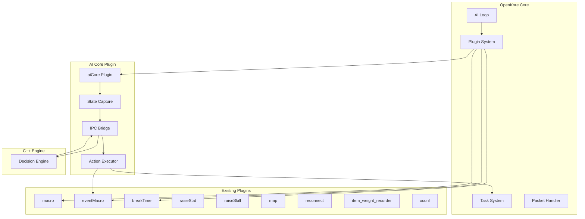

# Integration Guide

**Version:** 1.0  
**Date:** 2026-02-05  
**Status:** Final Specification

---

## Table of Contents

1. [Overview](#1-overview)
2. [Plugin Compatibility](#2-plugin-compatibility)
3. [Hook Integration](#3-hook-integration)
4. [State Sharing](#4-state-sharing)
5. [Conflict Resolution](#5-conflict-resolution)
6. [External Service Integration](#6-external-service-integration)

---

## 1. Overview

### 1.1 Integration Philosophy

The AI system is designed to **complement, not replace** existing OpenKore functionality:
- Works alongside existing plugins
- Respects user configurations
- Provides graceful fallback
- Maintains compatibility with vanilla OpenKore

### 1.2 Integration Architecture



---

## 2. Plugin Compatibility

### 2.1 Compatibility Matrix

| Plugin | Compatibility | Integration Method | Notes |
|--------|--------------|-------------------|-------|
| **macro** | ✅ Full | Coexist | AI generates macros, macro plugin executes |
| **eventMacro** | ✅ Full | Direct Use | AI uses eventMacro as primary execution engine |
| **breakTime** | ✅ Full | Respect | AI respects break times, pauses decisions |
| **raiseStat** | ✅ Full | Complement | AI works with stat raising goals |
| **raiseSkill** | ✅ Full | Complement | AI works with skill training |
| **map** | ✅ Full | Use | AI uses map plugin for navigation data |
| **reconnect** | ✅ Full | Respect | AI pauses during reconnection |
| **item_weight_recorder** | ✅ Full | Use | AI uses weight data for decisions |
| **xconf** | ✅ Full | Respect | AI respects xconf overrides |
| **OTP** | ✅ Full | Transparent | No interaction needed |
| **LatamChecksum** | ✅ Full | Transparent | Protocol-level, no conflict |
| **AdventureAgency** | ⚠️ Partial | Coordinate | May need coordination for party |
| **LATAMTranslate** | ✅ Full | Transparent | Translation layer, no conflict |

### 2.2 Plugin Load Order

```perl
# Recommended plugin load order in plugins.txt

# 1. Core utilities (load first)
xconf
OTP
LatamChecksum
LATAMTranslate

# 2. Basic functionality
map
item_weight_recorder

# 3. Macro system (before AI)
macro
eventMacro

# 4. AI Core (after macro system)
aiCore

# 5. Other plugins
breakTime
raiseStat
raiseSkill
reconnect
AdventureAgency
```

---

## 3. Hook Integration

### 3.1 Hook Priority System

OpenKore plugins use hooks with priorities. The AI system must respect these priorities:

```perl
# Hook priorities (lower number = higher priority)
my %HOOK_PRIORITIES = (
    'packet/received' => {
        'LatamChecksum' => 1,    # Decrypt first
        'aiCore' => 10,           # Process after decryption
    },
    'AI_pre' => {
        'breakTime' => 5,         # Check break time first
        'aiCore' => 10,           # AI decisions after break check
        'macro' => 15,            # Macro execution after AI
    },
    'AI_post' => {
        'aiCore' => 5,            # Cleanup
    }
};
```

### 3.2 Hook Registration

```perl
# openkore-ai/plugins/aiCore/aiCore.pl
package aiCore;

use strict;
use Plugins;
use Globals;

Plugins::register('aiCore', 'Advanced AI Core', \&on_unload);

sub on_load {
    # Register hooks with appropriate priorities
    Plugins::addHook('AI_pre', \&on_ai_pre, undef, 10);
    Plugins::addHook('packet/received', \&on_packet, undef, 10);
    Plugins::addHook('postLoginAfterLock', \&on_login, undef, 5);
    
    # State capture hooks
    Plugins::addHook('packet/stat_info', \&on_stat_update, undef, 5);
    Plugins::addHook('packet/actor_display', \&on_actor_display, undef, 5);
    
    # Action execution hooks
    Plugins::addHook('mainLoop_pre', \&check_actions, undef, 5);
    
    message "[aiCore] Advanced AI system loaded\n", "plugins";
}

sub on_ai_pre {
    # Check if we should process
    return if $breakTime::active;  # Respect break time
    return if AI::is('teleport', 'attack');  # Don't interfere with active AI
    
    # Capture state and send to C++ engine
    my $state = StateCapture::captureGameState();
    IPCClient::sendMessage('STATE_UPDATE', $state);
    
    # Receive and execute action (non-blocking)
    if (my $response = IPCClient::receiveMessage(1)) {
        if ($response->{type} eq 'ACTION_RESPONSE') {
            ActionExecutor::executeAction($response->{payload});
        }
    }
}
```

### 3.3 Critical Hooks

#### AI_pre Hook
```perl
sub on_ai_pre {
    # This is called every AI iteration
    # Use for: State updates, decision requests
    
    # IMPORTANT: Don't block here, use non-blocking IPC
}
```

#### packet/received Hook
```perl
sub on_packet {
    my (undef, $args) = @_;
    
    # Update internal state based on packet
    # Use for: Real-time state synchronization
}
```

#### mainLoop_pre Hook
```perl
sub check_actions {
    # Check for pending actions from C++ engine
    # Use for: Asynchronous action execution
}
```

---

## 4. State Sharing

### 4.1 Shared State Management

```perl
# aiCore/SharedState.pm
package SharedState;

use strict;
use Globals;

our %shared_state;

sub updateState {
    my ($key, $value) = @_;
    $shared_state{$key} = $value;
}

sub getState {
    my ($key) = @_;
    return $shared_state{$key};
}

# Sync with other plugins
sub syncWithBreakTime {
    return if !$breakTime::active;
    
    # Notify C++ engine of break time
    IPCClient::sendMessage('CONFIG_UPDATE', {
        break_time_active => 1,
        break_end_time => $breakTime::time
    });
}

sub syncWithRaiseStat {
    # Get stat raising goals from raiseStat plugin
    if (defined $raiseStat::config{goal}) {
        IPCClient::sendMessage('CONFIG_UPDATE', {
            stat_goals => $raiseStat::config{goal}
        });
    }
}

1;
```

### 4.2 Global Variables Access

```perl
# Safe access to OpenKore globals
sub captureGameState {
    my $state = {
        character => {
            name => $char->{name},
            hp => $char->{hp},
            max_hp => $char->{hp_max},
            # ... more fields
        },
        monsters => [],
        players => [],
        # ... more data
    };
    
    # Capture monsters
    foreach my $monster (@{$monstersList->getItems()}) {
        next if !$monster || $monster->{dead};
        push @{$state->{monsters}}, {
            id => $monster->{binID},
            name => $monster->{name},
            # ... more fields
        };
    }
    
    return $state;
}
```

---

## 5. Conflict Resolution

### 5.1 Action Priority System

When multiple systems want to act, use priority:

```perl
sub resolveActionConflict {
    my @actions = @_;
    
    # Priority order (highest first)
    my %priority = (
        'emergency_teleport' => 100,
        'ai_core_decision' => 80,
        'breakTime' => 70,
        'macro_execution' => 60,
        'auto_attack' => 50,
        'default' => 10
    );
    
    # Sort by priority
    @actions = sort { 
        ($priority{$b->{source}} // 10) <=> ($priority{$a->{source}} // 10)
    } @actions;
    
    return $actions[0];
}
```

### 5.2 Graceful Fallback

```perl
sub executeActionSafely {
    my ($action) = @_;
    
    eval {
        ActionExecutor::executeAction($action);
    };
    
    if ($@) {
        error "[aiCore] Action execution failed: $@\n";
        
        # Fallback to OpenKore native AI
        AI::queue('attack');  # Safe fallback
    }
}
```

### 5.3 Mutex Management

```perl
our $ai_mutex = 0;

sub acquireAIMutex {
    return 0 if $ai_mutex;
    $ai_mutex = 1;
    return 1;
}

sub releaseAIMutex {
    $ai_mutex = 0;
}

sub on_ai_pre {
    return unless acquireAIMutex();
    
    eval {
        # Do AI processing
        processAIDecision();
    };
    
    releaseAIMutex();
}
```

---

## 6. External Service Integration

### 6.1 LLM API Integration

```cpp
class LLMClient {
public:
    struct Config {
        std::string provider;  // "openai", "anthropic", "deepseek"
        std::string model;
        std::string api_key;
        std::string endpoint;
        uint32_t timeout_ms;
        uint32_t retry_attempts;
    };
    
    LLMResponse query(const LLMRequest& request);
    
private:
    Config config_;
    std::unique_ptr<HttpClient> http_client_;
    std::unique_ptr<RateLimiter> rate_limiter_;
    std::unique_ptr<ResponseCache> cache_;
};
```

#### Rate Limiting

```cpp
class RateLimiter {
public:
    bool allowRequest();
    void recordRequest();
    
private:
    uint32_t requests_per_minute_;
    std::deque<Timestamp> request_history_;
};

bool RateLimiter::allowRequest() {
    auto now = getCurrentTimestampMs();
    
    // Remove requests older than 1 minute
    while (!request_history_.empty() && 
           now - request_history_.front() > 60000) {
        request_history_.pop_front();
    }
    
    return request_history_.size() < requests_per_minute_;
}
```

#### Response Caching

```cpp
class ResponseCache {
public:
    std::optional<std::string> get(const std::string& prompt);
    void put(const std::string& prompt, const std::string& response);
    
private:
    struct CacheEntry {
        std::string response;
        Timestamp timestamp;
        uint32_t hit_count;
    };
    
    std::unordered_map<std::string, CacheEntry> cache_;
    uint32_t ttl_ms_ = 1800000;  // 30 minutes
    size_t max_entries_ = 1000;
};

std::optional<std::string> ResponseCache::get(const std::string& prompt) {
    auto hash = hashPrompt(prompt);
    auto it = cache_.find(hash);
    
    if (it == cache_.end()) {
        return std::nullopt;
    }
    
    // Check if expired
    auto age = getCurrentTimestampMs() - it->second.timestamp;
    if (age > ttl_ms_) {
        cache_.erase(it);
        return std::nullopt;
    }
    
    it->second.hit_count++;
    log_debug("Cache hit for prompt (hash: {})", hash);
    
    return it->second.response;
}
```

### 6.2 Multiple LLM Providers

```cpp
class LLMProviderManager {
public:
    void registerProvider(const std::string& name, 
                         std::unique_ptr<LLMProvider> provider);
    
    LLMResponse query(const LLMRequest& request);
    
private:
    std::vector<std::unique_ptr<LLMProvider>> providers_;
    
    std::unique_ptr<LLMProvider> selectProvider(const LLMRequest& request);
};

std::unique_ptr<LLMProvider> LLMProviderManager::selectProvider(
    const LLMRequest& request) {
    
    // Try providers in priority order
    for (auto& provider : providers_) {
        if (provider->isAvailable() && provider->canHandle(request)) {
            return std::move(provider);
        }
    }
    
    throw std::runtime_error("No LLM provider available");
}
```

### 6.3 Fallback Chain

```cpp
LLMResponse LLMProviderManager::query(const LLMRequest& request) {
    std::vector<std::string> errors;
    
    // Try each provider
    for (auto& provider : providers_) {
        if (!provider->isAvailable()) {
            continue;
        }
        
        try {
            auto response = provider->query(request);
            if (response.success) {
                return response;
            }
            errors.push_back(provider->getName() + ": " + response.error);
            
        } catch (const std::exception& e) {
            errors.push_back(provider->getName() + ": " + e.what());
        }
    }
    
    // All providers failed
    return LLMResponse{
        .success = false,
        .error = "All providers failed: " + join(errors, "; ")
    };
}
```

---

## 7. Configuration Override System

### 7.1 Configuration Hierarchy

```
Priority (highest to lowest):
1. Runtime commands (user input)
2. xconf overrides
3. AI Core config files
4. OpenKore config.txt
5. Default values
```

### 7.2 Configuration Merger

```cpp
class ConfigurationManager {
public:
    json getMergedConfig();
    
    void loadDefaultConfig();
    void loadOpenKoreConfig();
    void loadAICoreConfig();
    void applyXConfOverrides();
    void applyRuntimeOverride(const std::string& key, const json& value);
    
private:
    json default_config_;
    json openkore_config_;
    json aicore_config_;
    json xconf_overrides_;
    json runtime_overrides_;
    
    json merge(const std::vector<json>& configs);
};

json ConfigurationManager::getMergedConfig() {
    return merge({
        default_config_,
        openkore_config_,
        aicore_config_,
        xconf_overrides_,
        runtime_overrides_
    });
}
```

---

## 8. Testing Integration

### 8.1 Integration Tests

```perl
# test_integration.pl
use Test::More tests => 10;
use strict;

# Test 1: AI Core loads without errors
require_ok('plugins/aiCore/aiCore.pl');

# Test 2: Hooks are registered
ok(Plugins::hasHook('AI_pre', 'aiCore'), 'AI_pre hook registered');

# Test 3: IPC connection works
ok(IPCClient::connect(), 'IPC connection established');

# Test 4: State capture works
my $state = StateCapture::captureGameState();
ok(defined $state->{character}, 'State capture successful');

# Test 5: Action execution doesn't crash
eval {
    ActionExecutor::executeAction({
        type => 'NO_ACTION',
        parameters => {}
    });
};
ok(!$@, 'Action executor works');

# Test 6: Macro compatibility
ok(-e 'control/macros/generated/', 'Macro directory exists');

# Test 7: eventMacro integration
ok(defined $::Macro::Data::macroList, 'eventMacro accessible');

# Test 8: Respects break time
$breakTime::active = 1;
# Verify AI doesn't process during break time

# Test 9: Fallback to native AI
# Simulate C++ engine failure and verify OpenKore AI takes over

# Test 10: Configuration merge
my $config = ConfigurationManager::getMergedConfig();
ok(defined $config->{engine}, 'Configuration merge successful');

done_testing();
```

---

## 9. Deployment Checklist

### 9.1 Pre-Installation

- [ ] OpenKore 3.0+ installed and working
- [ ] Existing plugins configured
- [ ] Config files backed up

### 9.2 Installation

- [ ] Copy aiCore plugin to plugins/
- [ ] Copy C++ engine executable to bin/
- [ ] Create config/ directory structure
- [ ] Set up LLM API keys

### 9.3 Configuration

- [ ] Edit plugins.txt (add aiCore)
- [ ] Configure engine.json
- [ ] Configure llm_config.json
- [ ] Test IPC connection

### 9.4 Validation

- [ ] Start OpenKore
- [ ] Verify aiCore loads
- [ ] Check IPC connection
- [ ] Verify state updates
- [ ] Test action execution
- [ ] Monitor for conflicts

---

## 10. Troubleshooting

### 10.1 Common Issues

**Issue**: IPC connection fails
```
Solution:
1. Check if C++ engine is running
2. Verify named pipe/socket exists
3. Check firewall settings
4. Review engine.log for errors
```

**Issue**: Conflicts with macro plugin
```
Solution:
1. Verify plugin load order
2. Check hook priorities
3. Review macro file locations
4. Test macro execution independently
```

**Issue**: High CPU usage
```
Solution:
1. Reduce IPC message frequency
2. Optimize state capture
3. Check for infinite loops in macros
4. Review decision coordinator settings
```

---

**Next Document**: [Configuration Reference](07-configuration-reference.md)
