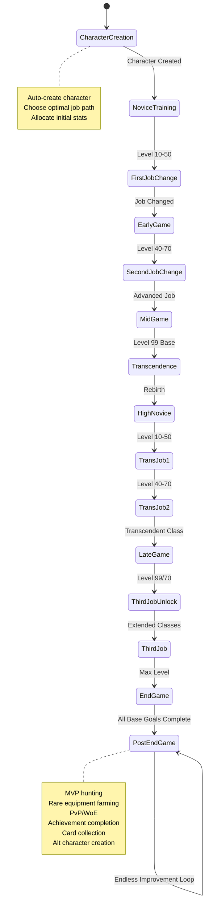

# Game Lifecycle Autonomy Specification

**Version:** 2.0  
**Date:** 2026-02-05  
**Status:** Final Specification

---

## Table of Contents

1. [Overview](#1-overview)
2. [Character Creation System](#2-character-creation-system)
3. [Job Path System](#3-job-path-system)
4. [Lifecycle Stages](#4-lifecycle-stages)
5. [Autonomous Goal Generation](#5-autonomous-goal-generation)
6. [Quest Automation Framework](#6-quest-automation-framework)
7. [Equipment Progression System](#7-equipment-progression-system)
8. [Resource Management](#8-resource-management)
9. [Endless Improvement Engine](#9-endless-improvement-engine)
10. [Implementation Specifications](#10-implementation-specifications)

---

## 1. Overview

### 1.1 Purpose

This specification defines a complete autonomous game lifecycle system that enables the OpenKore Advanced AI to play Ragnarok Online from character creation through endless endgame content, continuously improving and adapting without human intervention.

### 1.2 Design Goals

- **Complete Autonomy**: Zero human intervention required after initial configuration
- **All Job Paths**: Support all 12 job paths with specialized strategies
- **Continuous Improvement**: Never stop learning and optimizing
- **Adaptive Strategy**: Adjust approach based on performance metrics
- **Endless Content**: Generate new goals indefinitely after reaching endgame

### 1.3 Lifecycle Overview



---

## 2. Character Creation System

### 2.1 Character Creation Agent

```python
class CharacterCreationAgent:
    """Fully automated character creation system"""
    
    def __init__(self, llm_client, config: dict):
        self.llm = llm_client
        self.config = config
        self.job_knowledge = JobPathKnowledge()
    
    def create_character(self, preferences: dict = None) -> dict:
        """
        Completely automated character creation
        
        Args:
            preferences: Optional user preferences
                - playstyle: 'aggressive', 'balanced', 'defensive', 'support'
                - content_focus: 'pve', 'pvp', 'mvp', 'mixed'
                - party_preference: 'solo', 'party', 'flexible'
                - economy_focus: 'farming', 'questing', 'trading'
        
        Returns:
            Character creation result with job path and strategy
        """
        
        # Step 1: Select optimal job path
        job_path = self._select_job_path(preferences)
        
        # Step 2: Generate character name
        name = self._generate_character_name(job_path)
        
        # Step 3: Allocate initial stats
        initial_stats = self._allocate_initial_stats(job_path)
        
        # Step 4: Select appearance
        appearance = self._select_appearance()
        
        # Step 5: Execute character creation
        creation_result = self._execute_creation(
            name=name,
            job_path=job_path,
            stats=initial_stats,
            appearance=appearance
        )
        
        # Step 6: Generate initial strategy
        strategy = self._generate_initial_strategy(job_path, preferences)
        
        # Step 7: Store character profile
        self._store_character_profile({
            "name": name,
            "job_path": job_path,
            "initial_stats": initial_stats,
            "strategy": strategy,
            "created_at": time.time(),
            "preferences": preferences
        })
        
        return creation_result
    
    def _select_job_path(self, preferences: dict) -> str:
        """LLM-based job path selection with comprehensive analysis"""
        
        prompt = f"""
You are an expert Ragnarok Online strategist. Select the optimal starting job path.

Preferences:
- Playstyle: {preferences.get('playstyle', 'balanced')}
- Content Focus: {preferences.get('content_focus', 'pve')}
- Party Preference: {preferences.get('party_preference', 'flexible')}
- Economy Focus: {preferences.get('economy_focus', 'farming')}

Available Job Paths:
1. Swordsman → Knight/Crusader → Lord Knight/Paladin
2. Mage → Wizard/Sage → High Wizard/Professor
3. Archer → Hunter/Bard-Dancer → Sniper/Clown-Gypsy
4. Thief → Assassin/Rogue → Assassin Cross/Stalker
5. Acolyte → Priest/Monk → High Priest/Champion
6. Merchant → Blacksmith/Alchemist → Whitesmith/Creator

For each path, consider:
- Leveling efficiency (solo/party)
- Equipment dependency
- Zeny farming capability
- PvP/PvE viability
- Skill complexity
- Endgame potential

Respond with:
1. Recommended job path
2. Key strengths for the preferences
3. Initial stat allocation strategy
4. Estimated difficulty (1-10)
5. Key milestones to track

Format: JSON
"""
        
        response = self.llm.generate(prompt, temperature=0.7)
        parsed = json.loads(response)
        
        return parsed['job_path']
    
    def _allocate_initial_stats(self, job_path: str) -> dict:
        """Allocate starting stats optimally for job path"""
        
        # Base stats for each path (total: 0 points, will add during gameplay)
        stat_templates = {
            "Swordsman": {"str": 0, "agi": 0, "vit": 0, "int": 0, "dex": 0, "luk": 0},
            "Mage": {"str": 0, "agi": 0, "vit": 0, "int": 0, "dex": 0, "luk": 0},
            "Archer": {"str": 0, "agi": 0, "vit": 0, "int": 0, "dex": 0, "luk": 0},
            "Thief": {"str": 0, "agi": 0, "vit": 0, "int": 0, "dex": 0, "luk": 0},
            "Acolyte": {"str": 0, "agi": 0, "vit": 0, "int": 0, "dex": 0, "luk": 0},
            "Merchant": {"str": 0, "agi": 0, "vit": 0, "int": 0, "dex": 0, "luk": 0}
        }
        
        first_job = job_path.split("→")[0].strip()
        return stat_templates.get(first_job, stat_templates["Swordsman"])
    
    def _generate_character_name(self, job_path: str) -> str:
        """Generate unique character name based on job path"""
        
        job_prefixes = {
            "Swordsman": ["Blade", "Steel", "Valor", "Knight", "Guard"],
            "Mage": ["Arcane", "Mystic", "Spell", "Magi", "Sage"],
            "Archer": ["Arrow", "Swift", "Eagle", "Hunter", "Hawk"],
            "Thief": ["Shadow", "Stealth", "Rogue", "Silent", "Veil"],
            "Acolyte": ["Holy", "Divine", "Sanctus", "Priest", "Angel"],
            "Merchant": ["Trade", "Wealth", "Merchant", "Craft", "Smith"]
        }
        
        first_job = job_path.split("→")[0].strip()
        prefix = random.choice(job_prefixes.get(first_job, ["Player"]))
        suffix = ''.join(random.choices(string.ascii_uppercase + string.digits, k=4))
        
        return f"{prefix}{suffix}"
```

### 2.2 Character Creation Execution

```python
def execute_character_creation(name: str, job_path: str, appearance: dict) -> bool:
    """
    Execute the actual character creation in-game
    
    This integrates with OpenKore's character creation interface
    """
    
    steps = [
        ("select_slot", {"slot": 0}),
        ("enter_name", {"name": name}),
        ("select_appearance", appearance),
        ("confirm_creation", {}),
        ("wait_for_spawn", {"timeout": 30})
    ]
    
    for step_name, params in steps:
        success = execute_creation_step(step_name, params)
        if not success:
            raise CharacterCreationError(f"Failed at step: {step_name}")
    
    return True
```

---

## 3. Job Path System

### 3.1 All Job Paths Overview

```python
class JobPathKnowledge:
    """Comprehensive knowledge base for all job paths"""
    
    JOB_PATHS = {
        "swordsman_knight": {
            "path": "Swordsman → Knight → Lord Knight",
            "playstyle": "Melee tank/DPS",
            "difficulty": 3,
            "stats_priority": ["STR", "VIT", "AGI"],
            "key_skills": [
                {"name": "Bash", "priority": "high", "max_level": 10},
                {"name": "Provoke", "priority": "medium", "max_level": 10},
                {"name": "Magnum Break", "priority": "low", "max_level": 10}
            ],
            "equipment_path": ["Sword", "Spear", "Two-Hand Sword"],
            "farming_spots": {
                "early": ["Prontera Culvert", "Ant Hell"],
                "mid": ["Clock Tower", "Glast Heim"],
                "late": ["Abyss Lake", "Thanatos Tower"]
            }
        },
        
        "swordsman_crusader": {
            "path": "Swordsman → Crusader → Paladin",
            "playstyle": "Tank/Support",
            "difficulty": 4,
            "stats_priority": ["VIT", "DEX", "STR"],
            "key_skills": [
                {"name": "Holy Cross", "priority": "high", "max_level": 10},
                {"name": "Grand Cross", "priority": "high", "max_level": 10},
                {"name": "Devotion", "priority": "medium", "max_level": 5}
            ],
            "equipment_path": ["Sword+Shield", "Spear+Shield"],
            "farming_spots": {
                "early": ["Orc Dungeon", "Payon Dungeon"],
                "mid": ["Glast Heim", "Juperos"],
                "late": ["Thanatos Tower", "Endless Tower"]
            }
        },
        
        "mage_wizard": {
            "path": "Mage → Wizard → High Wizard",
            "playstyle": "Magic DPS",
            "difficulty": 2,
            "stats_priority": ["INT", "DEX", "VIT"],
            "key_skills": [
                {"name": "Fire Bolt", "priority": "high", "max_level": 10},
                {"name": "Storm Gust", "priority": "high", "max_level": 10},
                {"name": "Lord of Vermillion", "priority": "high", "max_level": 10},
                {"name": "Meteor Storm", "priority": "high", "max_level": 10}
            ],
            "equipment_path": ["Rod", "Staff", "Ancient Staff"],
            "farming_spots": {
                "early": ["Geffen Tower", "Orc Village"],
                "mid": ["Clock Tower", "Magma Dungeon"],
                "late": ["Thanatos Tower", "Endless Tower"]
            }
        },
        
        "mage_sage": {
            "path": "Mage → Sage → Professor",
            "playstyle": "Magic Support/DPS",
            "difficulty": 5,
            "stats_priority": ["INT", "DEX", "VIT"],
            "key_skills": [
                {"name": "Bolt Skills", "priority": "high", "max_level": 10},
                {"name": "Dispel", "priority": "medium", "max_level": 5},
                {"name": "Magnetic Earth", "priority": "medium", "max_level": 5}
            ],
            "equipment_path": ["Rod", "Book", "Staff"],
            "farming_spots": {
                "early": ["Geffen Tower", "Payon Dungeon"],
                "mid": ["Juno Fields", "Rachel Sanctuary"],
                "late": ["Endless Tower", "Old Glast Heim"]
            }
        },
        
        "archer_hunter": {
            "path": "Archer → Hunter → Sniper",
            "playstyle": "Ranged DPS",
            "difficulty": 2,
            "stats_priority": ["DEX", "AGI", "INT"],
            "key_skills": [
                {"name": "Double Strafe", "priority": "high", "max_level": 10},
                {"name": "Blitz Beat", "priority": "high", "max_level": 5},
                {"name": "Falcon Assault", "priority": "high", "max_level": 5}
            ],
            "equipment_path": ["Bow", "Composite Bow", "Hunter Bow"],
            "farming_spots": {
                "early": ["Payon Forest", "Ant Hell"],
                "mid": ["Clock Tower", "Turtle Island"],
                "late": ["Rachel Sanctuary", "Thanatos Tower"]
            }
        },
        
        "archer_bard_dancer": {
            "path": "Archer → Bard/Dancer → Clown/Gypsy",
            "playstyle": "Support/DPS",
            "difficulty": 6,
            "stats_priority": ["DEX", "AGI", "INT"],
            "key_skills": [
                {"name": "Musical Strike/Slinging Arrow", "priority": "high", "max_level": 5},
                {"name": "Ensemble Skills", "priority": "high", "max_level": 10},
                {"name": "Bragi's Poem", "priority": "high", "max_level": 10}
            ],
            "equipment_path": ["Violin/Whip", "Harp/Instrument"],
            "farming_spots": {
                "early": ["Payon Forest", "Orc Village"],
                "mid": ["Clock Tower", "Glast Heim"],
                "late": ["Party-focused endgame content"]
            }
        },
        
        "thief_assassin": {
            "path": "Thief → Assassin → Assassin Cross",
            "playstyle": "Critical DPS",
            "difficulty": 3,
            "stats_priority": ["AGI", "STR", "LUK"],
            "key_skills": [
                {"name": "Sonic Blow", "priority": "high", "max_level": 10},
                {"name": "Grimtooth", "priority": "high", "max_level": 5},
                {"name": "Enchant Deadly Poison", "priority": "high", "max_level": 5}
            ],
            "equipment_path": ["Dagger", "Katar", "Double Dagger"],
            "farming_spots": {
                "early": ["Prontera Culvert", "Payon Dungeon"],
                "mid": ["Sphinx", "Rachel Sanctuary"],
                "late": ["Abyss Lake", "Thanatos Tower"]
            }
        },
        
        "thief_rogue": {
            "path": "Thief → Rogue → Stalker",
            "playstyle": "Utility/DPS",
            "difficulty": 5,
            "stats_priority": ["STR", "AGI", "DEX"],
            "key_skills": [
                {"name": "Back Stab", "priority": "high", "max_level": 10},
                {"name": "Strip Skills", "priority": "medium", "max_level": 5},
                {"name": "Intimidate", "priority": "low", "max_level": 5}
            ],
            "equipment_path": ["Dagger", "Bow", "Sword"],
            "farming_spots": {
                "early": ["Prontera Culvert", "Clock Tower"],
                "mid": ["Glast Heim", "Abyss Lake"],
                "late": ["PvP/WoE focused"]
            }
        },
        
        "acolyte_priest": {
            "path": "Acolyte → Priest → High Priest",
            "playstyle": "Healer/Support",
            "difficulty": 4,
            "stats_priority": ["INT", "DEX", "VIT"],
            "key_skills": [
                {"name": "Heal", "priority": "high", "max_level": 10},
                {"name": "Magnificat", "priority": "high", "max_level": 5},
                {"name": "Sanctuary", "priority": "high", "max_level": 10},
                {"name": "Assumptio", "priority": "high", "max_level": 5}
            ],
            "equipment_path": ["Rod", "Mace", "Holy Stick"],
            "farming_spots": {
                "early": ["Party-based leveling"],
                "mid": ["Turn Undead farming"],
                "late": ["Party support in endgame"]
            }
        },
        
        "acolyte_monk": {
            "path": "Acolyte → Monk → Champion",
            "playstyle": "Melee DPS",
            "difficulty": 4,
            "stats_priority": ["STR", "AGI", "VIT"],
            "key_skills": [
                {"name": "Triple Attack", "priority": "high", "max_level": 10},
                {"name": "Raging Thrust", "priority": "high", "max_level": 5},
                {"name": "Asura Strike", "priority": "high", "max_level": 5}
            ],
            "equipment_path": ["Fist", "Knuckle", "Barehand"],
            "farming_spots": {
                "early": ["Prontera Culvert", "Orc Village"],
                "mid": ["Clock Tower", "Glast Heim"],
                "late": ["Abyss Lake", "MVP hunting"]
            }
        },
        
        "merchant_blacksmith": {
            "path": "Merchant → Blacksmith → Whitesmith",
            "playstyle": "Crafting/DPS",
            "difficulty": 3,
            "stats_priority": ["STR", "DEX", "VIT"],
            "key_skills": [
                {"name": "Mammonite", "priority": "high", "max_level": 10},
                {"name": "Cart Revolution", "priority": "high", "max_level": 10},
                {"name": "Weapon Research", "priority": "medium", "max_level": 10}
            ],
            "equipment_path": ["Axe", "Mace", "Two-Hand Axe"],
            "farming_spots": {
                "early": ["Ant Hell", "Orc Dungeon"],
                "mid": ["Magma Dungeon", "Thor Volcano"],
                "late": ["Crafting/economy focus"]
            }
        },
        
        "merchant_alchemist": {
            "path": "Merchant → Alchemist → Creator",
            "playstyle": "Crafting/Homunculus",
            "difficulty": 7,
            "stats_priority": ["INT", "DEX", "VIT"],
            "key_skills": [
                {"name": "Acid Terror", "priority": "high", "max_level": 5},
                {"name": "Homunculus Skills", "priority": "high", "max_level": 10},
                {"name": "Potion Research", "priority": "medium", "max_level": 10}
            ],
            "equipment_path": ["Axe", "Mace", "Book"],
            "farming_spots": {
                "early": ["Geffen Tower", "Orc Dungeon"],
                "mid": ["Bio Labs", "Abyss Lake"],
                "late": ["Homunculus grinding", "Economy"]
            }
        }
    }
    
    def get_job_path_info(self, job_path_key: str) -> dict:
        """Retrieve complete job path information"""
        return self.JOB_PATHS.get(job_path_key, {})
    
    def get_all_job_paths(self) -> list:
        """Get list of all available job paths"""
        return list(self.JOB_PATHS.keys())
```

---

## 4. Lifecycle Stages

### 4.1 Stage Definitions

```python
class LifecycleStage(Enum):
    """Game lifecycle stages"""
    
    NOVICE_TRAINING = "novice_training"      # Level 1-10
    EARLY_GAME = "early_game"                # Level 10-50, First job
    MID_GAME = "mid_game"                    # Level 50-99, Second job
    PRE_TRANSCEND = "pre_transcend"          # Level 99/50, preparing for rebirth
    HIGH_NOVICE = "high_novice"              # After rebirth, level 1-10
    TRANSCENDENT_EARLY = "transcendent_early" # Level 10-50, Trans first job
    TRANSCENDENT_MID = "transcendent_mid"    # Level 50-99, Trans second job
    TRANSCENDENT_LATE = "transcendent_late"  # Level 99/70+
    THIRD_JOB_UNLOCK = "third_job_unlock"    # Unlocking extended classes
    END_GAME = "end_game"                    # Max level, optimal equipment
    POST_END_GAME = "post_end_game"          # Endless improvement

class LifecycleStageManager:
    """Manages progression through game lifecycle stages"""
    
    def __init__(self, db_connection, llm_client):
        self.db = db_connection
        self.llm = llm_client
        self.current_stage = None
        self.stage_goals = {}
    
    def determine_current_stage(self, character_state: dict) -> LifecycleStage:
        """Determine current lifecycle stage based on character state"""
        
        level = character_state['level']
        job_level = character_state['job_level']
        job = character_state['job']
        rebirth_count = character_state.get('rebirth_count', 0)
        
        # Novice
        if job == "Novice" and rebirth_count == 0:
            return LifecycleStage.NOVICE_TRAINING
        
        # First job classes
        first_jobs = ["Swordsman", "Mage", "Archer", "Thief", "Acolyte", "Merchant"]
        if job in first_jobs:
            return LifecycleStage.EARLY_GAME
        
        # Second job classes
        second_jobs = ["Knight", "Wizard", "Hunter", "Assassin", "Priest", "Blacksmith",
                      "Crusader", "Sage", "Bard", "Dancer", "Rogue", "Monk", "Alchemist"]
        if job in second_jobs and rebirth_count == 0:
            if level >= 99:
                return LifecycleStage.PRE_TRANSCEND
            else:
                return LifecycleStage.MID_GAME
        
        # High Novice (after rebirth)
        if job == "Novice" and rebirth_count > 0:
            return LifecycleStage.HIGH_NOVICE
        
        # Transcendent first job
        trans_first = ["Swordsman High", "Mage High", "Archer High", "Thief High", 
                      "Acolyte High", "Merchant High"]
        if job in trans_first:
            return LifecycleStage.TRANSCENDENT_EARLY
        
        # Transcendent second job
        trans_second = ["Lord Knight", "High Wizard", "Sniper", "Assassin Cross", 
                       "High Priest", "Whitesmith", "Paladin", "Professor", 
                       "Clown", "Gypsy", "Stalker", "Champion", "Creator"]
        if job in trans_second:
            if level >= 99 and job_level >= 70:
                return LifecycleStage.THIRD_JOB_UNLOCK
            else:
                return LifecycleStage.TRANSCENDENT_MID
        
        # Third job / Extended classes
        third_jobs = ["Rune Knight", "Warlock", "Ranger", "Guillotine Cross", 
                     "Arch Bishop", "Mechanic", "Royal Guard", "Sorcerer", 
                     "Minstrel", "Wanderer", "Shadow Chaser", "Sura", "Genetic"]
        if job in third_jobs:
            if level >= 175:  # Max level
                return LifecycleStage.END_GAME
            else:
                return LifecycleStage.TRANSCENDENT_LATE
        
        # Default
        return LifecycleStage.POST_END_GAME
    
    def get_stage_objectives(self, stage: LifecycleStage, job_path: str) -> list:
        """Get objectives for current stage"""
        
        objectives_map = {
            LifecycleStage.NOVICE_TRAINING: self._novice_objectives,
            LifecycleStage.EARLY_GAME: self._early_game_objectives,
            LifecycleStage.MID_GAME: self._mid_game_objectives,
            LifecycleStage.PRE_TRANSCEND: self._pre_transcend_objectives,
            LifecycleStage.HIGH_NOVICE: self._high_novice_objectives,
            LifecycleStage.TRANSCENDENT_EARLY: self._trans_early_objectives,
            LifecycleStage.TRANSCENDENT_MID: self._trans_mid_objectives,
            LifecycleStage.TRANSCENDENT_LATE: self._trans_late_objectives,
            LifecycleStage.THIRD_JOB_UNLOCK: self._third_job_objectives,
            LifecycleStage.END_GAME: self._end_game_objectives,
            LifecycleStage.POST_END_GAME: self._post_end_game_objectives
        }
        
        generator = objectives_map.get(stage)
        if generator:
            return generator(job_path)
        return []
    
    def _novice_objectives(self, job_path: str) -> list:
        """Objectives for novice training (Level 1-10)"""
        return [
            {
                "type": "level",
                "target": 10,
                "priority": "critical",
                "description": "Reach Job Level 10 for job change",
                "locations": ["Training Grounds", "Prontera Field"],
                "estimated_time_hours": 0.5
            },
            {
                "type": "collect_items",
                "items": ["Jellopy", "Fluff", "Clover"],
                "quantity": 50,
                "priority": "medium",
                "description": "Collect basic items for initial zeny",
                "estimated_zeny": 5000
            },
            {
                "type": "learn_basics",
                "priority": "high",
                "description": "Learn basic game mechanics (movement, combat, items)",
                "tasks": ["attack_monster", "use_item", "open_storage"]
            }
        ]
    
    def _early_game_objectives(self, job_path: str) -> list:
        """Objectives for early game (First job, level 10-50)"""
        job_info = JobPathKnowledge().get_job_path_info(job_path)
        
        return [
            {
                "type": "job_change",
                "target_job": job_info['path'].split("→")[0].strip(),
                "priority": "critical",
                "description": f"Complete job change to {job_info['path'].split('→')[0].strip()}",
                "prerequisites": ["Job Level 10"]
            },
            {
                "type": "level",
                "target": 40,
                "priority": "high",
                "description": "Reach level 40 for second job change",
                "locations": job_info['farming_spots']['early']
            },
            {
                "type": "skills",
                "priority": "high",
                "description": "Learn essential skills",
                "skills": [s['name'] for s in job_info['key_skills'] if s['priority'] == 'high']
            },
            {
                "type": "equipment",
                "priority": "medium",
                "description": "Acquire basic job-appropriate equipment",
                "items": job_info['equipment_path'][:1],
                "estimated_zeny": 50000
            },
            {
                "type": "economy",
                "priority": "medium",
                "description": "Build initial economy (zeny and items)",
                "target_zeny": 100000,
                "target_items": ["White Potion x100", "Blue Potion x50"]
            }
        ]
    
    def _mid_game_objectives(self, job_path: str) -> list:
        """Objectives for mid game (Second job, level 50-99)"""
        job_info = JobPathKnowledge().get_job_path_info(job_path)
        
        return [
            {
                "type": "job_change",
                "target_job": job_info['path'].split("→")[1].strip(),
                "priority": "critical",
                "description": f"Complete job change to {job_info['path'].split('→')[1].strip()}",
                "prerequisites": ["Base Level 40+", "Job Level 40+"]
            },
            {
                "type": "level",
                "target": 99,
                "priority": "high",
                "description": "Reach base level 99 for transcendence",
                "locations": job_info['farming_spots']['mid']
            },
            {
                "type": "job_level",
                "target": 50,
                "priority": "high",
                "description": "Reach job level 50 for transcendence",
                "locations": job_info['farming_spots']['mid']
            },
            {
                "type": "skills",
                "priority": "high",
                "description": "Max out key skills",
                "skills": [s['name'] for s in job_info['key_skills']]
            },
            {
                "type": "equipment",
                "priority": "high",
                "description": "Acquire mid-tier equipment",
                "items": job_info['equipment_path'],
                "estimated_zeny": 5000000
            },
            {
                "type": "quests",
                "priority": "medium",
                "description": "Complete important quests",
                "quests": ["Airship Quest", "Endless Tower Access"]
            }
        ]
    
    def _end_game_objectives(self, job_path: str) -> list:
        """Objectives for end game (Max level)"""
        return [
            {
                "type": "equipment_optimization",
                "priority": "critical",
                "description": "Acquire Best-in-Slot equipment",
                "target": "All slots with optimal gear and cards"
            },
            {
                "type": "mvp_hunting",
                "priority": "high",
                "description": "Hunt MVP bosses for cards and rare items",
                "targets": ["Amon Ra", "Dark Lord", "Baphomet", "Osiris"]
            },
            {
                "type": "instance_farming",
                "priority": "high",
                "description": "Farm endgame instances",
                "instances": ["Endless Tower", "Old Glast Heim", "Infinite Space"]
            }
        ]
```

---

## 5. Autonomous Goal Generation

### 5.1 Goal Generation Engine

```python
class AutonomousGoalGenerator:
    """LLM-powered autonomous goal generation system"""
    
    def __init__(self, llm_client, memory_manager, db_connection):
        self.llm = llm_client
        self.memory = memory_manager
        self.db = db_connection
        self.crew_ai = CrewAIManager(llm_client)
    
    def generate_next_goals(self, character_state: dict, count: int = 5) -> list:
        """
        Generate next strategic goals based on current character state
        
        Uses CrewAI for complex strategic planning
        """
        
        # Get current stage and historical performance
        current_stage = self._determine_stage(character_state)
        historical_data = self._get_historical_performance(character_state['name'])
        similar_situations = self.memory.retrieve_similar_situations(character_state)
        
        # Use CrewAI for strategic goal generation
        context = {
            "character": character_state,
            "stage": current_stage,
            "history": historical_data,
            "similar_past": similar_situations,
            "constraints": self._get_constraints(character_state)
        }
        
        goals = self.crew_ai.execute_strategic_planning(context)
        
        # Validate and prioritize goals
        validated_goals = self._validate_goals(goals, character_state)
        prioritized_goals = self._prioritize_goals(validated_goals, character_state)
        
        return prioritized_goals[:count]
    
    def _build_goal_prompt(self, character_state: dict, context: dict) -> str:
        """Build comprehensive prompt for goal generation"""
        
        return f"""
You are managing a Ragnarok Online character with complete autonomy.

CURRENT CHARACTER STATE:
- Name: {character_state['name']}
- Level: {character_state['level']} (Job: {character_state['job']}, Job Lv: {character_state['job_level']})
- Stats: STR {character_state['str']}, AGI {character_state['agi']}, VIT {character_state['vit']}, 
         INT {character_state['int']}, DEX {character_state['dex']}, LUK {character_state['luk']}
- Zeny: {character_state['zeny']:,}
- Current Map: {character_state['map']}
- Equipment Value: {character_state.get('equipment_value', 0):,} zeny
- Completed Goals: {len(context.get('completed_goals', []))}

RECENT PERFORMANCE:
{self._format_performance(context.get('history', {}))}

SIMILAR PAST SITUATIONS:
{self._format_similar_situations(context.get('similar_past', []))}

TASK:
Generate the next 5 strategic goals for this character. Each goal should be:

1. **Specific and Measurable** - Clear success criteria
2. **Achievable** - Within character's current capabilities
3. **Progressive** - Builds toward long-term advancement
4. **Balanced** - Mix of leveling, equipment, economy, quests
5. **Adaptive** - Based on past performance and current situation

For each goal, provide:
- Goal title (concise)
- Detailed description
- Priority (critical/high/medium/low)
- Estimated time to complete (hours)
- Prerequisites (what's needed to start)
- Success criteria (how to measure completion)
- Expected rewards (exp, zeny, items, etc.)
- Alternative approaches (if primary fails)

Consider:
- Current level and job progression
- Economic situation (zeny for equipment/consumables)
- Skill point allocation
- Equipment upgrades needed
- Quest completion for unlocks
- Farming efficiency optimization
- Long-term strategic positioning

Format: JSON array of goal objects
"""
    
    def _validate_goals(self, goals: list, character_state: dict) -> list:
        """Validate goals are achievable given current state"""
        
        validated = []
        for goal in goals:
            # Check prerequisites
            if self._check_prerequisites(goal, character_state):
                # Check resource requirements
                if self._check_resources(goal, character_state):
                    # Check no conflicts with other goals
                    if self._check_conflicts(goal, validated):
                        validated.append(goal)
        
        return validated
    
    def _prioritize_goals(self, goals: list, character_state: dict) -> list:
        """Prioritize goals using multi-criteria decision making"""
        
        # Scoring criteria
        for goal in goals:
            score = 0
            
            # Priority weight
            priority_weights = {
                "critical": 100,
                "high": 75,
                "medium": 50,
                "low": 25
            }
            score += priority_weights.get(goal.get('priority', 'medium'), 50)
            
            # Time efficiency (prefer faster goals with good ROI)
            estimated_hours = goal.get('estimated_time_hours', 1)
            expected_value = goal.get('expected_rewards', {}).get('value', 0)
            if estimated_hours > 0:
                efficiency = expected_value / estimated_hours
                score += min(efficiency / 1000, 50)  # Cap at 50 points
            
            # Dependency bonus (goals that unlock other goals)
            if goal.get('unlocks_other_goals', False):
                score += 25
            
            # Current stage alignment
            if self._aligns_with_stage(goal, character_state):
                score += 30
            
            goal['_priority_score'] = score
        
        # Sort by score descending
        return sorted(goals, key=lambda g: g.get('_priority_score', 0), reverse=True)
```

### 5.2 Goal Execution Engine

```python
class GoalExecutionEngine:
    """Executes autonomous goals through macro generation and coordination"""
    
    def __init__(self, macro_generator, coordinator):
        self.macro_gen = macro_generator
        self.coordinator = coordinator
        self.active_goals = []
    
    def execute_goal(self, goal: dict, character_state: dict) -> dict:
        """
        Execute a single goal autonomously
        
        Returns execution result with success status and metrics
        """
        
        # Break down goal into executable tasks
        tasks = self._decompose_goal(goal)
        
        # Generate macros for each task
        macros = []
        for task in tasks:
            macro = self.macro_gen.generate_macro_for_task(task, character_state)
            macros.append(macro)
        
        # Execute tasks in sequence
        results = []
        for i, (task, macro) in enumerate(zip(tasks, macros)):
            print(f"Executing task {i+1}/{len(tasks)}: {task['description']}")
            
            result = self._execute_task(task, macro, character_state)
            results.append(result)
            
            # Update character state after each task
            character_state = self._update_character_state()
            
            # Check if should continue or abort
            if not result['success'] and task.get('critical', False):
                return self._create_failure_result(goal, results, f"Critical task failed: {task['description']}")
        
        # All tasks completed
        return self._create_success_result(goal, results)
    
    def _decompose_goal(self, goal: dict) -> list:
        """Decompose high-level goal into executable tasks"""
        
        goal_type = goal.get('type', 'general')
        
        if goal_type == 'level':
            return self._decompose_leveling_goal(goal)
        elif goal_type == 'equipment':
            return self._decompose_equipment_goal(goal)
        elif goal_type == 'quest':
            return self._decompose_quest_goal(goal)
        elif goal_type == 'economy':
            return self._decompose_economy_goal(goal)
        else:
            return self._decompose_general_goal(goal)
    
    def _decompose_leveling_goal(self, goal: dict) -> list:
        """Decompose leveling goal into farming tasks"""
        
        current_level = goal.get('current_level', 1)
        target_level = goal.get('target', 99)
        
        tasks = []
        
        # Determine optimal farming locations by level ranges
        level_ranges = [
            (current_level, min(current_level + 10, target_level)),
            (current_level + 10, min(current_level + 20, target_level)),
            (current_level + 20, target_level)
        ]
        
        for start, end in level_ranges:
            if start >= target_level:
                break
            
            location = self._get_optimal_farm_location(start, goal.get('job', 'Novice'))
            
            tasks.append({
                "type": "farm",
                "description": f"Farm at {location} from level {start} to {end}",
                "location": location,
                "target_level": end,
                "critical": True,
                "estimated_time_hours": (end - start) * 0.5  # Estimate
            })
        
        return tasks
```

---

## 6. Quest Automation Framework

### 6.1 Quest System Architecture

```python
class QuestAutomationFramework:
    """Fully automated quest completion system"""
    
    def __init__(self, llm_client, npc_handler):
        self.llm = llm_client
        self.npc = npc_handler
        self.quest_database = QuestDatabase()
    
    def complete_quest(self, quest_name: str, character_state: dict) -> dict:
        """
        Autonomously complete a quest
        
        Uses LLM to understand quest requirements and generate execution plan
        """
        
        # Get quest information
        quest_info = self.quest_database.get_quest(quest_name)
        
        if not quest_info:
            # Quest not in database, use LLM to figure it out
            quest_info = self._discover_quest(quest_name, character_state)
        
        # Check prerequisites
        if not self._check_quest_prerequisites(quest_info, character_state):
            return {"success": False, "reason": "Prerequisites not met"}
        
        # Generate execution plan
        plan = self._generate_quest_plan(quest_info, character_state)
        
        # Execute plan
        result = self._execute_quest_plan(plan, character_state)
        
        return result
    
    def _generate_quest_plan(self, quest_info: dict, character_state: dict) -> list:
        """Generate step-by-step plan to complete quest"""
        
        prompt = f"""
Generate a detailed execution plan for completing this Ragnarok Online quest:

QUEST: {quest_info['name']}
Description: {quest_info['description']}
Requirements: {quest_info['requirements']}
Rewards: {quest_info['rewards']}

Current Character State:
- Level: {character_state['level']}
- Location: {character_state['map']}
- Inventory: {character_state['inventory'][:10]}  # First 10 items

Generate a step-by-step plan with:
1. Navigation instructions (where to go)
2. NPC interactions (who to talk to, what to say)
3. Monster hunting (what to kill, how many)
4. Item collection (what items needed, where to get them)
5. Turn-in procedure (final NPC interaction)

Format: JSON array of steps with "type", "action", "location", "details"
"""
        
        response = self.llm.generate(prompt, temperature=0.3)
        plan = json.loads(response)
        
        return plan
    
    def _execute_quest_plan(self, plan: list, character_state: dict) -> dict:
        """Execute quest plan step by step"""
        
        for i, step in enumerate(plan):
            print(f"Quest step {i+1}/{len(plan)}: {step.get('action', 'unknown')}")
            
            step_type = step.get('type')
            
            if step_type == 'navigate':
                success = self._navigate_to(step['location'])
            elif step_type == 'talk_npc':
                success = self._talk_to_npc(step['npc_name'], step.get('dialogue', []))
            elif step_type == 'hunt_monsters':
                success = self._hunt_monsters(step['monster'], step['quantity'])
            elif step_type == 'collect_items':
                success = self._collect_items(step['items'])
            elif step_type == 'use_item':
                success = self._use_item(step['item'], step.get('target'))
            else:
                print(f"Unknown step type: {step_type}")
                success = False
            
            if not success:
                return {
                    "success": False,
                    "reason": f"Failed at step {i+1}: {step.get('action')}",
                    "completed_steps": i
                }
        
        return {
            "success": True,
            "completed_steps": len(plan),
            "rewards_obtained": True
        }
```

### 6.2 Important Quest Database

```python
class QuestDatabase:
    """Database of important quests for each job path"""
    
    ESSENTIAL_QUESTS = {
        "job_change_quests": {
            "swordsman": {
                "name": "Swordsman Job Change",
                "location": "Izlude",
                "requirements": ["Job Level 10"],
                "steps": ["Talk to Swordsman Guild Master", "Complete test", "Change job"],
                "rewards": ["Job change to Swordsman"]
            },
            "mage": {
                "name": "Mage Job Change",
                "location": "Geffen",
                "requirements": ["Job Level 10"],
                "steps": ["Enter Geffen Tower", "Pass magic test", "Change job"],
                "rewards": ["Job change to Mage"]
            },
            # ... all other job changes
        },
        
        "essential_quests": {
            "airship_access": {
                "name": "Airship Access Quest",
                "location": "Izlude",
                "requirements": ["Base Level 60+"],
                "importance": "high",
                "rewards": ["Access to Juno and other cities"]
            },
            
            "endless_tower": {
                "name": "Endless Tower Access",
                "location": "Endless Tower Entrance",
                "requirements": ["Party of 3+", "Base Level 50+"],
                "importance": "high",
                "rewards": ["Access to Endless Tower instance"]
            },
            
            "rebirth_quest": {
                "name": "Rebirth/Transcendence Quest",
                "location": "Valhalla",
                "requirements": ["Base Level 99", "Job Level 50"],
                "importance": "critical",
                "rewards": ["Transcendent class access"]
            }
        },
        
        "job_specific_quests": {
            "knight_mount": {
                "name": "Peco Peco Mount Quest",
                "job": "Knight",
                "location": "Prontera",
                "importance": "high",
                "rewards": ["Peco Peco mount (faster movement)"]
            },
            
            "priest_sanctuary": {
                "name": "Sanctuary Skill Quest",
                "job": "Priest",
                "location": "Prontera Cathedral",
                "importance": "critical",
                "rewards": ["Sanctuary skill"]
            }
            # ... many more job-specific quests
        }
    }
```

---

## 7. Equipment Progression System

### 7.1 Equipment Progression Ladder

```python
class EquipmentProgressionSystem:
    """Manages equipment progression from novice to endgame"""
    
    def __init__(self, llm_client, economy_manager):
        self.llm = llm_client
        self.economy = economy_manager
        self.equipment_db = EquipmentDatabase()
    
    def get_next_equipment_upgrade(self, character_state: dict) -> dict:
        """
        Determine next equipment upgrade based on current gear and resources
        
        Returns upgrade recommendation with acquisition plan
        """
        
        current_equipment = character_state['equipment']
        available_zeny = character_state['zeny']
        level = character_state['level']
        job = character_state['job']
        
        # Get equipment progression path for job
        progression_path = self.equipment_db.get_progression_path(job)
        
        # Find gaps in current equipment
        gaps = self._find_equipment_gaps(current_equipment, progression_path, level)
        
        # Prioritize gaps by impact and affordability
        prioritized = self._prioritize_upgrades(gaps, available_zeny)
        
        if not prioritized:
            return {"status": "optimal", "message": "All equipment slots optimized for current level"}
        
        # Get top recommendation
        recommendation = prioritized[0]
        
        # Generate acquisition plan
        acquisition_plan = self._generate_acquisition_plan(recommendation, character_state)
        
        return {
            "item": recommendation['item'],
            "slot": recommendation['slot'],
            "current_item": current_equipment.get(recommendation['slot']),
            "improvement": recommendation['impact'],
            "cost": recommendation['cost'],
            "acquisition_plan": acquisition_plan
        }
    
    def _generate_acquisition_plan(self, upgrade: dict, character_state: dict) -> dict:
        """Generate plan to acquire equipment upgrade"""
        
        item = upgrade['item']
        cost = upgrade['cost']
        available_zeny = character_state['zeny']
        
        if available_zeny >= cost:
            # Can buy immediately
            return {
                "method": "purchase",
                "vendor": self._find_vendor(item),
                "immediate": True
            }
        else:
            # Need to farm zeny
            zeny_needed = cost - available_zeny
            
            return {
                "method": "farm_then_purchase",
                "zeny_needed": zeny_needed,
                "farming_plan": self.economy.generate_farming_plan(zeny_needed, character_state),
                "estimated_time_hours": zeny_needed / self._calculate_zeny_per_hour(character_state)
            }

class EquipmentDatabase:
    """Database of equipment progression paths for all jobs"""
    
    PROGRESSION_PATHS = {
        "Swordsman": {
            "weapon": [
                {"level": 1, "item": "Knife", "cost": 50},
                {"level": 5, "item": "Sword", "cost": 100},
                {"level": 12, "item": "Blade", "cost": 2000},
                {"level": 18, "item": "Katana", "cost": 6000},
                {"level": 24, "item": "Tsurugi", "cost": 15000},
                {"level": 30, "item": "Bastard Sword", "cost": 30000},
                {"level": 36, "item": "Two-Handed Sword", "cost": 60000}
            ],
            "armor": [
                {"level": 1, "item": "Cotton Shirt", "cost": 10},
                {"level": 8, "item": "Adventurer's Suit", "cost": 1000},
                {"level": 15, "item": "Chain Mail", "cost": 5000},
                {"level": 25, "item": "Full Plate", "cost": 20000},
                {"level": 40, "item": "Saint's Robe", "cost": 50000}
            ],
            # ... other slots
        },
        
        "Mage": {
            "weapon": [
                {"level": 1, "item": "Rod", "cost": 50},
                {"level": 12, "item": "Staff", "cost": 5000},
                {"level": 18, "item": "Arc Wand", "cost": 12000},
                {"level": 24, "item": "Mighty Staff", "cost": 30000},
                {"level": 30, "item": "Wizardry Staff", "cost": 50000}
            ],
            "armor": [
                {"level": 1, "item": "Cotton Shirt", "cost": 10},
                {"level": 10, "item": "Silk Robe", "cost": 3000},
                {"level": 20, "item": "Mage Coat", "cost": 15000},
                {"level": 35, "item": "Magic Coat", "cost": 40000}
            ]
        },
        
        # ... all other jobs with complete equipment progressions
    }
    
    ENDGAME_EQUIPMENT = {
        "Swordsman_Knight_LordKnight": {
            "weapon": {
                "BiS": "Excalibur [4]",
                "alternative": ["Muramasa [2]", "Haedonggum [2]"],
                "cards": ["Hydra Card x4", "Desert Wolf Card x4"]
            },
            "armor": {
                "BiS": "Glorious Suit [1]",
                "alternative": ["Holy Robe [1]", "Valkyrie Armor [1]"],
                "cards": ["Marc Card", "Peco Peco Egg Card"]
            },
            "headgear": {
                "upper": {
                    "BiS": "Orc Hero Helm [1]",
                    "alternative": ["Beret [1]", "Magistrate Hat [1]"]
                },
                "middle": {
                    "BiS": "Sunglasses [1]"
                },
                "lower": {
                    "BiS": "Pipe"
                }
            },
            "garment": {
                "BiS": "Valkyrie Manteau [1]",
                "alternative": ["Undershirt [1]", "Muffler [1]"],
                "cards": ["Raydric Card", "Noxious Card"]
            },
            "footgear": {
                "BiS": "Valkyrie Shoes [1]",
                "alternative": ["Boots [1]", "Shoes [1]"],
                "cards": ["Verit Card", "Sohee Card"]
            },
            "accessories": {
                "BiS": "Glove [1] x2",
                "alternative": ["Clip [1] x2", "Ring [1] x2"],
                "cards": ["Kobold Card", "Zerom Card", "Mantis Card"]
            }
        },
        
        # ... BiS equipment for all other jobs
    }
```

---

## 8. Resource Management

### 8.1 Economy Management System

```python
class ResourceManagementSystem:
    """Manages zeny, items, and consumables autonomously"""
    
    def __init__(self, character_state: dict):
        self.state = character_state
        self.thresholds = self._calculate_thresholds()
    
    def evaluate_resource_status(self) -> dict:
        """Evaluate current resource status and needs"""
        
        return {
            "zeny_status": self._evaluate_zeny(),
            "consumables_status": self._evaluate_consumables(),
            "storage_status": self._evaluate_storage(),
            "equipment_status": self._evaluate_equipment_value(),
            "action_needed": self._determine_resource_action()
        }
    
    def _evaluate_zeny(self) -> dict:
        """Evaluate zeny situation"""
        
        current_zeny = self.state['zeny']
        required_zeny = self.thresholds['zeny_minimum']
        optimal_zeny = self.thresholds['zeny_optimal']
        
        if current_zeny < required_zeny:
            status = "critical"
            action = "urgent_farming"
        elif current_zeny < optimal_zeny:
            status = "low"
            action = "increase_farming"
        else:
            status = "healthy"
            action = "maintain"
        
        return {
            "current": current_zeny,
            "required": required_zeny,
            "optimal": optimal_zeny,
            "status": status,
            "recommended_action": action
        }
    
    def _evaluate_consumables(self) -> dict:
        """Evaluate consumable items (potions, arrows, etc.)"""
        
        inventory = self.state['inventory']
        
        consumables = {
            "healing": self._count_items(inventory, ["Red Potion", "White Potion", "Yellow Potion", "Yggdrasil Berry"]),
            "sp": self._count_items(inventory, ["Blue Potion", "Yggdrasil Berry"]),
            "arrows": self._count_items(inventory, ["Arrow", "Silver Arrow", "Fire Arrow"]),
            "buffs": self._count_items(inventory, ["Awakening Potion", "Berserk Potion"])
        }
        
        needs = []
        for category, count in consumables.items():
            threshold = self.thresholds.get(f"{category}_minimum", 50)
            if count < threshold:
                needs.append({
                    "category": category,
                    "current": count,
                    "needed": threshold - count
                })
        
        return {
            "current": consumables,
            "shortages": needs,
            "action_needed": len(needs) > 0
        }
    
    def generate_farming_plan(self, zeny_target: int, character_state: dict) -> dict:
        """Generate optimal farming plan to reach zeny target"""
        
        job = character_state['job']
        level = character_state['level']
        
        # Get optimal farming locations for job/level
        farming_spots = self._get_farming_locations(job, level)
        
        # Calculate expected zeny/hour for each spot
        spot_efficiency = []
        for spot in farming_spots:
            zeny_per_hour = self._calculate_spot_efficiency(spot, character_state)
            spot_efficiency.append({
                "location": spot['name'],
                "zeny_per_hour": zeny_per_hour,
                "estimated_hours": zeny_target / zeny_per_hour,
                "difficulty": spot['difficulty']
            })
        
        # Sort by efficiency
        spot_efficiency.sort(key=lambda x: x['zeny_per_hour'], reverse=True)
        
        best_spot = spot_efficiency[0]
        
        return {
            "recommended_location": best_spot['location'],
            "target_zeny": zeny_target,
            "expected_zeny_per_hour": best_spot['zeny_per_hour'],
            "estimated_time_hours": best_spot['estimated_hours'],
            "alternative_locations": spot_efficiency[1:3]
        }
```

---

## 9. Endless Improvement Engine

### 9.1 Post-Endgame Activity System

```python
class EndlessImprovementEngine:
    """Generates endless goals after reaching endgame"""
    
    ACTIVITY_TYPES = [
        "mvp_hunting",
        "rare_equipment_farming",
        "card_collection",
        "achievement_completion",
        "pvp_ranking",
        "woe_participation",
        "instance_mastery",
        "zeny_accumulation",
        "crafting_mastery",
        "alt_character_creation",
        "social_network_building",
        "market_trading",
        "perfect_stats_equipment",
        "costume_collection",
        "title_collection"
    ]
    
    def __init__(self, llm_client, achievement_tracker):
        self.llm = llm_client
        self.achievements = achievement_tracker
        self.activity_history = {}
    
    def generate_endless_goals(self, character_state: dict, count: int = 3) -> list:
        """Generate new goals even after max level"""
        
        # Analyze what hasn't been achieved
        unachieved = self._analyze_unachieved_content(character_state)
        
        # Get recent activity history to avoid repetition
        recent_activities = self._get_recent_activities(character_state['name'])
        
        # Use LLM to generate creative goals
        prompt = self._build_endless_goals_prompt(character_state, unachieved, recent_activities)
        
        response = self.llm.generate(prompt, temperature=0.8)  # Higher temp for creativity
        goals = json.loads(response)
        
        # Ensure variety
        diversified_goals = self._ensure_goal_diversity(goals, recent_activities)
        
        return diversified_goals[:count]
    
    def _analyze_unachieved_content(self, character_state: dict) -> dict:
        """Analyze what content/achievements haven't been completed"""
        
        return {
            "uncollected_mvp_cards": self._get_uncollected_mvp_cards(character_state),
            "missing_equipment": self._get_missing_bis_equipment(character_state),
            "incomplete_achievements": self.achievements.get_incomplete(character_state),
            "unexplored_instances": self._get_unexplored_instances(character_state),
            "unmastered_skills": self._get_unmastered_skills(character_state),
            "potential_upgrades": self._get_potential_upgrades(character_state)
        }
    
    def _build_endless_goals_prompt(self, state: dict, unachieved: dict, recent: list) -> str:
        """Build prompt for generating creative endgame goals"""
        
        return f"""
You are managing a max-level Ragnarok Online character with unlimited time.

CHARACTER STATUS:
- Level: {state['level']} (Max Level)
- Job: {state['job']}
- Total Playtime: {state.get('total_hours', 0)} hours
- Zeny: {state['zeny']:,}
- Equipment Value: {state.get('equipment_value', 0):,}

UNACHIEVED CONTENT:
- Uncollected MVP Cards: {len(unachieved['uncollected_mvp_cards'])}
- Missing BiS Equipment: {len(unachieved['missing_equipment'])}
- Incomplete Achievements: {len(unachieved['incomplete_achievements'])}
- Unexplored Instances: {unachieved['unexplored_instances']}

RECENT ACTIVITIES (avoid repetition):
{self._format_recent_activities(recent)}

Generate 5 engaging, challenging goals that will keep the character progressing:

1. Mix short-term (hours) and long-term (weeks) goals
2. Include both achievable and aspirational challenges
3. Consider collection, mastery, and economic objectives
4. Make goals specific with clear success criteria
5. Ensure variety - don't repeat recent activities

Each goal should be exciting and meaningful, not just "grind more".

Format: JSON array with goal objects containing:
- title, description, type, estimated_time_hours, success_criteria, rewards
"""
    
    def _ensure_goal_diversity(self, goals: list, recent_activities: list) -> list:
        """Ensure goal diversity to prevent repetitive gameplay"""
        
        # Group goals by type
        type_counts = {}
        recent_types = [a['type'] for a in recent_activities[-10:]]  # Last 10 activities
        
        diversified = []
        for goal in goals:
            goal_type = goal.get('type', 'general')
            
            # Avoid too many of same type
            if type_counts.get(goal_type, 0) < 2:
                # Avoid recently completed activity types
                if recent_types.count(goal_type) < 3:
                    diversified.append(goal)
                    type_counts[goal_type] = type_counts.get(goal_type, 0) + 1
        
        return diversified
    
    def generate_mvp_hunting_goal(self, character_state: dict) -> dict:
        """Generate specific MVP hunting goal"""
        
        uncollected_cards = self._get_uncollected_mvp_cards(character_state)
        
        # Prioritize by value and difficulty
        prioritized = sorted(
            uncollected_cards,
            key=lambda c: c['value'] * (1 / c['difficulty']),
            reverse=True
        )
        
        target_mvp = prioritized[0] if prioritized else None
        
        if not target_mvp:
            return None
        
        return {
            "type": "mvp_hunting",
            "title": f"Hunt {target_mvp['name']} for {target_mvp['card_name']}",
            "description": f"Kill {target_mvp['name']} repeatedly until obtaining {target_mvp['card_name']}",
            "target_mvp": target_mvp['name'],
            "target_card": target_mvp['card_name'],
            "estimated_attempts": target_mvp['drop_rate_inverse'],
            "estimated_time_hours": target_mvp['estimated_hours'],
            "success_criteria": f"Obtain {target_mvp['card_name']}",
            "rewards": {
                "card_value": target_mvp['value'],
                "character_improvement": target_mvp['power_boost']
            }
        }
```

---

## 10. Implementation Specifications

### 10.1 Database Schema

```sql
-- Complete database schema for lifecycle tracking

-- Character lifecycle state
CREATE TABLE character_lifecycle (
    character_id TEXT PRIMARY KEY,
    character_name TEXT NOT NULL,
    current_stage TEXT NOT NULL,
    current_level INTEGER NOT NULL,
    current_job TEXT NOT NULL,
    job_level INTEGER NOT NULL,
    rebirth_count INTEGER DEFAULT 0,
    total_playtime_hours REAL DEFAULT 0,
    created_at INTEGER NOT NULL,
    last_updated INTEGER NOT NULL
);

-- Active goals
CREATE TABLE active_goals (
    goal_id TEXT PRIMARY KEY,
    character_id TEXT NOT NULL,
    goal_type TEXT NOT NULL,
    title TEXT NOT NULL,
    description TEXT NOT NULL,
    priority TEXT NOT NULL,
    status TEXT NOT NULL, -- 'active', 'completed', 'failed', 'abandoned'
    progress REAL DEFAULT 0.0, -- 0.0 to 1.0
    created_at INTEGER NOT NULL,
    started_at INTEGER,
    completed_at INTEGER,
    estimated_hours REAL,
    actual_hours REAL,
    success_criteria TEXT, -- JSON
    rewards TEXT, -- JSON
    FOREIGN KEY (character_id) REFERENCES character_lifecycle(character_id)
);

-- Goal history
CREATE TABLE goal_history (
    history_id INTEGER PRIMARY KEY AUTOINCREMENT,
    character_id TEXT NOT NULL,
    goal_id TEXT NOT NULL,
    goal_title TEXT NOT NULL,
    completed_at INTEGER NOT NULL,
    time_taken_hours REAL NOT NULL,
    success BOOLEAN NOT NULL,
    rewards_obtained TEXT, -- JSON
    performance_rating REAL, -- 0.0 to 1.0
    notes TEXT,
    FOREIGN KEY (character_id) REFERENCES character_lifecycle(character_id)
);

-- Equipment tracking
CREATE TABLE equipment_history (
    equipment_id INTEGER PRIMARY KEY AUTOINCREMENT,
    character_id TEXT NOT NULL,
    slot TEXT NOT NULL, -- 'weapon', 'armor', 'headgear', etc.
    item_name TEXT NOT NULL,
    acquired_at INTEGER NOT NULL,
    acquisition_method TEXT, -- 'purchase', 'drop', 'quest', 'craft'
    cost INTEGER DEFAULT 0,
    replaced_at INTEGER,
    replaced_by TEXT,
    FOREIGN KEY (character_id) REFERENCES character_lifecycle(character_id)
);

-- Farming session tracking
CREATE TABLE farming_sessions (
    session_id TEXT PRIMARY KEY,
    character_id TEXT NOT NULL,
    location TEXT NOT NULL,
    start_time INTEGER NOT NULL,
    end_time INTEGER,
    duration_hours REAL,
    exp_gained INTEGER DEFAULT 0,
    job_exp_gained INTEGER DEFAULT 0,
    zeny_gained INTEGER DEFAULT 0,
    items_looted TEXT, -- JSON array
    monsters_killed INTEGER DEFAULT 0,
    deaths INTEGER DEFAULT 0,
    efficiency_rating REAL, -- zeny per hour
    FOREIGN KEY (character_id) REFERENCES character_lifecycle(character_id)
);

-- Quest completion tracking
CREATE TABLE quest_completions (
    completion_id INTEGER PRIMARY KEY AUTOINCREMENT,
    character_id TEXT NOT NULL,
    quest_name TEXT NOT NULL,
    completed_at INTEGER NOT NULL,
    attempts INTEGER DEFAULT 1,
    time_taken_hours REAL,
    rewards TEXT, -- JSON
    difficulty_rating INTEGER, -- 1-10
    FOREIGN KEY (character_id) REFERENCES character_lifecycle(character_id)
);

-- Performance metrics
CREATE TABLE lifecycle_metrics (
    metric_id INTEGER PRIMARY KEY AUTOINCREMENT,
    character_id TEXT NOT NULL,
    timestamp INTEGER NOT NULL,
    stage TEXT NOT NULL,
    level INTEGER NOT NULL,
    total_zeny INTEGER NOT NULL,
    exp_per_hour REAL,
    zeny_per_hour REAL,
    deaths_per_hour REAL,
    goal_completion_rate REAL,
    equipment_value INTEGER,
    FOREIGN KEY (character_id) REFERENCES character_lifecycle(character_id)
);

-- Indexes for performance
CREATE INDEX idx_active_goals_character ON active_goals(character_id, status);
CREATE INDEX idx_goal_history_character ON goal_history(character_id);
CREATE INDEX idx_equipment_character ON equipment_history(character_id);
CREATE INDEX idx_farming_character ON farming_sessions(character_id);
CREATE INDEX idx_lifecycle_metrics_character ON lifecycle_metrics(character_id, timestamp);
```

### 10.2 Configuration Example

```yaml
# config/lifecycle_autonomy.yaml

lifecycle:
  character_creation:
    enabled: true
    auto_select_job: true
    job_selection_criteria:
      - efficiency
      - versatility
      - endgame_potential
    
  autonomous_goal_generation:
    enabled: true
    goal_count: 5
    regeneration_interval_hours: 24
    llm_provider: "openai"  # or "anthropic"
    crew_ai_enabled: true
    
  quest_automation:
    enabled: true
    auto_complete_essential: true
    auto_complete_job_specific: true
    skip_optional: false
    
  equipment_progression:
    enabled: true
    auto_upgrade: true
    budget_percentage: 0.3  # Spend up to 30% of zeny on upgrades
    prioritize_bis: true
    
  resource_management:
    zeny_minimum: 100000
    zeny_optimal: 1000000
    consumable_thresholds:
      healing_potions: 100
      sp_potions: 50
      arrows: 500
    auto_restock: true
    
  endless_mode:
    enabled: true
    activity_diversity: 0.7  # 0-1, higher = more variety
    avoid_repetition_count: 3
    creative_goals: true
    
  performance_targets:
    exp_per_hour_minimum: 100000
    zeny_per_hour_minimum: 50000
    death_rate_maximum: 0.5  # deaths per hour
    goal_completion_rate_minimum: 0.8
    
  safety:
    emergency_teleport_hp: 0.2
    emergency_logout_enabled: true
    avoid_pvp_maps: true
    max_continuous_hours: 8
```

---

## Summary

This specification provides a complete autonomous game lifecycle system with:

✅ **Character Creation** - Fully automated with LLM-based job selection  
✅ **12 Job Paths** - Complete support for all Ragnarok Online job progressions  
✅ **Lifecycle Stages** - 11 distinct stages from novice to post-endgame  
✅ **Autonomous Goals** - LLM and CrewAI powered goal generation  
✅ **Quest Automation** - Automated quest discovery and completion  
✅ **Equipment Progression** - Smart equipment upgrade system  
✅ **Resource Management** - Autonomous economy and inventory management  
✅ **Endless Improvement** - Never-ending post-endgame content generation  
✅ **Complete Database** - Full schema for lifecycle tracking  
✅ **Production Config** - Ready-to-use configuration examples

**Next Steps:** Implementation in C++ core engine and Python AI service as defined in the Architecture Update Plan.
