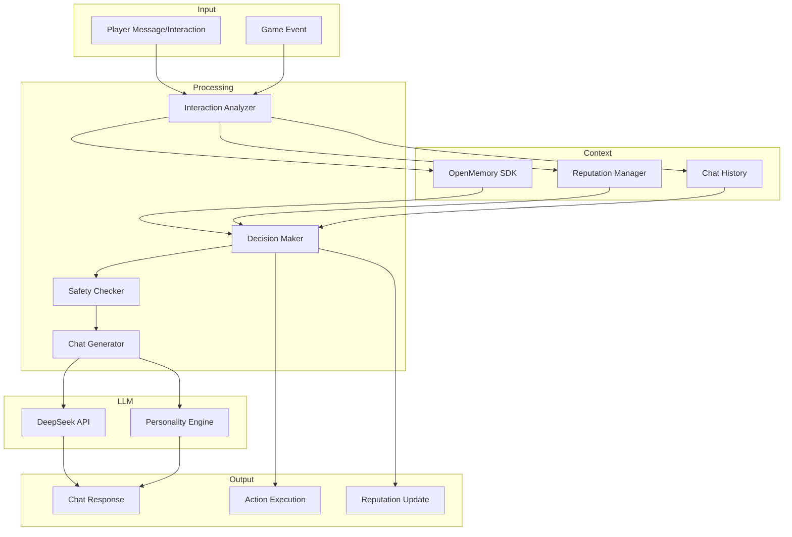

# Social Interaction System Specification

**Version:** 1.0  
**Date:** 2026-02-05  
**Status:** Final Specification  
**Priority:** Critical

---

## Document Overview

This specification defines the complete social interaction system for the OpenKore Advanced AI, enabling human-like communication and intelligent response to all player interactions in Ragnarok Online.

**Key Features:**
- Natural language chat generation via DeepSeek LLM
- Personality-driven responses with emotional awareness
- 7+ interaction categories (chat, buff, trade, duel, party, guild, other)
- Player reputation system with 6 trust tiers
- Context-aware decision making
- Scam detection and safety measures
- Multi-language support with auto-detection

**Related Documents:**
- [`02-data-structures-reference.md`](02-data-structures-reference.md) - Data structures
- [`05-coordinator-specifications.md`](05-coordinator-specifications.md) - Social Coordinator
- [`07-configuration-reference.md`](07-configuration-reference.md) - Configuration
- [`01-ipc-protocol-specification.md`](01-ipc-protocol-specification.md) - API endpoints
- [`CRITICAL-ENHANCEMENTS-PLAN.md`](../CRITICAL-ENHANCEMENTS-PLAN.md) - Implementation plan

---

## Table of Contents

1. [Overview](#1-overview)
2. [Human-Like Chat System](#2-human-like-chat-system)
3. [Interaction Categories](#3-interaction-categories)
4. [Player Reputation System](#4-player-reputation-system)
5. [Decision Framework](#5-decision-framework)
6. [Data Structures](#6-data-structures)
7. [SQLite Database Schemas](#7-sqlite-database-schemas)
8. [Configuration Reference](#8-configuration-reference)
9. [C++ Implementation](#9-c-implementation)
10. [Python Implementation](#10-python-implementation)
11. [Perl Integration](#11-perl-integration)
12. [API Endpoints](#12-api-endpoints)
13. [Testing Strategies](#13-testing-strategies)
14. [Production Considerations](#14-production-considerations)

---

## 1. Overview

### 1.1 Purpose

The Social Interaction System enables the bot to:
- Communicate naturally with players using LLM-generated chat
- Make intelligent decisions about all social interactions
- Build and maintain player relationships through reputation tracking
- Detect and avoid scams, griefers, and spam
- Participate in party, guild, and community activities

### 1.2 Architecture



### 1.3 Design Principles

1. **Human-Like Behavior**: Indistinguishable from real players
2. **Safety First**: Always check for scams, griefing, spam
3. **Context Awareness**: Consider game state, history, relationships
4. **Personality Consistency**: Maintain consistent personality traits
5. **Configurable**: Adjustable behavior policies
6. **Performance**: Fast decision making (< 100ms for most interactions)

---

## 2. Human-Like Chat System

### 2.1 Natural Language Generation

**LLM-Powered Chat:**
- Uses DeepSeek API for cost-effective generation
- Contextual prompts with personality traits
- Conversation history from OpenMemory
- Emotional state awareness

**Key Features:**
- Non-template based (each response unique)
- Considers sender relationship
- Matches conversation tone and style
- Avoids repetitive phrases
- Uses gaming slang appropriately

### 2.2 Personality Engine

```cpp
struct PersonalityConfig {
    std::string personality_type;  // "friendly", "professional", "casual", "sarcastic", "shy"
    
    struct Traits {
        float friendliness;      // 0.0 (cold) to 1.0 (very friendly)
        float chattiness;        // 0.0 (quiet) to 1.0 (very chatty)
        float formality;         // 0.0 (casual) to 1.0 (formal)
        float humor;             // 0.0 (serious) to 1.0 (joking)
        float helpfulness;       // 0.0 (selfish) to 1.0 (very helpful)
        float patience;          // 0.0 (impatient) to 1.0 (very patient)
        float confidence;        // 0.0 (shy) to 1.0 (confident)
        float enthusiasm;        // 0.0 (bored) to 1.0 (excited)
    } traits;
    
    struct LanguageStyle {
        std::vector<std::string> preferred_languages;  // ["en", "pt", "es"]
        std::string default_language = "en";
        bool auto_detect_language = true;
        bool use_slang = true;
        bool use_emoji = true;
        bool use_abbreviations = true;
        float emoji_frequency = 0.15;  // 15% of messages
        float slang_frequency = 0.25;  // 25% chance per message
    } language_style;
    
    struct Authenticity {
        bool enable_typos = true;
        float typo_rate = 0.03;  // 3% chance per message
        bool vary_message_length = true;
        bool vary_response_time = true;
        uint32_t min_response_time_ms = 500;
        uint32_t max_response_time_ms = 5000;
        std::vector<std::string> common_phrases;  // Personal catchphrases
        std::vector<std::string> favorite_emojis;  // Preferred emojis
    } authenticity;
    
    struct EmotionalProfile {
        std::string default_emotion = "neutral";
        float emotional_sensitivity = 0.5;  // How much game events affect emotion
        float emotion_decay_rate = 0.1;     // How fast emotions return to neutral
        std::map<std::string, float> emotion_tendencies;  // Likelihood of each emotion
    } emotional_profile;
};
```

**Personality Types:**

1. **Friendly** (Default)
   - High friendliness (0.8), chattiness (0.7), helpfulness (0.8)
   - Responds warmly to everyone
   - Uses positive emojis frequently
   - Quick to help others

2. **Professional**
   - High formality (0.8), patience (0.9), low humor (0.2)
   - Polite and efficient communication
   - Minimal emoji/slang usage
   - Focuses on objectives

3. **Casual**
   - Low formality (0.2), high slang usage, high abbreviations
   - Relaxed communication style
   - Frequent use of "lol", "brb", "afk"
   - Uses emojis liberally

4. **Sarcastic**
   - High humor (0.9), low patience (0.3), moderate friendliness (0.5)
   - Witty responses
   - Occasional sarcastic remarks
   - Playful banter

5. **Shy**
   - Low chattiness (0.3), low confidence (0.3), high patience (0.8)
   - Brief responses
   - Prefers listening to talking
   - Takes time to open up

### 2.3 Chat Context Management

```cpp
struct ChatContext {
    std::string conversation_id;
    std::string sender_id;
    std::string sender_name;
    ChatChannel channel;  // WHISPER, PARTY, GUILD, PUBLIC
    
    struct ConversationHistory {
        std::vector<ChatMessage> messages;
        uint32_t max_history = 20;
        Timestamp conversation_started;
        Timestamp last_message;
        uint32_t total_messages;
    } history;
    
    struct SenderInfo {
        float reputation_score;
        std::string relationship;  // "stranger", "acquaintance", "friend", "guild", "trusted"
        uint32_t interaction_count;
        std::vector<std::string> past_topics;
        std::optional<std::string> language_preference;
        std::optional<std::string> detected_personality;
    } sender_info;
    
    struct EmotionalContext {
        std::string our_emotion;         // "neutral", "happy", "frustrated", "excited", "sad"
        float emotion_intensity;         // 0.0 to 1.0
        std::string emotion_cause;       // "just leveled up", "died recently", "got rare drop"
        std::string sender_emotion;      // Detected from message
    } emotional_context;
    
    struct GameContext {
        std::string current_activity;    // "farming", "resting", "in_combat", "idle"
        bool is_busy;
        std::string current_map;
        bool in_party;
        bool in_guild;
    } game_context;
    
    bool requires_response() const;
    std::string getContextSummary() const;
};

struct ChatMessage {
    std::string message_id;
    Timestamp timestamp;
    std::string sender_name;
    std::string content;
    ChatChannel channel;
    bool is_outgoing;
    std::optional<std::string> detected_language;
    std::optional<std::string> detected_emotion;
};
```

### 2.4 LLM Prompt Generation

```cpp
std::string buildChatPrompt(
    const ChatContext& context,
    const std::string& incoming_message,
    const PersonalityConfig& personality) {
    
    std::stringstream prompt;
    
    // System role
    prompt << "You are roleplaying as a human player in Ragnarok Online.\n";
    prompt << "Respond naturally and briefly to the incoming message.\n\n";
    
    // Personality
    prompt << "**Your Personality:**\n";
    prompt << "- Type: " << personality.personality_type << "\n";
    prompt << "- Friendliness: " << formatPercent(personality.traits.friendliness) << "\n";
    prompt << "- Chattiness: " << formatPercent(personality.traits.chattiness) << "\n";
    prompt << "- Formality: " << formatPercent(personality.traits.formality) << "\n";
    prompt << "- Humor: " << formatPercent(personality.traits.humor) << "\n\n";
    
    // Current mood
    prompt << "**Your Current Mood:** " << context.emotional_context.our_emotion;
    if (!context.emotional_context.emotion_cause.empty()) {
        prompt << " (because: " << context.emotional_context.emotion_cause << ")";
    }
    prompt << "\n\n";
    
    // Relationship context
    prompt << "**About the Sender:**\n";
    prompt << "- Name: " << context.sender_name << "\n";
    prompt << "- Relationship: " << context.sender_info.relationship << "\n";
    prompt << "- Reputation: " << formatReputation(context.sender_info.reputation_score) << "\n";
    prompt << "- Past interactions: " << context.sender_info.interaction_count << "\n\n";
    
    // Conversation history
    if (!context.history.messages.empty()) {
        prompt << "**Recent Conversation:**\n";
        for (const auto& msg : context.history.messages) {
            prompt << msg.sender_name << ": " << msg.content << "\n";
        }
        prompt << "\n";
    }
    
    // Current activity
    prompt << "**What You're Doing:** " << context.game_context.current_activity << "\n";
    if (context.game_context.is_busy) {
        prompt << "(You're somewhat busy, keep responses brief)\n";
    }
    prompt << "\n";
    
    // Incoming message
    prompt << "**Incoming Message:** \"" << incoming_message << "\"\n\n";
    
    // Instructions
    prompt << "**Response Guidelines:**\n";
    prompt << "1. Respond naturally as a human player would\n";
    prompt << "2. Match your personality traits\n";
    prompt << "3. Keep response brief (5-30 words typically)\n";
    prompt << "4. Use casual language appropriate for gaming\n";
    
    if (personality.language_style.use_emoji && randomFloat(0, 1) < personality.language_style.emoji_frequency) {
        prompt << "5. You may use 1-2 emojis if it feels natural\n";
    }
    
    if (personality.language_style.use_slang && randomFloat(0, 1) < personality.language_style.slang_frequency) {
        prompt << "6. Use gaming slang when appropriate (gg, brb, afk, etc.)\n";
    }
    
    prompt << "\n**Respond with ONLY the chat message (no quotes, no meta-commentary):**\n";
    
    return prompt.str();
}
```

### 2.5 Typing Simulation

```cpp
class TypingSimulator {
public:
    struct TypingMetrics {
        uint32_t chars_per_second = 8;  // Average typing speed
        float variation = 0.3;            // ±30% variation
        uint32_t think_time_ms = 500;     // Time before starting to type
        uint32_t min_delay_ms = 200;      // Minimum delay
        uint32_t max_delay_ms = 5000;     // Maximum delay
    };
    
    uint32_t calculateResponseDelay(const std::string& message, const TypingMetrics& metrics) {
        // Base delay from message length
        uint32_t typing_time = (message.length() * 1000) / metrics.chars_per_second;
        
        // Add thinking time
        uint32_t total_time = metrics.think_time_ms + typing_time;
        
        // Apply variation
        float variation_factor = 1.0f + randomFloat(-metrics.variation, metrics.variation);
        total_time = static_cast<uint32_t>(total_time * variation_factor);
        
        // Clamp to bounds
        total_time = std::clamp(total_time, metrics.min_delay_ms, metrics.max_delay_ms);
        
        return total_time;
    }
};
```

### 2.6 Authenticity Features

**Typo Injection:**
```cpp
class TypoInjector {
public:
    std::string injectTypos(const std::string& message, float typo_rate) {
        if (randomFloat(0, 1) > typo_rate) {
            return message;  // No typo
        }
        
        std::string result = message;
        std::vector<TypoType> typo_types = {
            TypoType::SWAP_ADJACENT,      // "hte" instead of "the"
            TypoType::DUPLICATE_CHAR,     // "helllo" instead of "hello"
            TypoType::MISSING_CHAR,       // "helo" instead of "hello"
            TypoType::WRONG_CASE,         // "HEllo" instead of "Hello"
            TypoType::EXTRA_SPACE         // "he llo" instead of "hello"
        };
        
        // Pick random typo type and location
        auto typo = randomChoice(typo_types);
        size_t pos = randomInt(0, message.length() - 1);
        
        switch (typo) {
            case TypoType::SWAP_ADJACENT:
                if (pos > 0 && pos < message.length() - 1) {
                    std::swap(result[pos], result[pos + 1]);
                }
                break;
                
            case TypoType::DUPLICATE_CHAR:
                result.insert(pos, 1, result[pos]);
                break;
                
            case TypoType::MISSING_CHAR:
                result.erase(pos, 1);
                break;
                
            // ... other typo types
        }
        
        return result;
    }
};
```

**Slang/Emoji Injection:**
```cpp
class LanguageStyler {
public:
    std::string applyStyle(const std::string& message, const PersonalityConfig::LanguageStyle& style) {
        std::string result = message;
        
        // Replace common phrases with slang
        if (style.use_slang) {
            static const std::map<std::string, std::vector<std::string>> slang_replacements = {
                {"okay", {"ok", "k", "kk"}},
                {"yes", {"ye", "yea", "yeah", "yep"}},
                {"no", {"nah", "nope"}},
                {"thank you", {"ty", "thx", "thanks"}},
                {"be right back", {"brb"}},
                {"away from keyboard", {"afk"}},
                {"good game", {"gg"}},
                {"good luck", {"gl"}},
                {"have fun", {"hf"}},
                {"laugh out loud", {"lol"}},
                {"oh my god", {"omg"}}
            };
            
            for (const auto& [formal, slangs] : slang_replacements) {
                size_t pos = result.find(formal);
                if (pos != std::string::npos && randomFloat(0, 1) < style.slang_frequency) {
                    result.replace(pos, formal.length(), randomChoice(slangs));
                }
            }
        }
        
        // Add emoji at end if appropriate
        if (style.use_emoji && randomFloat(0, 1) < style.emoji_frequency) {
            const std::vector<std::string>& emojis = style.favorite_emojis.empty() 
                ? getDefaultEmojis() 
                : style.favorite_emojis;
            result += " " + randomChoice(emojis);
        }
        
        return result;
    }
    
private:
    std::vector<std::string> getDefaultEmojis() {
        return {"😊", "🙂", "👍", "😅", "😂", "❤️", "🎉", "😢", "😎", "🤔"};
    }
};
```

### 2.7 Multi-Language Support

```cpp
class LanguageDetector {
public:
    std::string detectLanguage(const std::string& message) {
        // Simple heuristic-based detection
        // In production, use ML-based detector or API
        
        // Check for language-specific characters
        if (containsCyrillic(message)) return "ru";
        if (containsChinese(message)) return "zh";
        if (containsJapanese(message)) return "ja";
        if (containsKorean(message)) return "ko";
        
        // Check for common words
        if (containsPortugueseWords(message)) return "pt";
        if (containsSpanishWords(message)) return "es";
        if (containsGermanWords(message)) return "de";
        if (containsFrenchWords(message)) return "fr";
        
        // Default to English
        return "en";
    }
    
private:
    bool containsPortugueseWords(const std::string& msg) {
        static const std::vector<std::string> indicators = {
            "ola", "obrigado", "sim", "nao", "como", "esta", "voce"
        };
        return containsAny(msg, indicators);
    }
    
    // ... similar for other languages
};
```

---

## 3. Interaction Categories

### 3.1 Chat Interactions

#### 3.1.1 Private Messages (Whispers)

**Decision Logic:**
```cpp
struct WhisperPolicy {
    bool respond_to_strangers = false;
    bool respond_to_friends = true;
    bool respond_to_guild = true;
    bool respond_to_party = true;
    ReputationTier min_reputation = ReputationTier::NEUTRAL;
    
    bool ignore_keywords_enabled = true;
    std::vector<std::string> ignore_keywords = {
        "buy", "sell", "trade", "zeny", "AD:", "WTS", "WTB"
    };
    
    bool auto_block_spam = true;
    uint32_t max_messages_per_minute = 5;
};

bool shouldRespondToWhisper(
    const Player& sender,
    const std::string& message,
    const WhisperPolicy& policy) {
    
    auto reputation = reputation_mgr_->getReputation(sender.id);
    
    // Always ignore blacklisted
    if (reputation.flags.is_blacklisted) {
        return false;
    }
    
    // Always respond to whitelisted
    if (reputation.flags.is_whitelisted) {
        return true;
    }
    
    // Check spam
    if (policy.auto_block_spam) {
        uint32_t recent_count = getRecentMessageCount(sender.id, 60);
        if (recent_count > policy.max_messages_per_minute) {
            log_warn("Spam detected from {}", sender.name);
            reputation_mgr_->adjustReputation(sender.id, -5, "Spam whispers");
            return false;
        }
    }
    
    // Check ignore keywords
    if (policy.ignore_keywords_enabled) {
        for (const auto& keyword : policy.ignore_keywords) {
            if (contains_ignore_case(message, keyword)) {
                return false;
            }
        }
    }
    
    // Check reputation threshold
    if (reputation.tier < policy.min_reputation) {
        return false;
    }
    
    // Check relationship flags
    if (reputation.flags.is_friend && policy.respond_to_friends) return true;
    if (reputation.flags.is_guild_member && policy.respond_to_guild) return true;
    if (reputation.flags.is_party_member && policy.respond_to_party) return true;
    
    return policy.respond_to_strangers;
}
```

#### 3.1.2 Party Chat

**Participation Strategy:**
```cpp
struct PartyChatPolicy {
    bool participate = true;
    float chat_frequency = 0.2;  // 20% of party messages get a response
    
    bool respond_to_questions = true;
    bool share_information = true;
    bool coordinate_strategy = true;
    
    std::vector<std::string> common_responses = {
        "nice", "gg", "ok", "sure", "ready", "omw", "brb", "ty"
    };
};

std::optional<std::string> generatePartyResponse(
    const std::string& message,
    const ChatContext& context,
    const PartyChatPolicy& policy) {
    
    // Always respond to questions directed at us
    if (isQuestionForUs(message, context)) {
        return generateLLMResponse(context, message);
    }
    
    // Respond to coordination messages
    if (isCoordinationMessage(message)) {
        return generateCoordinationResponse(message, context);
    }
    
    // Random participation based on frequency
    if (randomFloat(0, 1) < policy.chat_frequency) {
        // Use common short responses for casual chat
        if (isCasualChat(message)) {
            return randomChoice(policy.common_responses);
        }
        
        // Use LLM for more complex messages
        return generateLLMResponse(context, message);
    }
    
    return std::nullopt;  // Don't respond
}
```

#### 3.1.3 Guild Chat

Similar to party chat but with additional guild-specific responses:
- WoE (War of Emperium) coordination
- Guild event participation
- Resource requests/offers
- Guild politics (keep neutral)

#### 3.1.4 Public/Proximity Chat

```cpp
struct PublicChatPolicy {
    bool respond = false;  // Usually ignore public chat
    bool respond_if_mentioned = true;
    bool respond_to_friends_in_public = false;
    
    // Only respond to these types in public
    bool respond_to_help_requests = false;
    bool respond_to_questions_about_game = false;
};
```

### 3.2 Buff Interactions

#### 3.2.1 Buff Acceptance

```cpp
struct BuffAcceptancePolicy {
    bool accept_from_anyone = false;
    bool accept_from_party = true;
    bool accept_from_guild = true;
    bool accept_from_friends = true;
    ReputationTier min_reputation = ReputationTier::NEUTRAL;
    
    std::vector<std::string> always_accept = {
        "Blessing", "Increase AGI", "Kyrie Eleison", "Aspersio",
        "Impositio Manus", "Gloria", "Magnificat"
    };
    
    std::vector<std::string> never_accept = {
        // Potentially harmful buffs
    };
    
    bool reject_in_pvp_maps = true;
    bool reject_from_suspicious = true;
};

bool shouldAcceptBuff(
    const Player& caster,
    const Skill& buff,
    const GameState& state,
    const BuffAcceptancePolicy& policy) {
    
    // Check never accept list
    if (contains(policy.never_accept, buff.name)) {
        return false;
    }
    
    // Check always accept list
    if (contains(policy.always_accept, buff.name)) {
        // But still check PvP map restriction
        if (policy.reject_in_pvp_maps && state.is_pvp_map) {
            return false;
        }
        return true;
    }
    
    auto reputation = reputation_mgr_->getReputation(caster.id);
    
    // Never accept from blacklisted
    if (reputation.flags.is_blacklisted) {
        return false;
    }
    
    // Always accept from whitelisted
    if (reputation.flags.is_whitelisted) {
        return true;
    }
    
    // Check suspicious players
    if (policy.reject_from_suspicious && reputation.tier == ReputationTier::SUSPICIOUS) {
        return false;
    }
    
    // Check relationship
    if (reputation.flags.is_party_member && policy.accept_from_party) return true;
    if (reputation.flags.is_guild_member && policy.accept_from_guild) return true;
    if (reputation.flags.is_friend && policy.accept_from_friends) return true;
    
    // Check reputation tier
    if (reputation.tier >= policy.min_reputation && policy.accept_from_anyone) {
        return true;
    }
    
    return false;
}
```

#### 3.2.2 Buff Reciprocation

```cpp
void handleBuffReceived(const Player& caster, const Skill& buff) {
    // Record buff received
    interaction_history_->recordInteraction({
        .type = InteractionType::BUFF_RECEIVED,
        .player_id = caster.id,
        .data = json{{"buff", buff.name}},
        .outcome = "accepted"
    });
    
    // Adjust reputation positively
    reputation_mgr_->adjustReputation(caster.id, +2, "Gave helpful buff");
    
    // Schedule gratitude response
    if (randomFloat(0, 1) < 0.7) {  // 70% chance
        std::this_thread::sleep_for(std::chrono::seconds(1 + randomInt(0, 2)));
        sendChatMessage(ChatChannel::WHISPER, caster.name, generateThankYouMessage());
    }
    
    // Schedule reciprocal buff if possible
    if (canCastBuffs() && shouldReciprocate(caster)) {
        scheduleReciprocalBuff(caster.id, buff);
    }
}

bool shouldReciprocate(const Player& player) {
    auto reputation = reputation_mgr_->getReputation(player.id);
    
    // Always reciprocate to friends/guild
    if (reputation.flags.is_friend || reputation.flags.is_guild_member) {
        return true;
    }
    
    // 80% chance for positive reputation
    if (reputation.tier >= ReputationTier::FRIENDLY) {
        return randomFloat(0, 1) < 0.8;
    }
    
    // 50% chance for neutral
    if (reputation.tier == ReputationTier::NEUTRAL) {
        return randomFloat(0, 1) < 0.5;
    }
    
    return false;
}

std::string generateThankYouMessage() {
    std::vector<std::string> thanks_messages = {
        "ty", "thx", "thanks!", "thank you", "appreciate it",
        "thanks bro", "ty!", "thx!", "much appreciated"
    };
    return randomChoice(thanks_messages);
}
```

### 3.3 Trade Interactions

#### 3.3.1 Trade Request Evaluation

```cpp
struct TradePolicy {
    bool accept_trades = true;
    ReputationTier min_reputation = ReputationTier::FRIENDLY;
    bool allow_guild_trades = true;
    bool allow_friend_trades = true;
    
    bool require_fair_value = true;
    float max_value_deviation = 0.2;  // ±20%
    
    bool allow_buying = true;
    bool allow_selling = true;
    bool allow_free_items = false;  // Suspicious
    
    uint32_t high_value_threshold = 1000000;  // 1M zeny
    ReputationTier high_value_min_reputation = ReputationTier::TRUSTED;
};

enum class TradeDecision {
    ACCEPT,
    REJECT_POLITELY,
    REJECT_SILENTLY,
    NEGOTIATE,
    REPORT_SCAM
};

TradeDecision evaluateTradeRequest(
    const Player& trader,
    const TradeOffer& offer,
    const GameState& state,
    const TradePolicy& policy) {
    
    auto reputation = reputation_mgr_->getReputation(trader.id);
    
    // Auto-reject blacklisted
    if (reputation.flags.is_blacklisted) {
        return TradeDecision::REJECT_SILENTLY;
    }
    
    // Check if busy
    if (state.in_combat || state.in_dungeon) {
        return TradeDecision::REJECT_POLITELY;  // "sry busy atm"
    }
    
    // Calculate trade value
    auto valuation = evaluateTradeValue(offer);
    
    // Check for scam
    if (valuation.is_scam) {
        log_warn("Scam detected from {}: {}", trader.name, valuation.scam_reason);
        reputation_mgr_->adjustReputation(trader.id, -30, "Attempted trade scam");
        return TradeDecision::REPORT_SCAM;
    }
    
    // Check high-value trade restrictions
    if (valuation.total_value > policy.high_value_threshold) {
        if (reputation.tier < policy.high_value_min_reputation) {
            return TradeDecision::REJECT_POLITELY;  // "sry dont trade high value with strangers"
        }
    }
    
    // Check if fair trade
    if (policy.require_fair_value && !valuation.is_fair) {
        float deviation = std::abs(valuation.fair_value_ratio - 1.0f);
        
        if (deviation > policy.max_value_deviation) {
            if (valuation.fair_value_ratio < 1.0f - policy.max_value_deviation) {
                // They're undervaluing our items
                return TradeDecision::NEGOTIATE;  // Counteroffer
            } else {
                // They're overcharging
                return TradeDecision::REJECT_POLITELY;  // "too expensive"
            }
        }
    }
    
    // Check reputation
    if (reputation.tier < policy.min_reputation) {
        // Unless they're guild/friend
        if (!(reputation.flags.is_guild_member && policy.allow_guild_trades) &&
            !(reputation.flags.is_friend && policy.allow_friend_trades)) {
            return TradeDecision::REJECT_POLITELY;
        }
    }
    
    // Accept fair trades from acceptable players
    if (valuation.is_fair) {
        return TradeDecision::ACCEPT;
    }
    
    return TradeDecision::REJECT_POLITELY;
}
```

#### 3.3.2 Scam Detection

```cpp
struct TradeValuation {
    bool is_scam = false;
    std::string scam_reason;
    bool is_fair = false;
    float fair_value_ratio = 0.0f;  // our_value / their_value
    uint64_t total_value = 0;
    uint64_t our_value = 0;
    uint64_t their_value = 0;
};

TradeValuation evaluateTradeValue(const TradeOffer& offer) {
    TradeValuation result;
    
    // Calculate values
    result.our_value = calculateItemsValue(offer.our_items);
    result.their_value = calculateItemsValue(offer.their_items) + offer.zeny_offered;
    result.total_value = result.our_value + result.their_value;
    
    // Scam detection
    
    // 1. Free valuable items (very suspicious)
    if (result.their_value > 100000 && result.our_value == 0) {
        result.is_scam = true;
        result.scam_reason = "Free valuable items offered (likely scam)";
        return result;
    }
    
    // 2. Extreme overpricing (>300% of value)
    if (result.our_value > 0) {
        float ratio = static_cast<float>(result.their_value) / result.our_value;
        if (ratio > 3.0f) {
            result.is_scam = true;
            result.scam_reason = "Extreme overpricing detected";
            return result;
        }
    }
    
    // 3. Known scam items
    for (const auto& item : offer.their_items) {
        if (isKnownScamItem(item)) {
            result.is_scam = true;
            result.scam_reason = "Known scam item: " + item.name;
            return result;
        }
    }
    
    // Calculate fairness
    if (result.our_value > 0 && result.their_value > 0) {
        result.fair_value_ratio = static_cast<float>(result.our_value) / result.their_value;
        // Fair if within ±20%
        result.is_fair = (result.fair_value_ratio >= 0.8f && result.fair_value_ratio <= 1.2f);
    } else if (result.our_value == 0 && result.their_value == 0) {
        result.is_fair = true;  // Both sides empty (just looking)
    }
    
    return result;
}

uint64_t calculateItemsValue(const std::vector<Item>& items) {
    uint64_t total = 0;
    
    for (const auto& item : items) {
        // Get market price from database
        auto price = item_value_db_->getPrice(item.id);
        
        if (price) {
            total += *price * item.amount;
        } else {
            // Use NPC price as fallback
            total += item.npc_price * item.amount;
        }
    }
    
    return total;
}
```

### 3.4 Party Interactions

#### 3.4.1 Party Invite Handling

```cpp
PartyInviteDecision evaluatePartyInvite(
    const Player& inviter,
    const GameState& state) {
    
    auto reputation = reputation_mgr_->getReputation(inviter.id);
    
    // Auto-accept from guild
    if (reputation.flags.is_guild_member) {
        return {
            .accept = true,
            .response_message = "sure!",
            .reasoning = "Guild member invitation"
        };
    }
    
    // Auto-accept from friends
    if (reputation.flags.is_friend) {
        return {
            .accept = true,
            .response_message = "ok",
            .reasoning = "Friend invitation"
        };
    }
    
    // Check for spam invites
    uint32_t recent_invites = getRecentInvitesFrom(inviter.id, 3600);  // Last hour
    if (recent_invites > 2) {
        reputation_mgr_->adjustReputation(inviter.id, -10, "Spam party invites");
        return {
            .accept = false,
            .response_message = std::nullopt,  // Silent ignore
            .reasoning = "Spam invites"
        };
    }
    
    // Check if busy
    if (state.has_active_quest || state.farming_specific_objective) {
        return {
            .accept = false,
            .response_message = "sry doing quest rn",
            .reasoning = "Busy with quest"
        };
    }
    
    // Check reputation
    if (reputation.tier >= ReputationTier::FRIENDLY) {
        return {
            .accept = true,
            .response_message = "sure why not",
            .reasoning = "Friendly player, not busy"
        };
    }
    
    // Neutral players - random acceptance
    if (reputation.tier == ReputationTier::NEUTRAL) {
        if (randomFloat(0, 1) < 0.5) {
            return {
                .accept = true,
                .response_message = "ok",
                .reasoning = "Random acceptance from neutral"
            };
        }
    }
    
    // Default polite rejection
    return {
        .accept = false,
        .response_message = "sry soloing atm",
        .reasoning = "Default rejection"
    };
}
```

### 3.5 Duel Interactions

```cpp
DuelDecision evaluateDuelRequest(const Player& challenger, const GameState& state) {
    auto reputation = reputation_mgr_->getReputation(challenger.id);
    
    // Never duel if underleveled or undergeared
    if (state.character.level < challenger.level - 10) {
        return {.accept = false, .response = "sry too low level"};
    }
    
    // Accept friendly duels from friends/guild
    if (reputation.flags.is_friend || reputation.flags.is_guild_member) {
        return {.accept = true, .response = "ok lets go", .friendly_mode = true};
    }
    
    // Decline from suspicious players
    if (reputation.tier <= ReputationTier::SUSPICIOUS) {
        return {.accept = false, .response = "nah"};
    }
    
    // Decline if busy
    if (state.in_combat || state.farming) {
        return {.accept = false, .response = "sry farming"};
    }
    
    // Random acceptance from neutral players
    if (reputation.tier >= ReputationTier::NEUTRAL && randomFloat(0, 1) < 0.3) {
        return {.accept = true, .response = "sure", .friendly_mode = true};
    }
    
    return {.accept = false, .response = "maybe later"};
}
```

---

## 4. Player Reputation System

### 4.1 Reputation Tiers

```cpp
enum class ReputationTier {
    BLOCKED = -100,      // -100 to -51: Scammers, griefers, bots
    SUSPICIOUS = -50,    // -50 to -10: Unknown with red flags
    NEUTRAL = 0,         // -9 to 49: Default for strangers
    ACQUAINTANCE = 25,   // 25 to 49: Positive but limited interactions
    FRIENDLY = 50,       // 50 to 74: Positive interactions, some trust
    TRUSTED = 75,        // 75 to 99: Guild members, proven trustworthy
    WHITELISTED = 100    // 100: Manually whitelisted (owner's alts)
};

struct PlayerReputation {
    uint32_t player_id;
    std::string player_name;
    int32_t reputation_score;  // -100 to 100
    ReputationTier tier;
    
    struct InteractionStats {
        uint32_t total_interactions;
        uint32_t positive_interactions;
        uint32_t negative_interactions;
        uint32_t ignored_count;
        Timestamp first_interaction;
        Timestamp last_interaction;
        std::chrono::duration<int64_t> total_interaction_time;
    } stats;
    
    struct BehaviorFlags {
        bool is_guild_member = false;
        bool is_friend = false;
        bool is_party_member = false;
        bool is_whitelisted = false;
        bool is_blacklisted = false;
        bool attempted_scam = false;
        bool trades_fairly = false;
        bool gives_buffs = false;
        bool helpful = false;
        bool is_spammer = false;
        bool is_bot = false;
    } flags;
    
    std::vector<std::string> interaction_history;  // Last 10 interactions
    std::optional<std::string> notes;  // Manual notes
    std::optional<std::string> detected_personality;
    std::optional<std::string> preferred_language;
    
    void adjustReputation(int32_t delta, const std::string& reason);
    ReputationTier calculateTier() const;
    bool shouldInteract(InteractionType type) const;
};
```

### 4.2 Reputation Adjustment Rules

```cpp
class ReputationManager {
public:
    void adjustReputation(uint32_t player_id, int32_t delta, const std::string& reason) {
        auto& rep = getOrCreateReputation(player_id);
        
        int32_t old_score = rep.reputation_score;
        rep.reputation_score = std::clamp(rep.reputation_score + delta, -100, 100);
        
        // Update tier
        rep.tier = calculateTier(rep.reputation_score);
        
        // Log change
        log_info("Reputation change for {}: {} -> {} ({})",
                rep.player_name, old_score, rep.reputation_score, reason);
        
        // Store in database
        db_->updateReputation(rep);
        
        // Check for tier change
        if (calculateTier(old_score) != rep.tier) {
            onReputationTierChanged(rep, reason);
        }
    }
    
    ReputationTier calculateTier(int32_t score) {
        if (score >= 100) return ReputationTier::WHITELISTED;
        if (score >= 75) return ReputationTier::TRUSTED;
        if (score >= 50) return ReputationTier::FRIENDLY;
        if (score >= 25) return ReputationTier::ACQUAINTANCE;
        if (score >= -9) return ReputationTier::NEUTRAL;
        if (score >= -50) return ReputationTier::SUSPICIOUS;
        return ReputationTier::BLOCKED;
    }
    
private:
    void onReputationTierChanged(const PlayerReputation& rep, const std::string& reason) {
        log_info("{} reputation tier changed to: {}",
                rep.player_name, tierToString(rep.tier));
        
        // Take action based on new tier
        if (rep.tier == ReputationTier::BLOCKED) {
            // Auto-blacklist
            rep.flags.is_blacklisted = true;
            log_warn("{} has been auto-blacklisted", rep.player_name);
        }
    }
};
```

**Common Reputation Adjustments:**

| Action | Delta | Reason |
|--------|-------|--------|
| Gave helpful buff | +2 | Positive interaction |
| Fair trade completed | +5 | Trustworthy behavior |
| Helped in combat | +3 | Cooperative |
| Shared information | +1 | Helpful |
| Friendly chat | +1 | Social |
| Reciprocated buff | +2 | Cooperative |
| | | |
| Attempted scam | -30 | Malicious |
| Unfair trade | -10 | Untrustworthy |
| Spam messages | -5 | Annoying |
| Kill stealing | -5 | Griefing |
| Harassment | -15 | Toxic |
| Bot-like behavior | -20 | Suspicious |

### 4.3 Automatic Reputation Updates

```cpp
void handlePositiveInteraction(uint32_t player_id, InteractionType type) {
    switch (type) {
        case InteractionType::BUFF_GIVEN:
            adjustReputation(player_id, +2, "Gave helpful buff");
            break;
            
        case InteractionType::TRADE_COMPLETED:
            adjustReputation(player_id, +5, "Fair trade");
            break;
            
        case InteractionType::PARTY_COOPERATION:
            adjustReputation(player_id, +3, "Good party member");
            break;
            
        case InteractionType::INFORMATION_SHARED:
            adjustReputation(player_id, +1, "Shared info");
            break;
            
        case InteractionType::FRIENDLY_CHAT:
            adjustReputation(player_id, +1, "Friendly chat");
            break;
    }
}

void handleNegativeInteraction(uint32_t player_id, InteractionType type) {
    switch (type) {
        case InteractionType::SCAM_ATTEMPT:
            adjustReputation(player_id, -30, "Attempted scam");
            break;
            
        case InteractionType::UNFAIR_TRADE:
            adjustReputation(player_id, -10, "Unfair trade");
            break;
            
        case InteractionType::SPAM:
            adjustReputation(player_id, -5, "Spam");
            break;
            
        case InteractionType::KILL_STEAL:
            adjustReputation(player_id, -5, "Kill stealing");
            break;
            
        case InteractionType::HARASSMENT:
            adjustReputation(player_id, -15, "Harassment");
            break;
    }
}
```

---

## 5. Decision Framework

### 5.1 Context-Aware Decisions

```cpp
class InteractionDecisionMaker {
public:
    struct DecisionContext {
        GameState game_state;
        PlayerReputation sender_reputation;
        ChatContext chat_context;
        std::vector<RecentInteraction> recent_interactions;
        EmotionalState emotional_state;
        PersonalityConfig personality;
    };
    
    InteractionDecision evaluate(
        const InteractionRequest& request,
        const DecisionContext& context) {
        
        // Safety checks first
        if (!passedSafetyChecks(request, context)) {
            return createRejectDecision("Safety check failed");
        }
        
        // Check if busy
        if (context.game_state.is_busy && !isUrgent(request)) {
            return createBusyDecision(request.type);
        }
        
        // Evaluate based on interaction type
        switch (request.type) {
            case InteractionType::CHAT_WHISPER:
                return evaluateWhisperInteraction(request, context);
                
            case InteractionType::BUFF_OFFER:
                return evaluateBuffInteraction(request, context);
                
            case InteractionType::TRADE_REQUEST:
                return evaluateTradeInteraction(request, context);
                
            case InteractionType::PARTY_INVITE:
                return evaluatePartyInteraction(request, context);
                
            case InteractionType::DUEL_REQUEST:
                return evaluateDuelInteraction(request, context);
                
            default:
                return createDefaultDecision(request, context);
        }
    }
    
private:
    bool passedSafetyChecks(const InteractionRequest& request, const DecisionContext& context) {
        // Check blacklist
        if (context.sender_reputation.flags.is_blacklisted) {
            log_debug("Interaction blocked: sender is blacklisted");
            return false;
        }
        
        // Check for known scammer
        if (context.sender_reputation.flags.attempted_scam) {
            log_warn("Interaction blocked: known scammer");
            return false;
        }
        
        // Check for spam
        if (isSpamming(request, context)) {
            log_warn("Interaction blocked: spam detected");
            return false;
        }
        
        // PvP map safety
        if (context.game_state.is_pvp_map && isRiskyInteraction(request.type)) {
            log_debug("Interaction blocked: risky on PvP map");
            return false;
        }
        
        return true;
    }
    
    bool isSpamming(const InteractionRequest& request, const DecisionContext& context) {
        auto recent = getRecentInteractionsFrom(
            request.sender_id,
            std::chrono::minutes(5)
        );
        
        // More than 10 interactions in 5 minutes = spam
        return recent.size() > 10;
    }
};
```

### 5.2 Priority System

```cpp
enum class InteractionPriority {
    CRITICAL,   // Emergency (being attacked in party)
    HIGH,       // Important (guild leader message, party coordination)
    NORMAL,     // Regular (friend chat, buff offer)
    LOW         // Optional (stranger whisper, public chat)
};

InteractionPriority calculatePriority(
    const InteractionRequest& request,
    const DecisionContext& context) {
    
    // Guild leader messages are high priority
    if (context.sender_reputation.flags.is_guild_member && isGuildLeader(request.sender_id)) {
        return InteractionPriority::HIGH;
    }
    
    // Party coordination is high priority
    if (request.type == InteractionType::PARTY_COORDINATION) {
        return InteractionPriority::HIGH;
    }
    
    // Emergency situations
    if (request.is_emergency) {
        return InteractionPriority::CRITICAL;
    }
    
    // Friends and guild members are normal priority
    if (context.sender_reputation.flags.is_friend ||
        context.sender_reputation.flags.is_guild_member) {
        return InteractionPriority::NORMAL;
    }
    
    // Everything else is low priority
    return InteractionPriority::LOW;
}
```

---

## 6. Data Structures

### 6.1 Core Structures

```cpp
struct InteractionRequest {
    std::string request_id;
    Timestamp timestamp;
    InteractionType type;
    uint32_t sender_id;
    std::string sender_name;
    json data;  // Type-specific data
    InteractionPriority priority;
    bool is_emergency;
};

struct InteractionDecision {
    bool accept;
    std::optional<std::string> response_message;
    std::optional<Action> response_action;
    std::string reasoning;
    std::vector<std::string> safety_checks_passed;
    json metadata;
};

struct InteractionHistory {
    std::string interaction_id;
    Timestamp timestamp;
    InteractionType type;
    uint32_t player_id;
    std::string player_name;
    json request_data;
    InteractionDecision decision;
    std::optional<std::string> outcome;
    int32_t reputation_delta;
};
```

### 6.2 Chat-Specific Structures

```cpp
struct ChatGenerationRequest {
    std::string conversation_id;
    ChatContext context;
    std::string incoming_message;
    PersonalityConfig personality;
    uint32_t max_response_length = 100;
    std::optional<std::string> suggested_tone;
};

struct ChatGenerationResponse {
    std::string message;
    std::string detected_language;
    std::string emotional_tone;
    uint32_t generation_time_ms;
    uint32_t suggested_delay_ms;
    float confidence;
    std::vector<std::string> alternative_responses;
};
```

---

## 7. SQLite Database Schemas

### 7.1 Player Reputation Table

```sql
CREATE TABLE player_reputation (
    player_id INTEGER PRIMARY KEY,
    player_name TEXT NOT NULL UNIQUE,
    reputation_score INTEGER NOT NULL DEFAULT 0 CHECK(reputation_score >= -100 AND reputation_score <= 100),
    reputation_tier TEXT NOT NULL DEFAULT 'neutral',
    
    -- Interaction counters
    total_interactions INTEGER DEFAULT 0,
    positive_interactions INTEGER DEFAULT 0,
    negative_interactions INTEGER DEFAULT 0,
    ignored_count INTEGER DEFAULT 0,
    
    -- Timestamps
    first_seen INTEGER NOT NULL,
    last_seen INTEGER NOT NULL,
    last_interaction INTEGER,
    
    -- Relationship flags
    is_friend BOOLEAN DEFAULT 0,
    is_guild_member BOOLEAN DEFAULT 0,
    is_party_member BOOLEAN DEFAULT 0,
    is_whitelisted BOOLEAN DEFAULT 0,
    is_blacklisted BOOLEAN DEFAULT 0,
    
    -- Behavior flags
    attempted_scam BOOLEAN DEFAULT 0,
    trades_fairly BOOLEAN DEFAULT 0,
    gives_buffs BOOLEAN DEFAULT 0,
    helpful BOOLEAN DEFAULT 0,
    is_spammer BOOLEAN DEFAULT 0,
    is_bot BOOLEAN DEFAULT 0,
    
    -- Preferences
    preferred_language TEXT,
    detected_personality TEXT,
    chat_style TEXT,
    
    -- Notes
    notes TEXT,
    auto_notes TEXT,
    
    -- Metadata
    metadata TEXT,  -- JSON
    
    -- Indexes
    created_at INTEGER NOT NULL DEFAULT (strftime('%s', 'now')),
    updated_at INTEGER NOT NULL DEFAULT (strftime('%s', 'now'))
);

CREATE INDEX idx_reputation_score ON player_reputation(reputation_score DESC);
CREATE INDEX idx_reputation_tier ON player_reputation(reputation_tier);
CREATE INDEX idx_reputation_last_seen ON player_reputation(last_seen DESC);
CREATE INDEX idx_reputation_blacklisted ON player_reputation(is_blacklisted);
CREATE INDEX idx_reputation_name ON player_reputation(player_name);

-- Trigger to update updated_at
CREATE TRIGGER player_reputation_updated
AFTER UPDATE ON player_reputation
BEGIN
    UPDATE player_reputation SET updated_at = strftime('%s', 'now') WHERE player_id = NEW.player_id;
END;
```

### 7.2 Interaction History Table

```sql
CREATE TABLE interaction_history (
    interaction_id INTEGER PRIMARY KEY AUTOINCREMENT,
    session_id TEXT NOT NULL,
    timestamp INTEGER NOT NULL,
    
    -- Players involved
    player_id INTEGER NOT NULL,
    player_name TEXT NOT NULL,
    
    -- Interaction details
    interaction_type TEXT NOT NULL,  -- 'chat', 'buff', 'trade', 'party', 'duel'
    interaction_subtype TEXT,        -- 'whisper', 'party_chat', 'buff_received', etc.
    channel TEXT,                    -- 'whisper', 'party', 'guild', 'public'
    
    -- Content
    request_content TEXT,            -- JSON request data
    our_response TEXT,               -- What we did/said
    response_type TEXT,              -- 'accept', 'reject', 'ignore', 'negotiate'
    
    -- Outcome
    outcome TEXT NOT NULL,           -- 'accepted', 'rejected', 'completed', 'failed'
    outcome_reason TEXT,
    success BOOLEAN,
    
    -- Impact
    reputation_delta INTEGER DEFAULT 0,
    emotional_impact TEXT,           -- 'positive', 'negative', 'neutral'
    
    -- Context
    game_state TEXT,                 -- JSON snapshot of game state
    location TEXT,                   -- Map location
    decision_tier TEXT,              -- Which tier made decision
    
    -- Metadata
    metadata TEXT,                   -- JSON additional data
    
    FOREIGN KEY (session_id) REFERENCES player_sessions(session_id),
    FOREIGN KEY (player_id) REFERENCES player_reputation(player_id) ON DELETE CASCADE
);

CREATE INDEX idx_interaction_player ON interaction_history(player_id);
CREATE INDEX idx_interaction_type ON interaction_history(interaction_type);
CREATE INDEX idx_interaction_timestamp ON interaction_history(timestamp DESC);
CREATE INDEX idx_interaction_session ON interaction_history(session_id);
CREATE INDEX idx_interaction_outcome ON interaction_history(outcome);
```

### 7.3 Chat History Table

```sql
CREATE TABLE chat_history (
    chat_id INTEGER PRIMARY KEY AUTOINCREMENT,
    conversation_id TEXT NOT NULL,
    session_id TEXT NOT NULL,
    timestamp INTEGER NOT NULL,
    
    -- Message details
    channel TEXT NOT NULL,           -- 'whisper', 'party', 'guild', 'public'
    sender_id INTEGER,
    sender_name TEXT NOT NULL,
    recipient_id INTEGER,
    recipient_name TEXT,
    
    -- Content
    message_content TEXT NOT NULL,
    message_language TEXT,           -- Detected language
    message_length INTEGER,
    
    -- Direction
    is_outgoing BOOLEAN DEFAULT 0,
    generated_by TEXT,               -- 'llm', 'template', 'manual', null for incoming
    personality_used TEXT,           -- Personality profile used
    
    -- Context
    emotional_state TEXT,            -- Our emotion when sending/receiving
    game_context TEXT,               -- JSON: what we were doing
    
    -- Response tracking
    is_response_to INTEGER,          -- chat_id of message we're responding to
    requires_response BOOLEAN DEFAULT 0,
    response_generated BOOLEAN DEFAULT 0,
    response_delay_ms INTEGER,       -- Delay before sending (if outgoing)
    
    -- Analysis
    detected_emotion TEXT,           -- Emotion detected in message
    detected_intent TEXT,            -- Intent (question, statement, request, etc.)
    spam_score REAL DEFAULT 0.0,     -- 0.0 to 1.0
    
    -- Metadata
    metadata TEXT,                   -- JSON
    
    FOREIGN KEY (session_id) REFERENCES player_sessions(session_id),
    FOREIGN KEY (sender_id) REFERENCES player_reputation(player_id) ON DELETE SET NULL,
    FOREIGN KEY (is_response_to) REFERENCES chat_history(chat_id) ON DELETE SET NULL
);

CREATE INDEX idx_chat_conversation ON chat_history(conversation_id);
CREATE INDEX idx_chat_channel ON chat_history(channel);
CREATE INDEX idx_chat_timestamp ON chat_history(timestamp DESC);
CREATE INDEX idx_chat_sender ON chat_history(sender_id);
CREATE INDEX idx_chat_requires_response ON chat_history(requires_response) WHERE requires_response = 1;
CREATE INDEX idx_chat_session ON chat_history(session_id);
```

### 7.4 Trade History Table

```sql
CREATE TABLE trade_history (
    trade_id INTEGER PRIMARY KEY AUTOINCREMENT,
    session_id TEXT NOT NULL,
    timestamp INTEGER NOT NULL,
    
    -- Trade partner
    partner_id INTEGER NOT NULL,
    partner_name TEXT NOT NULL,
    
    -- Trade details
    trade_type TEXT NOT NULL,        -- 'buy', 'sell', 'exchange'
    trade_status TEXT NOT NULL,      -- 'proposed', 'negotiating', 'accepted', 'rejected', 'completed', 'cancelled'
    
    -- Items
    our_items TEXT NOT NULL,         -- JSON array of items we offered
    their_items TEXT NOT NULL,       -- JSON array of items they offered
    zeny_offered INTEGER DEFAULT 0,
    zeny_received INTEGER DEFAULT 0,
    
    -- Valuation
    our_value INTEGER,
    their_value INTEGER,
    fair_value_ratio REAL,
    is_fair_trade BOOLEAN,
    
    -- Scam detection
    is_scam BOOLEAN DEFAULT 0,
    scam_reason TEXT,
    scam_confidence REAL,
    
    -- Decision
    decision TEXT NOT NULL,          -- 'accept', 'reject', 'negotiate', 'report'
    decision_reason TEXT,
    
    -- Outcome
    completed BOOLEAN DEFAULT 0,
    satisfaction_rating INTEGER,     -- 1-5 stars
    
    -- Impact
    reputation_delta INTEGER DEFAULT 0,
    
    -- Metadata
    metadata TEXT,
    
    FOREIGN KEY (session_id) REFERENCES player_sessions(session_id),
    FOREIGN KEY (partner_id) REFERENCES player_reputation(player_id) ON DELETE CASCADE
);

CREATE INDEX idx_trade_partner ON trade_history(partner_id);
CREATE INDEX idx_trade_timestamp ON trade_history(timestamp DESC);
CREATE INDEX idx_trade_status ON trade_history(trade_status);
CREATE INDEX idx_trade_scam ON trade_history(is_scam) WHERE is_scam = 1;
CREATE INDEX idx_trade_session ON trade_history(session_id);
```

### 7.5 Pending Interactions Table

```sql
CREATE TABLE pending_interactions (
    pending_id INTEGER PRIMARY KEY AUTOINCREMENT,
    created_at INTEGER NOT NULL DEFAULT (strftime('%s', 'now')),
    expires_at INTEGER NOT NULL,
    
    -- Request details
    interaction_type TEXT NOT NULL,
    player_id INTEGER NOT NULL,
    player_name TEXT NOT NULL,
    request_data TEXT NOT NULL,      -- JSON
    
    -- Status
    status TEXT NOT NULL DEFAULT 'pending',  -- 'pending', 'processing', 'completed', 'expired'
    priority TEXT NOT NULL DEFAULT 'normal',
    
    -- Processing
    assigned_to TEXT,                -- Which component is handling this
    processing_started INTEGER,
    
    -- Result
    decision TEXT,
    response_data TEXT,              -- JSON
    
    FOREIGN KEY (player_id) REFERENCES player_reputation(player_id) ON DELETE CASCADE
);

CREATE INDEX idx_pending_status ON pending_interactions(status) WHERE status = 'pending';
CREATE INDEX idx_pending_expires ON pending_interactions(expires_at);
CREATE INDEX idx_pending_player ON pending_interactions(player_id);
```

---

## 8. Configuration Reference

### 8.1 Social Configuration File

```json
{
  "social_system": {
    "enabled": true,
    
    "personality": {
      "type": "friendly",
      "traits": {
        "friendliness": 0.8,
        "chattiness": 0.6,
        "formality": 0.3,
        "humor": 0.6,
        "helpfulness": 0.8,
        "patience": 0.7,
        "confidence": 0.6,
        "enthusiasm": 0.7
      },
      "language_style": {
        "preferred_languages": ["en", "pt"],
        "default_language": "en",
        "auto_detect_language": true,
        "use_slang": true,
        "use_emoji": true,
        "use_abbreviations": true,
        "emoji_frequency": 0.15,
        "slang_frequency": 0.25
      },
      "authenticity": {
        "enable_typos": true,
        "typo_rate": 0.03,
        "vary_message_length": true,
        "vary_response_time": true,
        "min_response_time_ms": 500,
        "max_response_time_ms": 5000,
        "common_phrases": ["nice", "gg", "lol", "brb"],
        "favorite_emojis": ["😊", "👍", "😂", "❤️"]
      }
    },
    
    "chat": {
      "whisper": {
        "respond_to_strangers": false,
        "respond_to_friends": true,
        "respond_to_guild": true,
        "respond_to_party": true,
        "min_reputation": 0,
        "ignore_keywords": ["buy", "sell", "WTS", "WTB", "AD:"],
        "auto_block_spam": true,
        "max_messages_per_minute": 5
      },
      "party_chat": {
        "participate": true,
        "chat_frequency": 0.2,
        "respond_to_questions": true,
        "share_information": true,
        "coordinate_strategy": true
      },
      "guild_chat": {
        "participate": true,
        "chat_frequency": 0.15,
        "respond_to_questions": true,
        "participate_in_events": true
      },
      "public_chat": {
        "respond": false,
        "respond_if_mentioned": true,
        "respond_to_friends_in_public": false
      }
    },
    
    "buffs": {
      "acceptance": {
        "accept_from_anyone": false,
        "accept_from_party": true,
        "accept_from_guild": true,
        "accept_from_friends": true,
        "min_reputation": 0,
        "always_accept": ["Blessing", "Increase AGI", "Kyrie Eleison"],
        "never_accept": [],
        "reject_in_pvp_maps": true
      },
      "reciprocation": {
        "reciprocate_buffs": true,
        "reciprocate_delay_ms": 2000,
        "reciprocate_probability": 0.8,
        "match_buff_type": true
      },
      "gratitude": {
        "thank_for_buffs": true,
        "thank_probability": 0.7,
        "use_emoji_thanks": true
      }
    },
    
    "trade": {
      "accept_trades": true,
      "min_reputation": 50,
      "allow_guild_trades": true,
      "allow_friend_trades": true,
      "require_fair_value": true,
      "max_value_deviation": 0.2,
      "high_value_threshold": 1000000,
      "high_value_min_reputation": 75,
      "enable_scam_detection": true,
      "auto_reject_scams": true
    },
    
    "party": {
      "accept_invites": true,
      "min_reputation": 50,
      "auto_accept_guild": true,
      "auto_accept_friends": true,
      "reject_spam_invites": true,
      "max_invites_per_hour": 3,
      "accept_while_farming": true,
      "accept_when_busy": false
    },
    
    "duel": {
      "accept_duels": false,
      "accept_from_friends": true,
      "accept_from_guild": true,
      "min_level_difference": 10,
      "friendly_mode_only": true
    },
    
    "reputation": {
      "default_score": 0,
      "auto_adjust": true,
      "decay_enabled": false,
      "whitelist": [],
      "blacklist": []
    },
    
    "llm": {
      "provider": "deepseek",
      "model": "deepseek-chat",
      "max_tokens": 100,
      "temperature": 0.8,
      "timeout_seconds": 10,
      "enable_caching": true,
      "cache_ttl_minutes": 60
    }
  }
}
```

---

## 9. C++ Implementation

### 9.1 Social Coordinator Class

```cpp
class SocialCoordinator {
public:
    SocialCoordinator(
        std::shared_ptr<ReputationManager> reputation_mgr,
        std::shared_ptr<ChatGenerator> chat_gen,
        std::shared_ptr<InteractionDecisionMaker> decision_maker,
        const SocialConfig& config
    );
    
    // Main processing
    void processInteraction(const InteractionRequest& request);
    std::optional<std::string> generateChatResponse(const ChatContext& context, const std::string& message);
    
    // Interaction handlers
    void handleWhisper(const Player& sender, const std::string& message);
    void handlePartyChat(const Player& sender, const std::string& message);
    void handleGuildChat(const Player& sender, const std::string& message);
    void handleBuffReceived(const Player& caster, const Skill& buff);
    void handleTradeRequest(const Player& trader, const TradeOffer& offer);
    void handlePartyInvite(const Player& inviter);
    void handleDuelRequest(const Player& challenger);
    
    // Configuration
    void updateConfig(const SocialConfig& config);
    void setPersonality(const PersonalityConfig& personality);
    
private:
    std::shared_ptr<ReputationManager> reputation_mgr_;
    std::shared_ptr<ChatGenerator> chat_gen_;
    std::shared_ptr<InteractionDecisionMaker> decision_maker_;
    std::shared_ptr<Database> db_;
    
    SocialConfig config_;
    PersonalityConfig personality_;
    
    std::unordered_map<std::string, ChatContext> active_conversations_;
    std::mutex conversations_mutex_;
};
```

### 9.2 Chat Generator Implementation

```cpp
class ChatGenerator {
public:
    ChatGenerator(
        std::shared_ptr<LLMClient> llm_client,
        std::shared_ptr<LanguageDetector> lang_detector,
        std::shared_ptr<TypingSimulator> typing_sim
    );
    
    std::optional<ChatGenerationResponse> generateResponse(
        const ChatGenerationRequest& request
    );
    
private:
    std::shared_ptr<LLMClient> llm_client_;
    std::shared_ptr<LanguageDetector> lang_detector_;
    std::shared_ptr<TypingSimulator> typing_sim_;
    std::shared_ptr<TypoInjector> typo_injector_;
    std::shared_ptr<LanguageStyler> styler_;
    
    std::string buildPrompt(const ChatGenerationRequest& request);
    std::string postProcess(const std::string& response, const ChatGenerationRequest& request);
};

std::optional<ChatGenerationResponse> ChatGenerator::generateResponse(
    const ChatGenerationRequest& request) {
    
    auto start = std::chrono::steady_clock::now();
    
    try {
        // Detect language
        std::string language = lang_detector_->detectLanguage(request.incoming_message);
        
        // Build LLM prompt
        std::string prompt = buildPrompt(request);
        
        // Query LLM
        auto llm_response = llm_client_->query(prompt, {
            .max_tokens = request.max_response_length,
            .temperature = request.personality.traits.chattiness,
            .timeout_seconds = 10
        });
        
        if (!llm_response) {
            log_warn("LLM query failed for chat generation");
            return std::nullopt;
        }
        
        // Post-process response
        std::string message = postProcess(llm_response->content, request);
        
        // Calculate response delay
        uint32_t delay = typing_sim_->calculateResponseDelay(
            message,
            request.personality.authenticity
        );
        
        auto end = std::chrono::steady_clock::now();
        auto duration = std::chrono::duration_cast<std::chrono::milliseconds>(end - start);
        
        return ChatGenerationResponse{
            .message = message,
            .detected_language = language,
            .emotional_tone = detectTone(message),
            .generation_time_ms = static_cast<uint32_t>(duration.count()),
            .suggested_delay_ms = delay,
            .confidence = llm_response->confidence
        };
        
    } catch (const std::exception& e) {
        log_error("Chat generation failed: {}", e.what());
        return std::nullopt;
    }
}

std::string ChatGenerator::postProcess(
    const std::string& response,
    const ChatGenerationRequest& request) {
    
    std::string result = response;
    
    // Trim whitespace
    result = trim(result);
    
    // Remove quotes if LLM added them
    if (result.front() == '"' && result.back() == '"') {
        result = result.substr(1, result.length() - 2);
    }
    
    // Apply language styling (slang, abbreviations)
    result = styler_->applyStyle(result, request.personality.language_style);
    
    // Inject typos if enabled
    if (request.personality.authenticity.enable_typos) {
        result = typo_injector_->injectTypos(
            result,
            request.personality.authenticity.typo_rate
        );
    }
    
    // Ensure reasonable length
    if (result.length() > request.max_response_length) {
        result = result.substr(0, request.max_response_length);
        // Trim to last complete word
        size_t last_space = result.find_last_of(' ');
        if (last_space != std::string::npos) {
            result = result.substr(0, last_space);
        }
    }
    
    return result;
}
```

---

## 10. Python Implementation

### 10.1 Python Service Integration

```python
from fastapi import APIRouter, HTTPException, Depends
from pydantic import BaseModel
from typing import Optional, List
import logging

router = APIRouter(prefix="/api/v1/social", tags=["social"])

class ChatRequest(BaseModel):
    sender_id: int
    sender_name: str
    message: str
    channel: str
    conversation_id: Optional[str] = None

class ChatResponse(BaseModel):
    response_message: Optional[str]
    should_respond: bool
    delay_ms: int
    reasoning: str

@router.post("/chat/process", response_model=ChatResponse)
async def process_chat_message(request: ChatRequest, db: Database = Depends(get_db)):
    """Process incoming chat message and generate response if appropriate"""
    
    try:
        # Get player reputation
        reputation = await db.get_reputation(request.sender_id)
        
        # Check if we should respond
        should_respond = should_respond_to_message(
            request, reputation
        )
        
        if not should_respond:
            return ChatResponse(
                response_message=None,
                should_respond=False,
                delay_ms=0,
                reasoning="Ignored based on policy"
            )
        
        # Get conversation context
        context = await get_chat_context(
            request.sender_id,
            request.conversation_id,
            db
        )
        
        # Generate response using LLM
        response = await generate_chat_response(
            request.message,
            context,
            reputation
        )
        
        # Log interaction
        await db.log_chat_interaction(request, response)
        
        return response
        
    except Exception as e:
        logging.error(f"Chat processing failed: {e}")
        raise HTTPException(status_code=500, detail="Chat processing failed")
```

### 10.2 Reputation Management API

```python
class ReputationUpdate(BaseModel):
    player_id: int
    delta: int
    reason: str

@router.post("/reputation/adjust")
async def adjust_reputation(update: ReputationUpdate, db: Database = Depends(get_db)):
    """Adjust player reputation score"""
    
    try:
        await db.adjust_reputation(
            update.player_id,
            update.delta,
            update.reason
        )
        
        # Get updated reputation
        reputation = await db.get_reputation(update.player_id)
        
        return {
            "player_id": update.player_id,
            "new_score": reputation.reputation_score,
            "new_tier": reputation.reputation_tier,
            "adjustment": update.delta,
            "reason": update.reason
        }
        
    except Exception as e:
        logging.error(f"Reputation adjustment failed: {e}")
        raise HTTPException(status_code=500, detail="Reputation adjustment failed")
```

---

## 11. Perl Integration

### 11.1 Perl Hook for Chat Messages

```perl
package aiCore;

# Hook for incoming whispers
Plugins::addHook('packet/private_message', \&onPrivateMessage);

sub onPrivateMessage {
    my (undef, $args) = @_;
    
    my $sender_name = $args->{MsgUser};
    my $message = $args->{Msg};
    
    # Send to C++ engine for processing
    my $response = IPCClient::processChat({
        sender_name => $sender_name,
        message => $message,
        channel => 'whisper'
    });
    
    # If we should respond, send the message
    if ($response->{should_respond} && $response->{response_message}) {
        # Wait for realistic delay
        sleep($response->{delay_ms} / 1000);
        
        # Send response
        Commands::run("pm \"$sender_name\" $response->{response_message}");
        
        message "[Social] Responded to $sender_name: $response->{response_message}\n", "ai";
    }
}

# Hook for party chat
Plugins::addHook('packet/party_chat', \&onPartyChat);

sub onPartyChat {
    my (undef, $args) = @_;
    
    my $sender_name = $args->{MsgUser};
    my $message = $args->{Msg};
    
    # Don't respond to our own messages
    return if ($sender_name eq $char->{name});
    
    # Process through engine
    my $response = IPCClient::processChat({
        sender_name => $sender_name,
        message => $message,
        channel => 'party'
    });
    
    if ($response->{should_respond} && $response->{response_message}) {
        sleep($response->{delay_ms} / 1000);
        Commands::run("p $response->{response_message}");
    }
}
```

---

## 12. API Endpoints

### 12.1 Social Interaction Endpoints

```
POST /api/v1/social/chat/process
POST /api/v1/social/reputation/adjust
GET  /api/v1/social/reputation/{player_id}
POST /api/v1/social/interaction/evaluate
GET  /api/v1/social/chat/history/{conversation_id}
POST /api/v1/social/trade/evaluate
POST /api/v1/social/party/evaluate
```

### 12.2 Example Request/Response

**Process Chat Message:**
```json
// Request
POST /api/v1/social/chat/process
{
  "sender_id": 12345,
  "sender_name": "PlayerName",
  "message": "hey wanna party?",
  "channel": "whisper",
  "conversation_id": "conv_12345"
}

// Response
{
  "response_message": "sure why not",
  "should_respond": true,
  "delay_ms": 2500,
  "reasoning": "Friendly player, not busy",
  "reputation_adjustment": 1
}
```

---

## 13. Testing Strategies

### 13.1 Unit Tests

```cpp
TEST(ChatGeneratorTest, GeneratesAppropriateResponse) {
    ChatGenerator generator(llm_client, lang_detector, typing_sim);
    
    ChatGenerationRequest request{
        .incoming_message = "hi how are you?",
        .personality = getFriendlyPersonality(),
        .context = createTestContext()
    };
    
    auto response = generator.generateResponse(request);
    
    ASSERT_TRUE(response.has_value());
    EXPECT_GT(response->message.length(), 0);
    EXPECT_LT(response->message.length(), 100);
    EXPECT_GT(response->suggested_delay_ms, 500);
}

TEST(ReputationManagerTest, AdjustsReputationCorrectly) {
    ReputationManager manager(db);
    
    uint32_t player_id = 12345;
    manager.adjustReputation(player_id, +5, "Helpful");
    
    auto reputation = manager.getReputation(player_id);
    EXPECT_EQ(reputation.reputation_score, 5);
    EXPECT_EQ(reputation.tier, ReputationTier::NEUTRAL);
}
```

### 13.2 Integration Tests

Test complete interaction flows:
- Receive whisper → Check reputation → Generate response → Send message
- Receive buff → Accept buff → Thank caster → Reciprocate buff
- Receive trade → Evaluate fairness → Accept/reject → Update reputation

### 13.3 Field Testing

- Test with real players to ensure natural behavior
- Monitor for detection as bot
- Verify reputation system accuracy
- Check scam detection effectiveness

---

## 14. Production Considerations

### 14.1 Performance

- Cache LLM responses for common phrases
- Use connection pooling for database
- Batch reputation updates
- Limit concurrent LLM requests

### 14.2 Safety

- Rate limit chat responses (max 10/minute)
- Monitor for blacklist evasion attempts
- Auto-blacklist on scam attempts
- Log all social interactions for review

### 14.3 Monitoring

```cpp
struct SocialMetrics {
    uint64_t total_interactions;
    uint64_t chat_responses_sent;
    uint64_t buffs_accepted;
    uint64_t trades_evaluated;
    uint64_t scams_detected;
    uint64_t reputation_adjustments;
    double avg_response_time_ms;
    double llm_success_rate;
};
```

### 14.4 Configuration Tuning

- Adjust personality traits for desired behavior
- Tune reputation thresholds
- Configure interaction policies per server
- Set appropriate response delays

---

**End of Social Interaction System Specification**

**Next Steps:**
1. Implement C++ Social Coordinator
2. Create Python API endpoints
3. Integrate with Perl plugin
4. Set up database tables
5. Configure LLM integration
6. Test with real players

**Related Documents:**
- [`10-concurrency-and-race-conditions.md`](10-concurrency-and-race-conditions.md) - Thread safety for social system
- [`05-coordinator-specifications.md`](05-coordinator-specifications.md) - Social Coordinator implementation
- [`CRITICAL-ENHANCEMENTS-PLAN.md`](../CRITICAL-ENHANCEMENTS-PLAN.md) - Enhancement plan
