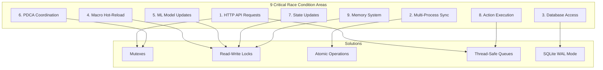

# Concurrency and Race Condition Prevention Specification

**Version:** 1.0  
**Date:** 2026-02-05  
**Status:** Final Specification  
**Priority:** Critical

---

## Document Overview

This specification defines comprehensive concurrency control and race condition prevention for the OpenKore Advanced AI system's multi-process, multi-threaded architecture.

**Key Features:**
- Thread-safe HTTP REST API with request serialization
- Multi-process synchronization (Perl + C++ + Python)
- SQLite WAL mode for concurrent database access
- Safe macro hot-reload during execution
- ML model hot-swap during inference
- PDCA cycle mutual exclusion
- Deadlock prevention with lock hierarchies
- Comprehensive error recovery

**Related Documents:**
- [`01-ipc-protocol-specification.md`](01-ipc-protocol-specification.md) - HTTP API specification
- [`02-data-structures-reference.md`](02-data-structures-reference.md) - Concurrency data structures
- [`TECHNICAL-ARCHITECTURE.md`](../TECHNICAL-ARCHITECTURE.md) - System architecture
- [`CRITICAL-ENHANCEMENTS-PLAN.md`](../CRITICAL-ENHANCEMENTS-PLAN.md) - Enhancement plan

---

## Table of Contents

1. [Overview](#1-overview)
2. [Concurrency Principles](#2-concurrency-principles)
3. [HTTP REST API Concurrency](#3-http-rest-api-concurrency)
4. [Multi-Process Synchronization](#4-multi-process-synchronization)
5. [Database Race Conditions](#5-database-race-conditions)
6. [Macro Hot-Reload Safety](#6-macro-hot-reload-safety)
7. [ML Model Update Safety](#7-ml-model-update-safety)
8. [PDCA Cycle Coordination](#8-pdca-cycle-coordination)
9. [State Synchronization](#9-state-synchronization)
10. [Action Execution Coordination](#10-action-execution-coordination)
11. [Memory System Concurrency](#11-memory-system-concurrency)
12. [Synchronization Primitives](#12-synchronization-primitives)
13. [Lock Hierarchies](#13-lock-hierarchies)
14. [Deadlock Detection](#14-deadlock-detection)
15. [Performance Impact](#15-performance-impact)
16. [Testing Strategies](#16-testing-strategies)

---

## 1. Overview

### 1.1 Concurrency Challenges

The OpenKore Advanced AI system has multiple sources of concurrency:

**Three Processes:**
1. **OpenKore (Perl)** - Game protocol, sends HTTP requests
2. **C++ Engine** - HTTP server (port 9901), AI decision making
3. **Python Service** - HTTP server (port 9902), advanced AI, storage

**Multiple Threads per Process:**
- HTTP request handler threads
- ML inference threads
- LLM query threads
- PDCA monitoring thread
- Metrics collection thread
- Database writer threads
- File watcher threads

**Shared Resources:**
- SQLite databases (read/write)
- Game state (read/write)
- ML models (read/write)
- Macro files (read/write)
- Configuration files (read/write)
- Decision queues (read/write)

### 1.2 Race Condition Categories



### 1.3 Design Principles

1. **Fail-Safe**: Always prefer safety over performance
2. **Lock Ordering**: Strict lock hierarchy to prevent deadlocks
3. **Timeout Protection**: All locks have timeouts
4. **Error Recovery**: Graceful handling of lock failures
5. **Logging**: Comprehensive lock acquisition logging in debug mode
6. **Testing**: Stress testing with concurrent operations

---

## 2. Concurrency Principles

### 2.1 Thread Safety Guarantees

```cpp
// Thread safety levels for each component
enum class ThreadSafety {
    UNSAFE,           // Not thread-safe, external synchronization required
    CONDITIONAL,      // Thread-safe with documented conditions
    SAFE,             // Fully thread-safe, can be called from any thread
    IMMUTABLE         // Immutable, inherently thread-safe
};

// Document thread safety for each class
class GameState {
    // Thread safety: CONDITIONAL
    // Safe to read from multiple threads if protected by shared_mutex
    // Safe to write from single thread with exclusive lock
private:
    mutable std::shared_mutex mutex_;
};

class ReputationManager {
    // Thread safety: SAFE
    // All public methods are thread-safe
    // Internal synchronization with mutexes
};
```

### 2.2 Synchronization Strategy

**Read-Heavy Operations:** Use `std::shared_mutex` (read-write lock)
- Multiple readers can access simultaneously
- Writers get exclusive access
- Examples: Game state, ML model inference

**Write-Heavy Operations:** Use `std::mutex` (exclusive lock)
- Only one thread can access at a time
- Examples: Database writes, metrics collection

**Lock-Free Operations:** Use `std::atomic` when possible
- No locks needed
- Examples: Counters, flags, simple state

**Producer-Consumer:** Use thread-safe queues
- Lock-free or internally synchronized
- Examples: HTTP request queue, action queue

### 2.3 Lock Hierarchy

```cpp
// Global lock ordering (acquire in this order to prevent deadlocks)
enum class LockOrder {
    CONFIG_LOCK = 1,           // Configuration updates
    SESSION_LOCK = 2,          // Session management
    STATE_LOCK = 3,            // Game state updates
    REPUTATION_LOCK = 4,       // Reputation manager
    DECISION_LOCK = 5,         // Decision making
    MODEL_LOCK = 6,            // ML model access
    MACRO_LOCK = 7,            // Macro execution/reload
    METRICS_LOCK = 8,          // Metrics collection
    DATABASE_LOCK = 9,         // Database access (highest)
    NETWORK_LOCK = 10          // Network I/O (highest)
};

// Violation of lock order = deadlock risk!
// Example of CORRECT ordering:
void safeOperation() {
    std::lock_guard<std::mutex> state_lock(state_mutex_);      // Order 3
    std::lock_guard<std::mutex> decision_lock(decision_mutex_); // Order 5
    // OK: acquired in order
}

// Example of INCORRECT ordering (deadlock risk):
void unsafeOperation() {
    std::lock_guard<std::mutex> decision_lock(decision_mutex_); // Order 5
    std::lock_guard<std::mutex> state_lock(state_mutex_);      // Order 3
    // DANGER: violated lock order!
}
```

### 2.4 Timeout Policy

```cpp
struct LockTimeoutPolicy {
    std::chrono::milliseconds default_timeout{5000};  // 5 seconds
    std::chrono::milliseconds critical_timeout{10000}; // 10 seconds
    std::chrono::milliseconds database_timeout{30000}; // 30 seconds
    
    bool enable_deadlock_detection = true;
    std::chrono::seconds deadlock_threshold{10};
};

template<typename Mutex>
bool try_lock_with_timeout(Mutex& mutex, std::chrono::milliseconds timeout) {
    auto start = std::chrono::steady_clock::now();
    
    while (!mutex.try_lock()) {
        auto elapsed = std::chrono::steady_clock::now() - start;
        if (elapsed > timeout) {
            log_error("Lock acquisition timeout after {}ms", 
                     std::chrono::duration_cast<std::chrono::milliseconds>(elapsed).count());
            return false;
        }
        std::this_thread::sleep_for(std::chrono::milliseconds(10));
    }
    
    return true;
}
```

---

## 3. HTTP REST API Concurrency

### 3.1 Request Serialization

**Problem:** Multiple Perl threads sending HTTP requests simultaneously to C++ engine could cause:
- Race conditions on shared state
- Inconsistent game state updates
- Action execution conflicts

**Solution:** Per-session request queue with serial processing

```cpp
class HTTPRequestSerializer {
private:
    struct SessionQueue {
        std::string session_id;
        std::mutex mutex;
        std::queue<HTTPRequest> requests;
        std::condition_variable cv;
        std::atomic<bool> processing{false};
        std::thread worker_thread;
        std::atomic<uint64_t> total_processed{0};
    };
    
    std::unordered_map<std::string, std::unique_ptr<SessionQueue>> session_queues_;
    std::shared_mutex queues_mutex_;
    
public:
    void enqueueRequest(const std::string& session_id, HTTPRequest request) {
        SessionQueue* queue = getOrCreateQueue(session_id);
        
        {
            std::lock_guard<std::mutex> lock(queue->mutex);
            queue->requests.push(std::move(request));
        }
        
        queue->cv.notify_one();
        
        // Start worker if not running
        bool expected = false;
        if (queue->processing.compare_exchange_strong(expected, true)) {
            queue->worker_thread = std::thread(
                &HTTPRequestSerializer::processQueue,
                this,
                session_id
            );
            queue->worker_thread.detach();
        }
    }
    
private:
    SessionQueue* getOrCreateQueue(const std::string& session_id) {
        {
            std::shared_lock<std::shared_mutex> lock(queues_mutex_);
            auto it = session_queues_.find(session_id);
            if (it != session_queues_.end()) {
                return it->second.get();
            }
        }
        
        // Need to create new queue
        std::unique_lock<std::shared_mutex> lock(queues_mutex_);
        auto [it, inserted] = session_queues_.emplace(
            session_id,
            std::make_unique<SessionQueue>()
        );
        it->second->session_id = session_id;
        return it->second.get();
    }
    
    void processQueue(const std::string& session_id) {
        auto* queue = getQueue(session_id);
        if (!queue) return;
        
        log_info("Started request processor for session {}", session_id);
        
        while (true) {
            HTTPRequest request;
            
            {
                std::unique_lock<std::mutex> lock(queue->mutex);
                
                // Wait for requests or timeout
                queue->cv.wait_for(lock, std::chrono::seconds(30), [&queue] {
                    return !queue->requests.empty();
                });
                
                if (queue->requests.empty()) {
                    // Timeout - exit if idle
                    queue->processing = false;
                    log_info("Request processor for session {} exiting (idle)", session_id);
                    break;
                }
                
                request = std::move(queue->requests.front());
                queue->requests.pop();
            }
            
            // Process request outside lock
            try {
                auto start = std::chrono::steady_clock::now();
                
                auto response = handleRequest(request);
                
                auto end = std::chrono::steady_clock::now();
                auto duration = std::chrono::duration_cast<std::chrono::milliseconds>(end - start);
                
                sendResponse(request.client_id, response);
                
                queue->total_processed++;
                
                log_debug("Processed request {} in {}ms", request.id, duration.count());
                
            } catch (const std::exception& e) {
                log_error("Request processing failed: {}", e.what());
                sendErrorResponse(request.client_id, 500, e.what());
            }
        }
    }
};
```

### 3.2 State Update Mutex

**Problem:** Game state is updated from HTTP requests and read by decision engines.

**Solution:** Read-write lock (shared_mutex) for state access

```cpp
class ThreadSafeGameState {
private:
    GameState state_;
    mutable std::shared_mutex state_mutex_;
    std::atomic<uint64_t> version_{0};
    
public:
    // Read access (multiple readers allowed)
    GameState readState() const {
        std::shared_lock<std::shared_mutex> lock(state_mutex_);
        return state_;  // Return copy
    }
    
    // Read with version check
    std::pair<GameState, uint64_t> readStateWithVersion() const {
        std::shared_lock<std::shared_mutex> lock(state_mutex_);
        return {state_, version_.load()};
    }
    
    // Write access (exclusive)
    void updateState(const GameState& new_state) {
        std::unique_lock<std::shared_mutex> lock(state_mutex_);
        
        state_ = new_state;
        version_++;
        
        log_debug("Game state updated to version {}", version_.load());
    }
    
    // Atomic field update
    void updateHP(int new_hp) {
        std::unique_lock<std::shared_mutex> lock(state_mutex_);
        state_.character.hp = new_hp;
        version_++;
    }
    
    // Conditional update with version check (optimistic locking)
    bool updateStateIfVersion(const GameState& new_state, uint64_t expected_version) {
        std::unique_lock<std::shared_mutex> lock(state_mutex_);
        
        if (version_.load() != expected_version) {
            log_warn("State version mismatch: expected {}, actual {}",
                    expected_version, version_.load());
            return false;
        }
        
        state_ = new_state;
        version_++;
        return true;
    }
    
    // Get current version (lock-free)
    uint64_t getVersion() const {
        return version_.load(std::memory_order_acquire);
    }
};
```

### 3.3 Connection Pool Thread Safety

```cpp
class ThreadSafeConnectionPool {
private:
    std::vector<std::unique_ptr<HTTPConnection>> connections_;
    std::queue<HTTPConnection*> available_;
    std::mutex pool_mutex_;
    std::condition_variable pool_cv_;
    std::atomic<uint32_t> active_connections_{0};
    
    uint32_t max_connections_;
    std::chrono::seconds timeout_;
    
public:
    ThreadSafeConnectionPool(uint32_t max_connections, std::chrono::seconds timeout)
        : max_connections_(max_connections), timeout_(timeout) {
        
        // Pre-create connections
        for (uint32_t i = 0; i < max_connections; i++) {
            auto conn = std::make_unique<HTTPConnection>();
            available_.push(conn.get());
            connections_.push_back(std::move(conn));
        }
    }
    
    class ConnectionGuard {
    public:
        ConnectionGuard(ThreadSafeConnectionPool* pool, HTTPConnection* conn)
            : pool_(pool), conn_(conn) {}
        
        ~ConnectionGuard() {
            if (conn_) {
                pool_->releaseConnection(conn_);
            }
        }
        
        HTTPConnection* operator->() { return conn_; }
        HTTPConnection& operator*() { return *conn_; }
        
    private:
        ThreadSafeConnectionPool* pool_;
        HTTPConnection* conn_;
    };
    
    std::optional<ConnectionGuard> acquireConnection() {
        std::unique_lock<std::mutex> lock(pool_mutex_);
        
        // Wait for available connection
        bool acquired = pool_cv_.wait_for(lock, timeout_, [this] {
            return !available_.empty();
        });
        
        if (!acquired || available_.empty()) {
            log_warn("Connection pool timeout");
            return std::nullopt;
        }
        
        auto* conn = available_.front();
        available_.pop();
        active_connections_++;
        
        return ConnectionGuard(this, conn);
    }
    
private:
    void releaseConnection(HTTPConnection* conn) {
        std::lock_guard<std::mutex> lock(pool_mutex_);
        available_.push(conn);
        active_connections_--;
        pool_cv_.notify_one();
    }
};

// Usage
auto conn_guard = connection_pool_.acquireConnection();
if (conn_guard) {
    auto response = (*conn_guard)->sendRequest(request);
}  // Connection automatically released
```

---

## 4. Multi-Process Synchronization

### 4.1 Process Communication Architecture

```
┌─────────────────────────────────────────────────────────┐
│  OpenKore (Perl)                                         │
│  ┌──────────────────────────────────────────────────┐  │
│  │  HTTP Client (Thread-Safe)                        │  │
│  │  - Request Queue                                  │  │
│  │  - Response Handler                               │  │
│  └──────────────────────────────────────────────────┘  │
└─────────────────────────────────────────────────────────┘
                     │ HTTP
                     ▼
┌─────────────────────────────────────────────────────────┐
│  C++ Engine (Port 9901)                                  │
│  ┌──────────────────────────────────────────────────┐  │
│  │  HTTP Server                                      │  │
│  │  - Request Serializer (Per Session)              │  │
│  │  - State Manager (Shared Mutex)                  │  │
│  │  - Decision Coordinator                           │  │
│  └──────────────────────────────────────────────────┘  │
└─────────────────────────────────────────────────────────┘
                     │ HTTP
                     ▼
┌─────────────────────────────────────────────────────────┐
│  Python Service (Port 9902)                              │
│  ┌──────────────────────────────────────────────────┐  │
│  │  FastAPI Server (async/await)                     │  │
│  │  - Request Handlers (async)                       │  │
│  │  - Database Pool (thread-safe)                    │  │
│  │  - OpenMemory SDK                                 │  │
│  └──────────────────────────────────────────────────┘  │
└─────────────────────────────────────────────────────────┘
```

### 4.2 Atomic State Flags

```cpp
// Use atomic flags for simple cross-process state
class SharedStateFlags {
private:
    // Memory-mapped file for inter-process atomics (Windows)
    HANDLE file_mapping_;
    void* shared_memory_;
    
    struct SharedFlags {
        std::atomic<bool> pdca_running{false};
        std::atomic<bool> training_in_progress{false};
        std::atomic<bool> model_updating{false};
        std::atomic<bool> emergency_stop{false};
        std::atomic<uint64_t> state_version{0};
        std::atomic<uint64_t> model_version{0};
    };
    
    SharedFlags* flags_;
    
public:
    SharedStateFlags(const std::string& name) {
        // Create or open memory-mapped file
        file_mapping_ = CreateFileMapping(
            INVALID_HANDLE_VALUE,
            NULL,
            PAGE_READWRITE,
            0,
            sizeof(SharedFlags),
            name.c_str()
        );
        
        if (!file_mapping_) {
            throw std::runtime_error("Failed to create file mapping");
        }
        
        shared_memory_ = MapViewOfFile(
            file_mapping_,
            FILE_MAP_ALL_ACCESS,
            0,
            0,
            sizeof(SharedFlags)
        );
        
        if (!shared_memory_) {
            CloseHandle(file_mapping_);
            throw std::runtime_error("Failed to map view of file");
        }
        
        flags_ = new (shared_memory_) SharedFlags();
    }
    
    ~SharedStateFlags() {
        if (shared_memory_) UnmapViewOfFile(shared_memory_);
        if (file_mapping_) CloseHandle(file_mapping_);
    }
    
    // Atomic operations (lock-free)
    bool tryAcquirePDCA() {
        bool expected = false;
        return flags_->pdca_running.compare_exchange_strong(expected, true);
    }
    
    void releasePDCA() {
        flags_->pdca_running.store(false);
    }
    
    bool isPDCARunning() const {
        return flags_->pdca_running.load(std::memory_order_acquire);
    }
    
    uint64_t getStateVersion() const {
        return flags_->state_version.load(std::memory_order_acquire);
    }
    
    void incrementStateVersion() {
        flags_->state_version.fetch_add(1, std::memory_order_release);
    }
};
```

### 4.3 Transaction Boundaries

```cpp
// Define clear transaction boundaries for multi-step operations
class TransactionManager {
public:
    class Transaction {
    public:
        Transaction(TransactionManager* mgr, const std::string& name)
            : mgr_(mgr), name_(name), committed_(false) {
            
            mgr_->beginTransaction(name_);
        }
        
        ~Transaction() {
            if (!committed_) {
                mgr_->rollbackTransaction(name_);
            }
        }
        
        void commit() {
            mgr_->commitTransaction(name_);
            committed_ = true;
        }
        
    private:
        TransactionManager* mgr_;
        std::string name_;
        bool committed_;
    };
    
    Transaction startTransaction(const std::string& name) {
        return Transaction(this, name);
    }
    
private:
    std::mutex transaction_mutex_;
    std::unordered_map<std::string, TransactionState> active_transactions_;
    
    void beginTransaction(const std::string& name);
    void commitTransaction(const std::string& name);
    void rollbackTransaction(const std::string& name);
};

// Usage example
void performComplexOperation() {
    auto tx = transaction_mgr_->startTransaction("update_player_state");
    
    try {
        // Step 1: Update game state
        state_mgr_->updateState(new_state);
        
        // Step 2: Update reputation
        reputation_mgr_->adjustReputation(player_id, delta, reason);
        
        // Step 3: Log interaction
        db_->logInteraction(interaction);
        
        // All successful - commit
        tx.commit();
        
    } catch (const std::exception& e) {
        log_error("Transaction failed: {}", e.what());
        // Automatic rollback in destructor
    }
}
```

---

## 5. Database Race Conditions

### 5.1 SQLite WAL Mode Configuration

```sql
-- Enable Write-Ahead Logging (critical for concurrency)
PRAGMA journal_mode = WAL;

-- Allow concurrent reads while writing
-- Readers see consistent snapshot

-- Busy timeout - wait up to 5 seconds for lock
PRAGMA busy_timeout = 5000;

-- Synchronous mode
PRAGMA synchronous = NORMAL;  -- Balance between safety and performance

-- Cache size (64MB)
PRAGMA cache_size = -64000;

-- WAL autocheckpoint (every 1000 pages)
PRAGMA wal_autocheckpoint = 1000;

-- Locking mode
PRAGMA locking_mode = NORMAL;  -- Allow concurrent access

-- Temp store in memory
PRAGMA temp_store = MEMORY;

-- Foreign keys
PRAGMA foreign_keys = ON;
```

### 5.2 Thread-Safe Database Wrapper

```python
import sqlite3
import threading
from contextlib import contextmanager
from typing import Optional, List
import logging

class ThreadSafeDatabase:
    """Thread-safe SQLite database wrapper with WAL mode"""
    
    def __init__(self, db_path: str):
        self.db_path = db_path
        self.local = threading.local()
        self._lock = threading.Lock()
        self._init_database()
    
    def _init_database(self):
        """Initialize database with WAL mode"""
        conn = sqlite3.connect(self.db_path)
        
        # Enable WAL mode
        conn.execute("PRAGMA journal_mode=WAL")
        conn.execute("PRAGMA busy_timeout=5000")
        conn.execute("PRAGMA synchronous=NORMAL")
        conn.execute("PRAGMA cache_size=-64000")
        conn.execute("PRAGMA foreign_keys=ON")
        
        conn.close()
        logging.info(f"Database initialized with WAL mode: {self.db_path}")
    
    def _get_connection(self) -> sqlite3.Connection:
        """Get thread-local connection"""
        if not hasattr(self.local, 'conn') or self.local.conn is None:
            self.local.conn = sqlite3.connect(
                self.db_path,
                isolation_level=None,  # Autocommit off for manual transactions
                check_same_thread=False,
                timeout=5.0
            )
            self.local.conn.row_factory = sqlite3.Row
            logging.debug(f"Created new connection for thread {threading.current_thread().name}")
        
        return self.local.conn
    
    @contextmanager
    def transaction(self, mode: str = 'DEFERRED'):
        """
        Context manager for transactions
        
        Modes:
        - DEFERRED: Lock acquired on first read/write (default)
        - IMMEDIATE: Write lock acquired immediately
        - EXCLUSIVE: Exclusive lock, blocks all access
        """
        conn = self._get_connection()
        
        try:
            conn.execute(f"BEGIN {mode}")
            yield conn
            conn.commit()
        except Exception as e:
            conn.rollback()
            logging.error(f"Transaction failed: {e}")
            raise
    
    @contextmanager
    def read_transaction(self):
        """Read-only transaction (allows concurrent reads)"""
        with self.transaction(mode='DEFERRED') as conn:
            yield conn
    
    @contextmanager
    def write_transaction(self):
        """Write transaction (acquires lock immediately)"""
        with self.transaction(mode='IMMEDIATE') as conn:
            yield conn
    
    def execute_read(self, query: str, params=None) -> List[sqlite3.Row]:
        """Execute read query safely"""
        with self.read_transaction() as conn:
            cursor = conn.execute(query, params or [])
            return cursor.fetchall()
    
    def execute_write(self, query: str, params=None) -> int:
        """Execute write query safely"""
        with self.write_transaction() as conn:
            cursor = conn.execute(query, params or [])
            return cursor.lastrowid
    
    def execute_many(self, query: str, params_list: List) -> None:
        """Execute batch write operations"""
        with self.write_transaction() as conn:
            conn.executemany(query, params_list)
    
    def close(self):
        """Close thread-local connection"""
        if hasattr(self.local, 'conn') and self.local.conn:
            self.local.conn.close()
            self.local.conn = None
```

### 5.3 Row-Level Locking Example

```python
def update_player_reputation_safe(player_id: int, delta: int, reason: str):
    """Update reputation with row-level locking"""
    
    with db.write_transaction() as conn:
        # Read current value with lock
        cursor = conn.execute(
            "SELECT reputation_score FROM player_reputation WHERE player_id = ?",
            (player_id,)
        )
        row = cursor.fetchone()
        
        if not row:
            raise ValueError(f"Player {player_id} not found")
        
        current_score = row[0]
        new_score = max(-100, min(100, current_score + delta))
        
        # Update (row still locked)
        conn.execute(
            """UPDATE player_reputation 
               SET reputation_score = ?,
                   last_interaction = ?,
                   total_interactions = total_interactions + 1
               WHERE player_id = ?""",
            (new_score, int(time.time()), player_id)
        )
        
        # Log change (same transaction)
        conn.execute(
            """INSERT INTO interaction_history 
               (player_id, interaction_type, outcome, reputation_delta, timestamp)
               VALUES (?, ?, ?, ?, ?)""",
            (player_id, 'reputation_update', reason, delta, int(time.time()))
        )
        
        # Commit happens automatically at context exit
```

### 5.4 Deadlock Prevention in Database

```python
class DatabaseDeadlockPrevention:
    """Strategies to prevent database deadlocks"""
    
    @staticmethod
    def consistent_table_order():
        """Always access tables in the same order"""
        # GOOD: Always access in same order
        with db.write_transaction() as conn:
            # 1. Update player_reputation
            conn.execute("UPDATE player_reputation SET ...")
            # 2. Update interaction_history
            conn.execute("INSERT INTO interaction_history ...")
        
        # BAD: Different order in different places causes deadlocks
        # Transaction A: reputation -> history
        # Transaction B: history -> reputation
        # = DEADLOCK!
    
    @staticmethod
    def use_immediate_transactions():
        """Use IMMEDIATE transactions for writes to acquire lock early"""
        # This prevents deadlock by ensuring lock is acquired before any reads
        with db.transaction(mode='IMMEDIATE') as conn:
            # Lock acquired immediately, no deadlock risk
            conn.execute("SELECT ...")
            conn.execute("UPDATE ...")
    
    @staticmethod
    def short_transactions():
        """Keep transactions as short as possible"""
        # GOOD: Short transaction
        with db.write_transaction() as conn:
            conn.execute("UPDATE player_reputation SET reputation_score = reputation_score + 1")
        
        # BAD: Long-running transaction holds locks
        with db.write_transaction() as conn:
            # Do expensive computation here (BAD!)
            time.sleep(5)
            conn.execute("UPDATE ...")
    
    @staticmethod
    def retry_on_busy():
        """Retry transactions on busy/locked errors"""
        max_retries = 3
        retry_delay = 0.1
        
        for attempt in range(max_retries):
            try:
                with db.write_transaction() as conn:
                    conn.execute("UPDATE ...")
                break  # Success
            except sqlite3.OperationalError as e:
                if "locked" in str(e) and attempt < max_retries - 1:
                    time.sleep(retry_delay * (attempt + 1))
                    continue
                raise
```

---

## 6. Macro Hot-Reload Safety

### 6.1 Execution Lock Pattern

**Problem:** Macros can be reloaded while they're being executed, causing:
- Mid-execution code changes
- Undefined behavior
- Crashes

**Solution:** Read-write lock for macro access

```cpp
class MacroHotReloader {
private:
    struct MacroState {
        std::shared_mutex execution_mutex;  // RW lock
        std::atomic<bool> is_executing{false};
        std::atomic<uint32_t> version{0};
        std::atomic<uint32_t> active_executions{0};
        std::string current_content;
        Timestamp last_reload;
    };
    
    std::unordered_map<std::string, MacroState> macro_states_;
    std::mutex state_map_mutex_;
    
public:
    // Execute macro (acquire read lock)
    void executeMacro(const std::string& macro_name) {
        auto& state = getMacroState(macro_name);
        
        // Acquire shared (read) lock - allows concurrent executions
        std::shared_lock<std::shared_mutex> lock(state.execution_mutex);
        
        state.active_executions++;
        auto version = state.version.load();
        
        try {
            log_debug("Executing macro '{}' version {}", macro_name, version);
            
            // Execute macro content
            executeMacroContent(state.current_content);
            
            log_info("Macro '{}' executed successfully", macro_name);
            
        } catch (const std::exception& e) {
            log_error("Macro '{}' execution failed: {}", macro_name, e.what());
        }
        
        state.active_executions--;
    }
    
    // Reload macro (acquire write lock)
    bool reloadMacro(const std::string& macro_name, const std::string& new_content) {
        auto& state = getMacroState(macro_name);
        
        // Validate new content first (outside lock)
        if (!validateMacroSyntax(new_content)) {
            log_error("Macro '{}' validation failed", macro_name);
            return false;
        }
        
        log_info("Reloading macro '{}'...", macro_name);
        
        // Acquire exclusive (write) lock - waits for all executions to finish
        std::unique_lock<std::shared_mutex> lock(state.execution_mutex);
        
        // Wait for active executions with timeout
        auto timeout = std::chrono::seconds(30);
        auto start = std::chrono::steady_clock::now();
        
        while (state.active_executions.load() > 0) {
            auto elapsed = std::chrono::steady_clock::now() - start;
            if (elapsed > timeout) {
                log_error("Timeout waiting for macro '{}' executions to finish", macro_name);
                return false;
            }
            
            // Brief sleep to allow executions to complete
            lock.unlock();
            std::this_thread::sleep_for(std::chrono::milliseconds(100));
            lock.lock();
        }
        
        // Atomically update macro content
        state.current_content = new_content;
        state.version++;
        state.last_reload = getCurrentTimestamp();
        
        log_info("Macro '{}' reloaded successfully (version {})",
                macro_name, state.version.load());
        
        return true;
    }
    
    // Get macro info (no lock needed for atomics)
    MacroInfo getMacroInfo(const std::string& macro_name) {
        auto& state = getMacroState(macro_name);
        
        return MacroInfo{
            .name = macro_name,
            .version = state.version.load(),
            .active_executions = state.active_executions.load(),
            .last_reload = state.last_reload
        };
    }
    
private:
    MacroState& getMacroState(const std::string& macro_name) {
        std::lock_guard<std::mutex> lock(state_map_mutex_);
        return macro_states_[macro_name];
    }
};
```

### 6.2 File Watcher Thread Safety

```cpp
class MacroFileWatcher {
private:
    std::filesystem::path macro_dir_;
    std::thread watcher_thread_;
    std::atomic<bool> running_{false};
    std::shared_ptr<MacroHotReloader> reloader_;
    
    std::unordered_map<std::string, std::filesystem::file_time_type> file_timestamps_;
    std::mutex timestamps_mutex_;
    
public:
    void start() {
        running_ = true;
        watcher_thread_ = std::thread(&MacroFileWatcher::watchLoop, this);
    }
    
    void stop() {
        running_ = false;
        if (watcher_thread_.joinable()) {
            watcher_thread_.join();
        }
    }
    
private:
    void watchLoop() {
        log_info("Macro file watcher started");
        
        while (running_) {
            try {
                checkForChanges();
            } catch (const std::exception& e) {
                log_error("File watcher error: {}", e.what());
            }
            
            std::this_thread::sleep_for(std::chrono::seconds(1));
        }
        
        log_info("Macro file watcher stopped");
    }
    
    void checkForChanges() {
        for (const auto& entry : std::filesystem::directory_iterator(macro_dir_)) {
            if (!entry.is_regular_file()) continue;
            if (entry.path().extension() != ".txt") continue;
            
            auto filename = entry.path().filename().string();
            auto last_write = std::filesystem::last_write_time(entry.path());
            
            bool changed = false;
            {
                std::lock_guard<std::mutex> lock(timestamps_mutex_);
                auto it = file_timestamps_.find(filename);
                
                if (it == file_timestamps_.end()) {
                    // New file
                    file_timestamps_[filename] = last_write;
                    changed = true;
                } else if (it->second != last_write) {
                    // Modified file
                    it->second = last_write;
                    changed = true;
                }
            }
            
            if (changed) {
                log_info("Detected change in macro file: {}", filename);
                
                // Read new content
                auto new_content = readFileContent(entry.path());
                
                // Trigger reload (thread-safe)
                reloader_->reloadMacro(filename, new_content);
            }
        }
    }
};
```

---

## 7. ML Model Update Safety

### 7.1 Model Hot-Swap Protocol

```cpp
class MLModelManager {
private:
    struct ModelState {
        std::shared_ptr<ONNXModel> active_model;
        std::shared_ptr<ONNXModel> staging_model;
        std::shared_mutex model_mutex;
        std::atomic<uint32_t> version{0};
        std::atomic<uint32_t> inference_count{0};
        std::atomic<uint32_t> active_inferences{0};
    };
    
    ModelState model_state_;
    
public:
    // Inference (acquire read lock)
    Prediction predict(const FeatureVector& features) {
        // Acquire shared lock (allows concurrent inference)
        std::shared_lock<std::shared_mutex> lock(model_state_.model_mutex);
        
        if (!model_state_.active_model) {
            throw MLException("No active model loaded");
        }
        
        model_state_.active_inferences++;
        auto version = model_state_.version.load();
        
        try {
            // Run inference (read-only operation)
            auto result = model_state_.active_model->infer(features);
            
            model_state_.inference_count++;
            
            log_debug("Inference completed with model version {}", version);
            
            model_state_.active_inferences--;
            return result;
            
        } catch (const std::exception& e) {
            model_state_.active_inferences--;
            throw;
        }
    }
    
    // Load model to staging (no lock needed)
    void loadModelToStaging(const std::string& model_path) {
        log_info("Loading new model to staging: {}", model_path);
        
        // Load model without holding any locks
        auto new_model = std::make_shared<ONNXModel>(model_path);
        
        // Validate model
        if (!new_model->validate()) {
            throw MLException("Model validation failed: " + model_path);
        }
        
        // Store in staging
        model_state_.staging_model = std::move(new_model);
        
        log_info("Model loaded to staging successfully");
    }
    
    // Promote staging to active (acquire write lock)
    bool promoteStaging() {
        if (!model_state_.staging_model) {
            log_error("No staging model to promote");
            return false;
        }
        
        log_info("Promoting staging model to active...");
        
        // Acquire exclusive write lock
        std::unique_lock<std::shared_mutex> lock(model_state_.model_mutex);
        
        // Wait for active inferences to complete (with timeout)
        auto timeout = std::chrono::seconds(30);
        auto start = std::chrono::steady_clock::now();
        
        while (model_state_.active_inferences.load() > 0) {
            auto elapsed = std::chrono::steady_clock::now() - start;
            if (elapsed > timeout) {
                log_error("Timeout waiting for inferences to complete");
                return false;
            }
            
            lock.unlock();
            std::this_thread::sleep_for(std::chrono::milliseconds(50));
            lock.lock();
        }
        
        // Atomically swap models
        model_state_.active_model = model_state_.staging_model;
        model_state_.staging_model = nullptr;
        model_state_.version++;
        model_state_.inference_count = 0;
        
        log_info("Model promoted successfully (version {})", 
                model_state_.version.load());
        
        return true;
    }
    
    // Get model metrics (lock-free atomics)
    ModelMetrics getMetrics() const {
        return ModelMetrics{
            .version = model_state_.version.load(),
            .total_inferences = model_state_.inference_count.load(),
            .active_inferences = model_state_.active_inferences.load()
        };
    }
};
```

### 7.2 Training Data Collection Concurrency

```cpp
class TrainingDataCollector {
private:
    std::vector<TrainingData> buffer_;
    std::mutex buffer_mutex_;
    std::atomic<uint32_t> buffer_size_{0};
    uint32_t max_buffer_size_ = 10000;
    
    std::atomic<bool> flushing_{false};
    
public:
    void collectSample(const TrainingData& data) {
        // Quick lock to add to buffer
        {
            std::lock_guard<std::mutex> lock(buffer_mutex_);
            
            if (buffer_.size() >= max_buffer_size_) {
                log_warn("Training buffer full, dropping sample");
                return;
            }
            
            buffer_.push_back(data);
        }
        
        buffer_size_++;
        
        // Check if we should flush (without lock)
        if (buffer_size_.load() >= max_buffer_size_ / 2) {
            tryFlush();
        }
    }
    
    void tryFlush() {
        // Try to acquire flush lock
        bool expected = false;
        if (!flushing_.compare_exchange_strong(expected, true)) {
            // Already flushing
            return;
        }
        
        // Flush in separate thread to avoid blocking
        std::thread([this]() {
            flushBuffer();
            flushing_ = false;
        }).detach();
    }
    
private:
    void flushBuffer() {
        std::vector<TrainingData> to_flush;
        
        {
            std::lock_guard<std::mutex> lock(buffer_mutex_);
            to_flush = std::move(buffer_);
            buffer_.clear();
        }
        
        buffer_size_ = 0;
        
        log_info("Flushing {} training samples to disk", to_flush.size());
        
        // Write to disk (no lock held)
        try {
            writeTrainingData(to_flush);
        } catch (const std::exception& e) {
            log_error("Failed to flush training data: {}", e.what());
        }
    }
};
```

---

## 8. PDCA Cycle Coordination

### 8.1 Single PDCA Instance Enforcement

```cpp
class PDCACycleManager {
private:
    std::mutex pdca_mutex_;  // Ensures only one PDCA cycle runs
    std::atomic<bool> cycle_running_{false};
    std::atomic<PDCAPhase> current_phase_{PDCAPhase::IDLE};
    
    std::mutex phase_transition_mutex_;
    std::condition_variable phase_cv_;
    
    // Metrics collection (thread-safe)
    std::shared_ptr<MetricsCollector> metrics_;
    std::atomic<uint32_t> cycle_count_{0};
    
public:
    bool startCycle(const std::string& trigger_reason) {
        // Try to acquire PDCA mutex (non-blocking)
        std::unique_lock<std::mutex> lock(pdca_mutex_, std::try_to_lock);
        
        if (!lock.owns_lock()) {
            log_warn("PDCA cycle already running, skipping trigger: {}", trigger_reason);
            return false;
        }
        
        // Double-check with atomic flag
        bool expected = false;
        if (!cycle_running_.compare_exchange_strong(expected, true)) {
            log_warn("PDCA cycle already running (atomic check)");
            return false;
        }
        
        log_info("Starting PDCA cycle #{}: {}", cycle_count_.load() + 1, trigger_reason);
        
        // Run cycle in separate thread
        std::thread([this, trigger_reason, lock = std::move(lock)]() mutable {
            try {
                runCycle(trigger_reason);
                cycle_count_++;
            } catch (const std::exception& e) {
                log_error("PDCA cycle failed: {}", e.what());
            }
            
            // Mark as not running
            cycle_running_ = false;
            current_phase_ = PDCAPhase::IDLE;
            
            // Lock released when thread exits
        }).detach();
        
        return true;
    }
    
    bool isCycleRunning() const {
        return cycle_running_.load();
    }
    
    PDCAPhase getCurrentPhase() const {
        return current_phase_.load();
    }
    
    void requestStop() {
        // Set stop flag (checked by cycle)
        // Implementation depends on requirements
    }
    
private:
    void runCycle(const std::string& trigger_reason) {
        log_info("PDCA Cycle started");
        
        try {
            // PLAN phase
            transitionPhase(PDCAPhase::PLAN);
            auto strategy = planPhase();
            
            // DO phase
            transitionPhase(PDCAPhase::DO);
            doPhase(strategy);
            
            // Wait for execution period
            std::this_thread::sleep_for(std::chrono::minutes(5));
            
            // CHECK phase
            transitionPhase(PDCAPhase::CHECK);
            auto outcome = checkPhase(strategy);
            
            // ACT phase
            transitionPhase(PDCAPhase::ACT);
            actPhase(strategy, outcome);
            
            transitionPhase(PDCAPhase::IDLE);
            
            log_info("PDCA Cycle completed successfully");
            
        } catch (const std::exception& e) {
            log_error("PDCA Cycle exception: {}", e.what());
            current_phase_ = PDCAPhase::IDLE;
        }
    }
    
    void transitionPhase(PDCAPhase new_phase) {
        std::lock_guard<std::mutex> lock(phase_transition_mutex_);
        
        auto old_phase = current_phase_.load();
        current_phase_ = new_phase;
        
        log_info("PDCA phase transition: {} -> {}",
                phaseToString(old_phase), phaseToString(new_phase));
        
        phase_cv_.notify_all();
    }
    
    Strategy planPhase() {
        // LLM query for strategy planning
        // Thread-safe as LLM client handles concurrency
        return llm_planner_->planStrategy(getCurrentGoal(), getGameState());
    }
    
    void doPhase(const Strategy& strategy) {
        // Generate and deploy macros
        // Thread-safe with macro hot-reload system
        auto macros = macro_generator_->generate(strategy);
        for (const auto& macro : macros) {
            macro_deployer_->deploy(macro);
        }
    }
    
    Outcome checkPhase(const Strategy& strategy) {
        // Collect and evaluate metrics
        // Thread-safe metrics collection
        auto metrics = metrics_->getMetricsSummary(strategy.id);
        return outcome_evaluator_->evaluate(getCurrentGoal(), strategy, metrics);
    }
    
    void actPhase(const Strategy& strategy, const Outcome& outcome) {
        // Adjust strategy based on outcome
        if (!outcome.success) {
            auto adjustments = strategy_adjuster_->analyzeAndAdjust(
                getCurrentGoal(),
                strategy,
                outcome
            );
            applyAdjustments(adjustments);
        }
    }
};
```

### 8.2 Metrics Collection Thread Safety

```cpp
class ThreadSafeMetricsCollector {
private:
    struct MetricEntry {
        std::string name;
        double value;
        Timestamp timestamp;
    };
    
    // Lock-free ring buffer for high-frequency metrics
    std::array<std::atomic<MetricEntry*>, 1000> ring_buffer_;
    std::atomic<uint32_t> write_index_{0};
    
    // Aggregated metrics (requires lock)
    std::unordered_map<std::string, std::vector<double>> aggregated_metrics_;
    std::mutex aggregated_mutex_;
    
    // Flush thread
    std::thread flush_thread_;
    std::atomic<bool> running_{false};
    
public:
    void start() {
        running_ = true;
        flush_thread_ = std::thread(&ThreadSafeMetricsCollector::flushLoop, this);
    }
    
    void stop() {
        running_ = false;
        if (flush_thread_.joinable()) {
            flush_thread_.join();
        }
    }
    
    // Lock-free metric recording
    void recordMetric(const std::string& name, double value) {
        auto* entry = new MetricEntry{name, value, getCurrentTimestamp()};
        
        uint32_t index = write_index_.fetch_add(1) % ring_buffer_.size();
        
        // Store in ring buffer (atomic)
        auto* old = ring_buffer_[index].exchange(entry);
        
        // Delete old entry if exists
        if (old) {
            delete old;
        }
    }
    
    MetricsSummary getMetricsSummary(const std::string& strategy_id) {
        std::lock_guard<std::mutex> lock(aggregated_mutex_);
        
        // Calculate summary from aggregated metrics
        return calculateSummary(aggregated_metrics_);
    }
    
private:
    void flushLoop() {
        while (running_) {
            flushRingBuffer();
            std::this_thread::sleep_for(std::chrono::seconds(1));
        }
    }
    
    void flushRingBuffer() {
        // Read all entries from ring buffer
        std::unordered_map<std::string, std::vector<double>> batch;
        
        for (auto& atomic_entry : ring_buffer_) {
            auto* entry = atomic_entry.exchange(nullptr);
            if (entry) {
                batch[entry->name].push_back(entry->value);
                delete entry;
            }
        }
        
        // Merge into aggregated metrics
        if (!batch.empty()) {
            std::lock_guard<std::mutex> lock(aggregated_mutex_);
            for (auto& [name, values] : batch) {
                auto& agg = aggregated_metrics_[name];
                agg.insert(agg.end(), values.begin(), values.end());
            }
        }
    }
};
```

---

## 9. State Synchronization

### 9.1 Copy-on-Write Pattern

```cpp
class CopyOnWriteGameState {
private:
    struct StateVersion {
        std::shared_ptr<GameState> state;
        uint64_t version;
        Timestamp timestamp;
    };
    
    std::atomic<std::shared_ptr<StateVersion>> current_version_;
    std::atomic<uint64_t> next_version_{1};
    
public:
    // Read state (lock-free)
    std::shared_ptr<GameState> readState() const {
        auto version = current_version_.load();
        return version ? version->state : nullptr;
    }
    
    // Update state (atomic swap)
    void updateState(const GameState& new_state) {
        // Create new version
        auto new_version = std::make_shared<StateVersion>(StateVersion{
            .state = std::make_shared<GameState>(new_state),
            .version = next_version_++,
            .timestamp = getCurrentTimestamp()
        });
        
        // Atomic swap
        auto old_version = current_version_.exchange(new_version);
        
        log_debug("Game state updated to version {}", new_version->version);
        
        // Old version will be deleted when all readers release it
        // (thanks to shared_ptr reference counting)
    }
    
    // Get current version number (lock-free)
    uint64_t getVersion() const {
        auto version = current_version_.load();
        return version ? version->version : 0;
    }
};
```

### 9.2 Version Stamping

```cpp
template<typename T>
class VersionedValue {
private:
    T value_;
    std::atomic<uint64_t> version_{0};
    mutable std::shared_mutex mutex_;
    
public:
    // Read with version check
    struct ReadResult {
        T value;
        uint64_t version;
    };
    
    ReadResult read() const {
        std::shared_lock<std::shared_mutex> lock(mutex_);
        return {value_, version_.load()};
    }
    
    // Write with automatic version increment
    void write(const T& new_value) {
        std::unique_lock<std::shared_mutex> lock(mutex_);
        value_ = new_value;
        version_++;
    }
    
    // Conditional write (only if version matches)
    bool writeIfVersion(const T& new_value, uint64_t expected_version) {
        std::unique_lock<std::shared_mutex> lock(mutex_);
        
        if (version_.load() != expected_version) {
            return false;  // Version mismatch
        }
        
        value_ = new_value;
        version_++;
        return true;
    }
    
    // Get current version (lock-free)
    uint64_t getVersion() const {
        return version_.load();
    }
};
```

### 9.3 State Merge Conflicts

```cpp
class StateMerger {
public:
    enum class MergeStrategy {
        PREFER_NEWER,      // Use newer timestamp
        PREFER_HIGHER,     // Use higher value
        MANUAL_RESOLVE,    // Require manual resolution
        LAST_WRITE_WINS   // Simple last write wins
    };
    
    struct MergeResult {
        bool success;
        GameState merged_state;
        std::vector<std::string> conflicts;
    };
    
    MergeResult merge(
        const GameState& base,
        const GameState& incoming,
        MergeStrategy strategy) {
        
        MergeResult result;
        result.merged_state = base;
        result.success = true;
        
        // Merge character state
        if (base.character.hp != incoming.character.hp) {
            if (strategy == MergeStrategy::PREFER_NEWER) {
                result.merged_state.character.hp = incoming.character.hp;
            } else {
                result.conflicts.push_back("HP mismatch");
            }
        }
        
        // Merge position
        if (base.character.position != incoming.character.position) {
            result.merged_state.character.position = incoming.character.position;
        }
        
        // ... merge other fields
        
        return result;
    }
};
```

---

## 10. Action Execution Coordination

### 10.1 Action Queue Thread Safety

```cpp
class ThreadSafeActionQueue {
private:
    struct ActionEntry {
        Action action;
        Priority priority;
        Timestamp queued_at;
        std::optional<Timestamp> deadline;
    };
    
    // Priority queue (requires lock)
    std::priority_queue<ActionEntry> actions_;
    std::mutex queue_mutex_;
    std::condition_variable queue_cv_;
    
    std::atomic<bool> processing_{false};
    std::atomic<uint32_t> queue_size_{0};
    
public:
    void enqueue(const Action& action, Priority priority) {
        {
            std::lock_guard<std::mutex> lock(queue_mutex_);
            
            actions_.push(ActionEntry{
                .action = action,
                .priority = priority,
                .queued_at = getCurrentTimestamp(),
                .deadline = action.deadline
            });
            
            queue_size_++;
        }
        
        queue_cv_.notify_one();
        
        log_debug("Action queued: {} (priority: {}, queue size: {})",
                 action.type, static_cast<int>(priority), queue_size_.load());
    }
    
    std::optional<Action> dequeue(std::chrono::milliseconds timeout) {
        std::unique_lock<std::mutex> lock(queue_mutex_);
        
        // Wait for action or timeout
        bool has_action = queue_cv_.wait_for(lock, timeout, [this] {
            return !actions_.empty();
        });
        
        if (!has_action || actions_.empty()) {
            return std::nullopt;
        }
        
        auto entry = actions_.top();
        actions_.pop();
        queue_size_--;
        
        // Check if deadline passed
        if (entry.deadline) {
            if (getCurrentTimestamp() > *entry.deadline) {
                log_warn("Action expired: {}", entry.action.type);
                return std::nullopt;
            }
        }
        
        return entry.action;
    }
    
    uint32_t size() const {
        return queue_size_.load();
    }
};
```

### 10.2 Command Conflict Resolution

```cpp
class CommandConflictResolver {
public:
    enum class ConflictResolution {
        QUEUE,        // Queue second command
        REPLACE,      // Replace first with second
        REJECT,       // Reject second command
        MERGE         // Merge commands if possible
    };
    
    ConflictResolution resolveConflict(
        const Action& executing,
        const Action& incoming) {
        
        // Check for direct conflicts
        if (isMovementAction(executing) && isMovementAction(incoming)) {
            // Can't move in two directions
            return ConflictResolution::REPLACE;
        }
        
        if (isSkillAction(executing) && isSkillAction(incoming)) {
            // Can't cast two skills simultaneously
            return ConflictResolution::QUEUE;
        }
        
        if (isMovementAction(executing) && isSkillAction(incoming)) {
            // Moving prevents skill cast
            return ConflictResolution::QUEUE;
        }
        
        // No conflict
        return ConflictResolution::QUEUE;
    }
};
```

---

## 11. Memory System Concurrency

### 11.1 OpenMemory Concurrent Access

```python
import asyncio
from typing import List, Optional
import threading

class ThreadSafeMemoryManager:
    """Thread-safe wrapper for OpenMemory SDK"""
    
    def __init__(self, openmemory_sdk):
        self.sdk = openmemory_sdk
        self._lock = asyncio.Lock()
        self._read_lock = asyncio.Lock()  # Separate lock for reads
    
    async def store_memory(self, memory: Memory) -> str:
        """Store memory with write lock"""
        async with self._lock:
            return await self.sdk.store_memory(memory)
    
    async def retrieve_memories(
        self,
        query: str,
        top_k: int = 5
    ) -> List[Memory]:
        """Retrieve memories with read lock (allows concurrent reads)"""
        async with self._read_lock:
            return await self.sdk.retrieve_memories(query, top_k)
    
    async def batch_store(self, memories: List[Memory]) -> List[str]:
        """Batch store with single lock acquisition"""
        async with self._lock:
            return await self.sdk.batch_store(memories)
    
    async def consolidate_memories(self):
        """Memory consolidation requires exclusive access"""
        async with self._lock:
            async with self._read_lock:  # Acquire both locks
                return await self.sdk.consolidate_memories()
```

### 11.2 Embedding Generation Concurrency

```python
class ConcurrentEmbeddingGenerator:
    """Generate embeddings concurrently with rate limiting"""
    
    def __init__(self, max_concurrent: int = 5):
        self.semaphore = asyncio.Semaphore(max_concurrent)
        self.embedding_cache = {}
        self.cache_lock = asyncio.Lock()
    
    async def generate_embedding(self, text: str) -> List[float]:
        """Generate embedding with concurrency limit"""
        
        # Check cache first (with lock)
        async with self.cache_lock:
            if text in self.embedding_cache:
                return self.embedding_cache[text]
        
        # Acquire semaphore (limits concurrent generations)
        async with self.semaphore:
            # Generate embedding
            embedding = await self._generate(text)
            
            # Store in cache
            async with self.cache_lock:
                self.embedding_cache[text] = embedding
            
            return embedding
    
    async def batch_generate(
        self,
        texts: List[str]
    ) -> List[List[float]]:
        """Generate embeddings in parallel batches"""
        
        tasks = [self.generate_embedding(text) for text in texts]
        return await asyncio.gather(*tasks)
```

---

## 12. Synchronization Primitives

### 12.1 Mutex Types

```cpp
// 1. std::mutex - Basic exclusive lock
std::mutex basic_mutex_;

void exclusiveOperation() {
    std::lock_guard<std::mutex> lock(basic_mutex_);
    // Only one thread at a time
}

// 2. std::shared_mutex - Read-write lock
std::shared_mutex rw_mutex_;

void readOperation() {
    std::shared_lock<std::shared_mutex> lock(rw_mutex_);
    // Multiple readers allowed
}

void writeOperation() {
    std::unique_lock<std::shared_mutex> lock(rw_mutex_);
    // Exclusive write access
}

// 3. std::recursive_mutex - Allows same thread to lock multiple times
std::recursive_mutex recursive_mutex_;

void recursiveFunction() {
    std::lock_guard<std::recursive_mutex> lock(recursive_mutex_);
    // Can be called recursively from same thread
    if (condition) {
        recursiveFunction();  // OK: same thread can lock again
    }
}

// 4. std::timed_mutex - Mutex with timeout
std::timed_mutex timed_mutex_;

void timedOperation() {
    if (timed_mutex_.try_lock_for(std::chrono::seconds(5))) {
        // Acquired lock
        // ... do work ...
        timed_mutex_.unlock();
    } else {
        // Timeout
        log_error("Failed to acquire lock within timeout");
    }
}
```

### 12.2 Atomic Operations

```cpp
// Atomic types (lock-free operations)
std::atomic<bool> is_processing{false};
std::atomic<uint32_t> counter{0};
std::atomic<uint64_t> version{0};

// Compare-and-swap
bool tryAcquire() {
    bool expected = false;
    return is_processing.compare_exchange_strong(expected, true);
}

// Fetch-and-add
void incrementCounter() {
    counter.fetch_add(1, std::memory_order_relaxed);
}

// Load/Store with memory ordering
void updateVersion() {
    version.store(newVersion, std::memory_order_release);
}

uint64_t readVersion() {
    return version.load(std::memory_order_acquire);
}
```

### 12.3 Condition Variables

```cpp
class ProducerConsumer {
private:
    std::queue<Item> queue_;
    std::mutex mutex_;
    std::condition_variable cv_;
    std::atomic<bool> shutdown_{false};
    
public:
    void produce(const Item& item) {
        {
            std::lock_guard<std::mutex> lock(mutex_);
            queue_.push(item);
        }
        cv_.notify_one();  // Wake up one consumer
    }
    
    std::optional<Item> consume(std::chrono::milliseconds timeout) {
        std::unique_lock<std::mutex> lock(mutex_);
        
        // Wait for item or timeout
        bool has_item = cv_.wait_for(lock, timeout, [this] {
            return !queue_.empty() || shutdown_;
        });
        
        if (shutdown_) return std::nullopt;
        if (!has_item || queue_.empty()) return std::nullopt;
        
        auto item = queue_.front();
        queue_.pop();
        return item;
    }
    
    void shutdown() {
        shutdown_ = true;
        cv_.notify_all();  // Wake up all consumers
    }
};
```

---

## 13. Lock Hierarchies

### 13.1 Lock Order Enforcement

```cpp
class LockOrderValidator {
private:
    // Thread-local storage for lock stack
    struct ThreadLockStack {
        std::vector<LockOrder> held_locks;
        
        void pushLock(LockOrder order, const std::string& name) {
            if (!held_locks.empty() && held_locks.back() >= order) {
                log_critical("LOCK ORDER VIOLATION!");
                log_critical("  Attempted: {} (order {})", name, static_cast<int>(order));
                log_critical("  After: {} (order {})", 
                           "previous", static_cast<int>(held_locks.back()));
                std::abort();  // Fatal error
            }
            held_locks.push_back(order);
        }
        
        void popLock(LockOrder order) {
            if (held_locks.empty() || held_locks.back() != order) {
                log_critical("LOCK RELEASE VIOLATION!");
                std::abort();
            }
            held_locks.pop_back();
        }
    };
    
    static ThreadLockStack& getThreadStack() {
        thread_local ThreadLockStack stack;
        return stack;
    }
    
public:
    class ScopedLockValidator {
    public:
        ScopedLockValidator(LockOrder order, const std::string& name)
            : order_(order) {
            getThreadStack().pushLock(order, name);
        }
        
        ~ScopedLockValidator() {
            getThreadStack().popLock(order_);
        }
        
    private:
        LockOrder order_;
    };
    
    static void validateLock(LockOrder order, const std::string& name) {
        #ifdef DEBUG_LOCKS
        getThreadStack().pushLock(order, name);
        #endif
    }
    
    static void releaseLock(LockOrder order) {
        #ifdef DEBUG_LOCKS
        getThreadStack().popLock(order);
        #endif
    }
};

// Usage
class SafeGameStateManager {
private:
    std::mutex state_mutex_;
    GameState state_;
    
public:
    void updateState(const GameState& new_state) {
        LockOrderValidator::ScopedLockValidator validator(
            LockOrder::STATE_LOCK,
            "state_mutex_"
        );
        
        std::lock_guard<std::mutex> lock(state_mutex_);
        state_ = new_state;
    }
};
```

### 13.2 Lock Hierarchy Table

| Lock Order | Component | Lock Type | Typical Hold Time |
|------------|-----------|-----------|-------------------|
| 1 | Configuration | `std::mutex` | < 1ms |
| 2 | Session Management | `std::mutex` | < 5ms |
| 3 | Game State | `std::shared_mutex` | < 10ms |
| 4 | Reputation Manager | `std::mutex` | < 10ms |
| 5 | Decision Coordinator | `std::mutex` | < 50ms |
| 6 | ML Model | `std::shared_mutex` | < 100ms |
| 7 | Macro Execution | `std::shared_mutex` | Variable |
| 8 | Metrics Collector | `std::mutex` | < 5ms |
| 9 | Database | SQLite lock | < 100ms |
| 10 | Network I/O | `std::mutex` | Variable |

---

## 14. Deadlock Detection

### 14.1 Deadlock Detector

```cpp
class DeadlockDetector {
private:
    struct LockInfo {
        std::thread::id thread_id;
        std::string lock_name;
        LockOrder order;
        Timestamp acquired_at;
        std::string stack_trace;
    };
    
    std::mutex detector_mutex_;
    std::unordered_map<std::thread::id, std::vector<LockInfo>> thread_locks_;
    std::thread detector_thread_;
    std::atomic<bool> running_{false};
    
    static constexpr uint32_t DEADLOCK_TIMEOUT_MS = 10000;  // 10 seconds
    
public:
    void start() {
        running_ = true;
        detector_thread_ = std::thread(&DeadlockDetector::detectorLoop, this);
    }
    
    void stop() {
        running_ = false;
        if (detector_thread_.joinable()) {
            detector_thread_.join();
        }
    }
    
    void registerLockAcquisition(
        const std::string& lock_name,
        LockOrder order) {
        
        std::lock_guard<std::mutex> lock(detector_mutex_);
        
        auto thread_id = std::this_thread::get_id();
        thread_locks_[thread_id].push_back(LockInfo{
            .thread_id = thread_id,
            .lock_name = lock_name,
            .order = order,
            .acquired_at = getCurrentTimestamp(),
            .stack_trace = captureStackTrace()
        });
    }
    
    void registerLockRelease(const std::string& lock_name) {
        std::lock_guard<std::mutex> lock(detector_mutex_);
        
        auto thread_id = std::this_thread::get_id();
        auto& locks = thread_locks_[thread_id];
        
        // Remove lock from end (LIFO)
        locks.pop_back();
    }
    
private:
    void detectorLoop() {
        while (running_) {
            detectDeadlocks();
            std::this_thread::sleep_for(std::chrono::seconds(1));
        }
    }
    
    void detectDeadlocks() {
        std::lock_guard<std::mutex> lock(detector_mutex_);
        
        auto now = getCurrentTimestamp();
        
        for (const auto& [thread_id, locks] : thread_locks_) {
            for (const auto& lock_info : locks) {
                auto lock_age = now - lock_info.acquired_at;
                
                if (lock_age > DEADLOCK_TIMEOUT_MS) {
                    log_critical("POTENTIAL DEADLOCK DETECTED!");
                    log_critical("  Thread: {}", thread_id);
                    log_critical("  Lock: {} (order {})",
                               lock_info.lock_name,
                               static_cast<int>(lock_info.order));
                    log_critical("  Held for: {}ms", lock_age);
                    log_critical("  Stack trace:\n{}", lock_info.stack_trace);
                    
                    // Attempt recovery
                    handleDeadlock(thread_id, lock_info);
                }
            }
        }
    }
    
    void handleDeadlock(std::thread::id thread_id, const LockInfo& lock_info) {
        // Recovery strategies:
        // 1. Log detailed diagnostics
        // 2. Send alert to monitoring system
        // 3. Attempt to break deadlock (risky)
        // 4. Restart affected components
        
        log_critical("DEADLOCK RECOVERY: Manual intervention required");
        
        // In production, might trigger automated restart
    }
};
```

---

## 15. Performance Impact

### 15.1 Lock Contention Metrics

```cpp
class LockContentionProfiler {
private:
    struct LockStats {
        std::string lock_name;
        std::atomic<uint64_t> acquisitions{0};
        std::atomic<uint64_t> contentions{0};
        std::atomic<uint64_t> total_wait_time_us{0};
        std::atomic<uint64_t> total_hold_time_us{0};
    };
    
    std::unordered_map<std::string, LockStats> lock_stats_;
    std::mutex stats_mutex_;
    
public:
    class ScopedLockProfiler {
    public:
        ScopedLockProfiler(
            LockContentionProfiler* profiler,
            const std::string& lock_name,
            std::mutex& mutex
        ) : profiler_(profiler), lock_name_(lock_name) {
            
            auto start = std::chrono::steady_clock::now();
            
            // Try to acquire lock
            if (!mutex.try_lock()) {
                // Contention detected
                profiler_->recordContention(lock_name_);
                mutex.lock();
            }
            
            auto end = std::chrono::steady_clock::now();
            auto wait_time = std::chrono::duration_cast<std::chrono::microseconds>(end - start);
            
            profiler_->recordAcquisition(lock_name_, wait_time.count());
            hold_start_ = std::chrono::steady_clock::now();
        }
        
        ~ScopedLockProfiler() {
            auto hold_time = std::chrono::duration_cast<std::chrono::microseconds>(
                std::chrono::steady_clock::now() - hold_start_
            );
            profiler_->recordRelease(lock_name_, hold_time.count());
        }
        
    private:
        LockContentionProfiler* profiler_;
        std::string lock_name_;
        std::chrono::steady_clock::time_point hold_start_;
    };
    
    void recordAcquisition(const std::string& lock_name, uint64_t wait_time_us) {
        auto& stats = getLockStats(lock_name);
        stats.acquisitions++;
        stats.total_wait_time_us += wait_time_us;
    }
    
    void recordContention(const std::string& lock_name) {
        auto& stats = getLockStats(lock_name);
        stats.contentions++;
    }
    
    void recordRelease(const std::string& lock_name, uint64_t hold_time_us) {
        auto& stats = getLockStats(lock_name);
        stats.total_hold_time_us += hold_time_us;
    }
    
    void printReport() {
        std::lock_guard<std::mutex> lock(stats_mutex_);
        
        log_info("=== Lock Contention Report ===");
        for (const auto& [name, stats] : lock_stats_) {
            double contention_rate = static_cast<double>(stats.contentions) / stats.acquisitions;
            double avg_wait_us = static_cast<double>(stats.total_wait_time_us) / stats.acquisitions;
            double avg_hold_us = static_cast<double>(stats.total_hold_time_us) / stats.acquisitions;
            
            log_info("Lock: {}", name);
            log_info("  Acquisitions: {}", stats.acquisitions.load());
            log_info("  Contentions: {} ({:.1f}%)",
                    stats.contentions.load(),
                    contention_rate * 100);
            log_info("  Avg wait: {:.2f} us", avg_wait_us);
            log_info("  Avg hold: {:.2f} us", avg_hold_us);
        }
    }
    
private:
    LockStats& getLockStats(const std::string& lock_name) {
        std::lock_guard<std::mutex> lock(stats_mutex_);
        auto& stats = lock_stats_[lock_name];
        stats.lock_name = lock_name;
        return stats;
    }
};
```

---

## 16. Testing Strategies

### 16.1 Stress Testing

```cpp
class ConcurrencyStressTest {
public:
    void testStateUpdateConcurrency() {
        ThreadSafeGameState state_mgr;
        
        constexpr int NUM_THREADS = 10;
        constexpr int UPDATES_PER_THREAD = 1000;
        
        std::vector<std::thread> threads;
        std::atomic<uint32_t> completed{0};
        
        // Spawn writer threads
        for (int i = 0; i < NUM_THREADS / 2; i++) {
            threads.emplace_back([&state_mgr, &completed]() {
                for (int j = 0; j < UPDATES_PER_THREAD; j++) {
                    GameState new_state = generateRandomState();
                    state_mgr.updateState(new_state);
                }
                completed++;
            });
        }
        
        // Spawn reader threads
        for (int i = 0; i < NUM_THREADS / 2; i++) {
            threads.emplace_back([&state_mgr, &completed]() {
                for (int j = 0; j < UPDATES_PER_THREAD * 10; j++) {
                    auto state = state_mgr.readState();
                    // Verify state consistency
                }
                completed++;
            });
        }
        
        // Wait for completion
        for (auto& thread : threads) {
            thread.join();
        }
        
        assert(completed == NUM_THREADS);
        log_info("Stress test completed successfully");
    }
    
    void testDeadlockScenario() {
        // Intentionally create deadlock scenario to test detection
        std::mutex mutex_a, mutex_b;
        
        std::thread thread_a([&]() {
            std::lock_guard<std::mutex> lock_a(mutex_a);
            std::this_thread::sleep_for(std::chrono::milliseconds(100));
            std::lock_guard<std::mutex> lock_b(mutex_b);  // Deadlock!
        });
        
        std::thread thread_b([&]() {
            std::lock_guard<std::mutex> lock_b(mutex_b);
            std::this_thread::sleep_for(std::chrono::milliseconds(100));
            std::lock_guard<std::mutex> lock_a(mutex_a);  // Deadlock!
        });
        
        // Should be detected by deadlock detector
        thread_a.join();
        thread_b.join();
    }
};
```

### 16.2 Race Condition Detection

```cpp
// Use ThreadSanitizer (TSan) for automatic race detection
// Compile with: -fsanitize=thread

// Example code to test
void potentialRaceCondition() {
    int shared_variable = 0;  // Not protected!
    
    std::thread t1([&]() { shared_variable++; });
    std::thread t2([&]() { shared_variable++; });
    
    t1.join();
    t2.join();
    
    // TSan will report: WARNING: ThreadSanitizer: data race
}
```

---

**End of Concurrency and Race Conditions Specification**

**Next Steps:**
1. Implement synchronization primitives in C++
2. Configure SQLite WAL mode
3. Add lock order validation in debug builds
4. Implement deadlock detector
5. Stress test all concurrent operations

**Related Documents:**
- [`09-social-interaction-system.md`](09-social-interaction-system.md) - Uses these concurrency patterns
- [`TECHNICAL-ARCHITECTURE.md`](../TECHNICAL-ARCHITECTURE.md) - System architecture
- [`CRITICAL-ENHANCEMENTS-PLAN.md`](../CRITICAL-ENHANCEMENTS-PLAN.md) - Enhancement plan
